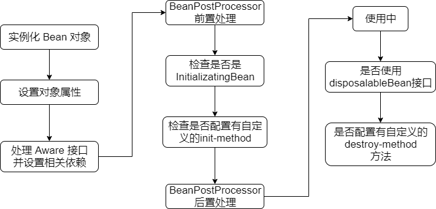
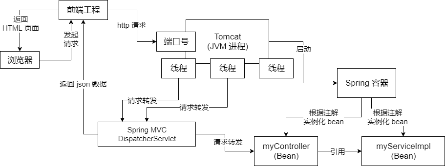

## Bean 的生命周期

Spring Bean 的生命周期，大致上可以分为创建、使用、销毁三个阶段。具体由可以分为以下几个阶段：

### 实例化 Bean

对于 BeanFactory 容器，当客户向容器请求一个尚未初始化的 bean 时，或初始化 bean 的时候需要注入另一个尚未初始化的依赖时，容器就会调用 createBean 进行实例化。对于 ApplicationContext 容器，当容器启动结束后，通过获取 BeanDefinition 对象中的信息，实例化所有的 bean。


容器在内部实现的时候，采用“策略模式”来决定采用何种方式初始化 bean 实例。通过，可以通过反射或者 CGLIB 动态字节码生成来初始化相应的 bean 实例或者动态生成其子类。

### 设置对象属性（依赖注入）

实例化后的对象被封装在 BeanWrapper 对象中，紧接着，Spring 根据 BeanDefinition 中的信息以及通过 BeanWrapper 提供的设置属性的接口完成依赖注入。


说人话就是 spring 容器需要去看看这个 bean 依赖了谁，把你依赖的 bean 也创建出来，给你进行一个注入。比如说通过构造函数，setter 注入等等。如下代码：

```java
public class MyService {

	private MyDao myDao;
	
	public MyService(MyDao myDao) {
		this.myDao = myDao;
	}
	
	public void setMyDao(MyDao myDao) {
		this.myDao = myDao;
	}
}
```

### 处理 Aware 接口

接着，Spring 会检测该对象是否实现了 xxxAware 接口，并将相关的 xxxAware 实例注入给 Bean：

- 如果这个 Bean 已经实现了 BeanNameAware 接口，Spring 容器会调用这个 bean 实现的 setBeanName(String beanId) 方法，此处传递的就是 Spring 配置文件中 Bean 的 id 值。

- 如果这个 Bean 已经实现了 BeanFactoryAware 接口，Spring 容器会调用这个bean 实现的 setBeanFactory() 方法，传递的是 Spring 工厂自身。

- 如果这个 Bean 已经实现了 ApplicationContextAware 接口，Spring 容器会调用我们 bean 的 setApplicationContext(ApplicationContext ctx) 方法，传入 Spring 上下文，把 Spring 容器传递给这个 bean。

### BeanPostProcessor

如果我们想在 bean 实例构建好之后，此时想在这个时间点，如果想对这个 Bean 进行一些自定义的处理，那么可以让 Bean 实现 BeanPostProcessor 接口，那将会调用 postProcessBeforeInitialization(Object obj, String s)方法。

### InitializingBean 与 init-method

如果 Bean 在 Spring 配置文件中配置了 init-method 属性，则会自动调用其配置的初始化方法。

### BeanPostProcessor

如果这个 Bean 实现了 BeanPostProcessor 接口，将会调用 postProcessAfterInitialization(Object obj, String s)方法。这个方法是在 Bean 初始化结束时调用，所以可以被应用于内存或缓存技术。


以上几个步骤完成后，Bean 就已经被正确创建了，之后就可以使用这个 Bean 了。

### DisposableBean

当 Bean 不再需要时，会经过清理阶段，如果 Bean 实现了 DisposableBean 接口，会调用其实现的 destroy() 方法。

### destroy-method

最后，如果这个 Bean 的 Spring 配置中配置了 destroy-method 属性，会自动调用其配置的销毁方法。




## 推断构造方法


Spring 在基于某个类生成 Bean 的过程中，需要利用该类的构造方法来实例化得到一个对象，但是如果一个类存在多个构造方法，Spring 会使用哪个呢？


Spring 的判断逻辑如下：


1. 如果一个类只存在一个构造方法，不管该构造方法是无参构造方法，还是有参构造方法，Spring 都会用这个构造方法
2. 如果一个类存在多个构造方法
   - 这些构造方法中，存在一个无参的构造方法，那么 Spring 就会用这个无参的构造方法
   - 这些构造方法中，不存在一个无参的构造方法，那么 Spring 就会报错


Spring 的设计思想是这样的：


1. 如果一个类只有一个构造方法，那么没得选择，只能用这个构造方法
2. 如果一个类存在多个构造方法，Spring 不知道如何选择，就会看是否有无参的构造方法，以为无参构造方法本身表示了一种默认的意义
3. 如果某个构造方法上加了 `@Autowired` 注解，那就表示程序员告诉 Spring 就用这个加了注解的方法，那 Spring 就会用这个加了 `@Autowired` 注解构造方法了


如果 Spring 选择了一个有参的构造方法，Spring 在调用这个有参构造方法时，需要传入参数，那这个参数是怎么来的？


Spring 会根据入参的类型和入参的名字去 Spring 中找 Bean 对象（以单例 Bean 为例，Spring 会从单例池那个 Map 去找）：


1. 先根据入参类型去找，如果只知道一个，那就直接用来作为入参
2. 如果根据类型找到多个，则根据入参名字来确定唯一一个
3. 如果最终没有找到，则会报错，无法创建当前 Bean 对象


确定用哪个构造方法，确定入参的 Bean 对象，这个过程就叫做推断构造方法


## Spring Web MVC 执行流程

1. 客户端（浏览器）发送请求，直接请求到 DispatcherServlet。（请求 DispatcherServlet）
2. DispatcherServlet 根据请求信息调用 HandlerMapping，解析请求对应的 Handler。（查找 @Controller）
3. 解析到对应的 Handler 后，开始由 HandlerAdapter 适配器处理。（查找 @RequestMapping）
4. HandlerAdapter 会根据 Handler 来调用真正的处理器开始处理请求，并处理相应的业务逻辑。（处理方法）
5. 处理器处理完业务后，会返回一个 ModelAndView 对象，Model 是返回的数据对象，View 是个逻辑上的 View。（返回处理结果）
6. ViewResolver 会根据逻辑 View 查找实际的 View。（逻辑视图解析为真正的视图）
7. DispatcherServlet 把返回的 Model 传给 View。（DispatcherServlet 视图渲染）
8. 通过View 返回给请求者（浏览器）


将上面的内容应用到实际项目中，大概流程就是这样：

1. Tomcat 的工作线程将请求转交给 Spring MVC 框架的 dispatcherServlet
2. DispatcherServlet 查找 @Controller 注解的 controller。我们一般会给 controller 加上 `@RequestMapping` 的注解，标注说哪些 controller 用来处理哪些请求，此时根据请求的 URI，去定位到哪个 controller 来进行处理。
3. 根据 @RequestMapping 去查找，使用这个 controller 内的哪个方法来进行请求的处理，对每个方法一般也会加 @RequestMapping 的注解。
4. 直接调用我们 controller 里面的某个方法来进行请求的处理
5. 我们的 controller 的方法会有一个返回值，以前的时候，一般来说还是走 jsp、模板技术，我们会把前端页面放在后端的工程里面，返回一个页面模板的名字，然后 spring MVC 的框架使用模板技术，对 HTML 页面做一个渲染。到了前后端分离，可能前端发送一个请求过来，我们只要返回json数据。
6. 前端负责把 HTML 页面渲染给浏览器就可以了。





