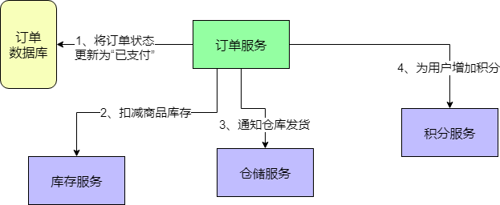
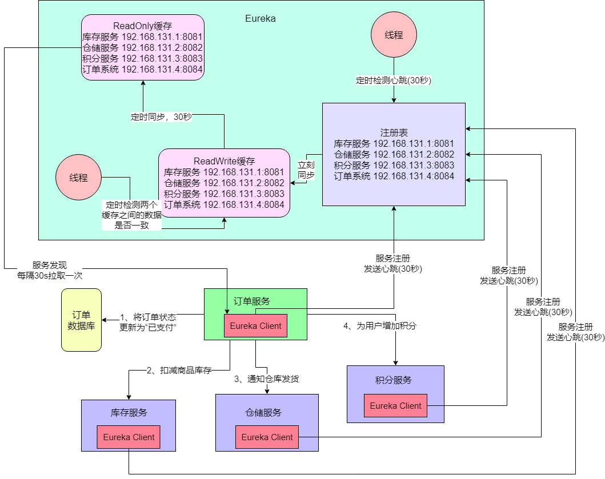
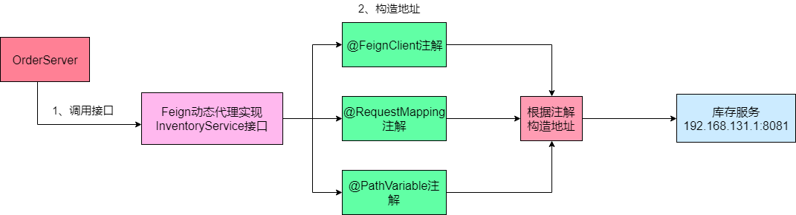
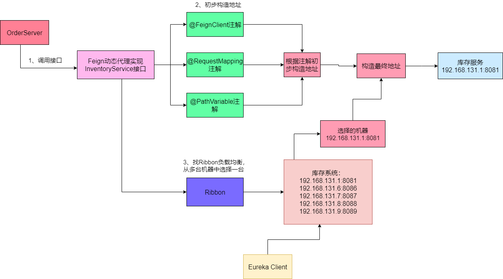
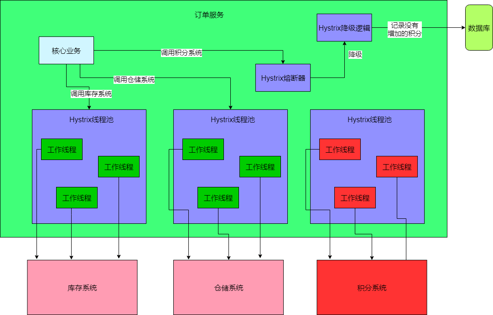
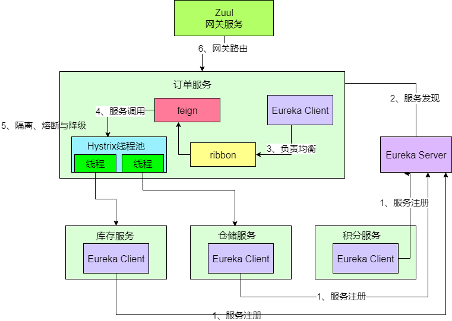

​		Spring Cloud是一个全家桶式的技术栈，包含了很多组件。本文主要简单介绍下最核心的几个组件的底层原理。包括Eureka、Ribbon、Feign、Hystrix和Zuul这几个组件。

## 业务场景介绍

​		文章先假定一个业务场景：现在开发一个电商系统，要实现支付订单的功能，流程如下：

- 创建一个订单之后，如果用户立刻支付了这个订单，我们需要将订单状态更新为“已支付”

- 扣减相应的商品库存

- 通知仓储中心，进行发货

- 给用户的这次购物增加相应的积分

针对上述流程，**我们需要有订单服务、库存服务、仓储服务、积分服务**。整个流程的大体思路如下：

- 用户针对一个订单完成支付之后，就会去找订单服务，更新订单状态

- 订单服务调用库存服务，完成相应功能

- 订单服务调用仓储服务，完成相应功能

- 订单服务调用积分服务，完成相应功能

如图所示：



## SpringCloud核心组件：Eureka

​		Eureka是微服务架构中的注册中心，主要功能是**服务注册与发现**和**心跳检测与故障**。在上述场景中，订单服务不知道其他其他服务在哪台机器上，此时就需要一个注册中心，来管理各个服务的地址，如图所示：



​		如上图所示，所有服务都有一个Eureka Client组件，这个组件专门负责将这个服务的信息注册到Eureka Server中，也就相当于告诉了Eureka Server自己在哪台服务器上，监听这哪个端口。而Eureka中维护了一个注册表，保存着各个服务的机器和端口号。

​		新增服务、下线服务都是直接操作Eureka-Server的注册表的，而注册表变更时为了并发安全是会加锁操作的（使用ReentrantReadWriteLock）然后注册表一变更，立刻清楚掉ReadWrite缓存的数据，并重新写入新数据。服务从ReadOnlyCache上拉取服务 ，并缓存到本地。而Eureka-Server采用两个缓存，是为了避免并发冲突。

​		假设没有ReadOnlyCacheMap，万一刚好注册表发生变更的时候，ReadWriteCacheMap会被失效掉，所以客户端的请求也就直接来读注册表了，会涉及到锁的操作，弄了个ReadOnlyCacheMap可以大大减少锁操作发生的概率。

​		假设没有ReadWriteCacheMap，那么ReadOnlyCacheMap每隔30秒刷新的时候就只能跟注册表比较了，如果此时注册表也发生了变更，也会涉及到锁的操作，因为ReadWriteCacheMap的存在（因为ReadWriteCacheMap是每隔180秒才会主动失效一次）也可以大大减少这个锁操作发生的概率。

​		除了服务注册与发现之外，Eureka还有检测心跳的功能，以此来判断那台机器出现故障。Eureka-Client默认每30秒想Eureka发送一次心跳，而Eureka-Server会有专门的线程来检测心跳。

​		总结一下：Eureka拥有服务注册与发现、心跳检测与故障等功能。其中：

- Eureka-Client：负责将这个服务的信息注册到Eureka Server中

- Eureka-Server：注册中心，里面有注册表和两个缓存，保存了各个服务所在的机器和端口。

## SpringCloud核心组件：Feign

​		通过Eureka我们知道了各个服务在哪里，但如何向其他服务发起请求呢，这个就是Feign的作用。如下所示：

```java
@Component
@FeignClient("tensquare-user")
public interface UserClient {

    @RequestMapping(value = "/user/incfollow/{userid}/{x}", method = RequestMethod.POST)
    public void incFollowcount(@PathVariable("userid")String userid, @PathVariable("x") int x);
}

```

​		通过使用Feign，直接就是用注解定义一个FeignClient接口，然后调用那个接口就可以了，FeignClient会在底层根据你的注解，跟你指定的服务建立连接、构造请求、发起请求、获取响应、解析响应等等。

​		而Feign之所以能实现这些功能，**关键的机制是使用了动态代理**。我们根据下图来分析：

- 首先，如果你对某个接口定义了@FeignClient注解，Feign就会针对这个接口创建一个动态代理
- 接着你要是调用按个接口，**本质上就是调用Feign创建的动态代理，这是核心中的核心**
- Feign的动态代理会根据你在接口上的@RequestMapping等注解，来**动态构造出你要请求的地址**。
- 最后针对这个地址，发起请求，解析响应



## SpringCloud核心组件：Ribbon

​		如果库存系统部署子在了五台机器上，Feign怎么知道该请求哪台机器呢。这时SpringCloud Ribbon就派上永用处了。**它的作用是负载均衡，会帮你在每次请求时选择一台机器，均匀的把请求分发到各个机器上**。

​		Ribbon的负载均衡**默认使用的是Round Robin轮询算法**。就是说如果订单服务对库存系统发起10次请求，那就先让你请求第1台机器。然后是第2台、第3台，第4、第5，然后再来一个循环，第1、第2。。。以此类推。

​		此外，Ribbon和Feign以及Eureka紧密协作而完成工作的，具体如下：

- 首先Ribbon会从Eureka-Client获取到对应的服务注册表，也就知道了所有的服务都部署在了哪些机器上，在监听哪些端口。
- 然后Ribbon就可以使用默认的Round Robin算法，从中选择一台。
- Feign就会针对这台机器，构造并发起请求。



## SpringCloud核心组件：Hystrix

​		在微服务架构里，一个系统会有很多的服务，以本文的业务场景为例：订单服务在一个业务流程里需要调用三个服务。现在假设订单服务有100个线程可以处理请求，然后积分服务不幸挂了，每次订单服务调用积分服务的时候，都会卡住几秒，然后抛出一个超时异常。这样会导致几个问题：

- 1、如果系统处于高并发的场景下，大量请求涌过来的时候，订单服务的100个线程都会卡在请求积分这块，导致订单服务没有一个线程可以处理请求。

- 2、然后就会导致别人请求订单服务的时候，发现订单服务也挂了，不响应任何请求了。

这就是**微服务架构中的服务雪崩问题**。这么多服务互相调用，要是不做任何保护的话，某一个服务挂了，就会引起连锁反应，导致别的服务也挂了。

​		但就算积分系统挂了，订单服务也可以不用挂啊。结合业务来看，支付订单的时候，只要把库存减了，然后通知仓库发货就可以了；如果积分系统挂了，大不了恢复之后，再手工恢复数据，不应该因为一个积分服务挂了，就直接导致订单服务也挂了。

​		这个时候就要使用Hystrix了。Hystrix是隔离、熔断以及降级的一个框架。就是**Hystrix会搞很多个小小的线程池**，例如订单服务请求库存服务是一个线程池，请求仓储服务是一个线程池，请求积分服务是一个线程池，每个线程池里的线程就仅仅用于请求哪个服务。

​		比如积分系统挂了，会导致订单服务里的那个调用积分服务的线程都卡死不能工作了，但是由于订单服务调用库存系统、仓储系统的这两个线程池都是正常工作的，所以这两个服务不会受到任何影响。

​		这个时候如果别人请求订单服务，订单服务还是可以正常调用库存服务扣减库存，调用仓储服务通知发货。只不过调用积分服务的时候，每次都会报错。**但是如果积分服务都挂了，每次调用都要去卡住几秒钟干啥呢？**有意义吗？当然没有！所以我们直接对积分服务熔断不就得了，比如在5分钟内请求积分服务直接就返回了，不要去走网络请求卡住几秒钟，这个过程，**就是所谓的熔断！**

​		而且积分系统挂了，我们还可以来个降级：每次调用积分服务，你就在数据库里记录一条消息，说给某某用户增加了多少积分，因为积分服务挂了，导致没增加成功！这样等积分服务恢复了，你可以根据这些记录手工加一下积分。这个过程，**就是所谓的降级**。



## SpringCloud的核心组件：Zuul

​		说完了Hystrix，接着给大家说说最后一个组件：Zuul，也就是微服务网关。**这个组件是负责网络路由的**。不懂网络路由？行，那我给你说说，如果没有Zuul的日常工作会怎样？

​		假设你后台部署了几百个服务，现在有个前端兄弟，人家请求是直接从浏览器那儿发过来的。**打个比方**：人家要请求一下库存服务，你难道还让人家记着这服务的名字叫做inventory-service？部署在5台机器上？就算人家肯记住这一个，你后台可有几百个服务的名称和地址呢？难不成人家请求一个，就得记住一个？你要这样玩儿，那真是友谊的小船，说翻就翻！

​		上面这种情况，压根儿是不现实的。所以一般微服务架构中都必然会设计一个网关在里面，像android、ios、pc前端、微信小程序、H5等等，不用去关心后端有几百个服务，就知道有一个网关，**所有请求都往网关走，网关会根据请求中的一些特征，将请求转发给后端的各个服务**。

​		而且有一个网关之后，还有很多好处，比如可以做**统一的降级、限流、认证授权、安全**，等等。

## 总结

最后再来总结一下，上述几个Spring Cloud核心组件，在微服务架构中，分别扮演的角色：

- **Eureka**：各个服务启动时，Eureka Client都会将服务注册到Eureka Server，并且Eureka Client还可以反过来从Eureka Server拉取注册表，从而知道其他服务在哪里
- **Ribbon**：服务间发起请求的时候，基于Ribbon做负载均衡，从一个服务的多台机器中选择一台
- **Feign**：基于Feign的动态代理机制，根据注解和选择的机器，拼接请求URL地址，发起请求
- **Hystrix**：发起请求是通过Hystrix的线程池来走的，不同的服务走不同的线程池，实现了不同服务调用的隔离，避免了服务雪崩的问题
- **Zuul**：如果前端、移动端要调用后端系统，统一从Zuul网关进入，由Zuul网关转发请求给对应的服务



