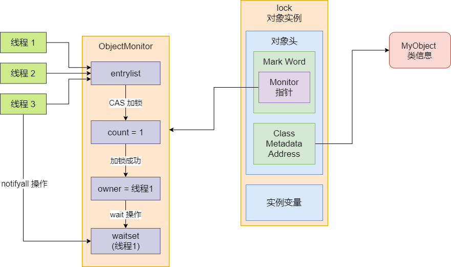

## Synchronized 关键字

Synchronized 关键字，可以同时保证原子性、可见性以及有序性


原子性层面而言，它加了 `synchronized` 之后，就有一个加锁和释放锁的机制。加锁之后，同一段代码就只有它可以执行了


可见性，它会通过加入一些内存屏障，使得它在同步代码块中对变量做的写操作，都会在释放锁的时候，全部强制执行 `flush` 操作；在进入同步代码块的时候，对变量的读操作，全部会强制执行 `refresh` 操作。这样那些更新了的数据，别的线程只要进入代码块，就可以读到


有序性，`synchronized` 关键字，它会通过加各种各样的内存屏障，来解决 LoadLoad、StoreStore 等重排序。


### Synchronized 通过加锁保证原子性

之前有跟简单说过 `synchronized` 加锁的原理，说白了，就是在进入加锁代码块的时候加一个 `monitorenter` 的指令，然后针对锁对象关联的 `monitor` 累加加锁计数器，同时标识自己这个线程加了锁。通过 `monitor` 里的加锁计数器可以实现可重入的加锁。


在出锁代码块的时候，加一个 ` monitorexit` 的指令，然后递减锁计数器。如果锁计数为 0，就会标志当前线程不持有锁，从而释放锁。


另外，`wait` 和 `notify` 关键字的实现也是依托于 `monitor` 实现的。在线程执行 wait 之后，自己会加入一个 `waitset` 中等待唤醒获取锁。`notifyall` 操作会从  monitor 的 waitset 中唤醒所有的线程，让他们竞争获取锁。


我们看如下的代码：

```java
MyObject lock = new MyObject();

synchronized(lock){

}
```


Java 对象都是分为**对象头**和**实例变量两块**的，其中实例变量就是平时看到的对象里的那些**变量数据**。然后对象头包含了两块东西，一个是 `Mark Word`（包含了 hashCode、锁数据、GC 数据等等），另一个是 `Class Metadata Address`（包含了指向类的元数据的指针）


在 Mark Word 里就有一个指针，是指向了这个对象实例关联的 monitor 的地址，这个 monitor 是 c++ 实现的，不是 Java 实现的。这个 monitor 实际上就是 c++ 实现的一个 `ObjectMonitor` 对象，里面包含了一个 `_owmer` 指针，指向了持有锁的线程


ObjectMonitor 里还有一个 `entrylist`，想要加锁的线程全部先进入这个 entrylist 等待获取机会尝试加锁，有机会加锁的线程，就会设置 `_owner` 指针指向自己，然后对 `_count` 计数器累加 1 次。


各个线程尝试竞争进行加锁，此时竞争加锁是在 JDK1.6 以后优化成了基于 `CAS` 来进行加锁，理解为跟之前的 Lock API 的加锁机制是类似的。通过 CAS 操作，操作 `_count` 计数器，例如将 `_count` 值尝试从 0 变为 1


如果成功了，那么执行加锁成功，如果失败了，那么加锁就失败了


然后释放锁的时候，先是对 `_count` 计数器递减 1，如果为 0 了就会设置 `_owner` 为 null，不再指向自己，代表自己彻底释放锁。


如果获取锁的线程执行 wait，就会将计数器递减，同时 `_owner` 设置为 null，然后自己进入 waitset 中等待唤醒，别人获取了锁执行 `notify` 的时候就会唤醒 waitset 中的线程竞争尝试获取锁。


这里需要注意的是，尝试加锁这个过程，也就是对 `_count` 计数器累加操作。如何保证多线程并发安全的原子性？就如上面说的，在 JDK1.6 之后，对 `synchronized` 内的加锁机制做了大量的优化，这里就是优化为 CAS 加锁的。

