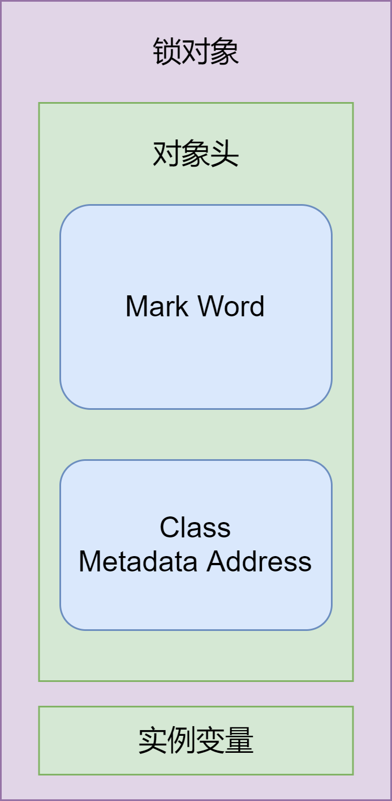
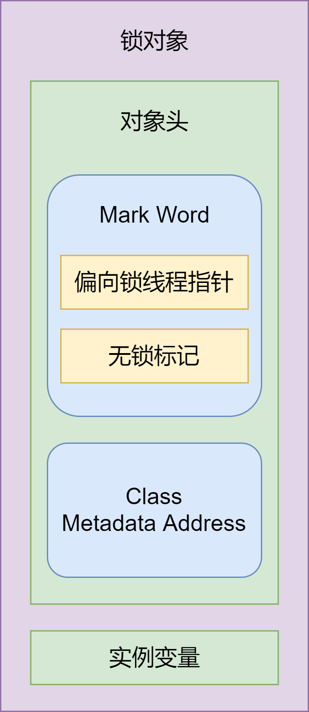
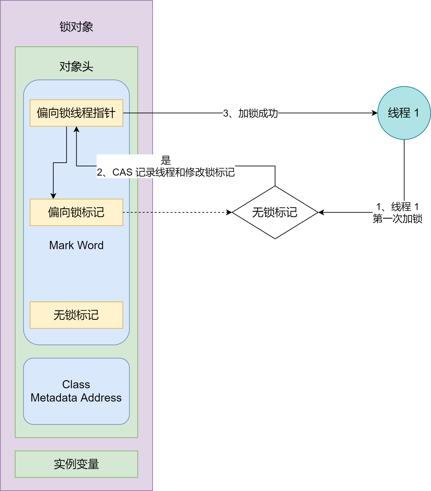
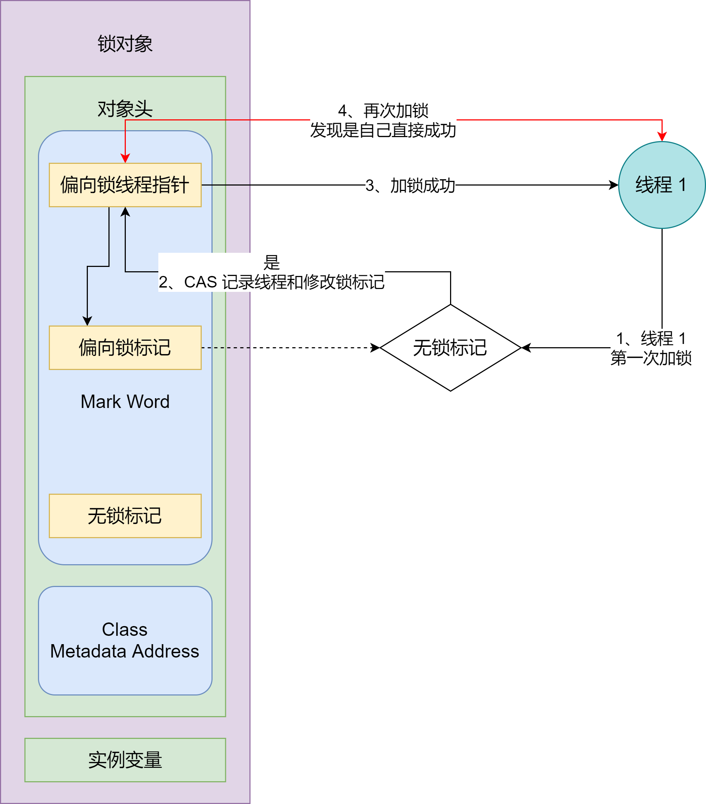
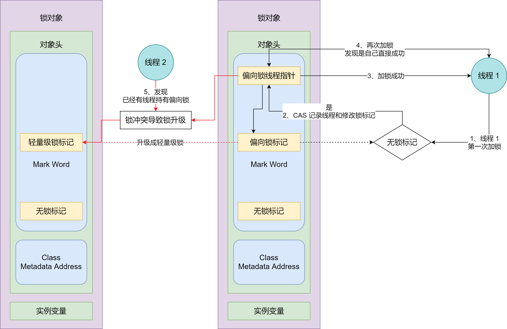
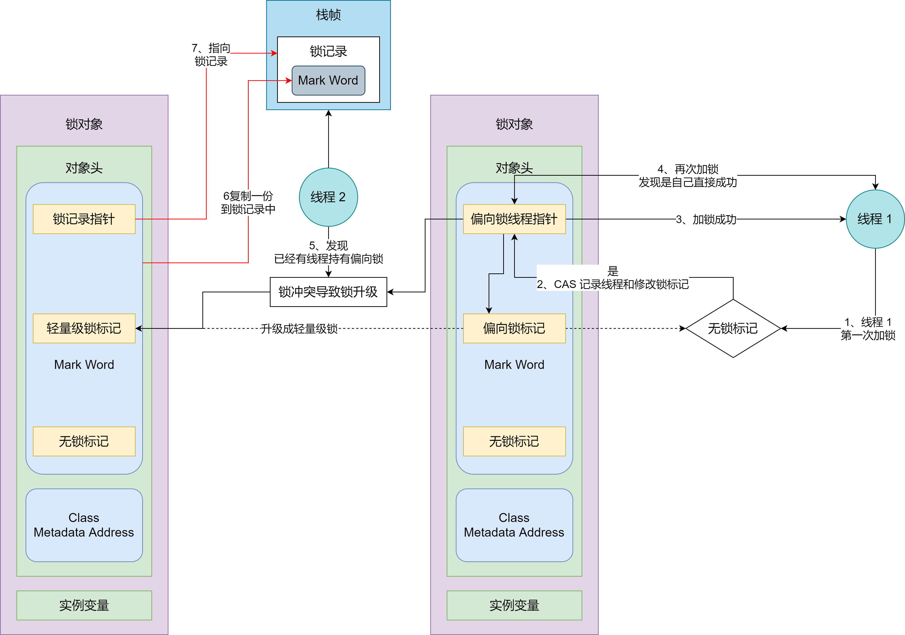
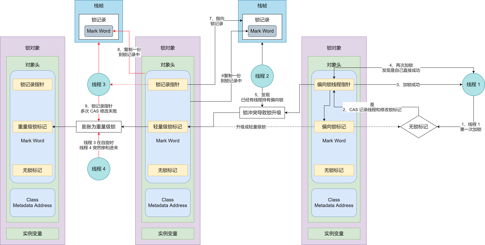
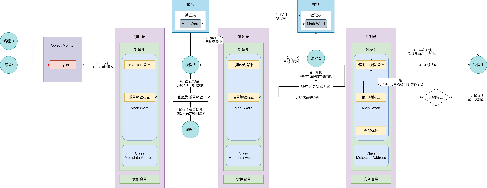
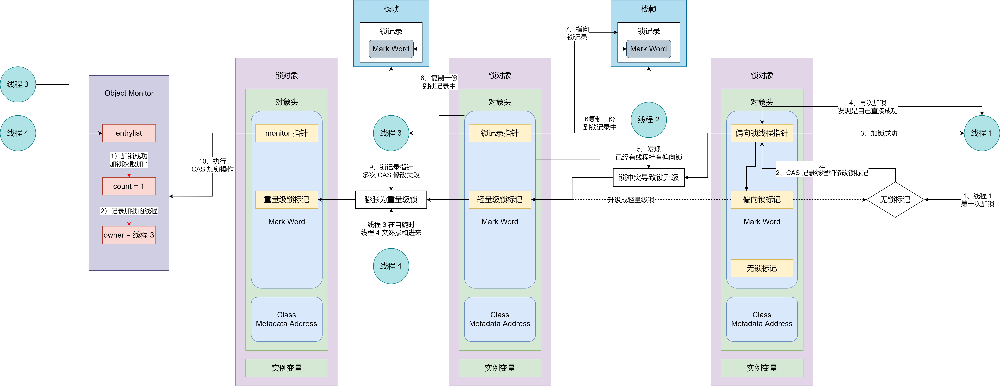

本文主要谈一下 Synchronized 锁的各种优化：包括偏向锁、轻量级锁、重量级锁，以及它们之间是如何获取和释放锁、锁之间是如何进行升级和膨胀的

## 偏向锁

从 JDK 1.6 开始，JVM 对比较重的 Synchronized 就引入了各种锁优化的机制，偏向锁算是最轻的一种锁，应用的场景也是最简单的，即偏向锁是专门为了优化线程多次获取同一把锁的场景量身打造的

比如说方式 A 是被 Synchronized 修饰的，线程 1 可能会多次调用方法 A，这样每次都要加锁和释放锁，而获取锁和释放锁是切切实实伴随着性能的损耗的

因为我们现在已经知道当前场景，即一个线程多次来获取一把锁，能不能说第一次获取锁成功之后，后面要是同一个线程再来获取锁时，就可以快点获取锁。根据这个想法，偏向锁机制被提出来了

### 偏向锁的获取

Synchronized 加锁时，肯定是要加锁的，对谁加锁呢？

- 访问 Synchronized 修饰的实例方法，锁对象就是方法对应的实例对象
- 访问 Synchronized 修饰的静态方法，锁对象就是方法所在的类，即类的字节码对象
- 访问 Synchronized 代码块，那锁对象就是 Synchronized 当前指定的对象

而偏向锁的具体实现细节，得要从锁对象的结构中进一步寻找答案

首先锁对象包含对象头以及其他的一些成员变量，包括成员变量、实例方法等，重点我们关注**对象头**

对象头里面包含的内容比较多，比如 `Mark Work`、`ClassMetadata Address`（就是当前锁对象的类在方法区中的地址）等，如下图：

而偏向锁实现的关键主要依附于 `Mark Word` 来实现：Mark Word 中有一个标志位用来记录当前锁的状态，比如当前是无锁状态还是偏向锁状态呢？

另外当一个线程获取锁成功后，Mark Word 中还有一个指向那个获取锁成功的线程指针；一开始获取锁的线程的指针当然为空，并且锁的状态为无锁状态，如下图：

此时线程 1 过来获取 Synchronized 锁，线程 1 先看下锁的状态，如果为无锁状态，就直接将偏向锁的线程指针 CAS 改为指向线程 1，然后将锁标记 CAS 为偏向锁标记，标志这线程 1 获取偏向锁成功，如下所示：

如果说线程 1 以后再要对同一个 Synchronized 加锁，此时就到锁对象头中的 Mark Word 中看一下，发现当前已经是偏向锁标记了，并且当前偏向锁线程指针也是指向自己，此时就可以几乎零性能损耗获取锁成功了。如下：

现在应该能感受到偏向锁的好处了吧。偏向锁，偏的是同一个线程，一个线程只在第一次获取锁时，需要 CAS 修改下锁的的标记以及线程指针，耗费一点性能，而往后的重复加锁都是以极低的代价直接获取锁成功的

### 竞争释放偏向锁

偏向锁的使用场景我们提到过一点，它是适合线程多次获取同一把锁而做的优化措施，适用于竞争不是很激烈的场景，一旦多线程竞争激烈了，此时就会导致偏向锁的释放和锁的升级

此时，如果线程 2 也过来对同一个 Synchronized 加锁会怎样？那就要看下之前的线程 1 是否还存活：

- 如果线程 1 已经执行结束了，那么此时线程 2 过来一看锁标记依然为偏向锁，但是线程指针指向的线程 1 已经没了，此时就将偏向锁的指针指向线程 2，线程 2 获取偏向锁成功，偏向锁后续就偏向线程 2 了
- 如果当前锁标记为偏向锁，并且当前线程 1 依然是存活的，此时线程 2 过来要对同一个 Synchronized 获取锁，此时就构成竞争，也就不符合偏向锁的适用的场景了。此时就会释放线程 1 获取的偏向锁，并且就锁标记 CAS 改为轻量级锁

从这里我们可以感受到，偏向锁的使用场景并不是很狭义的只有一个线程工作的场景，而不是竞争非常小，小道不足以发生竞争，这样对单个线程的多次获取同一个锁优化效率就可以充分发挥出来了

此时释放偏向锁的场景如下图所示：

## 轻量级锁

### 轻量级锁的获取

前面我们分析到线程 2 过来加锁时，和线程 1 产生冲突，线程 1 的偏向锁释放并被迫升级为了轻量级锁，那此时线程 1 和线程 2 都没有获取到锁，线程 1 和线程 2 都会同时 CAS 去获取轻量级锁

**偏向锁的加锁机制为修改 Mark Word 中锁标记位为偏向锁，并且线程指针指向当前线程**，那么轻量级锁的加锁机制是怎样的呢？我们继续看下

比如现在是线程 2 过来加锁，此时就会在线程 2 对应栈帧中开辟一块所记录的内存空间，然后将锁对象中的 Mark Word 复制一份到栈帧的锁记录中，并且将锁对象中的线程指针指向栈帧中的锁记录空间，这样轻量级锁算是加成功了。如下：

### 轻量级锁释放锁

当线程 2 的轻量级锁释放时，此时就会逆向操作，将线程 2 栈帧锁记录中的 Mark Word CAS 替换回锁对象中的 Mark Word，如果替换成功，就表示释放轻量级锁成功

到这里我们发现，之所以轻量级锁比偏向锁稍微重那么一点，就是下你比较于偏向锁而言，轻量级锁每次都要先加锁，然后还需要再释放锁。不想偏向锁，只要不产生竞争，那么第一次加锁一次即可，后续再次获取锁的性能耗费极低，并且也不需要释放锁，自然也就不用承担释放锁性能损耗了

## 重量级锁

### 什么时候会膨胀为重量级锁

#### 情况 1：其他线程 CAS 自旋失败导致膨胀为重量级锁

假设线程 2 还没有释放轻量级锁，此时线程 3 过来加锁，线程 3 和线程 2 一样，先把 Mark Word 复制一份到自己线程栈帧中的锁记录空间，然后在修改锁记录的指针时，因为锁记录的指针已经指向了线程 2，所以此时线程 3 的 CAS 修改锁记录指针就会失败

此时线程 3 的 CAS 操作失败并不会像偏向锁一样直接导致锁升级，而是会先 CAS 自旋一会，如果自旋获取锁失败的次数过多，此时才会升级为重量级锁

#### 情况 2：三个线程竞争导致直接膨胀为重量级锁

假设此时也是线程 2 获取了轻量级锁，线程 3 过来 CAS 加锁，修改锁记录指针时失败了，然后线程 3 正在自旋获取锁，这时正好线程 4 也来获取锁了，此时 JVM 会毫不犹豫地将锁膨胀为重量级锁

毕竟线程 3 在那自旋时，要是线程 2 能快点释放锁，那么线程 3 还是有机会在最大允许自旋次数内获取到轻量级锁的，这下倒好，线程 4 直接掺和进来，JVM 会认为现在线程 3 获取锁的希望不大，竞争太激烈了，所以就直接膨胀为重量级锁了

以下两种膨胀情况如下所示：

### 重量级锁的获取

现在由于锁膨胀为重量级锁，原本的锁记录的指针将会变为指向重量级锁 Monitor 对象的指针了，并且当前所有没获取到锁的线程优先进入到 Monitor 对象中 entrylist 中获取等待锁，如下：

然后多线程依次去获取锁，比如现在线程 3 开始获取锁，此时底层会执行 `monitorenter` 指令，然后在 Object Monitor 中锁的计数器加 1，并且记录当前持有锁的线程为线程 3，后面如果线程 3 再次过来加锁时发现当前持有锁的线程正是线程 3，直接将计数器加 1，表示又重入了一次锁，如下：

### 重量级锁的释放

重量级锁的释放比较简单，直接递减加锁次数 count：

- 递减后如果 count 为 0，表示当前线程该释放的都释放完了，此时直接将线程指针 owner 置空，释放锁完毕
- 如果递减后 count 还不为 0，那就表示线程之前对这个锁重入过好几次，那还得线程再次执行释放锁操作，直到 count 为 0 才算释放彻底了，才能将线程指针置空

## JIT 编译器的优化

Java 代码编译生成 class 字节码文件是静态编译过程，那么 class 字节码文件编译成计算机能执行的机器指令，这个阶段就包含了 JIT 编译

Synchronized 加锁时，除了对不同竞争程度做的各种锁优化之外，在最开始的 JIT 编译阶段也会 Synchronized 也做了一定程度的优化

### 锁消除

优化点之一就是锁消除，锁消除顾名思义就是不要你加的锁，把你加的 Synchronized 锁删除掉，免得加锁还要浪费性能，那什么场景下要锁消除呢？、

一般是在不需要加 Synchronized 锁的地方加锁。比如一个方法内，涉及到的变量都是局部变量，并且要是根据逃逸分析技术分析，发现完全没有将当前线程资源暴露给其他线程看见的可能，既然其他线程没有任何看见当前线程的资源，也就不会出现并发的问题，既然没有并发的问题，那你还莫名加个锁岂不是浪费性能了

所以 JIT 底层默默为该现象把了倒关，即锁消除的优化，要是在没有多线程并发冲突的地方还加 Synchronized 锁，底层就不会执行 `monitorenter` 和 `monitorexit` 相关的指定了

### 锁粗化

我们知道 Synchronized 锁比较重，也是比较消费性能的。比如有个场景，你在一个方法内，对同一个对象加了多次 Synchronized 锁，此时可能就对应有多个 Synchronized 代码块。正常我们看到这种情况，都会优化成：将多个 Synchronized 代码块合并在一个 Synchronized 代码块中，否则你就要先加锁在释放锁，重复多次这种耗费性能的操作

 确实 JIT 编译时也是这样设计的，底层不会多次执行 `monitorenter` 和 `monitorexit` 指令，如果发现居然是对同一个对象多次加 Synchronized 锁，底层将会把他们合并成一个 Synchronized 代码块，然后只会执行一次 monitorenter 和 monitorexit，达到了优化的目的，底层这里又对代码的性能把了道关

现在我们可以知道，锁粗化，顾名思义就是多个 Synchronized 代码块在底层 JIT 编译时合并成一个，好似一个锁变粗了一样，尽可能地避免了不必要的。多次加锁和释放锁带来的性能损耗

### 自适应加锁

我们前面看到了，在前面多个线程获取锁的时候，如果获取锁失败，都会自旋一会，然后再去尝试获取锁，也就是自旋加锁

其实这个做法已经比较先进了，相比于一旦获取锁失败就阻塞，然后线程上下文切换执行其他线程而言，确实已经很好了，毕竟线程上下文切换时很耗费性能的，如果说你能够自旋一会，等到其他线程释放锁之后就能获取到锁，虽然自旋一会耗费了点 CPU，但是相比于线程上下文切换的代价，自旋一会就可以获取到锁还是更好的

但是问题来了，要是当前的环境竞争非常激烈，我一直自旋都获取锁失败，可能都超过了线程上下文切换带来的性能损耗，那自旋获取锁岂不是性能更差？面对这个问题，提出了自适应加锁的概念

即根据最近几次线程自旋获取锁成功的概率，来决定当前线程是自旋一会来获取锁，还是直接阻塞切换线程上下文让其他线程执行

如果最近一段时间线程竞争程度比较激烈，那就不适合一直自旋等待；如果最近几次线程竞争很小，自旋获取锁的成功率比较高，那可以自旋等待一会来获取锁，通过这样比较智能的自适应过程，来权衡自旋加锁和线程上下文切换带来的性能损耗

## 题目剖析

### 偏向锁的加锁流程能简单说下吗？一般适用于什么场景？

偏向锁加锁时，首先会在 Synchronized 对应锁对象的对象头中的 Work Mark 中，先看一下锁的标记：

- 如果是无锁状态，CAS 修改为偏向锁标记，然后将 Mark Word 中的线程指针指向当前线程，表示当前线程已经获取到了一个偏向锁；那么后续该线程再来加锁时，发现自己已经获取偏向锁了，那么此时几乎零成本获取偏向锁成功
- 如果已经是偏向锁状态，那就看下当前的 Mark Word 中，线程指针指向的线程是不是自己，如果是自己，当然直接获取偏向锁成功了如果指针指向的线程不是当前线程，但恰好该指向的线程已经结束了，那么直接将 Mark Word 中，线程指针指向当前线程自己，表示现在改为偏向当前新来的线程了

从偏向锁的加锁流程我们可以看到，偏向锁只适合于竞争不激烈的场景，主要是优化同一个线程多次获取同一个锁的性能，如果说线程 1 已经获取偏向锁成功，并且在线程 1 还没有结束时，紧接着线程 2 又过来获取锁，这下一看锁标记为偏向锁，还被线程 1 持有，那就直接发生竞争了

### 轻量级锁时如何加锁的？为什么说轻量级锁会比偏向锁更重一点呢？

首先线程会在自己线程的栈帧中创建一个锁记录空间，然后将 Mark Word 复制一份到这个锁记录空间中，然后将锁对象中的 Mark Word 指向这个锁记录空间，轻量级锁就算获取成功了

因为轻量级锁相比较于偏向锁而言，每次加锁使用完毕后都需要释放锁，也就是说每次都需要老老实实地执行加锁和释放锁。而偏向锁只有在线程第一次过来加锁时，

