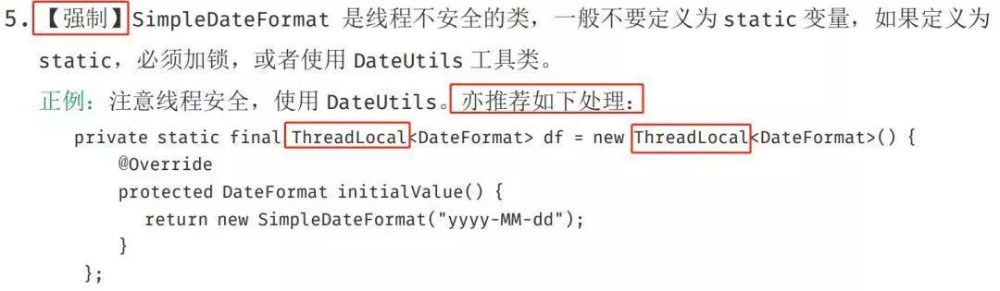
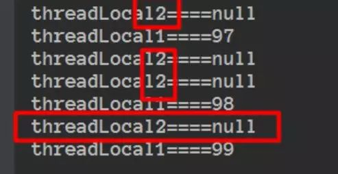
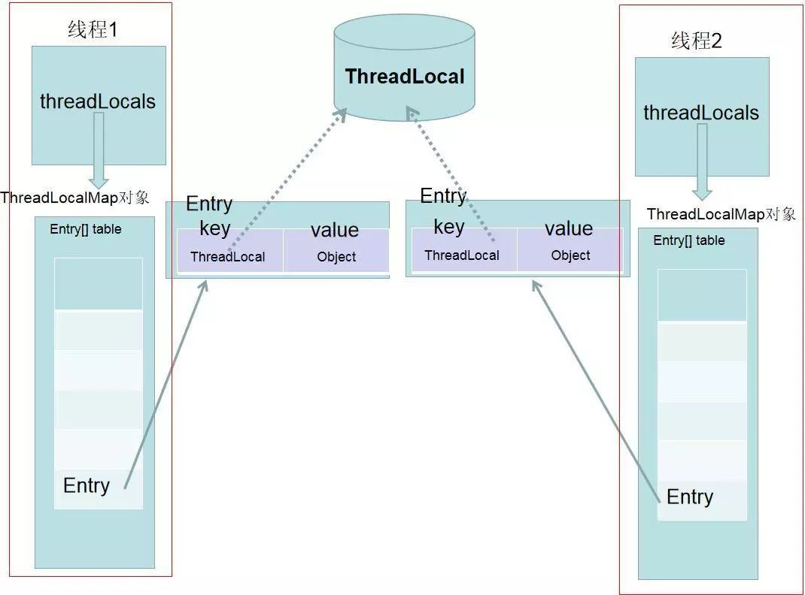
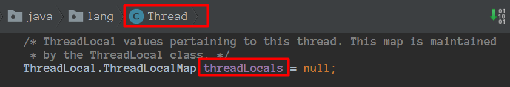
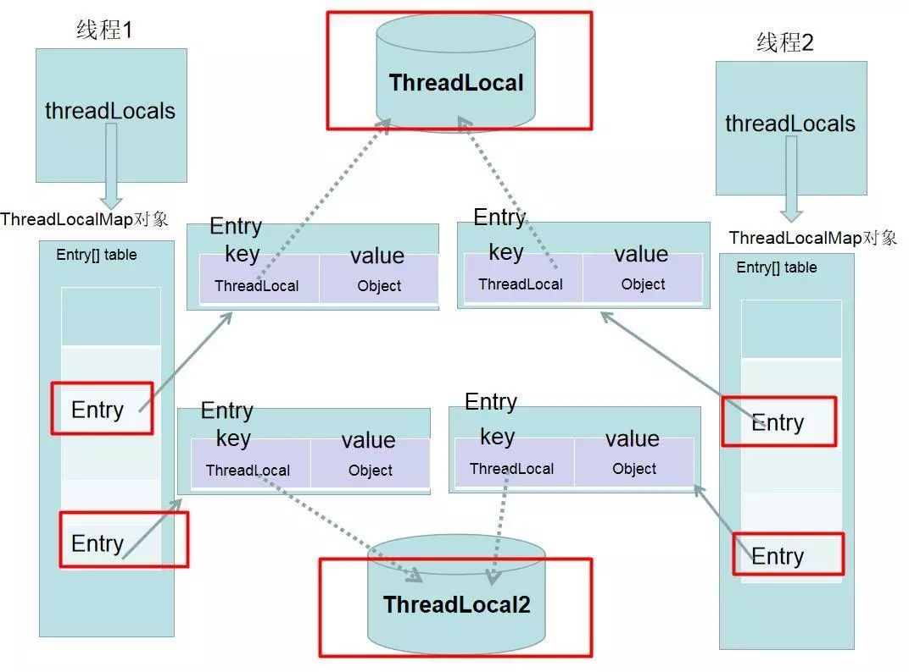
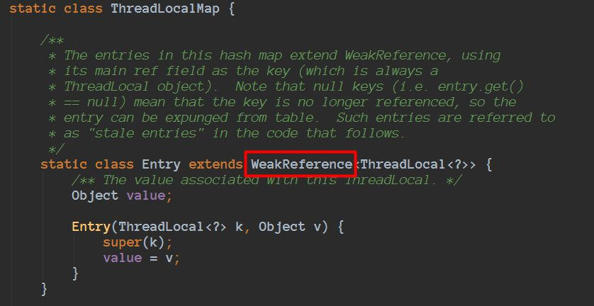
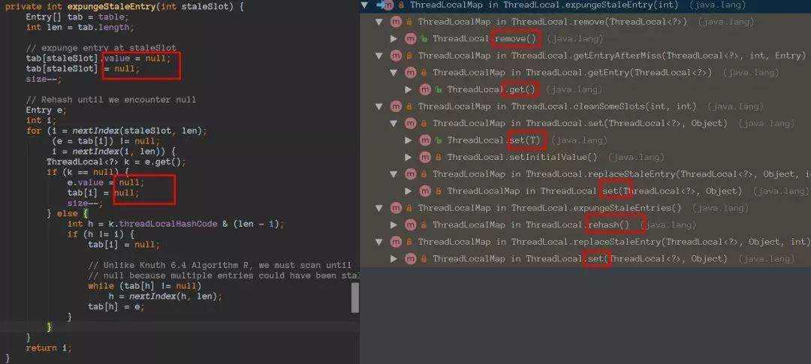
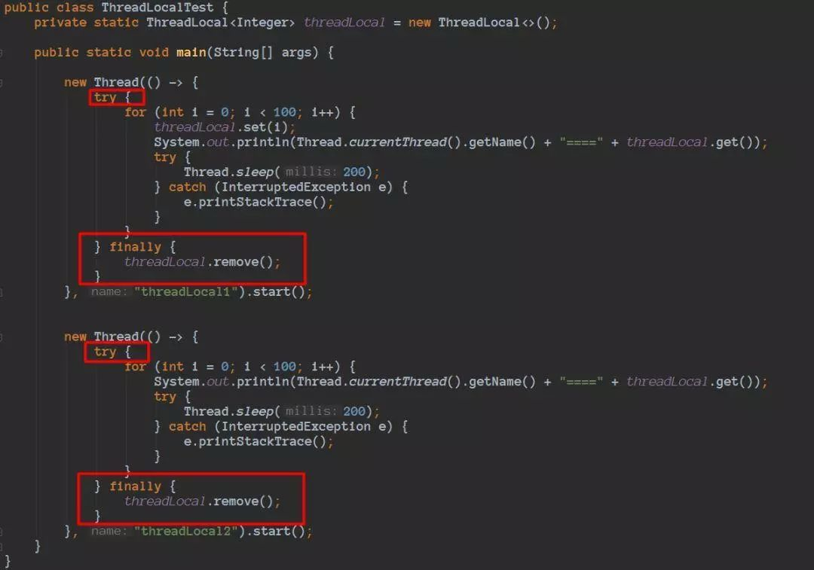

## ThreadLocal 用在什么地方

讨论 ThreadLocal 用在什么地方之前，我们先明确下，如果仅仅只有一个线程，都不用谈 ThreadLocal 了，**因为 ThreadLocal 是用在多线程的场景的！！**


ThreadLocal 归纳下来就 2 类用途：

- **保存线程上下文信息，在任意需要的地方可以获取**

- **线程安全的，避免某些情况需要考虑线程安全必须同步带来的性能损失**


### 保存线程上下文信息，在任意需要的地方可以获取

由于 ThreadLocal 的特性，同一线程在某地方进行设置，在随后的任意地方都可以获取到，从而可以用来保存线程上下文信息。


常用的比如每个请求怎么把一串后续关联起来，就可以用 ThreadLocal 进行 set，在后续的任意需要记录日志额的方法里进行 get 获取到请求 id，从而把整个请求串起来。还有比如 Spring 的事务管理，用 ThreadLocal 存储 Connection，从而各个 DAO 可以获取同一个 Connection，可以进行事务回滚，提交等操作。


> 备注：ThreadLocal 的这种用处，很多时候是用在一些优秀的框架里面的，一般我们很少接触，反而下面的场景我们接触的更多一些


### 线程安全，避免某些情况需要考虑线程安全必须同步带来的性能损失

ThreadLocal 为解决多线程程序的并发问题提供了一种新的思路，但是 ThreadLocal 也有局限性，我们来看看阿里的规范：


> 【参考】**ThreadLocal 无法解决共享对象的更新问题**，ThreadLocal 对象建议使用 static 修饰。这个变量时针对一个线程内所有操作共享的，所以设置为静态变量，所有此类实例共享次静态变量，也就是说在类第一次被使用时装载，只分配一块存储空间，所有此类的对象（主要是这个线程内定义的）都可以操控这个变量。


每个线程往 ThreadLocal 中读写数据是线程隔离，互相之间不会影响的，**所以 ThreadLocal 无法解决共享对象的更新问题**。


> 由于不需要共享信息，自然就不存在竞争问题，从而保证了某些情况下线程的安全，以及避免了某些情况需要考虑线程安全必须同步带来的性能损失。


这类场景阿里规范也提到了：




## ThreadLocal 一些细节

ThreadLocal 使用示例代码：

```java
public class ThreadLocalTest {

    private static ThreadLocal<Integer> threadLocal = new ThreadLocal<>();

    public static void main(String[] args) {
        new Thread(() -> {
            try {
                for (int i = 0; i < 100; i++) {
                    threadLocal.set(i);
                    System.out.println(Thread.currentThread().getName() + "===" + threadLocal.get());
                    try{
                        Thread.sleep(200);
                    }catch (InterruptedException e) {
                        e.printStackTrace();
                    }
                }
            } finally {
                threadLocal.remove();
            }
        }, "threadLocal1").start();

        new Thread(() -> {
            try {
                for(int i = 0; i < 100; i++) {
                    System.out.println(Thread.currentThread().getName() + "===" + threadLocal.get());
                    try {
                        Thread.sleep(200);
                    }catch (InterruptedException e) {
                        e.printStackTrace();
                    }
                }
            } finally {
                threadLocal.remove();
            }
        }, "threadLocal2").start();
    }
}

```


代码运行结果：




从运行的结果我们可以看到 ThreadLocal1 进行 set 值对 ThreadLocal2 没有任何影响


Thread、ThreadLocalMap、ThreadLocal 总览图：







Thread 类有属性变量 threadLocals（类型是 ThreadLocal.ThreadLocalMap），也就是说每个线程有一个自己的 ThreadLocalMap，所以每个线程往这个 ThreadLocal 中读写隔离的，并且是互相不会影响的。


**一个 ThreadLocal 只能存储一个 Object 对象，如果需要存储多个 Object 对象那么就需要多个 ThreadLocal**。如图：




看到上面的几个图，大概思路应该都清晰了，我们 Entry 的 key 指向 ThreadLocal 用虚线表示弱引用，下面我们看看 ThreadLocalMap：




java 对象的引用包括：强引用、软引用、弱引用、虚引用。因为这里涉及到弱引用，简单说明下，弱引用也是用来描述非必需对象的，当 JVM 进行垃圾回收时，无论内存是否充足，**该对象仅仅被弱引用关联**，那么就会被回收。


当仅仅只有 ThreadLocalMap 中的 Entry 的 key 指向 ThreadLocal 的时候，ThreadLocal 会进行回收的。ThreadLocal 被垃圾回收后，在 ThreadLocalMap 里对应的 Entry 的 key 值会变成 null，但是 Entry 是强引用，那么 Entry 里面存储的 Object，并没有办法进行回收。所以，ThreadLocal 做了一些额外的回收工作。




虽然做了但是也会存在内存泄露风险，所以后面会提到 ThreadLocal 最佳实践


## ThreadLocal 的最佳实践

ThreadLocal 被垃圾回收后，在 ThreadLocalMap 里对应的 Entry 的键值会变成 null，但是 Entry 是强引用，那么 Entry 里面存储的 Object，并没有办法进行回收，所以，ThreadLocalMap 做了一些额外的回收工作。


> 备注：很多时候，我们都是用在线程池的场景，程序不停止，线程基本不会销毁


由于线程的生命周期很长，如果我们往 ThreadLocal 里面 set 了很大很大的 Object 对象，虽然 set、get 等等方法在特定的条件会调用进行额外的清理，但是 **ThreadLocal 被垃圾回收后，在 ThreadLocalMap 里对应的 Entry 的键值会变成 null，但是后续也没有操作 set、get 等方法了**。


**所以最佳实现，应该在我们不使用的时候，主动调用 remove 方法进行清理。**


> 【参考】ThreadLocal 无法解决共享对象的更新问题，ThreadLocal 对象建议使用 static 修饰。这个变量时针对一个线程内所有操作共享的，所以设置为静态变量，所有次类实例共享次静态变量，也就是说再类第一次被使用时装载，只分配一块存储空间，所有此类的对象（只要是这个线程内定义的）都可以操控这个变量。


这里把 ThreadLocal 定义为 static 还有一个好处是，由于 ThreadLocal 里有强引用在，那么在 ThreadLocalMap 里对应的 Entry 的键也会永远存在，那么执行 remove 的时候就可以正确进行定位并且删除。


所以最佳实践做法应该为：




## 参考资料

[ThreadLocal](https://mp.weixin.qq.com/s/SysYihctu03RlUtI0pcG7w)