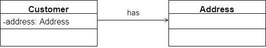
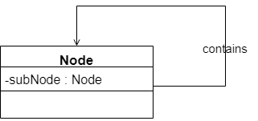

​		在软件系统中国，类并不是孤立存在的，类与类之间存在各种关系，对于不同类型的关系，UML提供了不同的表示方式。

## 关联关系

​		关联关系是类与类之间最常用的一种关系，它是一种结构化关系，用于表示一类对象与另一类对象之间有联系，如汽车和轮胎，师傅和徒弟，班级和学生等。在UML类图中，**用实现连接有关联关系的对象所对应的类**。

​		例如现在一个登陆界面类LoginForm中包含一个JButton类型的注册按钮loginButton，它们之间可以表示为关联关系，代码实现时可以在LoginForm中定义一个名为loginButton的属性对象，其类型为JButton，如图所示：


对应的JAVA代码片段如下：

```java
public class LoginForm {
    
    //定义成员变量
    private JButton loginButton;
    
    ...
}

public class JButton {
    ...
}
```

​		在UML中，关联关系又包含如下几种形式。

### 双向关联

​		默认情况下，关联是双向的。例如顾客购买商品并拥有商品，反之，卖出的商品总有某个顾客与之关联。因此，Customer类和Product类之间具有双向关联关系，如图所示：


​		对应的代码片段如下：

```java
public class Customer {
    
    private Product[] products;

    ...
}

public class Product {
    private Customer customer;
    
    ...
}
```

### 单向关联

​		类的关联关系也可以是单向的，**在UML中单向关联关系用带箭头的实线表示**。例如，顾客拥有地址，则Customer类与Address类具有单向关联关系，如图所示：



​		对应的代码如下：

```java
public class Customer {

    private Address address;

    ...
}

public class Address {
    
    ...
}
```

### 自关联

​		在系统中可能会存在一些类的属性对象类型为该类本身，这种特殊的关联关系成为自关联。例如，一个节点类（Node）的成员又是节点Node类型的对象，如图所示：



​		对应的代码如下：

```java
public class Node {

    private Node subNode;

    ...
}
```

### 多重性关联

​		多重性关联关系又称为重数性（Multiplicity）关联关系，表示两个关联对象在数量上的对应关系。在UML中，对象之间的多重性可以直接在关联直线上用一个数字或一个数字范围表示。

​		对象之间可以存在多种多重关联惯性，常见的多重性表示方法如下表：

| 表示方式 | 多重性说明                                                   |
| -------- | ------------------------------------------------------------ |
| 1.. 1    | 表示另一个类的一个对象只与改类的一个对象有关系               |
| 0.. *    | 表示另一个类的一个对象与该类的零个或多个对象有关系           |
| 1.. *    | 表示另一个类的一个对象与该类的一个或多个对象有关系           |
| 0.. 1    | 表示另一个类的一个对象没有或只与改类的一个对象有关系         |
| m.. n    | 表示另一个类的一个对象与该类最少m，最多n个对象有关系（m <= n） |

​		例如，一个界面可以拥有零个或多个按钮，但是一个按钮只能属于一个界面。因此，一个Form类的对象可以与零个或多个Button类的对象相关联，但一个Button类的对象只能与一个Form类的对象关联，如图所示：


​		对应的代码如下：

```java
public class Form {

    //定义一个集合对象
    private Button[] buttons;

    ...
}

public class Button {

    ...
}
```

### 聚合关系

​		聚合关系表示整体与部分的关系。在聚合关系中，成员对象是整体对象的一部分，但是成员对象可以脱离整体对象独立存在。在UML中，**聚合关系用带空心菱形的直线表示**。例如，汽车发送机是汽车的组成部分，但是汽车发送机可以独立存在，因此，汽车和发送机是聚合关系，如图所示：


​		在代码实现聚合关系时，**成员对象通常作为构造方法、Setter方法或业务方法的参数注入到整体对象中**，如下所示：

```java
public class Car {
    
    private Engine engine;

    //构造注入
    public Car(Engine engine) {
        this.engine = engine;
    }
    
    //设值注入
    public void setEngine(Engine engine) {
        this.engine = engine;
    }
    
    ...
}

public class Engine {

    ...
}
```

### 组合关系

​		组合关系也表示类之间整体和部分的关系，但是在组合关系中整体对象可以控制成员对象的生命周期，一旦整体对象不存在，成员对象也将不存在，成员对象与整体对象之间具有同生共死的关系。在UML中，**组合关系用带实心菱形的直线表示**。例如，人的头（Head）与嘴巴（Mouth），嘴巴是头的组成部分之一，而且如果头没了，嘴巴也就没了，因此头和嘴巴是组合关系，如图所示：


​		在代码实现组合关系时，**通常在整体类的构造方法中直接实例化成员类**，如下所示：

```java
public class Head {

    private Mouth mouth;

    public Head() {
        mouth = new Mouth();
    }

    ...
}

public class Mouth {

    ...
}
```

## 依赖关系

​		依赖关系是一种使用关系，特定事物的改变有可能会影响到使用该事物的其他的事物，在需要表示一个事物使用另一个事物时使用依赖关系。大多数情况下，依赖关系体现在某个类的方法使用另一个类的对象作为参数。在UML中，**依赖关系用带箭头的虚线表示，由依赖的一方指向被依赖的一方**。例如，驾驶员开车，在Driver类的drive()方法中将Car类型的对象作为一个参数传递，以便在drive()方法中能调用Car类的move()方法，且驾驶员的drive()方法依赖车的move()方法，因此类Drive依赖类Car，如图所示：


​		在系统实施阶段，依赖关系通常通过3种方式来实现。第1种也是最常用的一种方式是上面讲的将一个类的对象作为另一个类中方法的参数；第2种方式是在一个类的方法中将另一个类的对象作为其局部变量；第3种方式是在一个类的方法中调用另一个类的静态方法。

​		相应的代码如下：

```java
public class Driver {
    
    public void drive(Car car) {
        car.move();
    }
    
    ...

}
public class Car {
    
    public void move() {
        ...
    }
    ...
}
```

## 泛化关系

​		泛化关系也就是继承关系,用于描述父类与子类之间的关系，父类又称作基类或超类，子类又称作派生类。在UML中,**泛化关系用带空心三角形的直线来表示**。在代码实现时,使用面向对象的继承机制来实现泛化关系，如在Java语言中使用extends关键字、在C++/C#中使用冒号“:”来实现。


​		相应的代码如下所示：

```java
//父类
public class Person {

    protected String name;

    protected int age;

    public void move() {
        ...
    }

    public void say() {
        ...
    }

}

//子类
public class Student extends Person {

    private String stuedentNo;

    public void study() {
        ...
    }

}

//子类
public class Teacher extends Person{

    private String teacherNo;

    public void teach() {
        ...
    }
}
```

## 接口与实现关系

​		在很多面向对象语言中都引人了接口的概念，如Java、C#等。在接口中,通常没有属性，而且所有的操作都是抽象的，只有操作的声明，没有操作的实现。UML中用与类的表示法类似的方式表示接口，接口之间也可以有与类之间关系类似的继承关系和依赖关系，但是接口和类之间还存在一种实现(Realization)关系。在这种关系中，类实现了接口，类中的操作实现了接口中所声明的操作。在UML中,**类与接口之间的实现关系用带空心三角形的虚线来表示**。


​		相应的代码如下所示：

```java
public interface Vehicle {
    public void move();

}

public class Ship implements Vehicle {
    public void move() {
        ...
    }
}

public class Car implements Vehicle {
    public void move() {
        
        ...
    }
}
```

