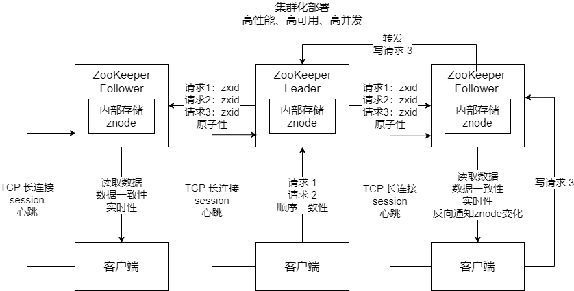

## ZooKeeper 的应用

ZooKeeper 是一个**分布式协调系统**，封装了分布式架构中所有核心和主流的需求和功能。主要有如下作用：

- **分布式锁**：运用于分布式的 Java 业务系统中

- **元数据管理**：Kafka、Canal，本身都是分布式架构，分布式集群在运行，它需要一个地方集中式地存储和管理分布式集群的核心元数据，所以它们都选择把核心元数据放在 ZooKeeper 中

- **分布式协调**：如果有人对 ZK 中的数据做了变更，ZK 会反过来去通知其它监听这个数据的人，告诉别人这个数据变更了。例如 Kafka 有多个 Broker，多个 Broker 会竞争成为一个 controller 的角色，如果作为 controller 的 Broker 挂掉了，此时它在 ZK 里注册的一个节点就会消失，其它 Broker 瞬间会被 ZK 反向通知这个事情，继续竞争成为新的 controller

- **Master 选举**


## ZooKeeper 的特点


ZooKeeper 这个系统可以存储元数据，支持 Master 选举和进行分布式协调和通知，所有它具有以下这些特点：

- **集群部署**：不可能单机版本

- **顺序一致性**：所有请求全部有序

- **原子性**：要么全部机器都成功，要么全部机器都别成功

- **数据一致性**：无论连接到哪台 ZK 上去，看到的都是一样的数据，不能有数据不一致

- **高可用**：如果某台机器宕机，要保证数据绝对不能丢失

- **实时性**：一旦数据反生变更，其他人要实时感知到


## ZooKeeper 的架构特点


为了实现需要的一些特性，ZooKeeper 的架构设计需要有哪些特点？


第一个就是**集群化部署**。3 ~ 5 台机器组成一个集群，每台机器都在内存保存了 ZK 的全部数据，机器之间互相通信同步数据，客户端连接任何一台机器都可以。


第二就是**树形结构的数据模型**：znode。数据模型简单，纯内存保存。ZK 的数据结构跟 UNIX 的文件系统是类似的，具有层级关系的树形的文件系统的结构，而 znode 可以认为是一个节点。例如下面

```
create /usr/local/uid
create /usr/local/test_file
```


uid 可以写入一些数据，比如 hello world；test_file 也可以写入一些数据的值


第三就是**顺序写**。集群中只有一台机器可以写，所有机器都可以读，所有请求都会分配一个 ZK 集群全局的唯一递增编号：`zxid`，保证各种客户端发起的写请求都是有序的。


另外就是**数据一致性**。任何一台 ZK 机器收到了写请求之后都会同步给其他机器，保证数据的强一致，你连接到任何一台 ZK 机器看到的数据都是一致的。


还有**高性能**。每台 ZK 机器都在内存中维护数据，所以 ZK 集群绝对是高并发高性能的。如果你让 ZK 部署在高配置物理机上，一个 3 台机器的 ZK  集群抗下每秒几万请求是没有问题的


**高可用**。哪怕集群中挂掉不超过一半的机器，都能保证可用，数据不会丢失，3 台机器可以挂 1 台，5 台机器可以挂 2 台。


**高并发**。高性能决定的，只要基于纯内存数据结构来处理，并发能力是很高的


## ZooKeeper 集群的角色

通常来说 ZooKeeper 集群里有三种角色的机器：Leader、Follower、Observer。


集群启动自动选举一个 Leader 出来，只有 Leader 是可以写的，Follower 是只能同步数据和提供数据的读取。Leader 挂了，Follower 可以继续选举出来 Leader。Observer 也只能读但是 Observer 不参与选举。


## 客户端与 ZooKeeper 之间的长连接

ZK 集群启动之后，自己分配好角色，然后客户端就会跟 ZK 建立连接，是 TCP 长连接。此时就会建立一个会话，就是 session，可以通过心跳感知到会话是否存在。有一个 `sessionTimeOut`，意思就是如果连接断开了，只要客户端在指定时间内重新连接 ZK 一台机器，就能继续保持 session，否则session 就超时了。


## ZooKeeper 的数据模型：znode 和节点类型

ZK 的核心数据模型就是 znode 树，平时我们往 ZK 写数据就是创建树形结构的 znode，里面可以写入值。这些数据模型，都在 ZK 内存里存放的。


ZK 主要有两种节点类型：持久节点和临时节点。持久节点就是哪怕客户端断开连接，也时一直存在的；临时节点就是只要客户端断开连接，节点就没了。


此外还有一种顺序节点，就是创建节点的时候自增加全局递增的序号。基于 ZK 实现的分布式锁的框架 -- curator。在里面就是基于 ZK 的临时顺序节点来实现的。加锁的时候，是创建一个临时顺序节点，ZK 会自动给你的临时节点加上一个后缀，是一个全局递增的编号，如果你客户端断开连接了，就自动销毁这个你加的锁，此时人家会感知到，就会尝试去加锁。


如果你是做元数据存储，用的肯定是持久节点；如果你是做一些分布式协调和通知，很多时候用临时节点，就是说我创建一个临时节点，别人来监听这个节点的变化，如果断开连接了，临时节点消失，此时人家会感知到，就会来做点别的事情；顺序节点，在分布式锁里用的比较经典


另外每个 znode 还有一个 Stat 用来存放数据版本：version（znode 的版本）；cversion（znode 子节点的版本），aversion（znode 的 ACL  权限控制版本）


## ZooKeeper 最核心的一个机制：Watcher 监听回调

ZooKeeper 最核心的机制，就是你一个客户端可以对 znode 进行 Watcher 监听，然后 znode 改变的时候回调通知你的这个客户端。这个是非常有用的一个功能，在分布式系统的协调中是很有必要的。


如果 ZK 只支持写和查，那么只能实现元数据存储和 Master 选举等部分功能；而分布式系统的协调需求，需要比如分布式架构中的系统 A 监听一个数据的变化，如果分布式架构中的系统 B 更新了哪个数据或者节点，ZK 会反过来通知系统 A 这个数据的变化。




