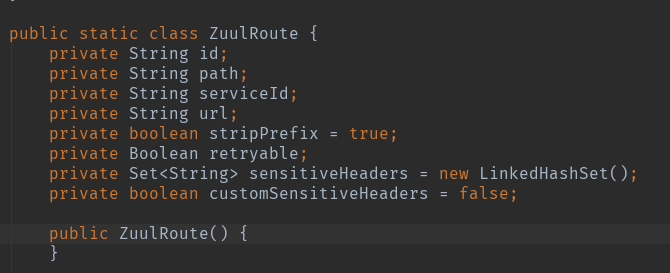
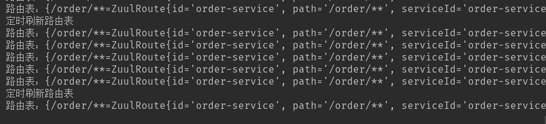

​		一般情况下，Zuul需要在配置文件里写好路由信息，这样zuul才可以通过这些路由信息根据连接转发到相应的服务上去。但每增加一个服务，就需要停下网关去重新编写配置文件，这样就比较麻烦了。因此，就有人提出了动态路由的方法。

​		动态路由有很多方式实现，这里主要讲一下用数据库去实现动态路由。

​		首先，先创建一个表，用于存储路由信息：

```sql
CREATE TABLE `gateway_api_route` (
   `id` varchar(50) NOT NULL,
   `path` varchar(255) NOT NULL,
   `service_id` varchar(50) DEFAULT NULL,
   `url` varchar(255) DEFAULT NULL,
   `retryable` tinyint(1) DEFAULT NULL,
   `enabled` tinyint(1) NOT NULL,
   `strip_prefix` int(11) DEFAULT NULL,
   `api_name` varchar(255) DEFAULT NULL,
   PRIMARY KEY (`id`)
 ) ENGINE=InnoDB DEFAULT CHARSET=utf8

```

​	该表结构主要是按照Zuul的ZuulProperties.ZuulRoute类设计的：



​	插入一条数据，方便测试：

```sql
INSERT INTO gateway_api_route (id, path, service_id, retryable, strip_prefix, url, enabled) VALUES ('order-service', '/order/**', 'order-service',0,1, NULL, 1);

```

​	然后编写表gateway_api_route相应的实体类：

```java
public class GatewayApiRoute {
 
	private String id;
	private String path;
	private String serviceId;
	private String url;
	private boolean stripPrefix = true;
	private Boolean retryable;
	private Boolean enabled;
	
	public String getId() {
		return id;
	}
	public void setId(String id) {
		this.id = id;
	}
	public String getPath() {
		return path;
	}
	public void setPath(String path) {
		this.path = path;
	}
	public String getServiceId() {
		return serviceId;
	}
	public void setServiceId(String serviceId) {
		this.serviceId = serviceId;
	}
	public String getUrl() {
		return url;
	}
	public void setUrl(String url) {
		this.url = url;
	}
	public boolean isStripPrefix() {
		return stripPrefix;
	}
	public void setStripPrefix(boolean stripPrefix) {
		this.stripPrefix = stripPrefix;
	}
	public Boolean getRetryable() {
		return retryable;
	}
	public void setRetryable(Boolean retryable) {
		this.retryable = retryable;
	}
	public Boolean getEnabled() {
		return enabled;
	}
	public void setEnabled(Boolean enabled) {
		this.enabled = enabled;
	}
	
}
```

​		接下来就开始编写动态路由的实现逻辑，其实基本逻辑就是从数据库里取出路由数据，然后封装成ZuulProperties.ZuulRoute。主要代码如下：

```java
package com.zhss.demo.zuul.gateway;

import org.springframework.beans.BeanUtils;
import org.springframework.cloud.netflix.zuul.filters.RefreshableRouteLocator;
import org.springframework.cloud.netflix.zuul.filters.SimpleRouteLocator;
import org.springframework.cloud.netflix.zuul.filters.ZuulProperties;
import org.springframework.jdbc.core.BeanPropertyRowMapper;
import org.springframework.jdbc.core.JdbcTemplate;
import org.springframework.util.StringUtils;
 
import java.util.LinkedHashMap;
import java.util.List;
import java.util.Map;

public class DynamicRouteLocator extends SimpleRouteLocator implements RefreshableRouteLocator {
 
    private JdbcTemplate jdbcTemplate;
    private ZuulProperties properties;
 
    public void setJdbcTemplate(JdbcTemplate jdbcTemplate) {
        this.jdbcTemplate = jdbcTemplate;
    }
    
    public DynamicRouteLocator(String servletPath, ZuulProperties properties) {
        super(servletPath, properties);
        this.properties = properties;
    }
    
    @Override
    public void refresh() {
        doRefresh();
    }
    
    @Override
    protected Map<String, ZuulProperties.ZuulRoute> locateRoutes() {
        LinkedHashMap<String, ZuulProperties.ZuulRoute> routesMap = new LinkedHashMap<String, ZuulProperties.ZuulRoute>();
        // 加载application.yml中的路由表
        routesMap.putAll(super.locateRoutes());
        // 加载db中的路由表
        routesMap.putAll(locateRoutesFromDB());
        
        // 统一处理一下路由path的格式
        LinkedHashMap<String, ZuulProperties.ZuulRoute> values = new LinkedHashMap<>();
        for (Map.Entry<String, ZuulProperties.ZuulRoute> entry : routesMap.entrySet()) {
            String path = entry.getKey();
            if (!path.startsWith("/")) {
                path = "/" + path;
            }
            if (StringUtils.hasText(this.properties.getPrefix())) {
                path = this.properties.getPrefix() + path;
                if (!path.startsWith("/")) {
                    path = "/" + path;
                }
            }
            values.put(path, entry.getValue());
        }
        
        System.out.println("路由表：" + values); 
        
        return values;
    }
 
    private Map<String, ZuulProperties.ZuulRoute> locateRoutesFromDB() {
        Map<String, ZuulProperties.ZuulRoute> routes = new LinkedHashMap<>();
        
        List<GatewayApiRoute> results = jdbcTemplate.query(
        		"select * from gateway_api_route where enabled = true ", 
        		new BeanPropertyRowMapper<>(GatewayApiRoute.class));
        
        for (GatewayApiRoute result : results) {
            if (StringUtils.isEmpty(result.getPath()) ) {
                continue;
            }
            if (StringUtils.isEmpty(result.getServiceId()) && StringUtils.isEmpty(result.getUrl())) {
                continue;
            }
            ZuulProperties.ZuulRoute zuulRoute = new ZuulProperties.ZuulRoute();
            try {
                BeanUtils.copyProperties(result, zuulRoute);
            } catch (Exception e) { 
            	e.printStackTrace();
            }
            routes.put(zuulRoute.getPath(), zuulRoute);
        }
        
        return routes;
    }
 
}
```

然后在新建一个配置类DynamicRouteConfiguration

```java
package com.zhss.demo.zuul.gateway;

import org.springframework.beans.factory.annotation.Autowired;
import org.springframework.boot.autoconfigure.web.ServerProperties;
import org.springframework.cloud.netflix.zuul.filters.ZuulProperties;
import org.springframework.context.annotation.Bean;
import org.springframework.context.annotation.Configuration;
import org.springframework.jdbc.core.JdbcTemplate;
 
@Configuration
public class DynamicRouteConfiguration {
 
    @Autowired
    private ZuulProperties zuulProperties;
    @Autowired
    private ServerProperties server;
    @Autowired
    private JdbcTemplate jdbcTemplate;
 
    @Bean
    public DynamicRouteLocator routeLocator() {
    	DynamicRouteLocator routeLocator = new DynamicRouteLocator(
    			this.server.getServletPrefix(), this.zuulProperties);
        routeLocator.setJdbcTemplate(jdbcTemplate);
        return routeLocator;
    }
 
}
```

这样就差不多，最后再实现一个定时器，定时刷新路由信息：

```java
package com.zhss.demo.zuul.gateway;

import org.springframework.beans.factory.annotation.Autowired;
import org.springframework.cloud.netflix.zuul.RoutesRefreshedEvent;
import org.springframework.cloud.netflix.zuul.filters.RouteLocator;
import org.springframework.context.ApplicationEventPublisher;
import org.springframework.context.annotation.Configuration;
import org.springframework.scheduling.annotation.EnableScheduling;
import org.springframework.scheduling.annotation.Scheduled;
import org.springframework.stereotype.Component;

@Component
@Configuration      
@EnableScheduling   
public class RefreshRouteTask {
	
	@Autowired
    private ApplicationEventPublisher publisher;
    @Autowired
    private RouteLocator routeLocator;
	
    @Scheduled(fixedRate = 5000) 
    private void refreshRoute() {
        System.out.println("定时刷新路由表");  
        RoutesRefreshedEvent routesRefreshedEvent = new RoutesRefreshedEvent(routeLocator);
        publisher.publishEvent(routesRefreshedEvent);
    }
    
}
```

这样一个基于zuul的动态路由功能就完成了，代码跑起来后，可以看到定时器在工作，定数刷新路由信息：

