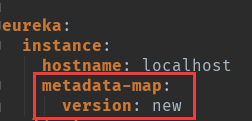

​		一般情况下，我们要发布新版本了，在不确定正确性的情况下，我们会选择先部分节点升级，然后再让一些特定的流量进入到这些新节点，完成测试后再全量发布。这就是灰度发布。

​		在Eureka中注册多个服务后，如果一个服务有多个实例，那么默认会走ribbon的软负载均衡来进行分发请求。而要完成灰度发布，要做的就是修改ribbon的负载策略。在SpringCloud体系中，完成这件事，一般都是根据Eureka的metadata进行自定义元数据，然后修改Ribbon的规则。

​		我们可以用数据库来动态开启灰度发布和指定灰度发布的请求，当然你也可以用Apollo配置中心、Redis、ZooKeeper，其实都可以。先创建一个灰度发布启用表：

```sql
CREATE TABLE `gray_release_config` (
   `id` int(11) NOT NULL AUTO_INCREMENT,
   `service_id` varchar(255) DEFAULT NULL,
   `path` varchar(255) DEFAULT NULL,
   `enable_gray_release` int(11) DEFAULT NULL,
   PRIMARY KEY (`id`)
 ) ENGINE=InnoDB DEFAULT CHARSET=utf8
```

​		其中“enable_gray_release”表示是否启用灰度发布，默认数字0是不启动，1启动。然后插入一条数据，方便我们测试：

```sql
INSERT INTO gray_release_config VALUES(1, 'order-service', '/order', 0)
```

​		首先，我们需要在Zuul项目里添加依赖：

```xml
<dependency>
	<groupId>io.jmnarloch</groupId>
	<artifactId>ribbon-discovery-filter-spring-cloud-starter</artifactId>
	version>2.1.0</version>
</dependency>
```

​		接着在网关中新建给表的实体类：

```sql
package com.zhss.demo.zuul.gateway;

public class GrayReleaseConfig {
	
	private int id;
	private String serviceId;
	private String path;
	private int enableGrayRelease;
	
	public int getId() {
		return id;
	}
	public void setId(int id) {
		this.id = id;
	}
	public String getServiceId() {
		return serviceId;
	}
	public void setServiceId(String serviceId) {
		this.serviceId = serviceId;
	}
	public String getPath() {
		return path;
	}
	public void setPath(String path) {
		this.path = path;
	}
	public int getEnableGrayRelease() {
		return enableGrayRelease;
	}
	public void setEnableGrayRelease(int enableGrayRelease) {
		this.enableGrayRelease = enableGrayRelease;
	}
	
}
```

​	然后我们可以编写一个定时器，定时获取灰度表的信息，看哪些服务需要灰度发布，新建类GrayReleaseConfigManager：

```sql
package com.zhss.demo.zuul.gateway;

import java.util.List;
import java.util.Map;
import java.util.concurrent.ConcurrentHashMap;

import org.springframework.beans.factory.annotation.Autowired;
import org.springframework.context.annotation.Configuration;
import org.springframework.jdbc.core.BeanPropertyRowMapper;
import org.springframework.jdbc.core.JdbcTemplate;
import org.springframework.scheduling.annotation.EnableScheduling;
import org.springframework.scheduling.annotation.Scheduled;
import org.springframework.stereotype.Component;

@Component
@Configuration      
@EnableScheduling 
public class GrayReleaseConfigManager {
	
	private Map<String, GrayReleaseConfig> grayReleaseConfigs = 
			new ConcurrentHashMap<String, GrayReleaseConfig>();
	
	@Autowired
	private JdbcTemplate jdbcTemplate;
	
	@Scheduled(fixedRate = 1000) 
    private void refreshRoute() {
		List<GrayReleaseConfig> results = jdbcTemplate.query(
        		"select * from gray_release_config", 
        		new BeanPropertyRowMapper<>(GrayReleaseConfig.class));
		
		for(GrayReleaseConfig grayReleaseConfig : results) {
			grayReleaseConfigs.put(grayReleaseConfig.getPath(), grayReleaseConfig);
		}
	}
	
	public Map<String, GrayReleaseConfig> getGrayReleaseConfigs() {
		return grayReleaseConfigs;
	}

}
```

​	然后再编写一个Zuul的过滤器，实现灰度发布的逻辑：

```java
package com.zhss.demo.zuul.gateway;

import org.springframework.context.annotation.Configuration;

import com.netflix.zuul.ZuulFilter;
import com.netflix.zuul.context.RequestContext;

import io.jmnarloch.spring.cloud.ribbon.support.RibbonFilterContextHolder;

import static org.springframework.cloud.netflix.zuul.filters.support.FilterConstants.*;

import java.util.Map;
import java.util.Random;

import javax.annotation.Resource;
import javax.servlet.http.HttpServletRequest;

@SuppressWarnings("unused")
@Configuration
public class GrayReleaseFilter extends ZuulFilter {
	
	@Resource
	private GrayReleaseConfigManager grayReleaseConfigManager;

    /**
     * 过滤的优先级，数字越大，级别越低
     * @return
     */
    @Override
    public int filterOrder() {
        return PRE_DECORATION_FILTER_ORDER - 1;
    }
 
    @Override
    public String filterType() {
        return PRE_TYPE;
    }

    /**
     * 是否执行该过滤器
     * @return
     */
    @Override
    public boolean shouldFilter() {
    	RequestContext ctx = RequestContext.getCurrentContext();
        HttpServletRequest request = ctx.getRequest();
        String requestURI = request.getRequestURI();
        
        // http://localhost:9000/order/order?xxxx
    
        Map<String, GrayReleaseConfig> grayReleaseConfigs = 
        		grayReleaseConfigManager.getGrayReleaseConfigs();
        for(String path : grayReleaseConfigs.keySet()) {
        	if(requestURI.contains(path)) {
        		GrayReleaseConfig grayReleaseConfig = grayReleaseConfigs.get(path);
        		if(grayReleaseConfig.getEnableGrayRelease() == 1) {
        			System.out.println("启用灰度发布功能");  
        			return true;
        		}
        	}
        }
        
        System.out.println("不启用灰度发布功能");   
        
        return false;
    }

    /**
     * 过滤器的具体逻辑
     * @return
     */
    @Override
    public Object run() {

//    	RequestContext ctx = RequestContext.getCurrentContext();
//        HttpServletRequest request = ctx.getRequest();
//        String gray = request.getParameter("gray");
//
//        if("true".equals(gray)) {
//        	RibbonFilterContextHolder.getCurrentContext().add("version", "new");
//        } else {
//        	RibbonFilterContextHolder.getCurrentContext().add("version", "current");
//        }

        Random random = new Random();
        int seed = random.nextInt(100);

        if (seed == 50) {
            // put the serviceId in `RequestContext`
            RibbonFilterContextHolder.getCurrentContext()
                    .add("version", "new");
        }  else {
            RibbonFilterContextHolder.getCurrentContext()
                    .add("version", "old");
        }


        return null;
    }
}
```

​		上面的代码主要还是看run()方法的实现。注释掉的代码是通过判断请求连接中是否包含“gray”参数，如果包含gray参数并且它的值为“true”，则将流量引到新的节点。而没有注释的代码则是根据随机数seed的值来引流。当你希望有10%的流量引到新节点时，可以将if(seed == 50)改成 seed >= 90或者其他。

​		最后，就是在要升级的服务配置上增加metadata的自定义数据即可，根据上述的代码，我们应该在要升级的服务的配置文件中增加：eureka: instance: metadata-map: version: new。在没升级的服务的配置文件中增加：eureka: instance: metadata-map: version: old



​		这样，基于Zuul的灰度发布功能就实现了。当然，基于灰度发布这块，国内有了更强大的开源框架Nepxion Discovery。Nepxion Discovery是一款对Spring Cloud Discovery服务注册发现、Ribbon负载均衡、Feign和RestTemplate调用的增强中间件，感兴趣的朋友可以去官方的github上查看：https://github.com/Nepxion/Discovery