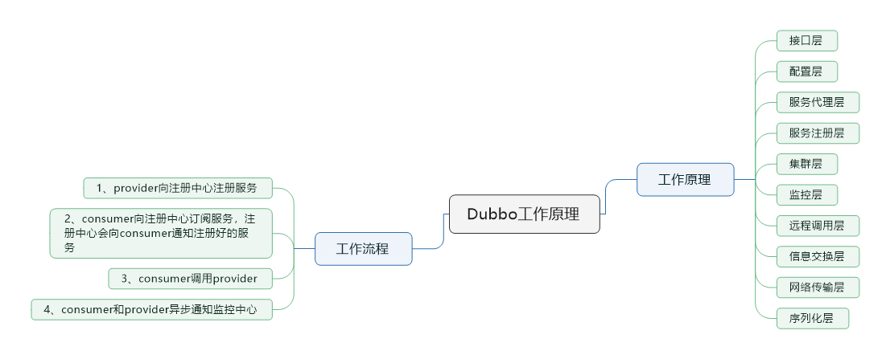
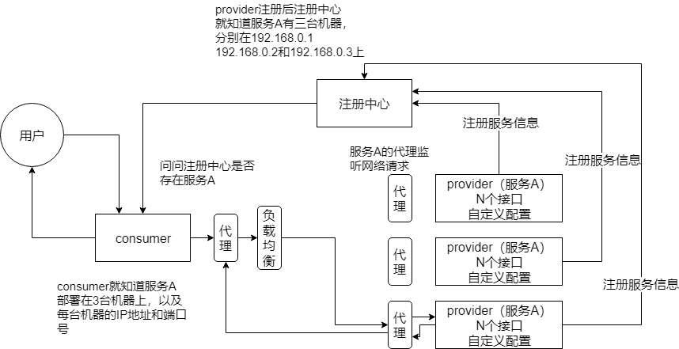
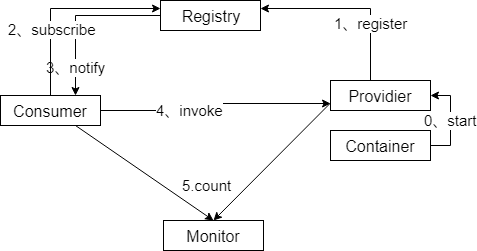

> 本节思维导图

## dubbo工作原理

- 第一层：service层，接口层：有服务提供者和服务消费者实现
- 第二层：config层，配置层：主要对dubbo进行各种配置
- 第三层：proxy层，服务代理层，为provider、consumer生成代理，代理之间进行网络通信
- 第四层：registry层，服务注册层，负责服务的注册与发现
- 第五层：cluster层，集群层，封装多个服务提供者的路由和负载均衡，将多个实例组合成一个服务
- 第六层：monitor层，监控层，对rpc接口的调用时间和调用次数进行监控
- 第七层：protocal层，远程调用层，封装rpc调用
- 第八层：exchange层，信息交换层，封装请求相应模式，同步转异步
- 第九层：transport层，网络传输层，抽象mina和Netty为统一接口
- 第十层：serialize层，数据序列化层

## 工作流程

- 第一步：provider向注册中心注册
- 第二步：consumer从注册中心订阅服务，注册中心通知consumer注册好的服务
- 第三步：consumer调用provider
- 第四步：consumer和provider都异步通知监控中心

## dubbo架构图

## 注册中心挂了可以继续通信吗

可以，因为刚开始初始化的时候，消费者会将提供服务的地址信息**拉取到本地缓存**，所以注册中心挂了可以继续通信

