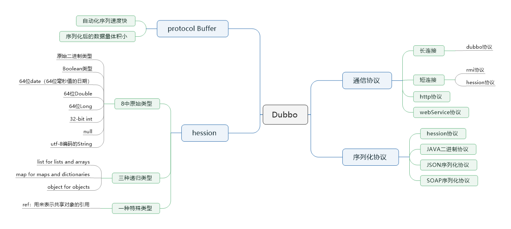
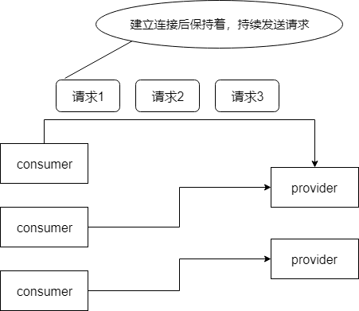
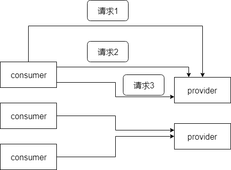

> 本节思维导图

## dubbo支持的通信协议

### dubbo协议

​		默认就是走dubbo协议，单一长连接，进行的是NIO异步通信，基于hession作为序列化协议。使用的场景是：传输数据量小（每次请求在100kb以内），但是并发量高。

​		为了支持高并发场景，一般是服务提供者就几台机器，但是服务消费者有上百台，可能每天调用量达到上亿次，此时用长连接是最合适的，就是跟每个服务消费者维持一个长连接即可，可能总共就100个连接，然后后面直接基于长连接NIO异步通信，可以支撑高并发请求。

​		长连接，通俗讲就是**建立连接后可以持续发送请求，无须再建立连接**。

​		而短连接，每次要发送请求之前，需要先重新建立一次连接。

### rmi协议

​		走JAVA二进制序列化，多个短连接，适合消费者和提供者数量差不多的情况，适用于文件的传输，一般较少用。

### hession协议

​		走hession序列化协议，多个短连接，适用于提供者数量比消费者数量还多的情况，适用于文件传输，一般较少用。

### http协议

​		走JSON序列化

### webService

​		走SOAP文本序列化

## dubbo支持的序列化协议

​		dubbo默认的序列化协议是hession序列化协议，除此之外还支持java二进制协议、json和SOAP文本序列化等多种序列化协议。

## hession数据结构

​		hession的数据结构可以分为三类型：8种基本原始类型、3种递归类型和1中特殊类型

### 8种基本原始类型

- 原始二进制数据
- 64-bit date（64位毫秒值日期）
- 64-bit double
- 64--bit long
- 32-bit int
- boolean
- null
- UTF-8 编码的string

### 3种递归类型

- list for lists and arrays
- map for maps and dictionaries
- object for objects

### 1种特殊类型

- ref：用于表示对共享对象的引用

## 为什么PB的效率是最高的

​		protocol buffer是Google出品的一种轻量并且高效的结构化数据存储格式，性能要比JSON和XML高得多。它性能高主要有两个原因：一是，它使用protocol编译器，自动进行序列化和反序列化，速度非常快，差不多比XML和JSON快上了20~100倍；第二，它的数据压缩效果好，它序列化后的数据量体积小，因为体积小，传输起来带宽和速度上会有优化。