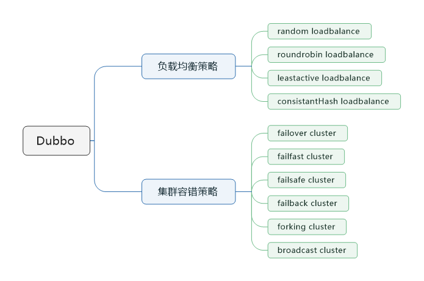

> 本节思维导图



## dubbo的负载均衡策略

### random loadbalance

​		随机调用实现负载均衡。这是dubbo默认的负载均衡策略。可以对provider设置不同的权重，会按照权重来负载均衡，权重大分配流量越高。一般使用这个策略即可。

### roundrobin loadbalance

​		均匀地将流量打到各个机器上，但如果各个机器性能不一样，容易导致性能差的机器负载过高，所以此时需要调整权重，让性能差的机器承载比较小的流量。

### leastactive loadbalance

​		这个就是自动感知一下，某个机器的性能越差，接收的流量就越小，就越不活跃，此时就会给不活跃性能差的机器更小的请求。

### consistentHash loadbalance

​		一致性哈希算法，相同参数的请求一定分发到一个provider上去，provider挂掉的时候，会基于虚拟节点均匀分配剩余的流量，抖动不会太大。如果你需要的不是随机负载均衡，是要一类请求都到一个节点，那就使用这个一致性哈希算法。

## dubbo集群容错策略

### failover cluster模式

失败自动切换，自动重试其他机器，默认使用这个，常见于读操作。（失败重试其他机器）

可以通过以下几种方式配置重试次数：

```xml
<dubbo:service retries="2" />
```

或者

```xml
<dubbo:reference retries="2" />
```

或者

```xml
<dubbo:reference>
	<dubbo:method name="findFoo" retries="2" />
</dubbo:reference>
```

### failfast cluster模式

一次调用失败就立即失败，常用与非幂等性的写操作，比如新增一条记录（调用失败就立即失败）

### failsafe cluster模式

出现异常时忽略掉，常用与不重要的接口调用，比如日志记录。

配置示例如下：

```xml
<dubbo:service cluster="failsafe" />
```

failsafe cluster模式

或者

```xml
<dubbo:reference cluster="failsafe" />
```

### failback cluster模式

失败了后台自动记录请求，然后定时重发，比较适合于写消息队列。

### forking cluster模式

并行调用多个provider，只要一个成功立即返回，常用于实时性要求比较高的读操作，但是会浪费更多的服务资源，可以通过forks="2"来设置最大并行数。

### broadcast cluster模式

逐个调用所有的provider，任何一个provider出错则报错。通用用于通知所有provider更新缓存或日志等本地资源信息。

## dubbo动态代理策略

默认使用javassist动态字节码生成，创建代理类。但是可以通过spi扩展机制配置自己的动态代理策略。