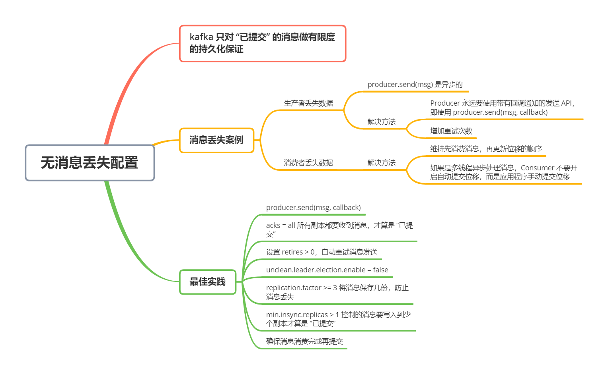
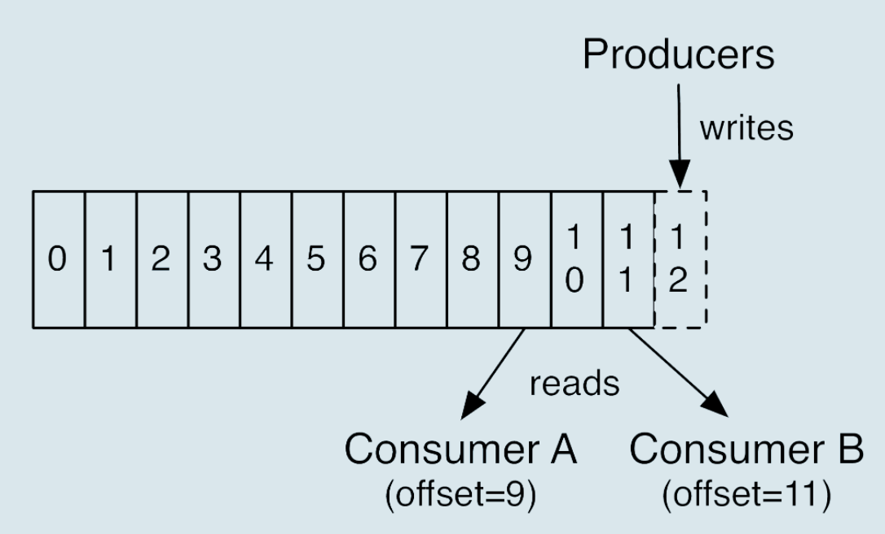

Kafka 什么情况下能保证消息不丢失呢？

**一句话概括，Kafka 只对「已提交」的消息做有限度的持久化保证**

第一个核心要素是「**已提交的消息**」。什么是已提交的消息？当 Kafka 的若干个 Broker 成功地接收到一条消息并写入到日志文件后，它们会告诉生产者程序这条消息已成功提交。此时，这条消息在 Kafka 看来就正式变成了「已提交」消息了

那为什么是若干个 Broker 呢？这取决于你对「已提交」的定义。你可以选择只要有一个 Broker 成功保存该消息就算是已提交，也可以是令所有 Broker 都成功保存该消息才算是已提交。不论哪种情况，Kafka 只对已提交的消息做持久化保证这件事是不变的

第二个核心要素是「**有限度的持久化保证**」。这里的有限度，是说 Kafka 不丢消息是有前提条件的。假如你的消息保存在 N 个 Kafka Broker 上，那么这个前提条件就是这 N 个 Broker 中至少有 1 个存活。只要这个条件成了，Kafka 就能保证你的这条消息永远不会丢失

总结一下，Kafka 是能做到不丢失消息的，只不过这些消息必须是已提交的消息，而且还要满足一定的条件

## 消息丢失案例

### 生产者程序丢失数据

目前，Kafka Producer 是异步发送消息的，也就是说如果你调用的是 `producer.send(msg)` 这个 API，那么它通常会立即返回，但此时你不能认为消息发送已完成

如果用这个方式，可能会有哪些因素导致消息没有发送成功呢？原因有很多，例如网络抖动，导致消息压根就没有发送到 Broker 端；或者消息本身不合格导致 Broker 拒绝接收（比如消息太大，超过了 Broker 的承受能力）等

实际上，解决此问题的方法非常简单：**Producer 永远要使用带有回调通知的发送 API，也就是说不要使用 producer.send(msg)，而是使用 producer.send(msg, callback)**。通过回调函数，就可以在提交失败的情况下，进行针对性的处理了

### 消费者程序丢失案例

Consumer 端丢失数据主要体现在 Consumer 端要消费的消息不见了。Consumer 程序有个「位移」的概念，表示的是这个 Consumer 当前消费到的 Topic 分区的位置。如下图

比如对于 Consumer A 而言，它当前的位移值就是 9；Consumer B 的位移值是 11

这里的「位移」类似于我们看书时使用的书签，它会记录我们当前阅读了多少页，下次翻书的时候我们就能直接跳到书签页继续阅读

正确使用书签有两个步骤：第一步是读书，第二步是更新书签页。如果这两步的顺序颠倒了，就可能出现这样的场景：当前的书签页是第 90 页，我先将书签放到第 100 页上，之后开始读书。当阅读到第 95 页时，我临时有事中止了阅读。那么问题来了，当我下次直接跳到书签页阅读时，我就丢失了第 96～99 页的内容，即这些消息就丢失了

同理，Kafka 中 Consumer 端的消息丢失就是这么一回事。要对抗这种消息丢失，办法就是：**维持先消费消息（阅读），再更新位移（书签）的顺序**即可。这样就能最大限度保证消息不丢失

当然，这种处理方式可能带来的问题是消息重复处理，类似于同一页书被读了很多遍，但这不属于消息丢失的情形

除此之外，还有一种情况。Consumer 程序从 Kafka 获取到消息之后开启了多个线程异步处理消息，而 Consumer 程序自动地向前更新位移。假如其中某个线程运行失败了，它负责的消息没有被成功处理，但位移已经被更新了，因此这条消息对于 Consumer 而言实际上是丢失了

这个问题的解决也很简单：**如果是多线程异步处理消费消息，Consumer 程序不要开启自动提交位移，而是要应用程序手动提交位移**。这里注意一下，单个 Consumer 程序使用多线程来消费消息说起来容易，写成代码却很困难，因为你很难正确地处理位移的更新，也就是说避免无消息消费很简单，但极易出现消息被消费了多次的情况

## 最佳实现

这里，我们分享一下 Kafka 无消息丢失的配置

1. 不要使用 producer.send(msg)，而要使用 `producer.send(msg, callback)`。一定要使用带有回调通知的 send 方法
2. 设置 `acks = all`。acks 是 Producer 的一个参数，代表了你对「已提交」消息的定义。如果设置成 all，则表名所有副本 Broker 都要接收到消息，该消息才算是已提交。这是最高等级的「已提交」定义
3. 设置 `retries` 为一个较大的值。这个 retries 同样是 Producer 的参数，对应前面提到的 Producer 自动重试。当出现网络的瞬时抖动时，消息发送可能会失败，此时配置了 retires > 0 的 Producer 能够自动重试消息发送，避免消息丢失
4. 设置 `unclean.leader.election.enable = false`。这是 Broker 端的参数，它控制的是哪些 Broker 有资格竞选分区的 Leader。如果一个 Broker 落后原先的 Leader 太多，那么它一旦成为新的 Leader，必然会造成消息的丢失。故一般都要将该参数设置成 false，即不允许这种情况的发生
5. 设置 `replication.factor >= 3`。这也是 Broker 端的参数。这里想表述的是，最好将消息多保存几份，毕竟目前防止消息丢失的主要机制就是冗余
6. 设置 `min.insync.replicas > 1`。这依然是 Broker 端参数，控制的是消息至少要被写入到多少个副本才算是「已提交」。设置成大于 1 可以提升消息持久性。在实际环境中千万不要使用默认值 1
7. 确保 `replication.factor > min.insync.replicas`。如果两者相等，那么只要有一个副本挂机，整个分区就无法正常工作了。我们不仅要改善消息的持久性，防止数据丢失，还要在不降低可用性的基础上完成。推荐设置成 `replication.facotr = min.insync.replicas + 1`
8. 确保消息消费完成再提交。Consumer 端有个参数 `enable.auto.commit`，最好把它设置成 false，并采用手动提交位移的方式。这对于单 Consumer 多线程处理的场景而言是很重要的

