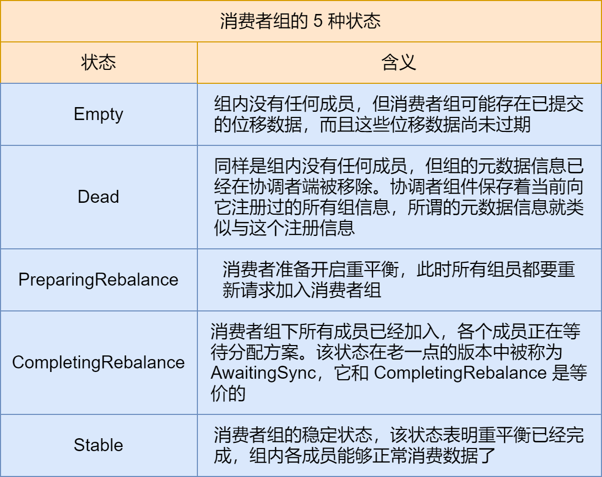
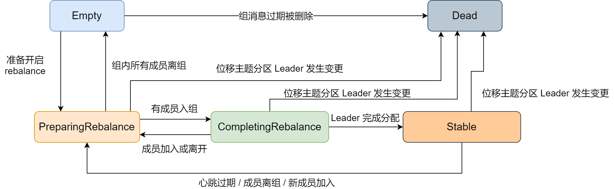
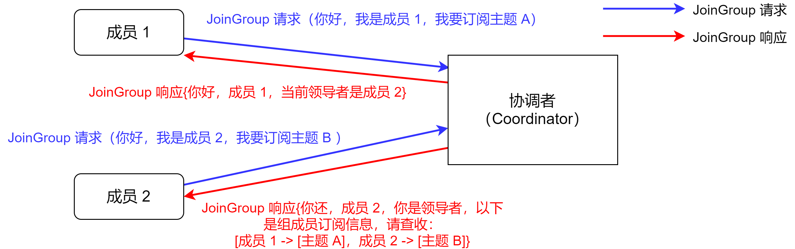
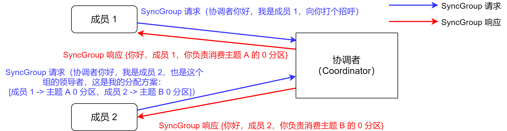
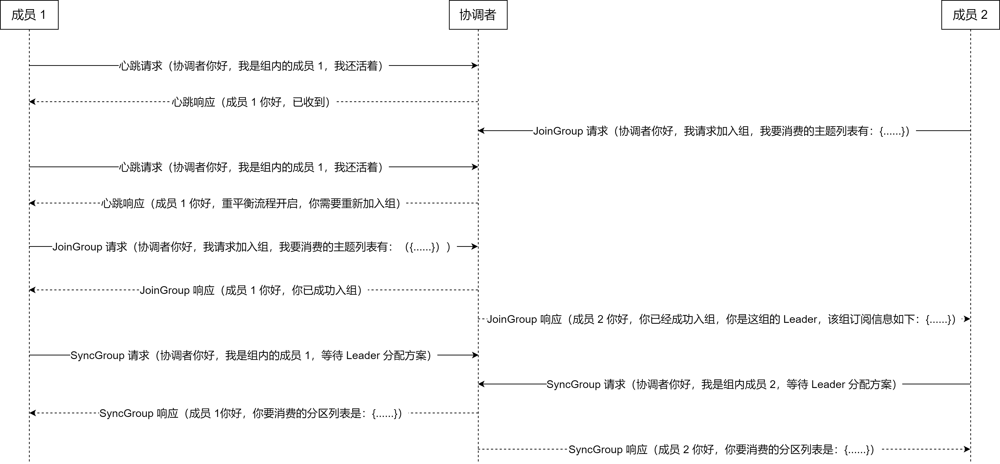
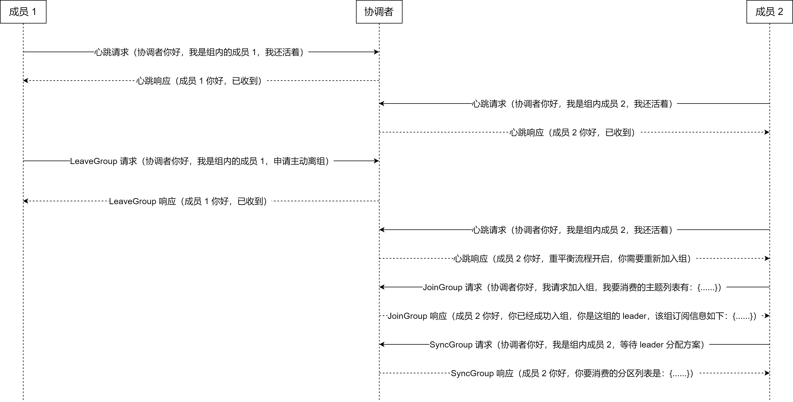
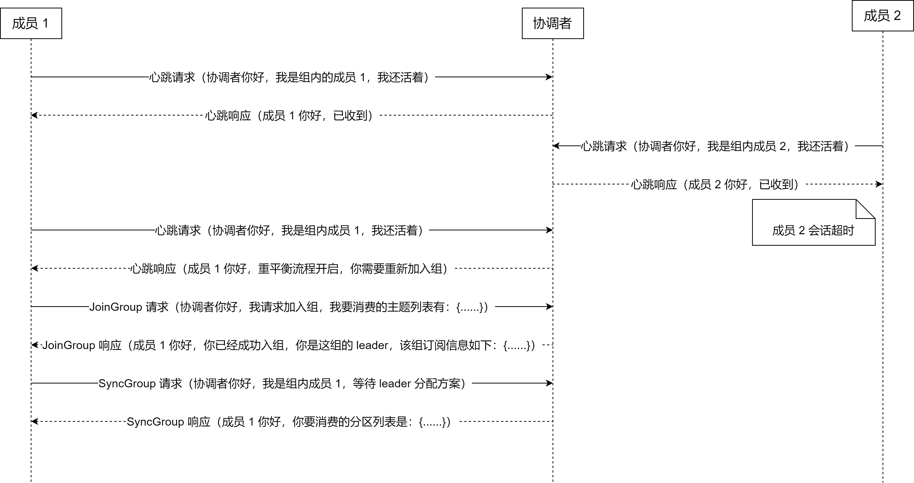
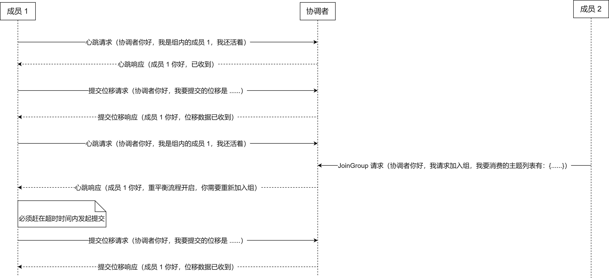

消费者组的重平衡，它的作用就是让组内所有的消费者实例就消费哪些主题分区达成一致。重平衡需要借助 Kafka Broker 端的 Coordinator 组件，在 Coordinator 的帮助下完成整个消费者组的分区重分配。今天我们就说说这个


## 触发与通知


重平衡的 3 个触发条件：


1. 组成员数量发生变化
2. 订阅主题数量发生变化
3. 订阅主题的分区数发生变化


一般情况下，因命中第 1 个条件而引发的重平衡是最常见的。另外，消费者组中的消费者实例依次启动也属于第 1 种情况，即，每次消费者组启动时，必然会触发重平衡过程


那么，**重平衡过程是如何通知到其他消费者实例的？答案就是靠消费者端的心跳线程（Heartbeat Thread）**


Kafka Java 消费者需要定期地发送心跳请求 到 Broker 端的协调者，以表明它还存活着。在 0.10.1.0 版本之前，发送心跳请求是在**消费者主线程**完成的，也就是你写代码调用 `KafkaConsumer.poll` 方法的那个线程


这样做最大的问题在于，消费处理逻辑也是在这个线程中完成的。因此，一旦消息处理消耗了过长的时间，心跳请求将无法及时发送到协调者那里，导致协调者「错误地」认为该消费者已「死」。自 0.10.1.0 版本开始，社区引入了一个单独的心跳线程来专门执行心跳请求发送，避免这个问题


这个重平衡有什么关系？其实，**重平衡的通知机制就是通过心跳线程来完成的**。当协调者决定开启新一轮重平衡后，它会将 "**REBALANCE_IN_PROGRESS**" 封装进心跳的响应中，发还给消费者实例。当消费者实例发现心跳响应中包含了 "REBALANCE_IN_PROGRESS"，就能立马知道重平衡开始了，这就是重平衡的通知机制


另外，消费者端参数 `heartbeat.interval.ms` 参数的作用，除了设置了心跳的间隔时间外，真正的作用是控制重平衡通知的频率。如果你想要消费者实例更迅速地得到通知，那么就可以给这个参数设置一个非常小的值，这样消费者就能更快速地感知到重平衡已经开启了


## 消费者组状态机


重平衡一旦开启，Broker 端的协调者组件就要开始忙了，主要涉及到控制消费者组的状态流转。Kafka 设计了一套消费组状态机，来帮助协调者完成整个重平衡流程


目前，Kafka 为消费者组定义了 5 种状态，分别是：Empty、Dead、PreparingRebalance、CompleingRebalance 和 Stable。如下：





接着，我们看看状态机的各个状态流转





一个消费者组最开始是 Empty 状态，当重平衡过程开启后，它会被置于 PreparingRebalance 状态下等待成员加入，之后变更到 CompletingRebalance 状态等待分配方案，最后流转到 Stable 状态完成重平衡


当有新成员加入或已有成员退出时，消费者组的状态从 Stable 直接跳到 PreparingRebalance 状态。此时，所有现存成员就必须重新申请加入组。当所有成员都退出组后，消费者组状态变更为诶 Empty。Kafka 定期自动删除过期位移的条件就是，组要处于 Empty 状态。因此，如果你的消费者组停掉了很长时间（超过 7 天），那么 Kafka 很可能就把该组的位移数据删除了。如下 Kafka 日志


```
Removed XXX expired offsets in XXX milliseconds
```


这就是 Kafka 在尝试定期删除过期位移。只有 Empty 状态下的组，才会执行过期位移删除的操作


## 消费者组重平衡流程


重平衡的完整流程需要消费者端和协调者组件共同参与才能完成。我们先从消费者的视角来审视一下重平衡的流程


在消费者端，重平衡分为两个步骤：分别是加入组合等待领导者消费者（Leader Consumer）分配方案。这两个步骤分别对应两类特定的请求：**JoinGroup 请求和 SyncGroup 请求**


当组内成员加入组时，它会向协调者发送 joinGroup 请求。在该请求中，每个成员都要将自己订阅的主题上报，这样协调者就能收集到所有成员的订阅信息。一旦收集了全部成员的 joinGroup 请求后，协调者会从这些成员中选择一个担任这个消费者组的领导者


通常情况下，第一个发送 joinGroup 请求的成员自动成为领导者。要区分这里的领导者和领导者副本，它们不是一个概念。这里的领导者是具体的消费者实例，它既不是副本，也不是协调者。**领导者消费者的任务是收集所有成员的订阅信息，然后根据这些订阅信息，制定具体的分区消费分配方案**


选出领导者之后，协调者会把消费者订阅信息封装到 joinGroup 请求的响应体中，然后发给领导者，由领导者统一作出分配方案后，进入到下一步：发送 SyncGroup 请求


在这一步中，领导者向协调者发送 SyncGroup 请求，将刚刚作出的分配方案发给协调者。值得注意的是，其他成员也会向协调者发送 SyncGroup 请求，只不过请求体中并没有实际的内容。这一步的主要目的是让协调者接收分配方案，然后统一以 SyncGroup 响应的方式发给所有成员，这样组内所有成员就都知道自己该消费哪些分区了


用一张图说明一下 JoinGroup 请求的处理过程





JoinGroup 请求的主要作用是将组成员订阅信息发送给领导者消费者，待领导者消费者指定好分配方案后，重平衡流程进入到 SyncGroup 请求阶段


下面这张图描述的是 SyncGroup 请求的处理流程





SyncGroup 请求的主要目的，就是让协调者把领导者指定的分配方案下发给各个组内成员。当所有成员都成功接收到分配方案后，消费者组进入到 Stable 状态，即开始正常的消费工作


到这里，**消费者端**的重平衡流程已经介绍完了。接下来，我们从**协调者端**来看一下重平衡是怎么执行的


## Broker 端重平衡场景剖析


要分析协调者端处理重平衡的全流程，必须要分几个场景来讨论


### 场景一：新成员入组


新成员入组是指组处于 Stable 状态后，有新成员加入。如果是全新启动一个消费者组，Kafka 是有一些自己的小优化的，流程上会有些不同。这里讨论的是，组稳定了之后又新成员加入的情形


当协调者收到新的 JoinGroup 请求后，它会通过心跳请求响应的方法通知组内现有的所有成员，强制它们开启新一轮的重平衡。具体的过程和之前的客户端重平衡流程是一样的。我们用一张时序图来说明协调者一端是如何处理新成员入组的





### 场景二：组成员主动离组


主动离组，就是消费者实例所在的线程或进程调用 close() 方法主动通知协调者它要退出。这个场景就涉及到了第三类请求：**LeaveGroup 请求**。协调者收到 LeaveGroup 请求后，依然会以心跳响应的方式通知其他成员。如下图：





### 场景三：组成员崩溃离组


崩溃离组是指消费者实例出现严重故障，突然宕机的离组。它和主动离组是有区别的，因为后者是主动发起的离组，协调者能马上感知并处理。但崩溃离组是被动的，协调者通常需要等待一段时间才能感知到，这段时间一般是消费者端参数 `session.timeout.ms` 控制的。即，kafka 一般不会超过 session.timeout.ms 就能感知到这个崩溃。当然，后面处理崩溃离组的流程与之前是一样的，如下：





### 场景四：重平衡时协调者对组内成员提交位移的处理


正常情况下，每个组内成员都会定期汇报位移给协调者。当重平衡开启时，协调者会给予成员一段缓冲时间，要求每个成员必须在这段时间内快速上报自己的位移信息，然后再开启正常的 JoinGroup / SyncGroup 请求发送。如下：





