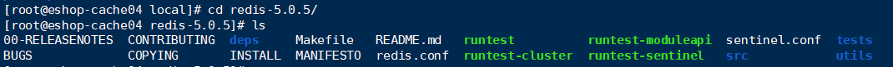
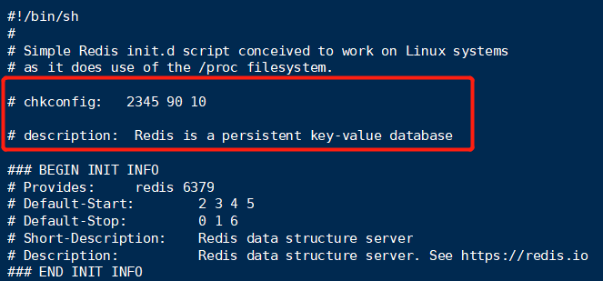
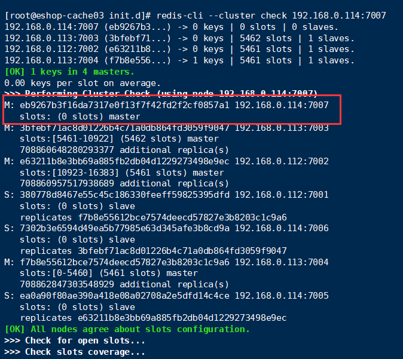
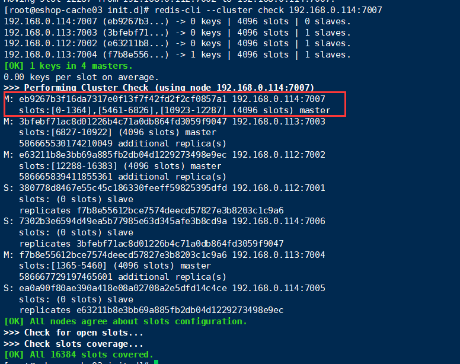
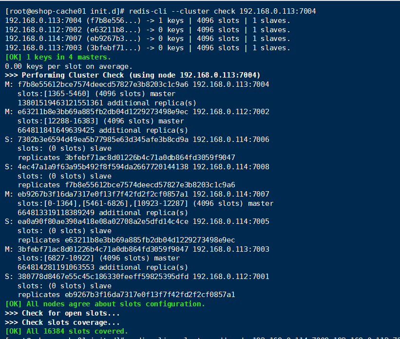
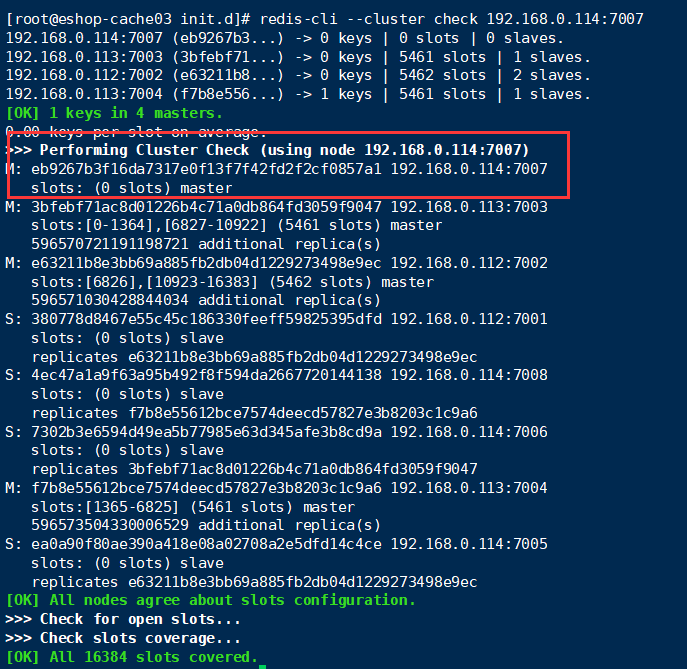

​		Redis Cluster集群，要求至少3个master去组成一个高可用，健壮的分布式的集群，每个master都建议至少给一个slave，因此，最少要求3个master，3个slave。在正式环境中，建议在6台机器上搭建。也可是3台，但要保证每个master都跟自己的slave不在同一台机器上。

## 搭建Redis

​		搭建Redis Cluster之前，我们需要先搭建redis。先去[官网](https://redis.io/)中下载一个redis，目前稳定版本是redis-5.0.5。下载完后将其上传到Linux系统上，我一般放在`/usr/local`目录中。

1. 上传完成后，执行`tar -zxvf redis-5.0.5.tar.gz`解压
2. 执行`cd redis-5.0.5/`进入redis目录
3. 执行`make && make test && make install`
4. 编译过程中会报一个错误`You need tcl 8.5 or newer in order to run the Redis test`，说明我们需要安装tcl才能安装redis。执行`yum install tcl`进行安装
5. 安装好之后再次执行`make && make test && make install`进行编译，需要等待一定的时间。等他编译好之后，有可能会报一个warning，这个可以不用管它。
6. 这样我们就把redis装好了。执行`ls`查看redis文件夹下的文件



## 生产环境的redis启动方案

​		在生产环境中，要把redis作为一个系统的daemon进程去执行，每次系统启动，redis进程也一起启动。

1. 在redis_util目录中，有个redis_init_scipt脚本。将这个脚本拷贝到Linux的/etc/init.d目录中，将redis_init_script重命名为redis_6379,6379使我们希望这个redis实例监听的端口号。`cp redis_init_script /etc/init.d/redis_6379`
2. 修改redis_6379脚本的`REDISPORT`，设置为6379（默认就是6379）。
3. 创建两个目录：/etc/redis（存放redis的配置文件），/var/redis/6379（存放redis的持久化文件）。
4. 修改redis配置文件，默认在根目录下，拷贝到/etc/redis目录中，修改名称为`6379.conf`。
5. 修改redis.conf的部分配置：
   - daemonize yes
   - pidfile /var/run/redis_6379.pid      # 设置redis的pid文件位置
   - port 6379        #设置redis的监听端口号
   - dir /var/redis/6379        #设置持久化文件的存储位置
6. 启动redis 分别执行以下语句 `cd /etc/init.d`、`chmod 777 redis_6379`、`./redis_6379 start`
7. 执行`ps -ef | grep redis`确认redis进程是否启动。
8. 在redis跟随系统启动自动启动。在redis_6379脚本中的上面，加入两行注释，然后执行`chkconfig redis_6379 on`。

```
# chkconfig:   2345 90 10

# description:  Redis is a persistent key-value database
```

 

## 搭建Redis Cluster

​		现在开始搭建redis集群。这个案例模拟的是在三台服务器上搭建redis cluster。在搭建redis集群的时候先关闭所有的redis实例。在搭建之前，先了解几个redis cluster的重要配置：

- cluster-enabled <yes/no>
- cluster-config-file <filename>         这是指定一个文件，供cluster模式下的redis实例将集群状态保存在那里，包括集群中其他机器的信息，比如节点的上线和下线，故障转移。这个不是我们去维护，只是给它指定一个文件，让redis自己去维护。
- cluster-node-time <milliseconds>        节点存活超时时长，超过一定时长，认为节点宕机，master宕机的话就会触发主备切换，salve宕机就不会提供服务。

### 开始搭建redis cluster

1. 先在三台服务器上安装redis。我们需要在三个服务器上搭建六个redis实例，端口号分别为7001、7002、7003、7004、7005和7006

2. 先在三个服务器上建两个文件件`mkdir -p /etc/redis-cluster` 、`mkdir -p /var/log/redis`，然后在服务器1建立`mkdir -p /var/redis/7001`和`mkdir -p /var/redis/7002`文件夹，再在服务器2和服务器3分别建立7003、7004和7005、7006文件夹。 

3. 修改redis的配置文件。举一个例子，将上面的6379.conf配置文件复制一份并修改为7001.conf。重点修改一下几个配置：

   ```yml
   port 7001
   cluster-enabled yes
   cluster-config-file /etc/redis-cluster/node-7001.conf
   cluster-node-timeout 15000
   daemonize	yes							
   pidfile		/var/run/redis_7001.pid 						
   dir 		/var/redis/7001		
   logfile /var/log/redis/7001.log
   bind 192.168.31.187		
   appendonly yes
   ```

   然后再接着生成并修改7002 7003 7004 7005 7006.conf配置文件，并放在相应的服务器中。

4. 准备生产环境的启动脚本。在服务器1中，在`/etc/init.d`目录下，将redis_6379启动启动脚本复制一份并命名为`redis_7001`，并修改里面的端口号。同样的生成7002 7003 7004 7005 7006的启动脚本，并放在相应服务器的`/etc/init.d`目录下。

5. 分别在3台服务器上，启动6个redis实例。

### 创建集群

​		6个redis实例启动后，就开始创建集群。

1. 随便选中一台服务器，开始安装ruby。执行`yum install -y ruby` `yum install -y rubygems` `gem install redis`。

2. 安装完成后，将redis-5.0.5目录中的src目录下的`redis-trib.rb`拷贝到/usr/local/bin中。`cp /usr/local/redis-3.2.8/src/redis-trib.rb /usr/local/bin`

3. 执行`redis-trib.rb create --replicas 1 192.168.0.112:7001 192.168.0.112:7002 192.168.0.113:7003 192.168.0.113:7004 192.168.0.114:7005 192.168.0.114:7006`。其中上面的IP地址就是你的机器地址。

4. 执行后会报下面的错误，这是因为yum安装的ruby的版本太低的缘故，可以执行`ruby -v`查看相应的版本。 

   ```
   redis-trib.rb:6: odd number list for Hash
            white: 29,
                   ^
     redis-trib.rb:6: syntax error, unexpected ':', expecting '}'
             white: 29,
                   ^
     redis-trib.rb:7: syntax error, unexpected ',', expecting kEND
   ```

5. 执行`yum remove -y ruby`和`yum remove -y rubygems`

6. 从官网下载最新的ruby压缩包，上传到服务器上

7. 解压`tar -zxvf ruby-2.6.5.tar.gz`，解压后进入到相应目录中，开始编译。执行`./configure` 、`make` 、 `make install`，并等待一段时间。

8. 执行`ruby -v`查看是否安装成功。

9. 再次执行 `redis-trib.rb create --replicas 1 192.168.0.112:7001 192.168.0.112:7002 192.168.0.113:7003 192.168.0.113:7004 192.168.0.114:7005 192.168.0.114:7006`。此时会抱一个WARNING。

   ```
   WARNING: redis-trib.rb is not longer available!
     You should use redis-cli instead.
     
     All commands and features belonging to redis-trib.rb have been moved
     to redis-cli.
     In order to use them you should call redis-cli with the --cluster
     option followed by the subcommand name, arguments and options.
     
     Use the following syntax:
     redis-cli --cluster SUBCOMMAND [ARGUMENTS] [OPTIONS]
     
     Example:
     redis-cli --cluster create 127.0.0.1:30001 127.0.0.1:30002 127.0.0.1:30003 127.0.0.1:30004 127.0.0.1:30005 127.0.0.1:30006 --cluster-replicas 1
     
     To get help about all subcommands, type:
     redis-cli --cluster help
   ```

10. 按照example执行以下命令`redis-cli --cluster create 192.168.0.112:7001 192.168.0.112:7002 192.168.0.113:7003 192.168.0.113:7004 192.168.0.114:7005 192.168.0.114:7006 --cluster-replicas 1`

11. 这样就创建好集群了，它会帮你指定好谁当master谁当slave。你查看后觉得没问题就输入`yes`即可。

## 节点的增加与删除

### 增加master节点

1. 先按照上述操作，新建一个端口号为7007的redis实例，并启动。

2. 在7001服务器上执行`redis-cli --cluster add-node 192.168.0.114:7007 192.168.0.112:7001`，将新增的7007redis实例增加到redis cluster中。

3. 执行` redis-cli --cluster check 192.168.0.114:7007`查看redis cluster的情况，可以看到7007实例已经作为master新增到redis cluster中。但这个master只有0个hash slots，所以我们还要给他分配hash slots.

   

4. 因为16364 / 4 = 4096，因此需要从其他三个master中迁移总共4096个节点到7007上。在任意一台服务器上执行`redis-cli --cluster reshard 192.168.0.112 7001`。执行后会出现`How many slots do you want to move (from 1 to 16384)?`，这是询问你要迁移多少slots，我们输入4096。执行后会出现`What is the receiving node ID? `这是询问你要迁移到哪里去，根据上图可知7007的ID是`eb9267b3f16da7317e0f13f7f42fd2f2cf0857a1`，输入进行执行。然后会出现`Please enter all the source node IDs.
   Type 'all' to use all the nodes as source nodes for the hash slots.
   Type 'done' once you entered all the source nodes IDs.`。这是让我们输入数据源的redis的ID，我们输入另外3个master的ID后输入done，之后再输入yes即可。

5. 再次执行`redis-cli --cluster check 192.168.0.114:7007`查看redis cluster的情况。可以看到此时7007已经有4096个slots了。



### 增加slave节点

1. 先按照上述操作，新建一个端口号为7008的redis实例，并启动。
2. 执行`redis-cli --cluster add-node 192.168.0.114:7008 192.168.0.112:7001 --cluster-slave --cluster-master-id f7b8e55612bce7574deecd57827e3b8203c1c9a6`。其中的master-id是7004redis的ID。意思是将7008挂载为7004的slave。
3. 执行`redis-cli --cluster 192.168.0.113:7004`查看7004的情况，可以看到7008已经是7004的slave了，但之前7001本来是7004的slave，却挂载到本来没有slave的7007master上，称为7007的slave。



### 删除节点

1. 删除master之前。先用reshard将数据迁移到其他节点，确保node为空后，才能执行remove操作

2. 假设我们要删除7007节点，先执行`redis-cli --cluster reshard 192.168.0.112:7001`，然后输入1365，将1365个slot迁移到其中一个master中。然后再依次迁移1365和1366个slot到另外两个master中。此时7007零个slots。

   

3. 执行`redis-cli --cluster del-node 192.168.0.112:7001 eb9267b3f16da7317e0f13f7f42fd2f2cf0857a1`,，其中那串ID是7007的ID。当你清空了一个master的hashslot时，redis cluster就会自动将其slave挂载到其他master上去，这个时候就只要删除掉master就可以了。