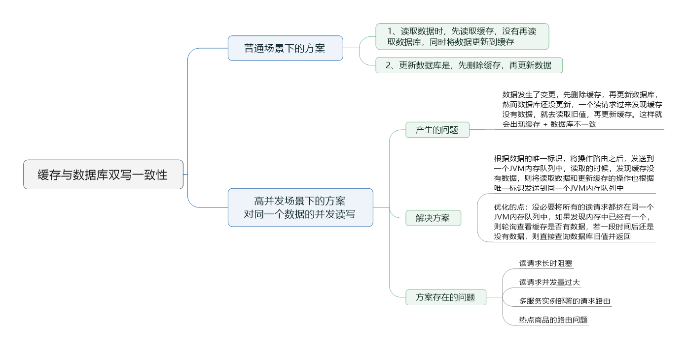
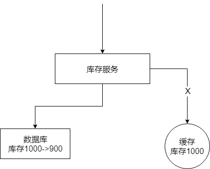

> 本节思维导图

## Cache Aside Pattern

​		最经典的缓存+ 数据库读写的模式，就是这个Cache Aside Pattern

- 读的时候，先读缓存，缓存没有的话，就读数据库，然后取出数据后放入缓存，同时返回请求。
- 更新的时候，**先更新数据库，然后再删除缓存。**（这个方案并不靠谱，原因下面有讲）

​        至于为什么是删除缓存，而不是更新缓存。原因在于在复杂的缓存场景，缓存不单单是数据库中直接拉取出来的值。比如更新了某个表的一个字段，然后其对应的缓存，是需要查询另外两个表的数据进行运算，才能计算出缓存最新的值的。

​		而且更新缓存的代价有时候是很高的。对于复杂的缓存数据计算场景，如果你频繁修改一个缓存涉及的多个表，缓存也频繁更新，但这个数据有可能只需要被访问一次呢？例如一个缓存涉及的表的字段，在一分钟内就修改了一百次，而缓存也更新了一百次，但是这个缓存在一分钟内只被读取一次，**有大量的冷数据**。如果只是删除缓存的话，那么在1分钟内，这个缓存也就重新计算一次，大幅度降低开销。**用到缓存才去算缓存**。

## 最初级的缓存不一致问题及解决方案

​		如果先更新数据库，在删除缓存。如果删除缓存失败了，那么会导致数据库中是新数据，缓存中是旧数据，数据就出现了不一致。

### 解决思路

​		**先删除缓存，再更新数据库**。如果数据库更新失败了，那么数据库中是旧数据，缓存是空的，那么数据不会不一致。因为读的时候缓存没有了，所以读了数据库中的旧数据，然后更新到缓存中。

## 高并发场景下数据不一致问题分析

​		数据发生了变更，先删除了缓存，然后要去修改数据库，此时还没修改，一个请求过来，先去读缓存，发现缓存空了，去查询数据库，**查到了修改前的旧数据**，放到了缓存中。随后数据变更的程序完成了数据库的修改。这样就会发生数据库与缓存的数据不一致了。

### 什么场景下会发生上述情况

​		只有在对一个数据在并发的进行读写的时候，才可能会出现这种问题。如果并发量很低的话，特别是读并发很低，每天访问量就一万，那么很少的情况才会出现上述情况。如果每天是上亿的流量，每秒并发读是几万，每秒只要有数据更新的情况，就可坑出现上述的数据库和缓存不一致的情况。

### 解决方案

​		更新数据的时候，根据**数据的唯一标识**，将操作路由之后，发送到一个jvm内部队列中。读取数据的时候，如果发现数据不在缓存中，那么将重新读取数据 + 更新缓存的操作，根据唯一标识路由之后，也发到同一个jvm内部队列中。

​		一个队列对应一个工作线程，每个工作线程串行拿到对应的操作，然后一条一条的执行。这样一个数据变更的操作，先删除缓存，然后再去更新数据库，但是还没有完成更新。此时如果一个读请求过来，没有读到缓存，可以先将缓存更新的请求发送到队列中，此时会在队列中积压，然后同步等待缓存更新完成。

​		这里有一个可以优化的地方。一个队列中，**多个更新缓存请求串在一起是没意义的**。可以做过滤，如果发现队列中已经有一个更新缓存的请求了，那么就不用再放个更新缓存的请求操作进去，直接等前面的更新操作请求完成即可。

​		等那个队列对应的工作线程完成了上一个操作的数据库的修改之后，才会去执行下一个操作，也就是缓存更新的操作，此时会从数据库读取最新的值，然后写入缓存中。

​		如果请求还在等待时间范围内，不断轮询，发现可以取到值了，那么久直接返回；如果请求等待的时间超过一定时长，那么这一次直接从数据库中读取当前的旧值。

### 存在的问题

- 读请求长时阻塞

由于读请求进行了非常轻度的异步化，所以要注意读超时的问题，每个读请求必须在超时时间范围内返回。

​		解决方案，或者最大的风险点在于可能**数据更新很频繁**。导致队列中积压了大量更新操作在里面，然后**读请求会发生大量的超时**，最后导致大量的请求直接走数据库。因此务必通过一些模拟真实的测试，看看数据更新的频率是怎样的。

​		另外，因为一个队列中，可能会积压对多个数据项的更新操作，因此需要根据自己的业务情况进行测试，可能需要**部署多个服务**。每个服务分摊一些数据的更新操作。如果一个内存队列路积压100个商品的库存修改操作，每个库存修改操作需要耗费10ms去完成，那么最后一个商品的读请求，可能等待10 * 100ms = 1s，才能得到数据，这个时候就**导致读请求的长时阻塞**。

- 读请求并发量过大

​        这里还必须做好压力测试，确保恰巧碰上上述情况的时候，还有一个风险，就是突然间大量读请求会在几十毫秒的延时hang在服务上，看服务能不能抗的住，需要多少机器才能抗住最大的极限情况的峰值。

​		但是因为不是所有的数据都在同一时间更新，缓存也不会再同一时间失效，所以每次可能也就是少数数据的缓存失效了，然后那些数据对应的读请求过来，并发量应该也不会特别大。

- 多服务实例部署的请求路由

​		可能这个服务部署了多个实例，那么必须保证，**执行数据更新操作，以及执行缓存更新操作的请求，都通过Nginx服务器路由到相同的服务实例上**。

​		例如对同一个商品的读写请求，全部路由到同一台服务器上。可以自己去做服务间的按照某个请求参数的hash路由，也可以用Nginx的hash路由功能等。

- 热点商品的路由问题，导致请求的倾斜

​		如果某个商品的读写请求特别高，全部打到相同机器相同的队列里，可能会造成某台机器的压力过大。就是说，因为只有在商品更新的时候才会清空缓存，然后才会导致读写并发。所以其实要根据业务系统去看，如果更新频率不是太高的话，这个问题的影响不是特别大，但是的确可能某些机器的负载会高一些。

## 总结

​		一般来说，如果允许缓存可以稍微的跟数据库偶尔有不一致的情况，也就是说系统不是严格要求“缓存 + 数据库”必须保持一致性的话，最好不要做“读请求和写请求串行化”，串到一个内存队列里去。

​		串行化可以保证一定不会出现不一致的情况，但是它会导致系统的吞吐量大幅度降低。