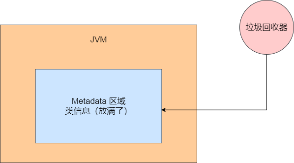
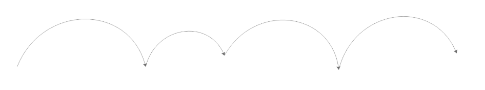
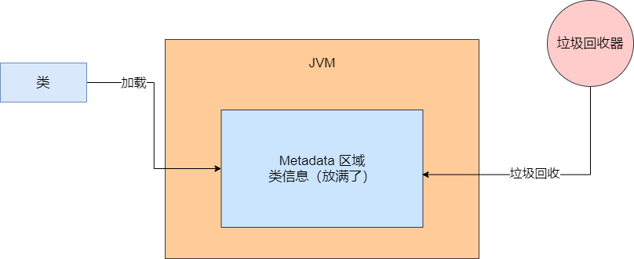
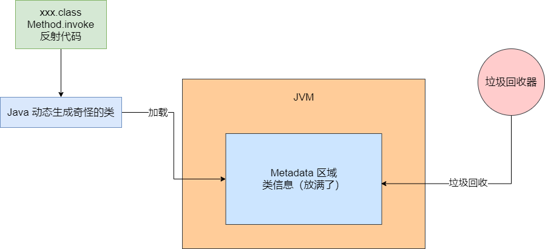
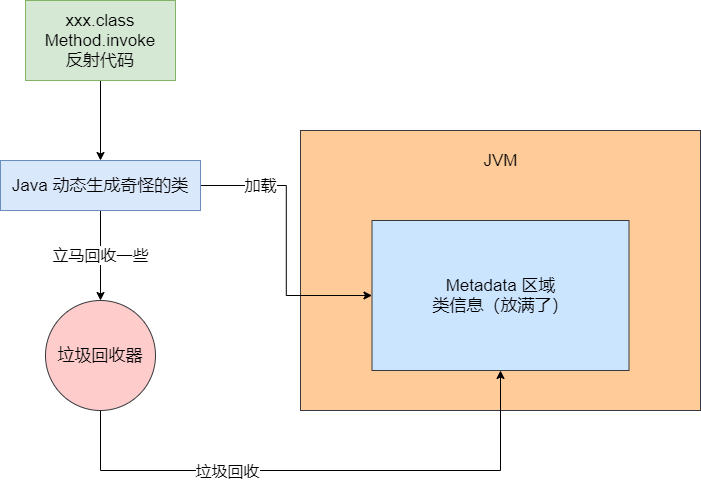

## 场景

一个新手工程师在网上看了某个 JVM 参数，在测试环境部署系统的时候，设置了一个 JVM 参数。由于测试环境有接触 Zabbix 监控系统，可以让你的系统进去，在上面可以看到每台机器的 CPU、磁盘、内存和网络的一些负载。


那个工程师设置了一个 JVM 参数之后，直接导致线上系统频繁接到 JVM 的 Full GC 的报警。于是就开始排查那个系统了。


## 查看 GC 日志

之前有说过如果在系统启动的时候让他输出 GC 日志，所以一旦发现报警，直接登录到线上机器，然后就可以看到对应的 GC 日志了。


在日志里，看到了一个 `Metadata GC Threshold` 的字样，类似于如下位置：

```
[Full GC (Metadata GC Threshold) xxxxx, xxxxx]
```

从这里就可以看出，这频繁的 Full GC，实际上是 JDK1.8 以后的 Metadata 元数据区导致的，也就是类似我们之前说的永久代。


这个 Metadata 区域一般是放一些加载到 JVM 里去的类，所以此时就很奇怪了，为什么会因为 Metadata 区域频繁地被塞满，进而触发 Full GC？而且 Full GC 会带动 CMS 回收老年代，还会回收 Metadata 区域本身。如图：




## 查看 Metaspace 内存占用情况

接着我们看一下 Metaspace 区域的内存占用情况，简单点你可以通过 jstat 来观察。如果有监控系统，它会给你展示出来一个 Metaspace 内存区域占用的波动曲线图，类似下面：




看起来 Metaspace 区域的内存呈现一个波动的状态，它总是会先不断增加，达到一个顶点之后，就会把 Metaspace 区域给占满，然后自然就会触发一次 Full GC，Full GC 会带着 Metaspace 区域的垃圾回收，所以接下来 Metaspace 区域的内存占用又变得很小了。


## 一个综合性的分析思路

看到这里，相信大家肯定有一点感觉了。这个明显是系统在运行过程中，不停地有新的类产生被加载到 Metaspace 区域里去，然后不停地把 Metaspace 区域占满，接着触发一次 Full GC 回收掉 Metaspace 区域中的部分类。然后这个过程反复不断地循环，进而造成 Metaspace 区域反复被占满，然后反复导致 Full GC 的发生，如图：




## 到底是什么类不停地被加载

那到底是什么类不停地被加载到 JVM 的 Metaspace 区域里去？这个时候就要在 JVM 启动参数中加入这个参数了：`-XX:TraceClassLoading` `-XX:TraceClassUnloading`。


这两个参数，顾名思义，就是追踪类加载和类卸载的情况，它会通过日志打印出来 JVM 中加载了哪些类，卸载了哪些类。加入这两个参数后，我们就可以看到 JVM 日志文件中，输出流一堆日志，里面显示如下的内容：

```
[Loaded sun.reflect.GeneratedSerializationConstructorAccessor from _JVM Defined_Class]
```

明显可以看到，JVM 在运行期间不停地加载了大量的所谓 "GeneratedSerializationConstructorAccessor" 类到了 Metaspace 区域里去。就是因为 JVM 运行期间不停地加载这种奇怪的类，然后不停地把 Metaspace 区域占满，才会引发不停地执行 Full GC。


这是一个非常实用的技巧。频繁 Full GC 不光是老年嗲触发的，有时候也会因为 Metaspace 区域的类太多而触发。


## 为什么会频繁加载奇怪的类

接着遇到类似这种情况，通过 Google 发现，那个类大概是你使用 Java 中的反射加载的，所谓反射代码类似如下：

```java
Method method = XXX.class.getDeclareMethod(xx, xx);
method.invoke(target, params);
```


简单来说就是通过 XXX.class 获取到某个类，然后通过 getDeclaredMethod 获取到那个类的方法。这个方法就是一个 Method 对象，接着通过 Method.invoke 可以去调用那个类的某个对象的方法，大概就这个意思。


在执行这种反射的时候，JVM会在你反射调用一定次数之后就动态生成一些类，就是我们之前看到的那种莫名其妙的类。下次你再次执行反射的时候，就是调用这些类的方法，这是 JVM 的一个底层优化。


看到这，是不是有点懵。这个倒无所谓，不影响你进行 JVM 的优化。**你只需要记住一个结论：如果你在代码里大量用了类似上面反射的东西，那么 JVM 就是会动态地去生成一些类放入 Metaspace 区域里的。**所以上面看到的那些奇怪的类，就是由于不停地执行反射的代码才生成的。如图：




## JVM 创建的奇怪类有什么玄机

那么 JVM 为什么要不停地创建那些奇怪的类然后放入 Metaspace 中去？其实这要从一个点入手来分析一下了，因为上面说的那种 JVM 自己创建的奇怪的类，它们的 Class 对象都是 SoftReference，也就是软引用。


可能有人不知道类的 Class 是什么。简单来说，每个类本身自己也是一个 Class，就是一个 Class 对象，一个 Class 对象就代表了一个类。同时这个 Class 对象代表的类，可以派生出很多实例对象。例如，Class Student，这就是一个类，它本身是由一个 Class 类型的对象表示的。但是如果你走一个 Student student = new Student()，这就是实例化了这个 Student 类的一个对象，这是一个 Student 类型的实例对象。


所以我们这里说的 Class 对象，就是 JVM 在反射过程中动态生成的类的 Class 对象，它们都是 SoftReference 软引用的。所谓的软引用，正常情况下不会回收，但是如果内存比较紧张的时候就会回收这些对象。


那么 SoftReference 对象到底在 GC 的时候要不要回收是通过什么来判断的呢？就是这么一个公式：


**clock - timestamp <= freespace * SoftRefLRURPolicyMSPerMB**


这个意思是，`clock - timestamp` 代表了一个软引用对象它有多久没被访问过了，`freespace` 代表了 JVM 中的空闲内存空间，`SoftRefLRUPolicyMSPerMB` 代表每一 MB 空闲内存空间可以允许 SoftReference 对象存活多久。


举个例子，加入说现在 JVM 创建了一大堆的奇怪的类出来，这些类本身的 Class 对象都是被 SoftReference 软引用的。然后新增 JVM 的内存空间有 3000 MB，SoftRefLRURPolicyMSPerMB 默认值是 1000 毫秒，那么就意味着，此时那些奇怪的 SoftReference 软引用的 Class 对象，可以存活 3000 * 1000 = 3000 秒，就是 50 分钟左右。


当然上面也只是举例子。正常情况下，发生 GC 时，其实 JVM 内部或多或少都有一些空间内存的，所以基本上如果不是快要发生 OOM 内存溢出了，一般软引用也不会被回收了。所以正常情况下，JVM 会随着反射代码的执行，动态地创建一些奇怪的类，它们的 Class 对象都是软引用，正常情况下不会被回收，但是也不应该快速增长才对。


## 为什么 JVM 创建的奇怪的类会不停地变多

那为什么 JVM 创建的那些奇怪的类会不停地变多呢？原因是，文章开头的新手工程师不知道从哪里扒出来了 `SoftRefLRUPolicyMSPerMB` 这个JVM 启动参数，它直接把这个参数设置为 0 了。他想的是，一旦这个参数设置为 0，任何软引用对象就可以尽快释放掉，不用留存，尽量给内存释放空间出来，这样就可以提高内存利用率了。


实际上一旦这个参数设置为 0 之后，直接导致 `clock - timestamp <=  freespace * SoftLRUPolicyMSPerMB` 这个公式的右半边是 0，就导致所有的软引用对象，比如 JVM 生成的那些奇怪的 Class 对象，刚创建出来就可能被一次 Young GC 给带着立马回收掉了。




比如 JVM 给你弄出 100 个奇怪的类，结果你瞎设置软引用的参数，导致突然一次 GC 就给你回收掉几十个类。接着 JVM  在反射代码执行的过程中，就会继续创建这种奇怪的类，这 JVM 的机制之下，会导致这种奇怪的类越来越多。


也许下一次 GC 又会回收掉一些奇怪的类，但是马上 JVM 还会继续生成这种类，最终导致 Metaspace 区域就被放满了，一旦 Metaspace 区域放满了，就会触发 Full GC，然后回收掉很多类，接着再次重复上述循环。


为什么软引用的类因为错误的参数设置被快速回收之后，就会导致 JVM 不停创建更多的新的类呢？其实大家不用去扣这里的细节，这里有大量的底层 JDK 源码的实现，异常复杂，大家只要记住这个结论就好。


## 如何解决这个问题

虽然底层 JDK 的一些实现细节没分析，但是大致梳理出来了一个思路，大家也清楚问题所在和原因了。解决方案很简单，在有大量反射代码的场景下，主要把 `-XX:SoftRefLRUPolicyMSPerMB = 0` 这个参数设置大一些即可。千万不要设置为 0，可以设置个 1000,2000，或者 5000 毫秒。


提高这个数值，就是让反射过程中 JVM 自动创建的软引用的一些类的 Class 对象不要被随便回收。当我们优化这个参数之后，就可以看到系统稳定运行了，基本上 Metaspace 区域的内存占用是稳定的，不会来回大幅度波动了。

