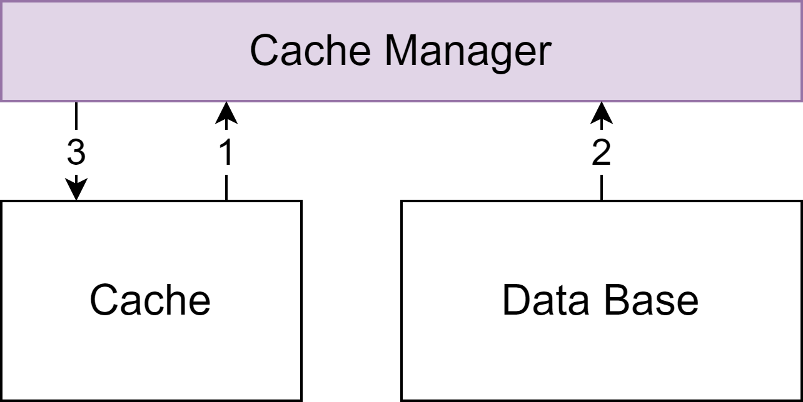

## Spring Cache

在讨论公司的分布式缓存架构之前，我们先拿 Spring Cache 缓存作为一个参考系。简单来说，Spring Cache 有两个优点：

1. 基于 Spring AOP 注解
   - 上手简单
   - 对业务侵入性低
2. 提供标准的 Cache 抽象（JSR 107），具体的 `Cache`、`CacheManager` 依赖各自实现

### SpaceStation 实践

在 Spring Cache 的基础上，我们进行了一些简单的优化。包括以下两点：

- 实现了两级缓存（堆内内存 + Redis）

- 自定义 EnhanceCacheManager，定义了 CacheConfig 结构，可以定义 Cache 的 `TTL`、`Size` 等属性

### Spring Cache 初体验

在使用 Spring Cache 的过程中，发现了以下缺点：

- 接口简单。没有 `TTL`，而且也没有缓存批量操作。例如批量增加、批量删除等等

- 注解简单。注解的属性太少，缓存配置和缓存声明式分开的

- 扩展困难。所有功能需要自己实现 Cache Manager，而且切面固定，但不是所有功能都是放在 CacheManager 里面

- 对缓存穿透、缓存雪崩缺乏支持

## 公司的分布式缓存架构 - SCache

为了解决 Spring Cache 上述问题，满足公司项目的使用。公司架构组决定自研一个分布式缓存架构。其设计目标如下：

1. 开箱即用，声明式（注解）和编程式的使用方式
2. 更丰富的 API 和注解
3. 原生支持多级缓存
4. 支持批量缓存存取
5. 更好预防缓存雪崩和缓存穿透场景
6. 做一个透明的、可监控的缓存层

为此，该架构吸收了 Spring Cache 的优点，有标准化的 Cache API；并且基于 AOP，降低侵入性；同时支持 `SPEL`，以及灵活的 key 生成和条件匹配

### 多级缓存

SCache 本地使用 Caffeine Cache，远程缓存则适配 Redis，并且多级缓存之间 TTL 等属性会作出区分。支持可配置的序列化、压缩等存储方式，另外，提供了统一的 Redis 操作客户端 Eadis

### 批量缓存操作

Spring Cache 的批量缓存操作，其实并不是真正意义上的批量，而是多个 key hash 成一个，仍是单个缓存。这样如果其中一个 key 发生变化，整个缓存就都无法命中了

而 SCache 则是拆分请求，分成独立的缓存，批量查询。如果命中缓存，则从 Cache 中获取，未命中的缓存则走业务逻辑回源，然后将回源到的数据回写到缓存，最终结果是有 Cache 和 DB 数据两者结合而成。如下图：

### 缓存场景

#### 缓存穿透

缓存穿透是指大量请求请求不存在的数据，穿透缓存，请求到了数据库那里。SCache 的解决方案是缓存 Null Value，并为 Null Value 提供专门的 TTL

#### 缓存击穿

缓存击穿是指某缓存 key 失效，大量并发请求同时抵达数据库。SCache 的解决方案是控制缓存回源的并发数，并且提供可选的 `Cache Policy`，直接返回过期缓存，并异步回源。此外再上 Lock，Lock 范围可以在 JVM，也可以在整个系统

#### 缓存雪崩

缓存雪崩是缓存采用了相同的过期时间，导致大量缓存同时失效，请求全部落到了 DB 上。SCache 采取的解决方案是采用多级缓存，并在缓存有限期附加随机时间，同时控制缓存回源的并发

### 可监控的缓存

缓存的监控，主要是分为以下几个维度去监控：

- 分 Cache 监控：每个缓存都有自己的命名

- 分 Type 监控：有两个类型，本地缓存和远程缓存

而我们监控的指标主要是：缓存的 QPS、相应时间以及命中率等

### 其他特性

SCache 除了上述的功能外，还有其他特性。包括缓存与源的一致性、缓存自动刷新和缓存压缩等

1. 缓存与源的一致性

   - 与事务的协调处理

   - 数据库主从同步延迟的处理

2. 缓存自动刷新

   - 定时自动刷新缓存
   - 冷数据，自动停止刷新

3. 缓存压缩

   - 节约 Redis 内存
   - 存入缓存时自动压缩
   - 读取缓存时自动解压缩

## 一级缓存失灵

一般情况下，为了保证系统的高可用，我们都是集群部署系统，那么这样就会出现一个问题。假设有两台机器都部署了系统，其中两个系统本地缓存数据 X = 1。接着 JVM1 更改了数据 X = 2，并修改了本地换粗和 Redis 缓存，但此时 JVM2 的 X 还是为 1。这就是一级缓存失灵，如下图

### 网上的解决方案

如何保证多个系统之间的本地缓存数据保持一致性呢？常规的解决方法有两种，一是 **JVM 之间直接同步**；二是**引入中间件**，例如 MQ

「JVM 之间直接同步」大体上有两种方案，一个是**使用 RPC**，但这个依赖于服务发现的实时性，而且有可能造成通知方压力过大；另一个是**使用一致性协议**，如 Gossip 等，但这个实现复杂度较高，并且不可控，消息过大，容易造成网络风暴

### SCache 的解决方案

#### 初级方案

因为我们的远程缓存时采用 Redis，因此架构组经过讨论后，采用 Redis 的 `pubSub` 机制来解决一致性问题。`PubSub` 消息包含发生变更的 key 以及对应的编号，并且通知的时候，删除过期的 key 而不是更新 value

#### 进阶方案

随着系统有并发量的提升，刚开始那一套方案开始出现了问题。Redis 的 `PubSub` 是有一定延迟的，平时可能感觉不出来，但有了一定并发量的时候，就会有问题。例如一个数据，x = 1,被修改了两次，x = 2, x = 3，通过 Redis 的 pubSub 广播出去，但由于延迟，有可能另一台JVM 先修改了 x =3，再修改了 x = 2。这时候就出现问题了。因此，就有了这个进阶方案。

进阶方案包含两个维度。首先是「发起方」，发起方要修改数据的时候，先**双写变更 key，然后*定时心跳*通知当前最大的消息 id**

接着是「接收方」，先**比对心跳通知，检查自身消息 id 是否遗漏。如果遗留，则 get 备份消息，进行一致性恢复；无法恢复一致性，则清空该 name 下本地缓存**

#### 方案补充

基本上述方案就能抗住高并发，实现数据的一致性。接着就是一些网络问题的补充方案。因为 Redis 的不稳定，尤其是集群的网络抖动，双写 `set`、`publish`、`subscribe` 等都可能失败。因此 Eadis 提供高可靠的 `Set / Get`、`Publish / Subscribe` 命令，自动计算合适的 `hashtag`，将数据发送到可用的 Redis 节点上

## 出现的问题

这套缓存框架使用一段时间后，慢慢也开始显露出一个问题。那就是本地缓存时存储在 JVM 堆内存中的，很多缓存数据会逃过 Young GC，躲入老年代。缓存虽然会不断淘汰，但是之前的数据仍然占用老年代空间，并造成老年代的碎片

这个时候，虽然有 JVM 的 GC 垃圾回收机制，回收掉老年代的数据，但这套缓存框架仍然受限于 JVM 的堆内存，大量系统剩余的内存无法利用

### 解决方案

为了解决上述问题，我们就需要搞定「大内存」，而最有效的方法就是**使用堆外内存**。经过调研，主要有一下三种方法使用堆外内存：

1. 使用直接内存
   - 性能好
   - 需要配置 JVM 参数进行控制
   - MaxDirectMemorySize 有 `OOM` `Full GC` 风险
2. 使用本地服务
   - 提升架构复杂度，降低了系统稳定性
   - 进程间通信，性能相对较低
   - PAAS 外存在数据一致性无问题
3. 使用本地动态链接库
   - 进程内通信，与 Java 进程工存亡
   - 缺乏合适的技术解决方案

最终架构组采用了第三个方案，选择 Rust 实现动态链接库。理由如下：

- 可提供 FFI 接口的功能

- C 语言级别的性能

- 内存安全，自动回收，无 GC

- 并发安全

- 纯粹的缓存 Lib 复杂度可控

在使用 Rust 的过程中，发现 Rust 现有的 HashMap 容器并不好用，跟 JDK1.7 的 ConcurrentHashMap 类似，有如下问题：

- 采用分段锁，锁的粒度太大，高并发下锁竞争激烈

- 数据越多，Put、扩缩容等对锁造成的影响越大

- 数据结构内部封装，外部不可见

为此，架构组参考 JDK1.8 的 ConcurrentHashMap，用 Rust 自定义了 hashMap，有如下特点：

1. 线程安全
2. 最小粒度的锁，支持高并发
3. 渐进式 rehash，扩缩容无阻塞
4. 可自由访问任意 entry 进行遍历

SCache 就用这一套解决了大内存问题

## 内存控制

内存控制主要分为三个方面：整体限制、独立控制以及数据淘汰

整体限制主要分为以下两点：

- 可定义最少需要保留的主机空闲内存

- 可定义堆外缓存最大使用的主机内存

独立控制主要体现在：每个命名 Cache 可以单独配置可使用的堆外内存大小，使用 `localMaxWeight` 属性去配置

数据淘汰主要有以下三点：

1. 后台线程定期淘汰过期数据
2. **惰性删除**。Get 数据时，如果该 Key 已经过期，则删除该数据
3. **强制剔除**。Insert 数据时，如果使用内存已经达到所配置的 `localMaxWeight`，则将先淘汰部分数据，释放足够的内存来完成本次 Insert

