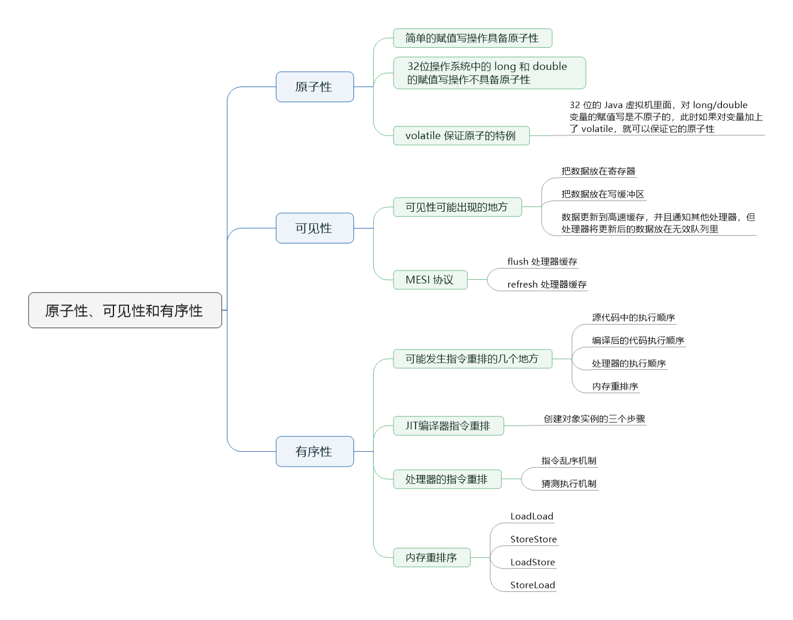
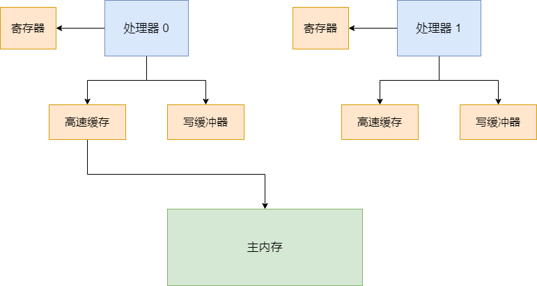
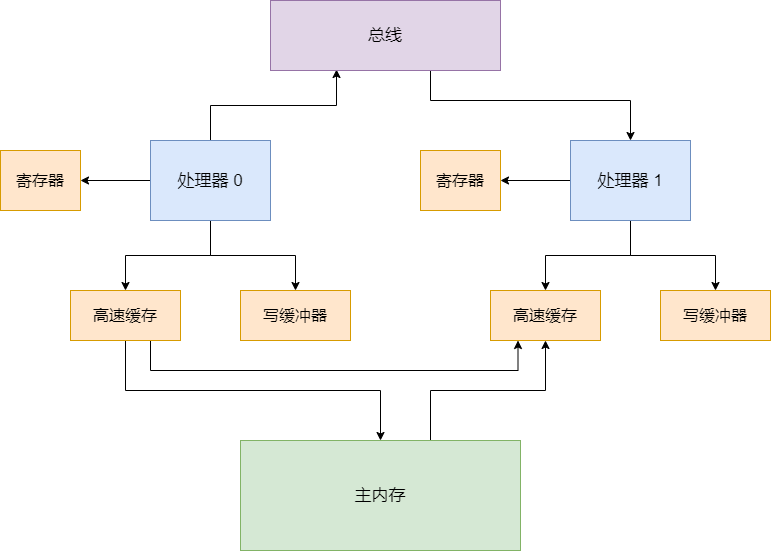
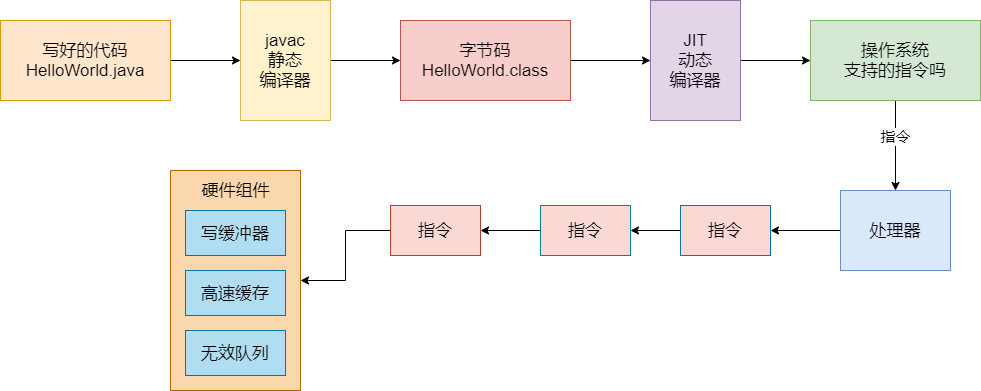
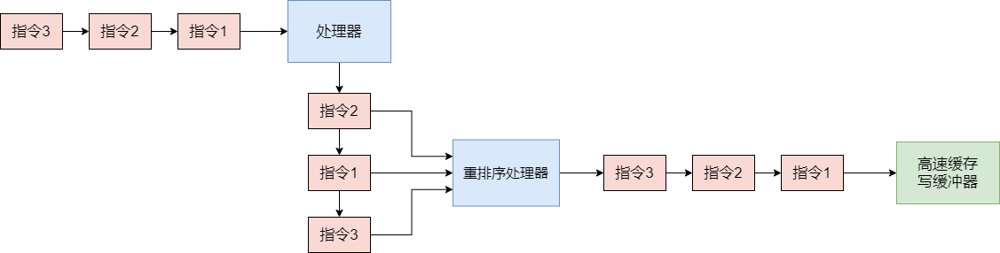
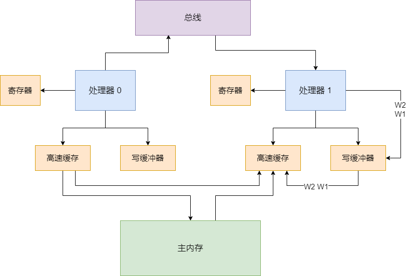

> 思维导图



## 原子性

Java 语言规范里，`int i = 0`、`resource = loadResources`、`flag = true`，各种变量的简单赋值操作，规定都是原子的，包括引用类型的变量的赋值操作，也是原子的。


但是很多复杂的操作，例如 `i++`，先读取 i 的值，再更新 i 的值。还有 `i = y + 2`，先读取 y 的值，再更新 i 的值，这种复杂操作，不是简单赋值写，它是有计算的过程在里面的，此时 Java 语言规范默认是不保证原子性的。


volatile 关键字，保证了可见性和有序性，但不保证原子性。像上面的 `i++`，`i = y + 2`，volatile都是不保证原子性的。


### 赋值写操作中不保证原子性的特例

原子性这块，在 32 位虚拟机里的 long/double 类型的变量的简单赋值写操作，不是原子的。例如 `long i = 30`、`double c = 45.0`，在 32 位虚拟机里就不是原子的，因为 long 和 double 是 64 位的。


如果多个线程同时并发执行 long i = 30，long 是 64 位的，就会导致有的线程在修改 i 的高 32 位，有的线程在修改 i 的低 32 位，多线程并发给 long 类型的变量进行赋值操作，在 32 位的虚拟机下，是有问题的。可能会导致多线程给 long i = 30 赋值之后，导致 i 的值不是 30，可能是 -3333334429 乱码一样的数字，就是因为高低 32 位赋值错了，就导致二进制数字转换为十进制之后是一个很奇怪的数字。


### volatile 保证原子性的特例

volatile 对原子性保证的语义，在 Java 里是很有限的，几乎可以忽略不计。32 位的 Java 虚拟机里面，对 long/double 变量的赋值写是不原子的，此时如果对变量加上了 volatile，就可以保证在 32 位 Java 虚拟机里面，对 long/double 变量的赋值是原子的了。


## 硬件级别思考可见性的问题

每个处理器都有自己的寄存器（register），所以多个处理器各自运行一个线程的时候，可能导致某个变量给放到寄存器里去，接着就会导致各个线程没法看到其他处理器寄存器里的变量的值修改了。**可见性的第一个问题，就有可能在寄存器的级别，导致变量副本的更新，无法让其他处理器看到**。


然后处理器运行的线程对变量的操作都是针对写缓冲来的（store buffer），并不是直接更新主内存，所以很可能导致一个线程更新了变量，但是仅仅是在写缓冲区而已，没有更新到主内存里去。**这个时候，其他处理器的线程是没法读到它的写缓冲区的变量值的，所以此时会有可见性的问题，这是第二个可见性发生的场景。**


然后即使这个时候一个处理器的线程更新了写缓冲区之后，将更新同步到了自己高速缓存里（cache，或者是主内存），然后还把这个更新通知给了其他的处理器，**但是其他处理器可能就是把这个更新放到无效队列里**，没有更新它的高速缓存。此时其他处理器的线程从高速缓存里读数据的时候，读到的还是过时的旧值。




### MESI协议

如果要实现可见性，其中一个方法就是通过 `MESI` 协议。这个 `MESI` 协议实际上有很多种不同的实现，因为它不过就是一个协议，具体的实现机制要考具体底层的系统如何实现。根据具体底层硬件的不同，`MESI` 协议的实现是有区别的。


比如说 `MESI` 协议有一种实现，就是一个处理器将另外一个处理器的高速缓存中的更新后的数据拿到自己的高速缓存中更新一下，这样大家的缓存不就实现同步了，然后各个处理器的线程看到的数据就一样了。


为了实现 `MESI` 协议，有两个配套的专业机制需要说一下：**flush 处理器缓存**、**refresh 处理器缓存**。


flush 处理器缓存，它的意思是把自己更新的值刷新到高速缓存里去（或者是主内存），因为必须要刷到高速缓存（或者是主内存）里，才有可能在后续通过一些特殊的机制让其他的处理器从自己的高速缓存（或者是主内存）里读取到更新的值。


除了 flush 以外，它还会发送一个消息到总线（bus），通知其他处理器，某个变量的值被它修改了。


refresh 处理器缓存，它的意思就是说再读取一个变量的值的时候，如果发现其他处理器的线程更新了变量的值，必须从其他处理器的高速缓存（或者是主内存）里，读取这个最新的值，更新到自己的高速缓存中。


所以，为了保证可见性，在底层是通过 `MESI` 协议、flush 处理器缓存和 refresh 处理器缓存，这一整套机制来保障的。要记住，flush 和 refresh 这两个操作，flush 是强制刷新数据到高速缓存（或主内存），不要仅仅停留在写缓冲器里面；refresh，是从总线嗅探发现某个变量被修改，必须强制从其他处理器的高速缓存加载变量的最新值到自己的高速缓存里去。


内存屏障的使用，在底层硬件级别的原理，其实就是在执行 flush 和 refresh。还有 volatile 关键字：

```
volatile boolean isRunning = true;
```


当执行 `isRunning = false` 时，就是写 volatile 变量，就会通过执行一个内存屏障，在底层触发 flush 处理器缓存的操作；`while(isRunnig) {}`，读 volatile 变量，也会通过执行一个内存屏障，在底层触发 refresh 操作。


一个变量加了 volatile 修饰之后，对这个变量的写操作，会执行 flush 处理器缓存，把数据刷到高速缓存（或者是主内存）中，然后对这个变量的读操作，会执行 refresh 处理器缓存，从其他处理器的高速缓存中，读取最新的值。




## 有序性

### Java 程序运行过程中发生指令重排的几个地方

我们写好的代码在实际执行的时候那个顺序可能在很多环节都会被人给重排序，一旦重排序之后，在多线程并发的场景下，就有可能出现一些问题。




1、**自己写的源代码中的执行顺序**，这个是我们自己写的代码，一般来说就是按照我们自己脑子里想的那样来写。


2、**编译后的代码的执行顺序**。java 里有两种编译器，一个是静态编译器（javac），一个是动态编译器（JIT）。javac 负责把 `.java` 文件中的源代码编译为 `.class` 文件中的字节码，这个一般是程序写好之后进行编译的。JIT 负责把 `.class` 文件中的字节码编译为 JVM 所在操作系统支持的机器码，一般在程序运行过程中进行编译。


在这个编译的过程中，编译器是很有可能调整代码的执行顺序的，为了调高代码的执行效率，很可能调整代码的执行顺序。JIT 编译器对指令重排的还是挺多的。


3、**处理器的执行顺序**。哪怕你给处理器一个代码的执行顺序，但是处理器还是可能会重排代码，更换一种执行顺序。JIT 编译好的指令，还是可能会被处理器调整顺序


4、**内存重排序**。有可能你这个处理器在执行指令的时候，在高速缓存和写缓冲器、无效队列等等硬件层面的组件，也可能导致你的指令的执行看起来的顺序跟想象的不太一样。


上述就是我们在写好 java 代码之后，从编译到执行的过程中，代码的执行顺序可能有指令重排的地方，只要有指令重排就有一定可能造成程序执行异常。


但是编译器和处理器不是胡乱地重排序，他们会遵循一个关键的规则，就是数据依赖规则。如果说一个变量的结果依赖于之前的代码执行结果，那么就不能随意进行重排序，要遵循数据的依赖。例如：

```java
int a = 3;
int b = 5;
int c = a * b;
```


那第三行代码依赖于上面两行代码，第一行和第二行代码可以重排序，但是第三行代码必须放在最下面。


此外还有 happens-before 原则，就是有一些基本的规则是要遵守的，不会让你胡乱地重排序。在遵守一定的规则的前提下，有好几个层面的代码和指令都可能出现重排序。


### JIT编译器指令重排的例子

JIT 动态编译的时候，有可能造成一个非常经典的指令重排。

```java
public class MyObject {

	private Resource resource;
	
	public MyObject() {
	
		// 从配置文件里加载数据构造 Resource 对象
		this.resource = loadResource();
	}
	
	public void execute() {
		this.resource.execute();
	}
}
```


假设线程 1 执行我们写的这么一行代码：

```java
MyObject myObj = new MyObject();
```


而线程 2 执行下面这行代码：

```java
myObj.execute();
```


首先，我们要知道 `new Object()` 是如何创建一个 MyObject 对象实例的。

- 步骤1：以 MyObject 类作为原型，给它的对象实例分配一块内存空间。`objRef` 就是指向了分配好的内存空间的地址的引用。

```java
objRef = allocate(MyObject.class);
```


- 步骤2：就是针对分配好内存空间的一个对象实例，执行它的构造函数，对这个对象进行初始化的操作，执行我们自己写的构造函数里的一些代码，对各个实例变量赋值，执行初始化的逻辑。

```java
invokeConstructor(objRef);
```


- 步骤3：上面两个步骤搞定之后，一个对象实例就算创建完成。此时就是把 objRef 指针指向的内存地址，赋值给我们自己的引用类型的变量，myObj 就可以作为一个类似指针的概念指向了 MyObject 对象实例的内存地址。

```
myObj = objRef;
```


有可能 JIT 动态编译为了加速程序的执行速度，因为步骤 2 是在初始化一个对象实例，这个步骤是有可能很耗时的，比如说你可能会在这里执行一些网络的通信，磁盘文件的读写等等。而 JIT 为了加速程序的执行性能和效率，就可能发生指令重排，把顺序排为：步骤 1 -> 步骤 3 -> 步骤 2


此时线程 1 刚好执行完了 步骤 1 和步骤 3，步骤 2 还没执行，此时 myObj 已经不是 null 了，但是 MyObject 对象实例内部的 resource 还是 null。而线程 2 直接调用 `myObj.execute` 方法，此时内部会调用 resource.execute() 方法。但因为 resource 还是 null，直接导致空指针错误。


double check 单例模式里面，就是可能会出现这样的 JIT 指令重排。如果你不加 volatile 关键字，会导致一些问题的发生。volatile 可以避免出现  步骤1、步骤3、步骤2 这样的重排序。


### 现代处理器为了提升性能的指令乱序和猜测执行机制

#### 指令乱序机制

指令不一定说是拿到了一个指令立马可以执行的，比如有的指令是要进行网络通信、磁盘读写、获取锁等等，因此有的指令不是立马就绪可以执行的。为了调高效率，在现代处理器里面都是走的指令的乱序执行机制。


把编译好的指令一条一条读取到处理器里，但是哪个指令先就绪可以执行，就先执行，不是按照代码顺序来的。每个指令的结果放到一个重排序处理器中，重排序处理器把各个指令的结果按照代码顺序应用到主内存或者写缓冲器里。


这就导致处理器可能在乱序执行我们代码编译后的指令。




#### 猜测执行机制

还有一个猜测执行。比如一个 `if` 判断有一堆代码，很可能先去执行 `if` 的代码算出来结果，然后再来判断 if 是否成立。

```
int sum = 0;
if(flag) {
	for(int i = 0; i < 10; i++) {
	
	}
}
```


### 内存重排序

处理器会将数据写入写缓冲器，这个过程是 `store`；从高速缓存里读数据，这个过程是 `load`。写缓冲器和高速缓存执行 `load` 和 `store` 的过程，都是按照处理器指示的顺序来的，处理器的重排处理器也是按照程序顺序来 `load`  和 `store` 的。


但是有个问题，就是在其他的处理器看到的一个视觉假象而言，有可能会出现看到的 `load` 和 `store` 是重排序的，也就是内存重排序。


处理器的乱序执行和猜测执行，都是指令重排序，这次说的是内存重排序，因为都是发生在内存层面的写缓冲器和高速缓存中的。


这个内存重排序，有 4 种可能性：

- **LoadLoad** 重排序：一个处理器先执行一个 L1 读操作，再执行一个 L2 读操作。但是另外一个处理器看到的是先 L2 再 L1

- **StoreStore** 重排序：一个处理器先执行一个 W1 写操作，再执行一个 W2 写操作。但是另外一个处理器看到的是先 W2 再 W1

- **LoadStore** 重排序：一个处理器先执行一个 L1 读操作，再执行一个 W2 写操作。但是另外一个处理器看到的是 W2 在 L1

- **StoreLoad** 重排序：一个处理器先执行一个 W1 写操作，再执行一个 L2 读操作。但是另外一个处理器看到的是先 L2 在 W1


例如，一个处理器向写缓冲器先后写入 W1 W2 的指令。但写缓冲器在内部进行了 指令重排，变成 W2 W1 的顺序写入到高速缓冲中。此时其他处理器看到的顺序就是 W2 再 W1了，这就是 StoreStore 重排序。




再比如，看下面的代码：

```java
// 共享变量
Resource resource = null;
Boolean resourceLoaded = false;

// 处理器0
resource = loadResourceFromDish();
resourceLoaded = true;

// 处理器1
while(!resourceLoaded) {
	try{
		Thread.sleep(1000);
		
	}catch(Exception e) {
		
	}
}

resource.execute();
```

类似上面的代码，很可能处理器 0 先写了 resource，再写了 resourceLoaded。结果写缓冲器进行内存重排序，先落地了 `resourceLoaded = true`，此时 resource 还是 null。此时处理器 1 就会看到 resourceLoaded =  true，就会对 resource 对象执行了 execute() 方法，此时就会有空指针异常的问题。


总之，高速缓存和写缓冲器都可以自己对 `Load`  和 `Store` 操作的结果落地到内存进行各种不同的重排序，进而造成上述 4 种内存重排序问题的发生。

