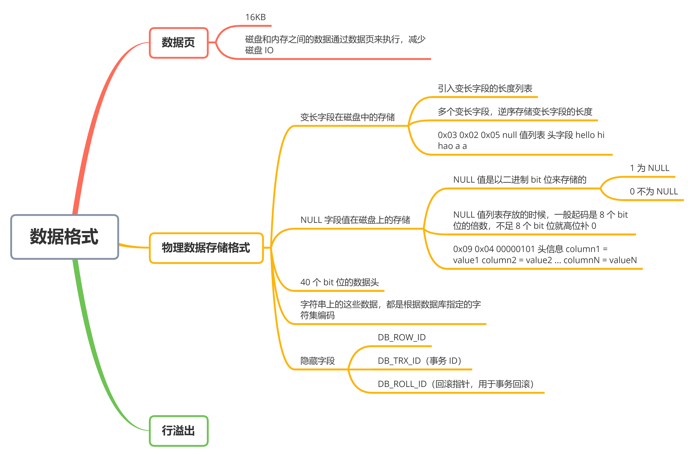
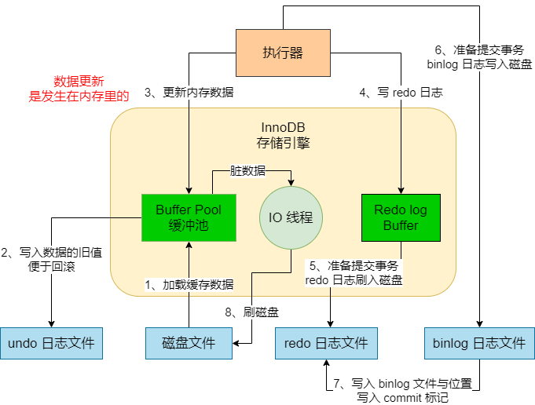
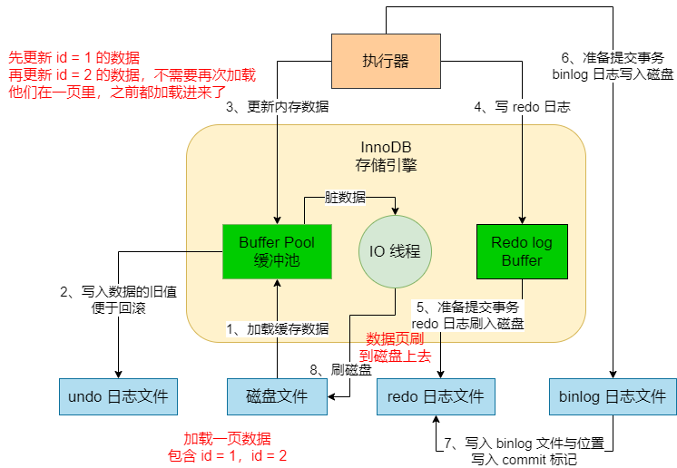
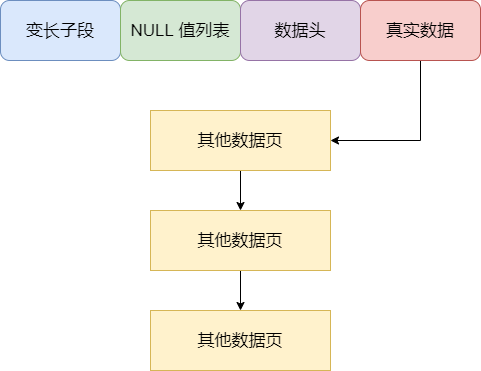

## 引入数据页

当我们要执行 update 之类的 SQL 语句的时候，必然涉及到对数据的更新操作。那么此时对数据是在哪里更新的？此时并不是直接去更新磁盘文件，而是要把磁盘上的一些数据加载到内存里来，然后对内存里的数据进行更新，同时写 redo log 到磁盘上去。如图：




这里就有一个问题，难道我们每次都是把磁盘里的一条数据加载到内存里去进行更新，然后下次要更新别的数据的时候，再从磁盘里加载另外一条数据到内存里去？


这样效率明显是很差的。所以 InnoDB 存储引擎在这里引入了一个「**数据页**」的概念，也就是把数据组织成一页一页的概念，每一页有 `16kb`，然后每次加载磁盘的数据到内存里的时候，是至少加载一页数据进去，甚至是多页数据进去。


假设我们有一次要更新一条 id = 1 的数据：

```mysql
update xxx set xxx = xxx where id = 1
```


那么此时它会把 id = 1 这条数据所在的一页数据都加载到内存里去，这一页数据里，可能还包含了 id = 2，id = 3 等其他数据。然后我们更新完 id = 1 的数据之后，接着更新 id = 2 的数据，那么此时就不用再次读取磁盘里的数据了，因为 id = 2 本身就跟 id = 1 在一页里，之前这一页数据就加载到内存里了，直接更新内存里的数据页中的 id = 2 这条数据即可。


这就是数据页的意义，磁盘和内存之间的数据交换通过数据页来执行，包括内存里更新后的脏数据。刷回磁盘的时候，也是至少一个数据页刷回去。




## MySQL 物理数据存储格式

对数据页中的每一行数据，它在磁盘上是怎么存储的？其实这里涉及到一个概念，就是行格式。我们可以对一个表指定它的行存储格式是怎么样的，比如我们这里用 **COMPACT** 格式

```java
CREATE TABLE table_name (columns) ROW_FORMAT = COMPACT
ALTER TABLE table_name ROW_FORMAT = COMPACT
```


你可以在建表的时候，就指定一个行存储的格式，也可以后续修改行存储的格式。这里指定了一个 `COMPACT` 行存储格式，在这种格式下，每一行数据它实际存储的时候，大概格式类似下面：

```
变长字段的长度列表, null 值列表, 数据头, column01 的值, column02 的值, column0n 的值...
```


对于每一行数据，它其实存储的时候都会有一些头字段对这行数据进行一定的描述，然后再放上它这一行数据每一列的具体的值，这就是所谓的行格式。除了 COMPACT 以为，还有其他几种行存储格式，基本都大同小异。


### 变长字段在磁盘中的存储

在 MySQL 里有一些字段的长度是变长的，是不固定的，比如 `VARCHAR(10)` 之类的这种类型的字段，实际上它里面存放的字符串的长度是不固定的，有可能是 `hello` 这么一个字符串，也可能是 `a` 这么一个字符串。


假设现在有一行数据，它的几个字段的类型为 VARCHAR(10)，CHAR(1)，CHAR(1)。那么它第一个字段是 VARCHAR(10)，这个长度是可能变化的，所以这一行数据可能就是类似于：hello a a。即第一个字段的值是 hello，后面两个字段的值都是一个字符，就是一个 a


然后另外一行数据，同样也是这几个字段，它的第一个字段的值可能是 「hi」，后面两个字段也是「a」，所以这一行数据可能是类似于：hi a a。一共三个字段，第一个字段的长度是不固定的，后面两个字段的长度都是固定的 1 个字符


假设你把上述两条数据写入了一个磁盘文件里，两行数据是挨在一起的，那么这个时候在一个磁盘文件里可能有下面的两行数据：

hello a a hi a a


其实，平时你看到的表里的很多行数据，最终落地到磁盘里的时候，都是上面那种样子的，一大坨数据放在一个磁盘文件里都挨着存储的。


#### 存储在磁盘文件里的变长字段为什么难以读取

现在我们要读取上面的磁盘文件的数据，要读取出来 `hello a a` 这一行数据，这个过程要更困难一些。第一个问题就是，从这个磁盘文件里读取的时候，到底哪些内容是一行数据？因为这个表里的第一个字段是 VARCHAR(10) 类型的，第一个字段的长度是多少我们是不知道的


所以有可能你读取出来「hello a a hi」是一行数据，也可能读取出来「hello a」是一行数据。你在不知道一行数据的每个子弹到底是多少长度的情况下，胡乱读取时不现实的，根本不知道磁盘文件里混成一坨的数据里，哪些数据是你要读取的一行？


#### 引入变长字段的长度列表

所以说才要在存储每一行数据的时候，都保存一下它的变长字段的长度列表，这样才能解决一行数据的读取问题。即，你在存储「hello a a」这行数据的时候，要带上一些额外的附加信息，比如第一块就是它里面的变长字段的长度列表。


也就是说，这个 hello 是 VARCHAR(10) 类型的变长字段的额值，那么这个 hello 字段值的长度是多少？我们看到 「hello」的长度是 5，十六进制就是 `0x05`，所以此时会在 `hello a a` 前面补充一些额外信息，首先就是变长字段的长度列表，你会看到这样数据在磁盘里存储的时候，其实是类似如下的格式：`0x05 null 值列表 数据头 hello a a`


这个时候你有两行数据，还有一行数据可能就是：`0x02 null 值列表 数据头 hi a a`，两行数据放在一起存储在磁盘文件里，看起来是如下所示的：

```
0x05 null 值列表 数据头 hello a a 0x02 null 值列表 hi a a
```


#### 如何读取变长字段

假设你要读取「hello a a」这行数据，你首先会知道这个表里的三个字段的类型是 VARCHAR(10) CHAR(1) CHAR(1)，那么此时你先要读取第一个字段的值，那么第一个字段是变长的，它的实际长度是多少？


此时你会发现第一行数据的开头有一个变长字段的长度列表，里面会读取到一个 `0x05` 这个十六进制的数字，发现第一个变长字段的长度是 5，于是按照长度为 5， 读取出来第一个字段的值，就是 hello。接着你知道后续两个字段都是 CHAR(1)，长度都是固定的 1 个字符，于是此时就以此按照长度为 1 读取出来后续两个字段的值，分别是 a a，于是最终你会读取出 `hello a a` 这一行数据


假设你要读取第二行数据，你先看一下第二行数据后的变长字段的长度列表，发现它第一个变长字段的长度是 `0x02`，于是就读取长度为 2 的字段值，就是 hi，再读取两个长度固定为 1 的字符值，都是 a，此时读取出来 `hi a a` 这行数据


#### 多个变长字段，如何存放他们的长度

如果说有多个变长字段，如何存放它们的长度？比如一行数据有 VARCHAR(10) VARCHAR(5) VARCHAR(20) CHAR(1) CHAR(1) 一共 5 个字段，其中三个是变长字段，此时假设一行数据是这样的：hello hi hao a a


此时在磁盘中存储的，必须在它开头的变长字段长度列表中存储几个变长字段的长度，一定要注意，**它这里是逆序存储的**。


也就是说先存放 VARCHAR(20) 这个字段的长度，然后存放 VARCHAR(5) 这个字段的长度，最后存放 VARCHAR(10) 这个字段的长度。现在「hello hi hao」三个字段的长度分别是 0x05 0x02 0x03，但是实际存放在变长字段长度列表的时候，是逆序放的，所以一行数据实际存储可能是下面这样的：

```
0x03 0x02 0x05 null 值列表 头字段 hello hi hao a a
```


### NULL 字段值在磁盘上的存储

所谓的 NULL 值列表，顾名思义，说的就是你一行数据里可能有的字段是 NULL，比如你有一个 name 字段，它是允许为 NULL 的，那么实际上在存储的时候，如果你没给它赋值，它这个字段的值就是 NULL。


假设这个字段的 NULL 值我们在磁盘上存储的时候，就是按照 "NULL" 这么个字符串来存储，是不是很浪费空间？本来它就是个 NULL，说明什么值都没有，你还给它存个 "NULL" 字符串，这是何必呢？所以实际在磁盘上存储数据的时候，一行数据里的 NULL 值是肯定不会直接按照字符串的方式存放在磁盘上浪费空间的。


#### NULL 值是以二进制 bit 位来存储的

那 NULL 值列表在磁盘上如何存储呢？其实，对所有的 NULL 值，不通过字符串在磁盘上存储，而是通过二进制的 bit 位来存储，一行数据里假设有多个字段的值都是 NULL，那么这多个字段的 NULL，就会以 bit 位的形式来存放在 NULL 值列表中。


举个例子，先看下面的建表语句：

```java
CREATE TABLE customer (
	name VARCHAR(10) NOT NULL,
	address VARCHAR(20),
	gender CHAR(1),
	job VARCHAR(30),
	school VARCHAR(50)
)ROW_FORMAT = COMPACT;
```


上面一个客户表，里面有 5 个字段，分别为 name、address、gender、job、school，代表了客户的姓名、地址、性别、工作以及学校。其中有 4 个变长字段，还有一个定长字段，然后第一个 name 字段是声明了 NOT NULL 的，就是不能为 NULL，其它 4 个字段都可能是 NULL 的


假设这个表里有这么一行数据：`jack NULL m NULL xx_school`，它的 5 个字段里有两个字段都是 NULL。我们看看它在磁盘上是怎么存储的。


#### 结合案例看一行数据的磁盘存储格式

上面表里的那行数据，在磁盘上应该如何存储呢？因为它有多个变长字段，还有多个字段允许为 NULL。首先我们回顾一下，一行数据在磁盘上的存储格式应该是下面这样：

```
变长字段长度列表 NULL 值列表 头信息 column = value1 column2 = value2 ... columnN = valueN
```


所有先看变长字段长度列表应该放什么东西。它一共有 4 个变长字段，按照之前说的，是不是应该按照逆序的顺序，先放 school 字段的长度，再放 job、address、name 几个字段的长度？


说起来是这样，但其实这里要区分一个问题，那就是如果这个变长字段的值是 NULL，就不用在变长字段长度列表里存放它的值长度了，所以在上面那行数据中，只有 name 和 school 两个变长字段是有值的，把它们的长度按照逆序放在变长字段长度列表中即可。如下：

```
0x09 0x04 NULL 值列表 头信息 column1 = value1 column2 = value2 ... columnN = valueN
```


接着来看 NULL 值列表，这个 NULL 值列表是这样存放的，你所有允许值为 NULL 的字段，注意，是允许值为 NULL，不是说一定值就是 NULL 了，只要是允许你为 NULL 的字段，在这里每个字段都有一个二进制 bit 位的值，如果 bit 值是 1 说明是 NULL，如果 bit 值是 0 说明不是 NULL


例如上面 4 个字段都允许为 NULL，每个人都会有一个 bit 位，这一行数据的值是 `jack NULL m NULL xx_school`，然后其中 2 个字段是 NULL，2 个字段不是 NULL，所以 4 个 bit 位应该是：1010


但是实际放在 NULL 值列表的时候，它是按逆序放的，所以在 NULL 值列表里，放的是：0101，整体这一行数据看着是下面这样的：

```
0x09 0x04 0101 头信息 column1 = value1 column2 = value2 ... columnN = valueN
```


另外就是它实际 NULL 值列表存放的时候，不会说仅仅是 4 个 bit 位，它一般起码是 8 个bit 位的倍数，如果不足 8 个 bit 为就高位补 0，所以实际存放看起来是如下的：

```
0x09 0x04 00000101 头信息 column1 = value1 column2 = value2 ... columnN = valueN
```


#### 磁盘上的一行数据如何读取

结合上面的磁盘上的数据存储格式来思考一下，一行数据到底是如何读取出来的？

```
0x09 0x04 00000101 头信息 column1 = value1 column2 = value2 ... columnN = valueN
```


首先它必然要把变长字段列表和 NULL 值列表读取出来，通过综合分析一下，就知道有几个变长字段，哪几个变长字段是 NULL。此时就可以从变长字段长度列表中解析出来不为 NULL 的变长字段的长度，然后也知道哪几个字段是 NULL 的，此时根据这些信息，就可以从实际的列值存储区域里，把你每个字段的值读取出来了。


如果是变长字段的值，就按照它的值长度来读取，如果是 NULL，就知道它是个 NULL，没有值存储，如果是定长字段，就按照定长长度来读取，这样就可以把你一行数据的值都读取出来了。


### 磁盘文件中，40个 bit 位的数据头以及真实数据是如何存储的

上面说了在磁盘上存储数据的时候，每一行数据都会有变长字段长度列表，逆序存放这行数据里的变长字段的长度，然后会有 NULL 值列表，对于允许为 NULL 的字段都会有一个 bit 位标识那个字段是否为 NULL，也是逆序排列的


其实每一行数据存储的时候，还得有 40 个 bit 位的数据头，这个数据头是用来描述这行数据的。这 40 个 bit 位里，第一个 bit 位和第二个 bit 位，都是预留位，是没任何含义的。


然后接下来有一个 bit 位是 `delete_mask`，它标识的是这行数据是否被删除了。在 MySQL 里删除一行数据的时候，未必是立马把它从磁盘上清理掉，而是给它在数据头里搞 1 个 bit 标记它已经被删了。


其实大家现在看这些数据头，只要先留有一个印象就可以了，知道每一行数据都有一些数据头，不同的数据头都是用来描述这行数据的一些状态和附加信息的


然后下一个 bit 位是 `min_rec_mask`，这个 bit 位先不用关注 ，它其实就说在 B+ 数里每一层的非叶子节点里的最小值都有这个标记


接下来有 4 个 bit 位是 `n_owned`，这个暂时也不用去管它。它其实就是记录了一个记录数


接着还有 13 个 bit 位是 `heap_no`，它代表的是这样数据在记录堆里的位置


然后是 3 个 bit 位的 `record_type`，这就是说这行数据的类型。0 代表的是普通类型，1 代表的是 B+ 树非叶子节点，2 代表的是最小值数据，3 代表的是最大值数据


最后是 16 个 bit 的 `next_record`，这个是指向它下一条数据的指针


### 每一行的实际数据在磁盘上是如何存储的

接下来我们看看真实数据是如何存储的。首先我们在存储真实数据的时候，并没什么特别的，就是按照我们那个字段里的数据值去存储就行了。


比如之前说了一个例子，有一行数据是 `jack NULL m NULL  xx_school`，那么它真实存储大致如下：

```
0x09 0x04 00000101 0000000000000000000010000000000000011001 jack m xx_school
```


刚开始先是它的变长字段的长度，用十六进制来存储，然后是 NULL 值列表，指出了谁是 NULL，接着是 40 个 bit 位的数据头，然后是真实的数据值，就放在后面。


在读取这个数据的时候，它会根据变长字段的长度，先读取出来这个 jack 这个值，因为它的长度是 4，就读取 4 个长度的数，jack 就出来了。然后发现第二个字段是 NULL，就不用读取了。第三个字段是变长字段，直接读取 1 个字符就可以了，就是 m 这个值。第四个字段是 NULL，不用读取了。第五个字段是变长字段长度是 9，读取出来 xx_school 就可以了。


但是，真正在磁盘上存储的时候，我们那些字符串不是直接这么存储在磁盘上的。**实际上字符串这些东西都是根据我们数据库指定的字符集编码**，就行编码之后在存储的，所以大致看起来一行数据是如下所示的：

```
0x09 0x04 00000101 000000000000000000010000000000000011001 616161 636320 6262626262
```


如上，我们的字符串和其他类型的数值最终都会根据字符集编码，搞成一些数字和符号存储在磁盘上。


所以其实一行数据是如何存储的，我们应该很清楚了。其实，在实际存储一行数据的时候，会在它的真实数据部分，加入一些隐藏字段。


首先有一个 `DB_ROW_ID` 字段，这就是一个行的唯一标识，是它数据库内部给你搞的一个标识，不是你的主键 ID 字段。如果我们没有指定主键和 unique key 唯一索引的时候，它就内部自动加一个 ROW_ID 作为主键


接着是一个 DB_TRX_ID 字段，这是跟事务相关的，它是说这是哪个事务更新的数据，这是事务 ID


最后是 `DB_ROLL_PTR` 字段，这是回滚指针，是用来进行事务回滚的。


所以如果你加上这几个隐藏字段之后，实际一行数据可能看起来如下所示：

```
0x09 0x04 00000101 000000000000000100000000000001 10010000000094C (DB_ _ROW_ ID)
00000000032D (DB_ TRX_ ID) EA000010078E (DB_ ROL PTR) 616161 636320 6262626262
```


上面几个隐藏字段都加了括号说明了，那基本就是最终在磁盘上一行数据的样子了。


## 行溢出

通过上面我们初步了解到，实际上我们每一行数据都是放在一个数据页里的，这个数据页默认的大小是 16KB。但是，万一一行数据的大小超过了页的大小怎么办呢？


比如有一个表的字段类型是 VARCHAR(65532)，意思就是最大可以包含 65532 个字符，这就远大于 16KB 的大小了，也就是说这一行的数据的这个字段远超一个数据页的大小了


这个时候实际上会在那一页里存储你这行数据，然后在那个字段中，仅仅包含它一部分数据，同时包含一个 20 个字节的指针，指向了其他的一些数据页，那些数据页用链表串联起来，存放这个 VARCHAR(65532) 超大字段里的数据。如图：




上面的这个过程，其实就是 **行溢出**，就是说一行数据存储的内容太多了，一个数据页都放不下，此时只能溢出这个数据页，把数据页存放到其他数据页里去，那些数据页就叫做溢出页。包括其他的一些字段类型都是一样的，比如 TEXT、BLOB 这种类型的字段，都有可能出现溢出，然后一行数据就会存储在多个数据页里。


讲到这里，我们可以做一点总结。当我们在数据库插入一行数据的时候，实际上是在内存里插入一个有复杂存储结构的一行数据，然后随着一些条件的发生，这行数据会被刷到磁盘文件里去。在磁盘文件里存储的时候，这行数据也是按照复杂的存储结构去存放的。


而且每一行数据都是放在数据页里的，如果一行数据太大，就会产生行溢出问题，导致一行数据溢出到多个数据页里去，那么这行数据在 Buffer Pool 可能就是存在于多个缓存页里的，刷入到磁盘的时候，也是用磁盘上的多个数据页来存放这行数据的。