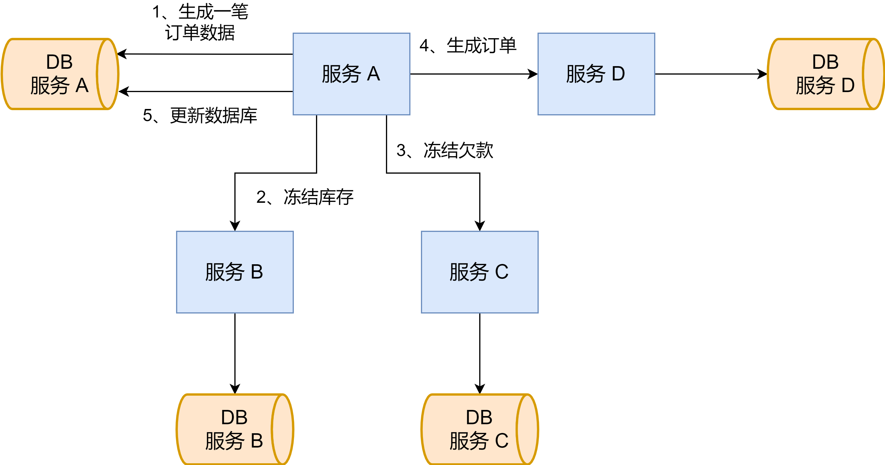
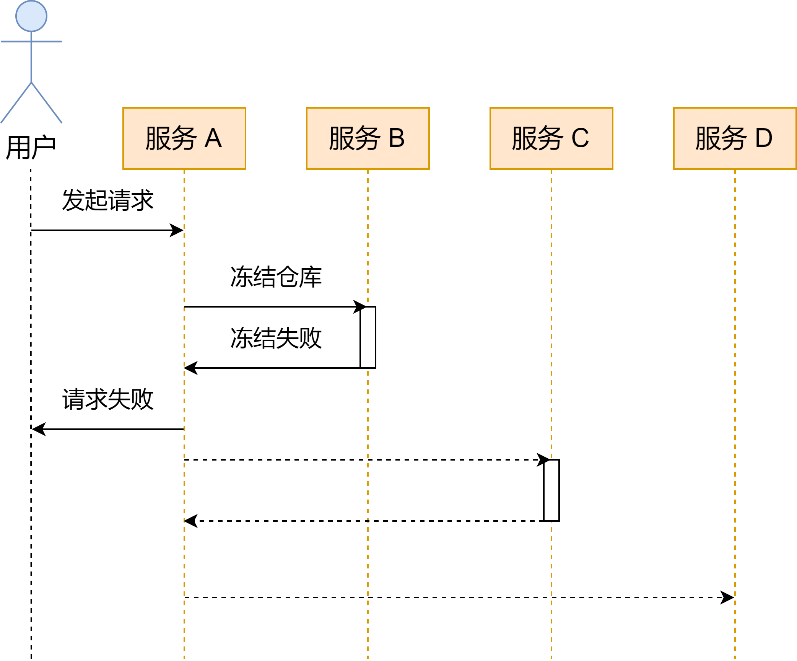
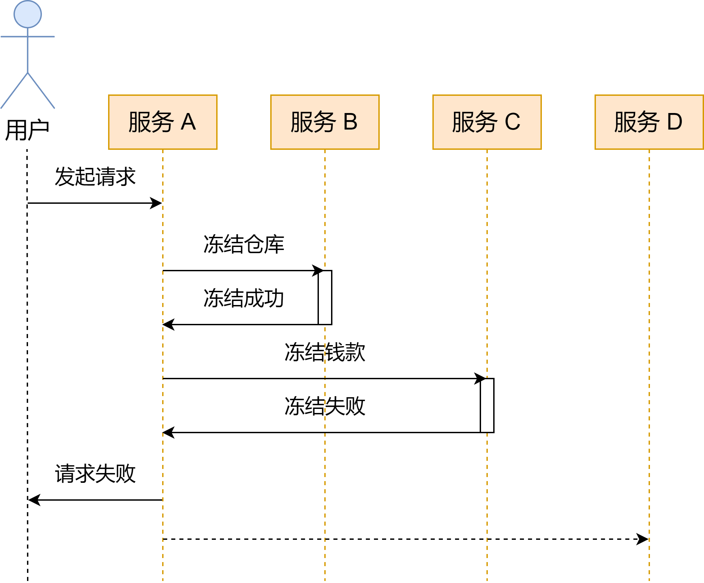
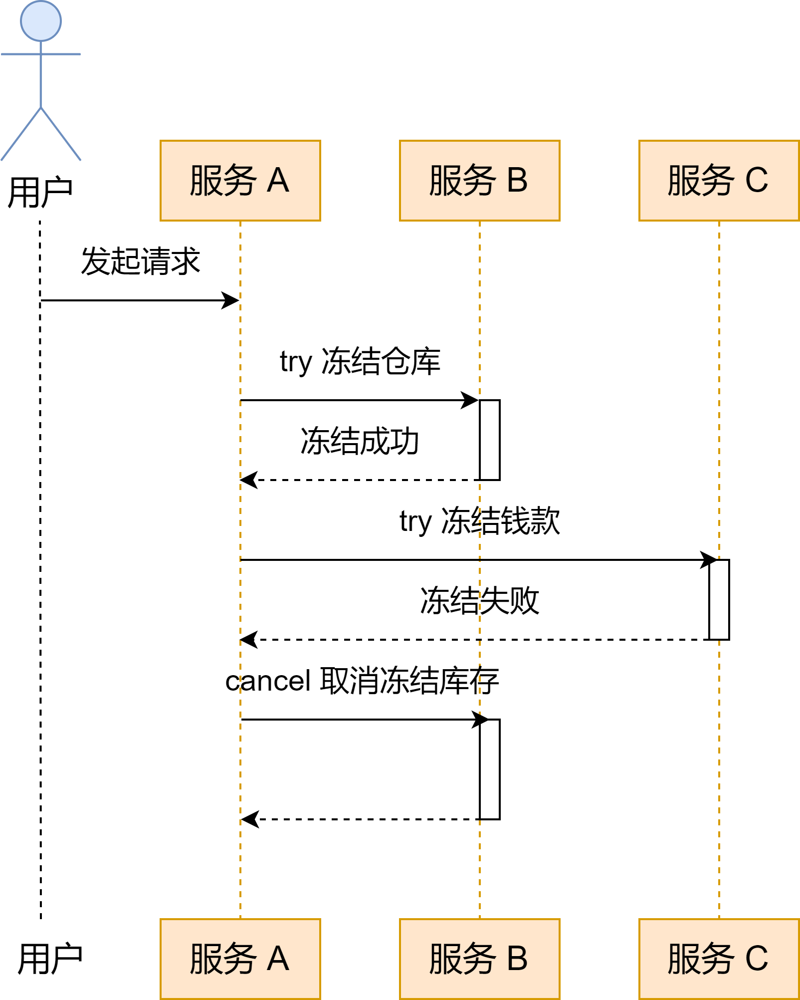
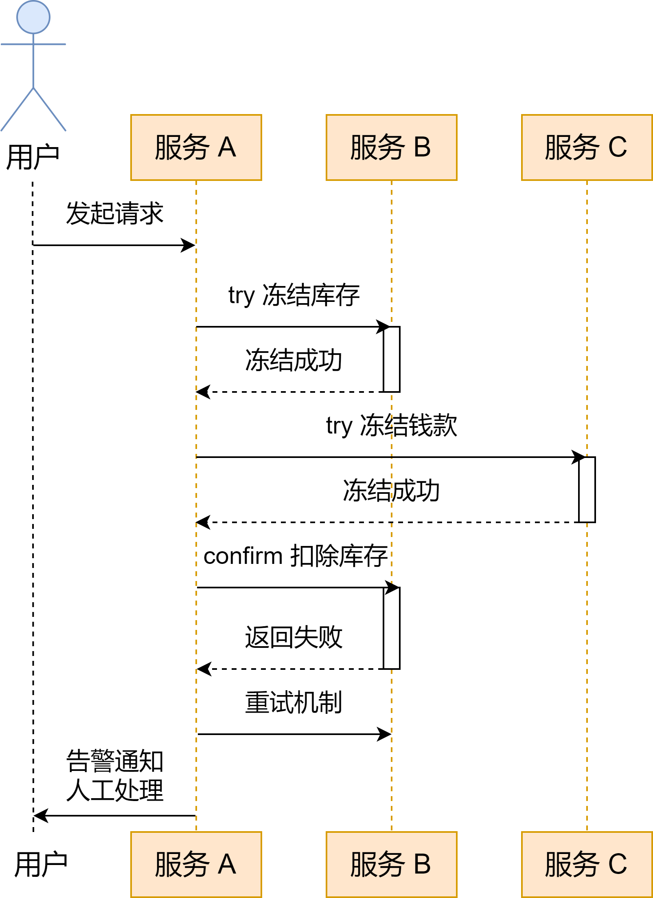
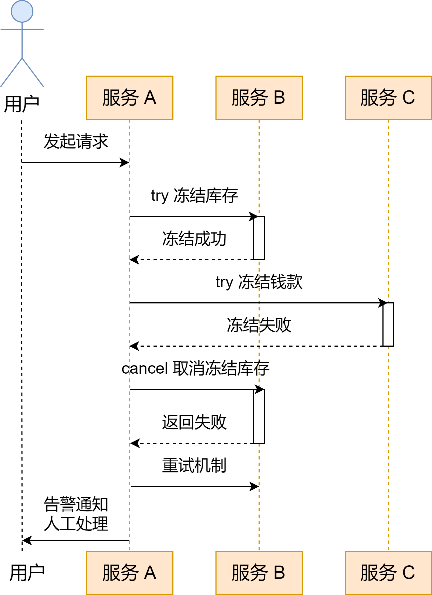
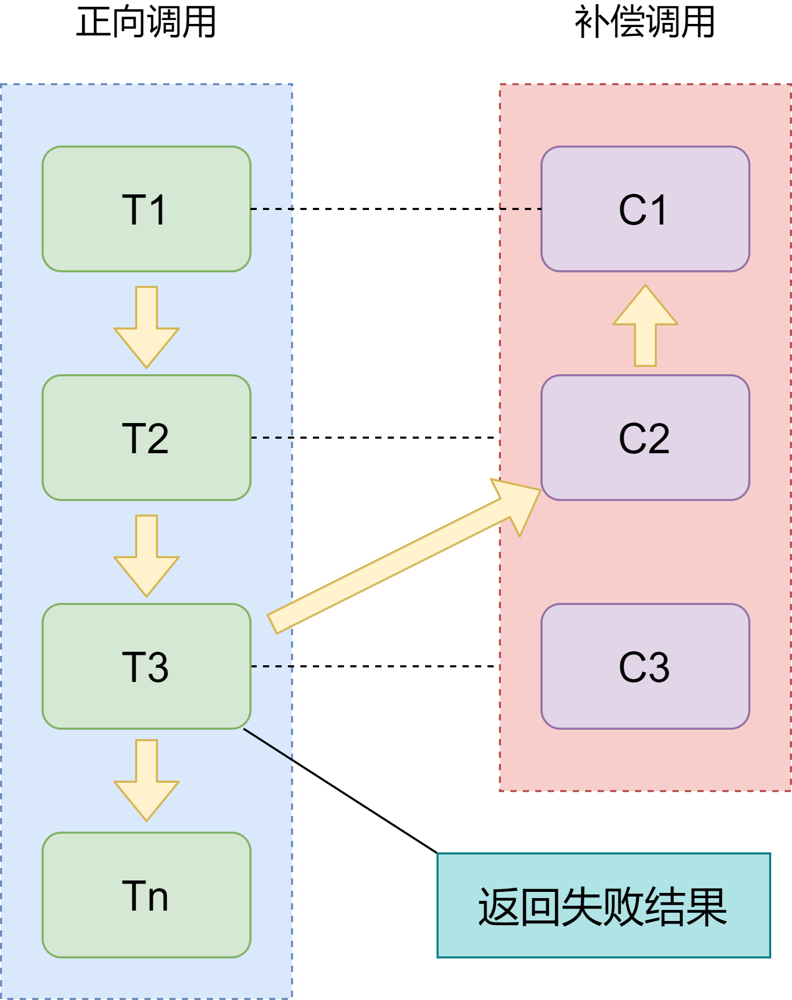

## 业务理解

简单描述下业务场景：有四个模块 A、B、C、D，其中 B、C、D 是下游服务，A 是上游服务调用方。从前端进来一个请求进入 A，A 需要对这一个请求进行记录落库，之后串行地调用 B、C 服务，并且异步地调用 D 服务，调用结束后再对数据库里这批请求进行更新操作

用电商场景来说就是以下几个步骤：

- 用户在订单平台操作下单

- 占库存

- 占钱款

- 生成一笔订单

如图所示：

## 分布式系统

上图是一个分布式应用的简单呈现，将电商的业务拆分成了多个服务。在分布式应用的场景中，往往会遇到**「网络通信异常」**、**「服务器节点异常」**甚至**「服务器宕机」**等场景。其实，在分布式应用中遇到的各种异常场景一定会比想的还要多，发生也更频繁

既然分布式应用需要考虑那么多的异常场景，为什么还要使用分布式的方式部署服务呢？以前，流量还没那么大的时候，一个网站靠单机是可以撑住的。但随着互联网业务的快速发展，我们开始追求网站的高可用、高性能、易扩展、伸缩性强且安全的系统。这也是分布式系统存在的意义

分布式系统有一下特点：

- **高可用**：在出现一台或多台服务器节点异常甚至宕机的情况下，系统仍然可用，采用分布式冗余部署多节点来保证高可用

- **高性能**：在单机的情况下一台机器的 CPU、内存等因素容易成为性能的瓶颈，在在分布式多机部署的情况下，通过拆分业务多机部署达到高性能

- **伸缩性强**：在访问量增大和存储需求提高的时候，一台或几台服务器就显得势单力薄，此时可以通过向服务器集群中添加服务器来应付

- **扩展性强**：需要将扩展性和伸缩性区分开来看待，伸缩性是基于底层硬件来说的，而扩展性则是针对业务来说的，也就是说便于新业务的扩展或者是业务的拆分。一般采用模块化，所以更便于扩展，也便于模块重用。业务被拆分，开发效率也会随之提升

另外，分布式需要重点考虑在服务调用「**成功、失败、超时异常**」三种场景下，如何保证「**数据一致性**」的问题

## 数据一致性

我们经常听到「**一致性**」这个名词。在使用数据库的时候提到的「**ACID**」里的 `C` 是一致性，分布式系统「**CAP 理论**」里面的 `C` 也是一致性，这两个有什么区别呢？

### ACID

`ACID` 指的是在数据库写入或更新时为了保证实物正确可靠而必须满足的四个特性，分别是「A（Atomicity 原子性）、C（Consistency 一致性）、I（Isolation 隔离性）、D（Durability 持久性）」。其它三个特性我们先不谈，这里的一致性指的是事务上的一致性。我理解的其它三个特性最终都是为了这个一致性而服务。这里的一致性指的是在事务发生的前后，系统从一个正确的状态，转移到另一个正确的状态

什么叫「**正确的状态**」呢？举个例子，A B 账号各有 100 元，A 向 B 转账 50 元，转账后的 A 的账户变成 了 50 元，B 账户变成了 150 元，这是正确的状态。如果此时 A 又向 B 转账了 100元，之后 A 的账户变成了 -50 元，B 的账户变成了 250 元，那么这就是错误的状态。在这个例子里，如果变成了错误的状态，事务是需要回滚的，这就是事务上的一致性。一般来说这个一致性可以是数据库做约束去保证，但更多时候业务逻辑更为复杂，需要代码层面去约束保证

### CAP

CAP 理论通常用于分布式系统中，CAP 分别指「**C（Consistency 一致性）、A（Availability 可用性）、P（Partition tolerance 分区容错性）**」，CAP 理论认为在分布式系统中这三个特性只能同时满足两个。而我们所说的数据一致性也是指的这个一致性，这个一致性和 ACID 中的事务一致性完全不是同一个东西，切记不要搞混了

- **一致性**：在分布式系统中所有的数据副本，在同一个时刻有同样的值

- **可用性**：在分布式系统的集群中某个或多个节点故障了，客户端的读写请求仍然会有响应

- **分区容错性**：当集群中的节点与节点之间无法通信时，或者系统在一定时限内无法达到数据一致性，就意味着产生了分区，而分区产生后仍然可用，即分区容错性

为什么只能同时满足两个？首先考虑要满足分区容忍性的情况下，就要做多个副本，但是一旦副本多起来，一致性就会收到影响，数据同步需要花更多时间，数据同步花的时间多了，就会对可用性造成影响，有可能有段时间无法使用，同时分区容错性由于达到一致性的时间变长了，则无法很好地满足。归纳起来就是：

- **满足 C / A 不满足 P**：即不要求分区，则节点受限，也就是放弃了系统的伸缩性，这跟分布式的特性是想违背的。通常采用这种方案的是传统的数据库，如 Oracle

- **满足 C / P 不满足 A**：则不要求可用性，要求一致性即所有副本的数据都要保持一致，而分区则有可能导致数据同步的时间大大地延长，这种场景下就牺牲了用户的体验，等数据全部一致了用户才可以用户。Zookeeper 就是采用了这种方式

- **满足 A / P 不满足 C**：则不要求一致性。一旦分区发生，又要保持可用，每个节点就会用本地缓存的数据来提供服务，这样用户就可能访问到过期的数据。服务发现组件 Eureka 就是采用了这种方式

前后的矛盾冲突导致无法同时满足三者，因此我们一般在实现中会采用一些折中的方案，这就要提到在一致性上根据实际需求而产生的集中不同的一致性：

- **强一致性**：系统中某个数据被更新了，那么后续对于该数据的读取都将得到更新后的值，也就是说所有副本上数据都要保持严格的一致，副本是同步更新的

- **弱一致性**：相对强一致性而言，数据更新后，对该数据的读取并不能保证总是读取到更新后的值，也就是副本的数据无法保持一致，副本是异步更新的

- **最终一致性**：属于一种特殊的弱一致性，系统中多有的副本在经过一个短暂的数据不一致后通过同步最终达到一致

在我们这次的业务场景中，上游服务 A 对于服务 B、C、D 的调用都要保证数据最终一致性。对于服务 B、C 是同步调用，在服务调用过程中如果失败则事务直接进行回滚；对于服务 D 异步调用可以容忍较长时间的数据不一致，在最终一致性之前引入「软状态（中间状态）」作为临时状态，当异步调用结果还没有返回时，可以设置一个「订单生成中」的状态

## 容错机制

对于跟钱打交道的业务，我们考虑的重点首先肯定是不能错（数据一致性），错了之后怎么解决或者系统如何自动处理是我们接下来考虑的（容错机制）

容错的话需要考虑多种场景，流程顺利的话自不必说，失败的话就要考虑实现自动回滚系统，而像因为网络或服务器节点原因而导致的超时则是需要特殊考虑的异常场景

### 业务成功场景

成功场景表示同步调用成功以及异步发起请求这个动作成功，这个时候会返回给用户表示请求成功。但是有一点需要注意的是异步请求后不代表订单就生成成功了，此时返回给用户的只是给用户一个响应而不至于流程阻塞。所以此时我们会进入软状态，也就是中间状态类似于「**订单生成中**」的状态来表示。订单生成有可能成功也有可能失败，如果订单生成失败则同样要做回滚的处理

### 业务场景失败 

#### 业务失败场景 1

#### 业务失败场景 2

#### 业务失败场景 3

这里展示了三种失败的场景，对于前两种，失败了就需要做回滚处理：

- 当调用服务 B 冻结库存失败则终止并回滚数据库

- 当调用服务 C 冻结钱款失败则终止并回滚服务 B 解除库存以及回滚数据库

对于第三种失败场景则多了几种选择：

- 可以同前两种一样直接做回滚的处理

- 可以选择提供给用户「**手动重试**」的机会，因为一般成功冻结仓库和冻结钱款后，这笔订单已经大概率下达成功了，异步发起请求失败是极小概率的事情，通过提供重试机制来提升用户的体验

- 可以将异步请求写入数据库扩展消息队列，另起一个线程去处理异步请求以及后续的操作，包括可以设定「**自动重试**」以及受到异步返回结果后成功和失败的处理。这样的好处在于可以很好地将代码解耦开，业务流程较为清晰

### 超时 / 异常处理

超时的原因多种多样，**网络抖动、服务器节点不通、服务器节点崩溃**，而且超时还有一个难点在于特别容易导致状态的不一致。当服务 A 调用服务 B 超时了，此时无法得知 B 是否有接收到请求，在这种情况下有两种解决方案：一种是要求 B 要实现「**幂等**」或者提供「**状态查询接口**」，服务 A 通过重试来处理超时情景；另外一种是采用「**强制回滚**」来处理超时，但是当这两种方法都再次超时的时候就不得不人工介入处理，此时则还需要预留好后续的提供给运维人员的人工处理手段

### 宕机处理

突然的停电、插头被人拔了或者有人恶意杀进程，一旦出现那么保存在内存中的状态和数据就全部没了。假如此时服务 A 已经成功调用服务 B 冻结库存成功了，还没有调用服务 C 就突然断电了，那么势必会造成各个服务上的数据不一致，库存都已经扣了，钱没有扣，订单也没有生成，这不就莫名多扣了库存吗。所以在调用服务前一定要将现场的数据保存下来，方便宕机重启后进行回滚状态

在宕机重启系统后，会启动一个线程去读取保存的现场数据，基于现场数据去做回滚，因此现场数据应该包含有几个信息：**被调用模块、传递参数、状态**。判断该数据是否已经用于回滚处理，如果已经进行回滚则为已处理，否则为待处理

## TCC

什么是 TCC 框架？TCC 其实是三个单词的首字母，分别是：`try`、`confirm`、`cancel`。try 就是尝试一下，confirm 就是确认，cancel 就是取消。例如你晚上约几个朋友去吃宵夜，然后就约了几个朋友预定了座位，这就是 try；朋友约到了座位预约到了，准时六点下班去吃饭，这就是 confirm；因为你要修 bug 不得不加班，或者朋友都在加班，或者没有预约到座位，那就没有宵夜了，这就是 cancel

让我们结合业务场景来讲一下

### 正常逻辑

#### 阶段一：try

在 `try` 阶段，「**调用方**」会分别调用多个「**被调用方**」，只有当多个被调用方都返回成功的时候，才会进行 `confirm`，否则就会进行 `cancel`。也就是说 try 阶段是一个预备类的操作，锁定某个资源、冻结部分数据，是在真正的扣除之前进行一个预占、冻结的动作

#### 阶段二：confirm

在该阶段，confirm 就是对 try 成功了之后的一个后续处理，将冻结、预占的数据进行真正的扣除（该业务场景是扣除，当然其他场景也可能是增加），这里就要考虑两种场景：

1. confirm 都成功了，那么对服务 B、C 的调用就此完成，在数据上服务也都是一致的
2. 个别或者全部的 confirm 失败了或者调用超时了，和 try 阶段不一样的是，这种场景不做 cancel 回滚处理，而是将所有的 confirm 进行重试。需要注意的是，被调用方一定要实现「**幂等机制**」，否则是无法进行重试的。另外，需要设定重试次数，如果重试还是失败或超时并且已经超过了重试次数，则必须告警通知人工进行处理

#### 阶段三：cancel

只有在 `try` 阶段失败或异常超时的情况下才会进行 `cancel` 处理，并且 cancel 处理并不是对所有的调用方进行 cancel，而是对已经 try 成功的被调用方进行 cancel 处理。另外，和 confirm 阶段一样，cancel 阶段也需要提供重试机制和重试超过一定次数的情况下告警通知人工处理

### 进一步思考

到这，基本就能知道 TCC 框架大概是怎么回事。在具体实现中，可以选用开源的 TCC 框架：ByteTCC、Himly、TCC - transaction、Seata 等等。或者自己手写，不过手写这么个框架内部的实现细节还是很复杂的，各个阶段的执行情况怎么感知，如何推动到下一步阶段，如何实现重试机制、告警系统、人工菌介入、宕机回滚等等都要考虑清楚

## Saga

Saga 框架，感觉是一个没有 `confirm` 的 TCC 框架，但这么说也不太准确，因为 Saga 的 try 不再是尝试一下，没有了预占和冻结数据，而是直接对数据进行了扣除 / 增加

Saga 理论来自 Hector & Kenneth 1987 发表的论文 Sagas，其中最主要的思想就是**补偿协议**：

**补偿协议**：在 Saga 模式下，分布式事务内有多个参与者，每个参与者都是正向补偿服务。上图中的 `T1 ~ Tn` 就是「**正向调用**」，`C1 ~ Cn` 是「**补偿调用**」，正向调用和补偿调用是一一对应的关系。假设有 n 个被调用方服务，`T1` 就是对服务方一的调用，`T2` 就是服务方二的调用，`T3` 就是服务方三的调用。如果这时候返回了失败，那么就需要进行回滚，此时就会调用 `T2` 的对应补偿 `C2`，调用 `T1` 的对应补偿 `C1`，使得分布式事务回到初始状态

### Saga 适用场景

- Saga 是一种「**长事务的解决方案**」，更适合于**业务流程长、业务流程多**的场景

- 如果服务参与者包含其他公司或遗留系统服务，此时无法提供 TCC 模式下的三个接口，那么就需要采用 Saga

- 典型的业务系统：金融机构对接系统（需要对接外部系统）、渠道整合（流程长）、分布式架构服务

- 银行金融机构使用更为广泛

Saga 模式的优势是：

- 一阶段提交本地数据库事务，无所，高性能；

- 参与者可以采用事务驱动异步执行，高吞吐

- 补偿服务即正向服务的「方向」，易于理解，易于实现

缺点：Saga 模式由于一阶段已经提交本地数据库事务，且没有进行「预留」动作，所以不能保证隔离性

## Saga 和 TCC 的异同

TCC 和 Saga 的不同之处，主要体现在应用场景上的不同

### 数据隔离性

回到我们的业务场景，服务 A 调用了服务 B、C，如果发生了以下的情况：

1. 对服务 B try 成功了，但是服务 C try 失败了
2. 此时有用户来读取服务 B 和服务 C 的数据
3. A、B、C 进行回滚

那么对于 TCC 和 Saga 来说，try 失败了都会进入 cancel阶段，但是刚好在还没有来得及进行 cancel 回滚处理的时候，有用户来读取 B、C 的数据。这种情况下 TCC 和 Saga 就会返回不一样的结果

对于 TCC 来说，try 只是一个冻结的操作，所以它操作的也只是一个**冻结字段**，这并不会影响用户查询的实际数据，所以是可以返回正确的结果的

对于 Saga 来说，try 则是对数据的一个直接操作，会更改用户想要访问的数据，那么这个时候就会返回给用户脏数据。会有脏读说明 Saga 框架下数据时有**隔离性**的问题的

对于 Saga 来说，隔离问题本质上是要**控制并发**，因此还是要回到业务上来，从业务逻辑层去实现并发控制。可以是在应用层枷锁的机制去处理，也可以是 Session 层面保证串行化，但这些多多少少对性能和吞吐量有所影响

### 两阶段与一阶段

从上面的叙述中，Saga 相对于TCC主要在隔离性上的缺失，究其原因，是因为 TCC 是两阶段提交事务而 Saga 是一阶段提交事务。

对于 TCC，**一阶段**会将资源进行预占，对资源进行锁定；**二阶段**才会使用资源或释放资源

对于 Saga，则是**一阶段**直接进行事务提交。相比 TCC 二阶段的提交事务，一阶段提交事务「**无锁**」，且可以采用「**事件驱动异步执行**」，适合**长流程**的业务，另外异步执行也意味着更高的**吞吐量**

但是一阶段提交导致 Saga 有隔离性问题，那么在 cancel（补偿）失败的时候，TCC 可以采用重试机制去处理，而 Saga 需要提供额外的人工介入处理

## 参考资料

[分布式事务实践——TCC、Saga入门级理解](https://weiyimu.vip/article?id=6857520180894351374)

[分布式事务 Seata Saga 模式首秀以及三种模式详解](https://www.sofastack.tech/blog/sofa-meetup-3-seata-retrospect/)

