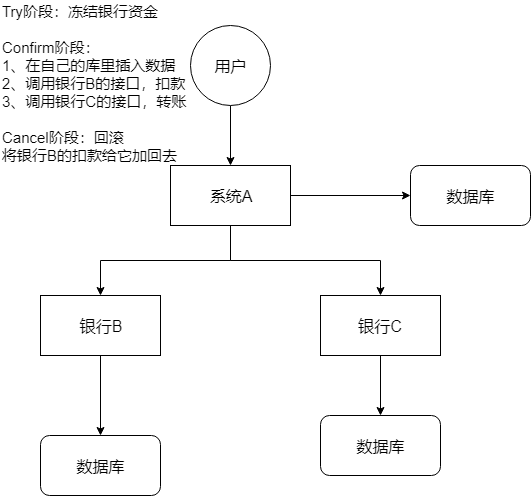
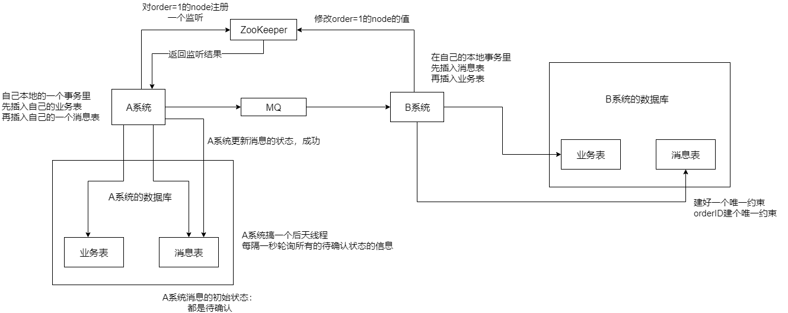
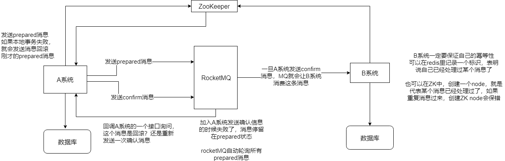

> 本节思维导图

目前分布式事务的实现方案主要有以下5种：

- XA方案
- TCC方案
- 本地消息表
- 可靠消息最终一致性方案
- 最大努力通知方案

## 两阶段提交方案/XA方案

​		所谓的XA方案，就是两阶段提交。有一个**事务管理器**的概念，负责协调多个数据库（资源管理器）的事务，事务管理器先询问各个数据库是否准备好了，如果数据库都准备好了，就正式提交事务，在各个数据库上执行。如果任何其中一个数据库回答不OK，那么就回滚事务。

​		这种分布式方案，比较适合单块应用里，跨多个库的分布式事务，而且因为严重依赖于数据库层面来搞定复制的事务，效率很低。绝对不适合高并发的场景。如果要实现，可以基于**Spring+JTA**就可以实现。

​		这个方案，一般很少用。一般来说某个系统内部如果出现跨多个库的操作，是不合规的。即便是现在的微服务，一个大的系统分成十几个甚至几百个服务。一般来说，都是要求每个服务只能操作自己对应的一个数据库。如果要操作别的服务对应的库，不允许直接连接，违反微服务架构的规范，你随便交叉胡乱访问，几百个服务的话，全体乱套，这样的一套服务是没法管理的，没法治理的，可能会出现数据被别人改错，自己的库被别人写挂等情况。

如果你要操作别人的服务的库，你必须是通过**调用别的服务的接口**来实现，绝对不允许交叉访问别人的数据库。

## TCC方案

​		tcc全称是：**try、confirm、cancel**

- Try阶段：这个阶段说的是对各个服务的资源做检测以及对资源进行**锁定或者预定**。
- Confirm：这个阶段说的是在各个服务中**执行实际的操作**。
- Cancel：如果任何一个服务的业务方法执行出错，那么这里就需要**进行补偿**，就是执行已经执行成功的业务逻辑的回滚操作。（把那些执行成功的回滚）。

​        这种方案也用的比较少，但是也有使用的场景。因为这个**事务回滚**实际上是严重**依赖于自己写的代码来回滚和补偿**的，会造成补偿代码巨大。一般来说跟**钱**相关的，跟钱打交道的，**支付、交易**相关的场景，会使用TCC，严格保证分布式事务要么全部成功，要么全部自动回滚，严格保证资金的正确性。而且最好是你的各个业务执行的时间都比较短。但是一般情况下尽量不要使用TCC方案，自己手写回滚逻辑或者是补偿代码，都是很恶心的，业务代码很难维护。

## 本地消息表

​		本地消息表的大概意思如下：

- A系统在自己本地一个事务里操作同时，插入一条数据到消息表；
- 接着A系统将这个消息发送到MQ中去；
- B系统接收到消息之后，在一个事务里，往自己本地消息表插入一条数据，同时执行其他的业务操作，如果这个消息已经被处理过，那么此时这个事务会回滚，这样**保证不会重复处理消息**；
- B系统执行成功之后，就会更新自己本地信息表的状态以及A系统信息表的状态；
- 如果B系统处理失败，那么久不会更新信息表状态，那么此时A系统会定时扫描自己的消息表，如果有未处理的消息，则会发送到MQ中去，让B再次处理；
- 这个方案保证了最终一致性，哪怕B事务失败了，但是A会不断重发信息一致到B那边成功为止。

这个方案最大的问题是就是**严重依赖于数据库的消息表来管理事务**，如果是高并发场景，很难扩展，所以一般比较少用。

## 可靠消息最终一致性方案

​		这个的意思，就是干脆不用本地消息表了，直接基于MQ来实现事务，比如阿里的RocketMQ就支持消息事务，大概的思路如下：

- A系统先发送一个prepared消息到mq，如果这个prepared消息发送失败那么就直接取消操作别执行了；
- 如果这个消息发送成功了，那么接着执行本地事务，如果成功就告诉MQ发送确认信息，如果失败就告诉mq回滚消息；
- 如果发送了确认消息，那么此时B系统会接收到确认信息，然后执行本地事务；
- MQ会自动定时轮询所有prepared消息回调你的接口，问你这个消息是不是本地事务处理失败了，所有没发送确认消息的信息，是继续重试还是回滚？一般来说这里你就可以查下数据库之前本地事务是否执行，如果回滚了，那么这里也回滚吧。这个就是避免可能本地事务执行成功了，而确认消息却发送失败了。
- 这个方案里，要是系统B的事务失败了，那就重试，自动不断地重试直到成功，如果实在不行，那就针对重要的资金业务进行回滚，比如B系统本地回滚后，想办法通知系统A也回滚，或者是发送警报由人工来手工回滚和补偿

​		这个方案还是比较合适的，目前国内的互联网公司大部分都是这样设计。你可以使用RocketMQ，也可以使用其他消息队列封装一套类似的逻辑出来。

## 最大努力通知方案

​		这个方案的大概思路就是：

- 系统A本地事务执行完之后，发送个消息到MQ；
- 这里会有个专门消费MQ的最大努力通知服务，这个服务会消费MQ然后写入数据中记录下来，或者是放入个内存队列里，接着调用系统B的接口；
- 要是系统B执行成功就OK了，要是系统B执行失败了，那么最大努力同时服务就定时尝试重新调用系统B，反复N次，最后还是不行就放弃。

## 总结

​		基本上，一些特别严格的场景，用的是TCC来保证强一致性，例如严格要求资金绝对不能错的场景；其他的一些场景基于阿里的RocketMQ来实现分布式事务，例如一般的分布式事务场景，订单插入之后要调用库存服务更新库存，库存数据没有资金那么敏感，可以用可靠消息最终一致性方案。