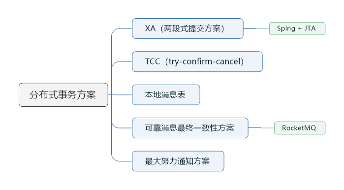
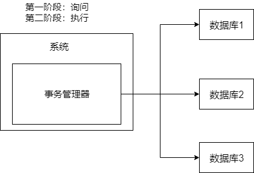

> 本节思维导图

目前分布式事务的实现方案主要有以下5种：

- XA方案
- TCC方案
- 本地消息表
- 可靠消息最终一致性方案
- 最大努力通知方案

## 两阶段提交方案/XA方案

​		所谓的XA方案，就是两阶段提交。有一个**事务管理器**的概念，负责协调多个数据库（资源管理器）的事务，事务管理器先询问各个数据库是否准备好了，如果数据库都准备好了，就正式提交事务，在各个数据库上执行。如果任何其中一个数据库回答不OK，那么就回滚事务。

​		这种分布式方案，比较适合单块应用里，跨多个库的分布式事务，而且因为严重依赖于数据库层面来搞定复制的事务，效率很低。绝对不适合高并发的场景。如果要实现，可以基于**Spring+JTA**就可以实现。

​		这个方案，一般很少用。一般来说某个系统内部如果出现跨多个库的操作，是不合规的。即便是现在的微服务，一个大的系统分成十几个甚至几百个服务。一般来说，都是要求每个服务只能操作自己对应的一个数据库。如果要操作别的服务对应的库，不允许直接连接，违反微服务架构的规范，你随便交叉胡乱访问，几百个服务的话，全体乱套，这样的一套服务是没法管理的，没法治理的，可能会出现数据被别人改错，自己的库被别人写挂等情况。

如果你要操作别人的服务的库，你必须是通过**调用别的服务的接口**来实现，绝对不允许交叉访问别人的数据库。

## TCC方案

​		tcc全称是：**try、confirm、cancel**

- Try阶段：这个阶段说的是对各个服务的资源做检测以及对资源进行**锁定或者预定**。
- Confirm：这个阶段说的是在各个服务中**执行实际的操作**。
- Cancel：如果任何一个服务的业务方法执行出错，那么这里就需要**进行补偿**，就是执行已经执行成功的业务逻辑的回滚操作。（把那些执行成功的回滚）。

​        这种方案也用的比较少，但是也有使用的场景。因为这个**事务回滚**实际上是严重**依赖于自己写的代码来回滚和补偿**的，会造成补偿代码巨大。一般来说跟**钱**相关的，跟钱打交道的，**支付、交易**相关的场景，会使用TCC，严格保证分布式事务要么全部成功，要么全部自动回滚，严格保证资金的正确性。而且最好是你的各个业务执行的时间都比较短。