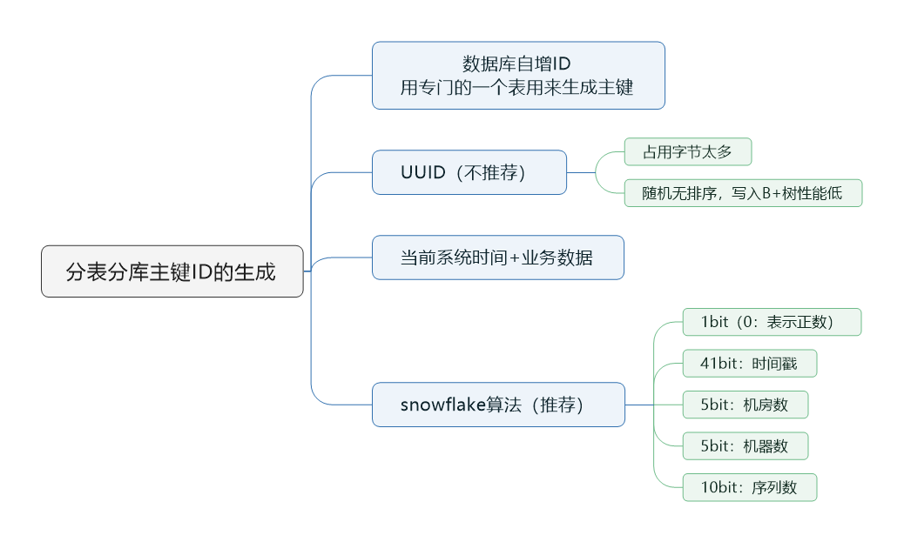
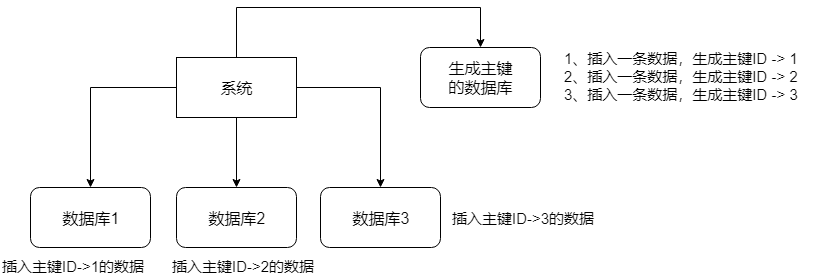

> 本节思维导图



​		分库分表后，主键ID的生成就成了一个问题，我们需要生成一个**全局唯一**的ID来支持。有以下方法来生成全局唯一的ID主键

## 数据库自增ID

​		这个就是说你的系统里每次得到一个ID，都是往一个库的一个表里插入一条没什么业务含义的数据，用于专门生成主键ID。然后获取到相应的ID后，就往对应的分库分表里去写入。



### 优缺点

​		这个方案的好处就是方便简单，**缺点就是单库生成自增ID**，要是高并发的话，就会有瓶颈；可以改进一下，就是专门开一个服务出来，这个服务每次就拿到当前ID最大值，然后自己递增几个ID，一次性返回一批ID，然后再把当前最大ID修改成递增几个ID之后的一个值，但是**无论如何都是基于单个数据库。**

### 适合场景

​		一般来说，分表分库就两个原因，要不就是单库并发太高，要不就是单库数据量太大。除非**你并发不高，但是数据量太大**导致的分库分表扩容，你就可以用这个方案，因为每秒最高并发最多也就几百，那么就走单独的一个库和表生成自增主键即可。

## UUID

​		好处就是本地生成，不用基于数据库来了；不好就是，UUID太长，占用空间太大，作为主键性能太差了；更重要的是，UUID不就有有序性，会导致B+数索引在写的时候有过多的随机写操作（连续的ID可以产生部分顺序写），还有，由于在写的时候不能产生有顺序的append操作，而需要进行insert操作，将会读取整个B+数节点到内存，在插入这条记录后再将这个节点写会磁盘，这种操作在记录占用空间比较大的情况下，性能下降明显。

### 适用场景

​		要是随机生成文件名、编号之类的，可以用UUID，但是作为主键是不能用UUID的。

## 获取系统当前时间

​		这个就是获取当前时间即可，但是**当并发很高时**，比如一秒并发几千，**会有重复的情况**，这个肯定是不合适的。

### 适用场景

​		一般如果用这个方案，就是将当前时间跟很多其他的业务字段拼接起来，作为一个ID。如果业务上就觉得可以接受，那么也是可以的。你可以将别的业务字段跟当前时间拼接起来，组成一个全局唯一的编号。

## snowflake算法

​		snowflake算法是Twitter开源的分布式ID生成算法，采用Scala语言实现，是把一个64位的long型的ID。其中一个bit的不用的，用其中的41bit作为毫米数，用10bit作为工作机器id，12bit作为序列号。

- 1bit：第一个bit统一都是0，因为我们生成的ID都是正数
- 41bit：表示的是时间戳，单位是毫秒。41bit可以表示的数字多达`2^41-1`，也就是可以标识`2^41-1`个毫秒值，换算成年就是表示69年的时间
- 10bit：记录工作机器ID，代表的是这个服务最多可以部署在2^10台机器上，也就是1024台机器。但是10bit里5个bit代表机房ID，5个bit代表机器ID。意思就是最多代表`2^5`个机房（32个机房），每个机房里可以代表30台机器。
- 12bit：这个是用来记录同一个毫秒内产生的不同ID，12bit可以代表的最大整数是`2^12=4096`，也就是说可以用这个12bit代表的数字来区分**同一个毫秒内**的4096个不同的ID。

```java
package com.leyou.utils;

import java.lang.management.ManagementFactory;
import java.net.InetAddress;
import java.net.NetworkInterface;

/**
 * <p>名称：IdWorker.java</p>
 * <p>描述：分布式自增长ID</p>
 * <pre>
 *     Twitter的 Snowflake　JAVA实现方案
 * </pre>
 * 核心代码为其IdWorker这个类实现，其原理结构如下，我分别用一个0表示一位，用—分割开部分的作用：
 * 1||0---0000000000 0000000000 0000000000 0000000000 0 --- 00000 ---00000 ---000000000000
 * 在上面的字符串中，第一位为未使用（实际上也可作为long的符号位），接下来的41位为毫秒级时间，
 * 然后5位datacenter标识位，5位机器ID（并不算标识符，实际是为线程标识），
 * 然后12位该毫秒内的当前毫秒内的计数，加起来刚好64位，为一个Long型。
 * 这样的好处是，整体上按照时间自增排序，并且整个分布式系统内不会产生ID碰撞（由datacenter和机器ID作区分），
 * 并且效率较高，经测试，snowflake每秒能够产生26万ID左右，完全满足需要。
 * <p>
 * 64位ID (42(毫秒)+5(机器ID)+5(业务编码)+12(重复累加))
 *
 * @author Polim
 */
public class IdWorker {
    /**
     *  时间起始标记点，作为基准，一般取系统的最近时间（一旦确定不能变动）
     */
    private final static long twepoch = 1288834974657L;
    /**
     *  机器标识位数
      */
    private final static long workerIdBits = 5L;
    /**
     * 数据中心标识位数
     */
    private final static long datacenterIdBits = 5L;
    /**
     * 机器ID最大值
     */
    private final static long maxWorkerId = -1L ^ (-1L << workerIdBits);
    /**
     * 数据中心ID最大值
     */
    private final static long maxDatacenterId = -1L ^ (-1L << datacenterIdBits);
    /**
     * 毫秒内自增位
     */
    private final static long sequenceBits = 12L;
    /**
     * 机器ID偏左移12位
     */
    private final static long workerIdShift = sequenceBits;
    /**
     * 数据中心ID左移17位
     */
    private final static long datacenterIdShift = sequenceBits + workerIdBits;
    /**
     * 时间毫秒左移22位
     */
    private final static long timestampLeftShift = sequenceBits + workerIdBits + datacenterIdBits;

    private final static long sequenceMask = -1L ^ (-1L << sequenceBits);
    /**
     * 上次生产id时间戳
     */
    private static long lastTimestamp = -1L;
    /**
     * 并发控制
     */
    private long sequence = 0L;

    private final long workerId;
    /**
     * 数据标识id部分
     */
    private final long datacenterId;

    public IdWorker(){
        this.datacenterId = getDatacenterId(maxDatacenterId);
        this.workerId = getMaxWorkerId(datacenterId, maxWorkerId);
    }
    /**
     * @param workerId
     *            工作机器ID
     * @param datacenterId
     *            序列号
     */
    public IdWorker(long workerId, long datacenterId) {
        if (workerId > maxWorkerId || workerId < 0) {
            throw new IllegalArgumentException(String.format("worker Id can't be greater than %d or less than 0", maxWorkerId));
        }
        if (datacenterId > maxDatacenterId || datacenterId < 0) {
            throw new IllegalArgumentException(String.format("datacenter Id can't be greater than %d or less than 0", maxDatacenterId));
        }
        this.workerId = workerId;
        this.datacenterId = datacenterId;
    }
    /**
     * 获取下一个ID
     *
     * @return
     */
    public synchronized long nextId() {
        long timestamp = timeGen();
        if (timestamp < lastTimestamp) {
            throw new RuntimeException(String.format("Clock moved backwards.  Refusing to generate id for %d milliseconds", lastTimestamp - timestamp));
        }

        if (lastTimestamp == timestamp) {
            // 当前毫秒内，则+1
            sequence = (sequence + 1) & sequenceMask;
            if (sequence == 0) {
                // 当前毫秒内计数满了，则等待下一秒
                timestamp = tilNextMillis(lastTimestamp);
            }
        } else {
            sequence = 0L;
        }
        lastTimestamp = timestamp;
        // ID偏移组合生成最终的ID，并返回ID
        long nextId = ((timestamp - twepoch) << timestampLeftShift)
                | (datacenterId << datacenterIdShift)
                | (workerId << workerIdShift) | sequence;

        return nextId;
    }

    private long tilNextMillis(final long lastTimestamp) {
        long timestamp = this.timeGen();
        while (timestamp <= lastTimestamp) {
            timestamp = this.timeGen();
        }
        return timestamp;
    }

    private long timeGen() {
        return System.currentTimeMillis();
    }

    /**
     * <p>
     * 获取 maxWorkerId
     * </p>
     */
    protected static long getMaxWorkerId(long datacenterId, long maxWorkerId) {
        StringBuffer mpid = new StringBuffer();
        mpid.append(datacenterId);
        String name = ManagementFactory.getRuntimeMXBean().getName();
        if (!name.isEmpty()) {
         /*
          * GET jvmPid
          */
            mpid.append(name.split("@")[0]);
        }
      /*
       * MAC + PID 的 hashcode 获取16个低位
       */
        return (mpid.toString().hashCode() & 0xffff) % (maxWorkerId + 1);
    }

    /**
     * <p>
     * 数据标识id部分
     * </p>
     */
    protected static long getDatacenterId(long maxDatacenterId) {
        long id = 0L;
        try {
            InetAddress ip = InetAddress.getLocalHost();
            NetworkInterface network = NetworkInterface.getByInetAddress(ip);
            if (network == null) {
                id = 1L;
            } else {
                byte[] mac = network.getHardwareAddress();
                id = ((0x000000FF & (long) mac[mac.length - 1])
                        | (0x0000FF00 & (((long) mac[mac.length - 2]) << 8))) >> 6;
                id = id % (maxDatacenterId + 1);
            }
        } catch (Exception e) {
            System.out.println(" getDatacenterId: " + e.getMessage());
        }
        return id;
    }


}
```

​		利用这个 snowflake 算法，你可以开发自己公司的服务，甚至对于机房 id 和机器 id，反正给你预留了 5 bit + 5 bit，你换成别的有业务含义的东西也可以的。

​		这个 snowflake 算法相对来说还是比较靠谱的，所以你要真是搞分布式 id 生成，如果是高并发啥的，那么用这个应该性能比较好，一般每秒几万并发的场景，也足够你用了。