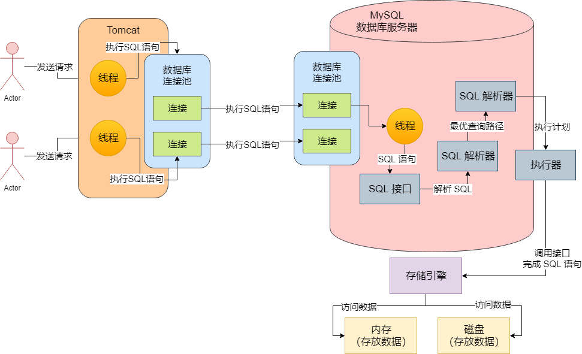
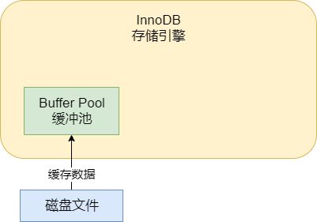
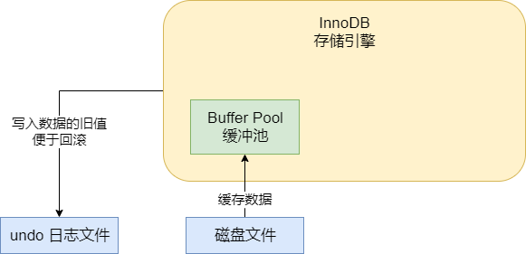
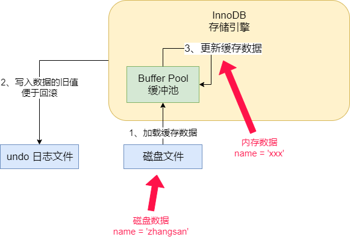
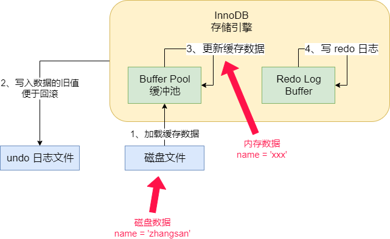
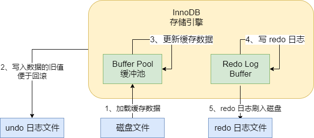
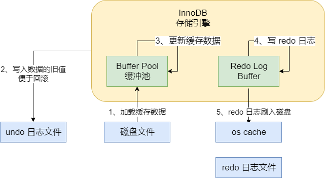

我们知道，MySQL 最常用的就是 InnoDB 存储引擎，那么我们今天借助一条更新语句的执行，来初步地了解一下 InnoDB 存储引擎的架构设计。


首先假设我们一条 SQL 语句：

```mysql
UPDATE users SET name = 'xxx' WHERE id = 10
```


首先我们的系统通过一个数据库连接发送到 MySQL 上，然后经过 SQL 接口、解析器、优化器、执行器几个环节，解析 SQL 语句，生成执行计划，接着由执行器去负责这个计划的执行，调用 InnoDB 存储引擎的接口去执行。所以如下图，大致会走下图的这个流程：



接下来我们看一下这个存储引擎里的架构设计，以及如何基于存储引擎完成一条更新语句的执行。

## InnoDB 的重要内存结构：缓冲池

InnoDB 存储引擎中有一个非常重要的放在内存里的组件，就是缓冲池（Buffer Pool），这里面会缓冲很多的数据，以便于以后在查询的时候，如果内存缓冲池里有数据，就可以不用去查磁盘了。



引擎执行更新语句的时候，比如对 "id = 10" 这一行数据，它其实会将 "id = 10" 这一行数据看看是否在缓冲池里，如果不在的话，那么会直接从磁盘里加载到缓冲池里来，而且接着会对这行记录加独占锁。因为在我们更新 "id = 10" 的这一行数据的时候，肯定是不允许别人同时更新的，所以必须要对这行记录加独占锁。

## undo 日志文件：让你更新的数据可以回滚

接着，假设 "id = 10" 这行数据的 name 原来是 "zhangsan"，现在我们要更新为 "xxx"，那么此时我们得先把要更新的原来的值 "zhangsan" 和 "id = 10" 这些信息，写入到 undo 日志文件中去。


如果之前有接触过数据库的话，我们应该知道，如果我们要执行一个更新语句，要是他是在一个事务里的话，那么事务提交之前我们都是可以对数据进行回滚的，也就是把你更新为 "xxx" 的值回滚到之前的 "zhangsan" 去。所以为了考虑到未来可能要回滚数据的需要，这里会把你更新前的值写入 undo 日志文件，如图：




## 更新 buffer pool 中的缓存数据

当我们把要更新的那行记录从磁盘文件加载到缓冲池，同时对它加锁之后，而且还要把更新前的旧值写入 undo 日志文件之后，就可以正式更新这行数据了。更新的时候，先更新缓冲池中的记录，此时这个数据就是脏数据了。这里所谓的更新内存缓冲池里的数据，意思就是把内存里的 "id = 10" 这行数据的 name 字段修改为 "xxx"。


那为什么说此时这行数据是脏数据呢？因为这个时候磁盘上 "id = 10" 这行数据的 name 字段还是 "zhangsan" ，但是内存里这行数据已经被修改了，所以就会叫它是脏数据。如图：



## Redo Log Buffer：万一系统宕机，如何避免数据丢失

接下来，按照上图的说明，现在已经把内存里的数据进行修改，但是磁盘上的数据还没修改。那么此时万一 MySQL 所在的机器宕机了，必然会导致内存里修改过的数据丢失，这怎么解决？这个时候，就必须把对内存所做的修改写入到一个 Redo Log Buffer 里去，这也是内存里的一个缓冲区，是用来存放 redo 日志的。


所谓的 redo 日志，就是记录下来你对数据做了什么修改，比如对 "id = 10" 这行数据修改了 name 字段的值为 "xxx"，这就是一个日志。



这个 redo 日志是用来在 MySQL 突然宕机的时候，用来恢复你更新过的数据的。

## 如果还没提交事务，MySQL 宕机了怎么办

一般情况下，在数据库中，哪怕执行一条 SQL 语句，其实也可以是一个独立的事务，只有当你提交事务之后，SQL 语句才算执行结束。所以到目前为止，其实还没有提交事务，那么此时如果 MySQL 崩溃，必然导致内存里 Buffer Pool 中的修改过的数据丢失，同时你写入 Redo Log Buffer 中的 redo 日志也会丢失。


那么此时数据丢失要紧吗？其实不要紧，因为你一条更新语句，没提交事务，就代表它没执行成功，此时 MySQL 宕机虽然导致内存里的数据都丢失了，但是磁盘上的数据依然还停留在原样子。也就是说，"id = 1" 的那行数据的 name 字段的值还是老的值 "zhangsan"，所以此时你的这个事务就是执行失败了，没能成功完成更新，你会收到一个数据库的异常。然后当 mysql 重启之后，你会发现你的数据没有任何变化。


所以此时如果 MySQL 宕机，不会有任何问题。

## 提交事务的时候将 redo 日志写入磁盘中

接着我们要提交一个事务了，此时就会根据一定的策略把 redo 日志从 redo log buffer 里刷入到磁盘文件里去。此时这个策略是通过 `innodb_flush_log_at_trx_commit` 来配置的，它又几个选项：


当这个参数的值为0时，你提交事务的时候，不会把 redo log buffer 里的数据刷入磁盘文件，此时可能你都提交事务了，结果 MySQL 宕机了，然后此时内存里的数据全部丢失。相当于你提交事务成功了，但是由于 MySQL 突然宕机了，导致内存中的数据和 redo 日志都丢失了。

当这个参数的值为1时，你提交事务的时候，就必须把 redo log 从内存刷入到磁盘文件里去，只要事务提交成功，那么 redo log 就必然在磁盘里了。



那么只要提交事务成功之后，redo 日志一定在磁盘文件里，此时你肯定会有一条 redo 日志说“我此时对哪个数据做了哪些修改，比如 name 字段 修改为了 xxx 了”。


然后哪怕此时 buffer pool 中更新过的数据还没刷新到磁盘里去，此时内存里的数据是已经更新过的 "name = xxx"，然后磁盘上的数据是还没更新的 "name = zhangsan"。然后此时 MySQL 系统突然崩溃了，此时会丢失数据吗？答案是不会，因为虽然内存里的修改成 name = xxx 的数据会丢失，但是 redo 日志里已经说了，对某某数据做了修改 name=xxx，所以此时 MySQL 重启之后，它可以根据 redo 日志去恢复之前做过的修改。


最后来看看，如果 `innodb_flush_log_at_trx_commit` 的值是 2，那么提交事务的时候，把redo 日志写入磁盘文件对应的 os cache 缓存里去，而不是直接进入磁盘文件，可能 1 秒后才会把 os cache 里的数据写入到磁盘文件里去。


这种模式下，你提交事务之后，redo log 可能仅仅停留在 os cache 内存缓存里，没实际进入磁盘文件，万一此时你要是机器宕机了，那么 os cache 里的 redo log 就会丢失，同样会让你感觉提交事务了，结果数据丢失了。

