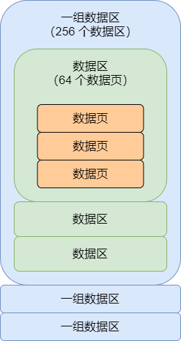
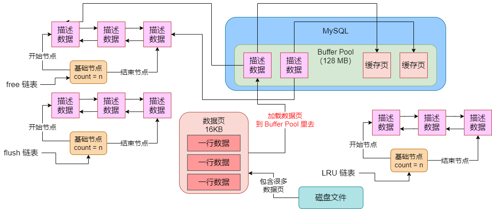

我们都清楚，最终 MySQL 的数据都是放在磁盘文件里的，那么数据在磁盘文件是怎么存放的呢？我们知道我们平时数据都是插入一个一个的表中的，而表是个逻辑概念，其实在物理层面，它对应的是**表空间**这个概念。


所以其实在 MySQL 的磁盘上，表空间就对应着磁盘文件，在磁盘文件里就存放着数据。那么在这个表空间的磁盘文件里，数据是如何组织的？


这个就非常复杂了。假如让你把数据一行一行地写入一个磁盘文件，当然很简单。但你现在要存储的是数据库里如此复杂的数据，它里面有各种字段类型的，还有索引这个概念。所以其实在磁盘文件里存放的数据，它从最基本的角度来看，就是被拆分为一个一个数据区（extent）分组，每个 extent 组中包含了 256 个 extent，然后每个 extent 里包含了 64 个数据页。然后每个数据页里都包含了一行一行的数据。如图：




听到这里，是不是觉得很简单？其实不是的，在实际存储的时候，在数据行里有很多附加的信息，在数据页、数据区里，都有很多附加的特殊信息。各种各样的特殊信息，就可以让我们在简简单单的磁盘文件里实现 B+ 树索引、事务之类的非常复杂的机制。


那么问题来了，我们都知道，当我们在数据库中执行 CRUD 的时候，你必须先把磁盘文件里的一个数据页加载到内存的 Buffer Pool 的一个缓存页里去，然后当我们增删改查都是针对缓存页里的数据来执行的。所以假设此时我们要插入一条数据，那么是选择磁盘文件里的哪个数据页加载到缓存里去呢？


大家注意，这里要划重点。其实这个时候会看你往哪个表里插入数据，然后肯定得根据表找到一个表空间。找打表空间之后，就可以定位到对应的磁盘文件。有了磁盘文件之后，就可以从里面找一个 extent 组，找到一个 extent，接着从里面找一个数据页出来。这个数据页有可能是空的，也可能已经放入一些数据行了。然后就可以把这个数据页从磁盘里完整加载出来，放入 Buffer Pool 的缓存页里了。如图：




那么，这个从磁盘文件里读取一个数据页，是怎么读取的？其实很简单，磁盘里的文件的数据都是紧挨在一起的，类似于下面的那种样子：

```
0xdfs3439399abc0sfsdkslf9sdfpsfds0xdfs3439399abcOsfsdksIf9sdfpsfds
0xdfs3439399abc0sfsdkslf9sdfpsfds0xdfs3439399abc0sfsdkslf9sdfpsfds
```


其实上述字符完全无任何意义，就是为了演示随便搞出来的一段东西而已，但是大致来说磁盘里存放的数据看起来就是那样的，可能先是有一个 extent 组开始的一些东西，然后里面是一个一个的 extent，每个 extent 开始的时候回些一些特殊的信息，然后再是一个一个的数据页，里面是一个一个的数据行。


那么在读取一个数据页的时候，你就可以通过随机读写的方式来了。举个例子，我们下面有一个伪代码，就是设置一下要从一个数据文件的哪个位置开始读取，一直到哪个位置就结束。

```java
dataFile.setStartPosition(25347)
dataFile.setEndPosition(28890)
dataPage = dataFile.read()
```


通过上面伪代码那种方式，你指定磁盘文件里的开始截止位置，就能读取出来指定位置的一段数据，比如读取出来一大坨东西：`psfds0xdfs343939`。也许这坨东西就是一个数据页包含的内容了。然后把数据页放到内存的缓存页里即可。


接着 CRUD 操作都可以直接针对缓存页去执行了，会自动把更新的缓存页加入 flush 链表，然后更新它在 LRU 链表里的位置，包括更新过的缓存页会从 free 链表里拿出来，等等，后续一系列操作，都是之前我们分析过的。


此时对于那些被更新过的缓存页来说，都会有后台线程刷入磁盘的，那么刷磁盘的时候怎么刷呢？看看下面的一段伪代码：

```java
dataFile.setStartPosition(25347)
dataFile.setEndPosition(28890)
dataFile.write(cachePage)
```


因为一个数据页的大小其实是固定的，所以一个数据页固定就是可能在一个磁盘文件里占据了某个开始位置到结束位置的一段数据，此时你写回去的时候也是一样，选择好固定的一段位置的数据，直接把缓存页的数据写回去，就覆盖了原来的那个数据页了，就如上面的伪代码示意


今天通过一篇总结文章，让大家初步了解到的存储模型是如何跟 Buffer Pool 缓存机制配合起来实现 CRUD 的。