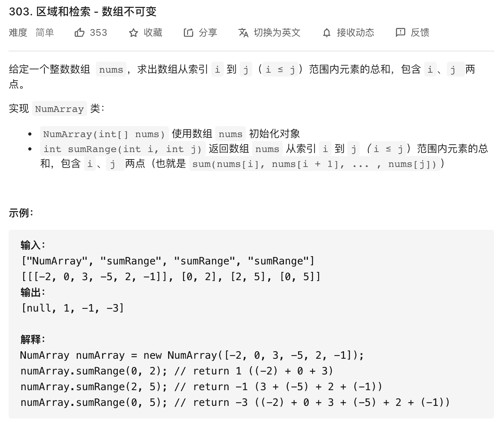
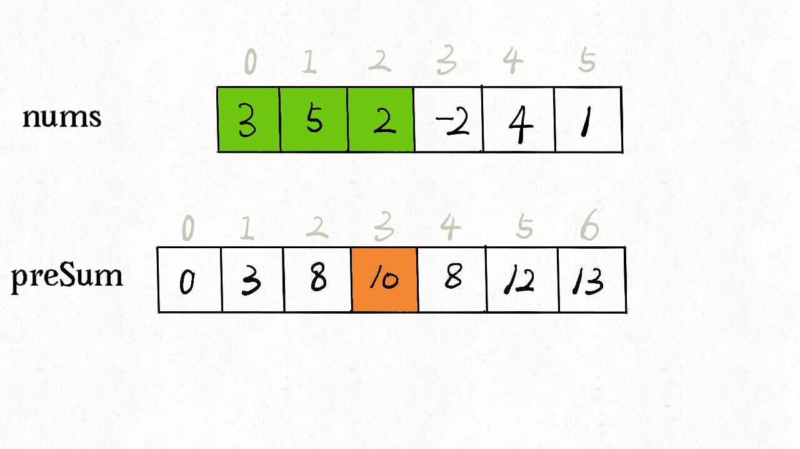

**前缀和技巧适用于快速计算一个索引区间内的元素之和**


这道题 [303.区域和检索 - 数组不可变](https://leetcode-cn.com/problems/range-sum-query-immutable/) 就是前缀和的基本使用场景：





题目要求你实现这样一个类：


```java
class NumArray {

    public NumArray(int[] nums) {

    }
    
    public int sumRange(int left, int right) {

    }
}
```


`sumRange` 函数需要计算并返回一个索引区间之内的元素和，没学过前缀和的人可能写出如下代码：


```java
class NumArray {

    private int[] nums;

    public NumArray(int[] nums) {
        this.nums = nums;
    }
    
    public int sumRange(int left, int right) {
        int res = 0;
        for (int i = left; i <= right; i++) {
            res += nums[i];
        }
        return res;
    }
}
```


这样可以达到效果，但是效率很差，因为 `sumRange` 的时间负责度是 `O(N)`，其中 `N` 代表 `nums` 数组的长度


这道题的最优解法是使用**前缀和技巧**，将 `sumRange` 函数的时间复杂度降为 `O(1)`


## 前缀和技巧


如何运用前缀和技巧？我们说要将 `sumRange` 函数的时间复杂度降为 `O(1)`，说白了就是不要在 `sumRange` 里面用 for 循环，如何实现？直接看代码，如下：


```java
class NumArray {

    // 前缀和数组
    private int[] preSum;

    /* 输入一个数组，构造前缀和 */
    public NumArray(int[] nums) {
        preSum = new int[nums.length + 1];
        // 计算 nums 的累加和
        for (int i = 1; i < preSum.length; i++) {
            preSum[i] = preSum[i - 1] + nums[i - 1];
        }
    }
    
    /* 查询闭区间 [left, right] 的累加和 */
    public int sumRange(int left, int right) {
        return preSum[right + 1] - preSum[left];
    }
}
```


核心思路是 new 一个新的数组 `preSum` 出来，`preSum[i]` 记录 `nums[0...i-1]` 的累加和，如下图：10 = 5 + 3 + 2





看到这个 `preSum` 数组，如果我想求索引区间 `[1, 4]` 内的所有元素之和，就可以通过 `preSum[5] - preSum[1]` 得出。这样，`sumRange` 函数仅仅需要做一次减法运算，避免了每次进行 for 循环调用，最坏时间复杂度为常数 `O(1)`


这个技巧用在 生活中运用也挺广泛的，比如说，你们班上有若干个同学，每个同学有一个期末考试的成绩（满分 100 分），那么请实现一个 API，输入任意一个分数段，返回有多少同学的成绩在这个分数内


那么，你可以先通过技术排序的方式计算每个分数具体有多少个同学，然后利用前缀和技巧来实现分数查询的 API：


```java
int[] scores; // 存储着所有同学的分数
// 试卷满分 100 分
int[] count = new int[100 + 1]
// 记录每个分数有几个同学
for (int score : scores)
    count[score]++
// 构造前缀和
for (int i = 1; i < count.length; i++)
    count[i] = count[i] + count[i-1];

// 利用 count 这个前缀和数组进行分数段查询
```


## 相关题目


[560. 和为 K 的子数组](https://leetcode-cn.com/problems/subarray-sum-equals-k/)


[304. 二维区域和检索 - 矩阵不可变](https://leetcode-cn.com/problems/range-sum-query-2d-immutable/)


304 这道题，题目给的是一个二维数组 `matrix`，那么你可以构造一个二维的前缀和数组 `preSum`，然后 `preSum[i][j]` 就记录 `matrix[0..i][0..j]` 的和


题目让你算 `(x1, y1, x2, y2)` 这个的矩形的和，相当于图中红色矩形之和减去绿色矩形减去蓝色矩形最后加上黄色矩形的和，而红绿蓝黄这几个矩形的和都是在你的 `preSum` 里面记录着的。


## 参考资料


公众号 ：labuladong