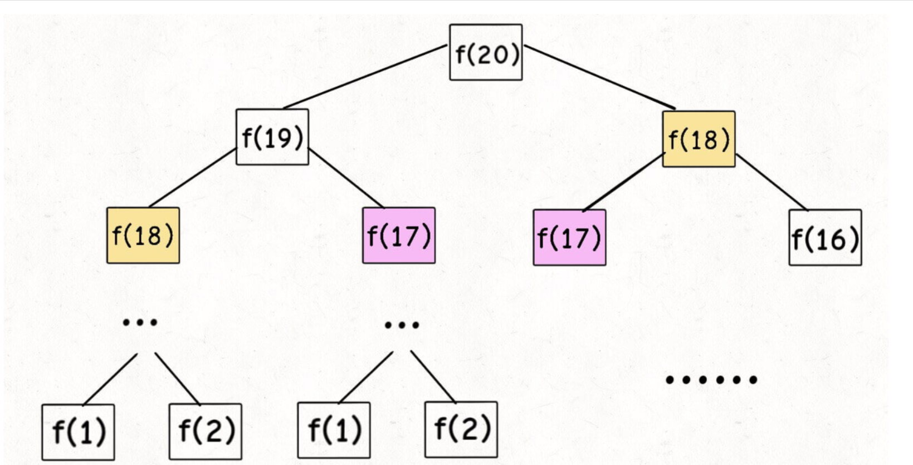
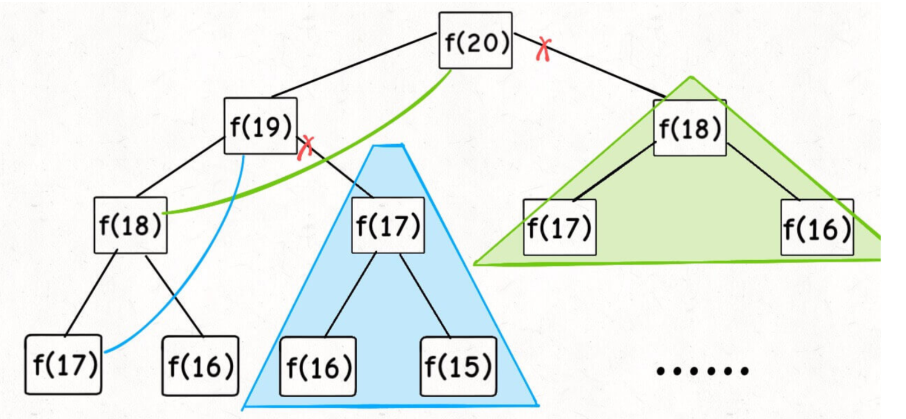
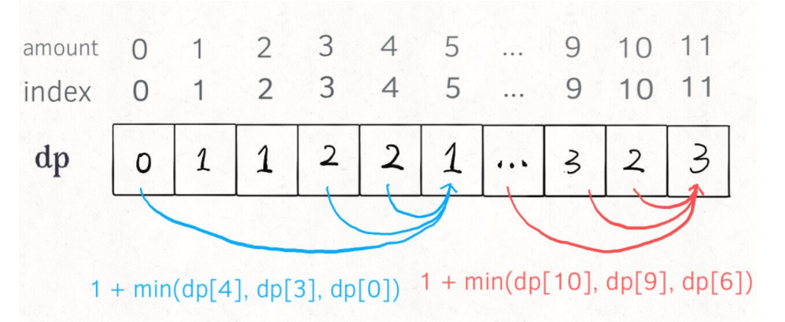

**动态规划问题一般形式就是求最值**。既然要求最值，核心问题是什么？**求解动态规划的核心问题就是穷举**。因为要求最值吗，肯定要把所有可行的答案穷举出来，然后在其中找最值


但是，动态规划的穷举有点特别，因为这类问题**存在「重叠子问题」**，如果暴力穷举的话效率会很低，所以需要「备忘录」来优化穷举过程，避免不必要的计算。而且，动态规划问题一定会**具备「最优子结构」**，才能通过子问题的最值得到原问题的最值


另外，虽然动态规划的核心思想是穷举求最值，但是问题可以千变万化，穷举所有可行解并不是一件容易的事，只有列出**正确的「状态转移方程」**才能正确地穷举


以上提到的重叠子问题，最优子结构、状态转移方程就是动态规划三要素。具体什么意思待会会举例详解，但是在实际的算法问题中，写出状态转移方程式最困难的。我们用一个思维框架，辅助你思考状态转移方程：


**明确 base case -> 明确「状态」-> 明确「选择」-> 定义 dp 数组 / 函数的含义**


按上面的套路走，最后的结果就可以套这个框架：


```java
// 初始化 base case
dp[0][0][...] = base

// 进行状态转移
for(状态 1 : 状态 1 的所有取值) {
	for(状态 2 : 状态 2 的所有取值) {
		for ... {
			dp[状态 1][状态 2][...] = 求最值(选择 1, 选择 2 ...)
		}
	}
}
```


下面通过斐波那契数列问题和凑零钱问题来详解动态规划的基本原理


## 斐波那契数列

### 暴力递归

斐波那契数列的数学形式就是递归的，写成代码如下所示：


```java
int fib(int N) {
	if(N == 1 || N == 2) {
		return 1;
	}
	return fib(N - 1) + fib(N - 2);
}
```


这样写代码虽然简洁易懂，但是十分低效。假设 N = 20，画出的递归树如下：





怎么理解这棵递归树？就是说想要计算原问题 `f(20)`，我们就要先计算出子问题 `f(19)` 和 `f(18)`，然后要计算 `f(19)`，就要先算出子问题 `f(18)` 和 `f(17)`，以此类推。最后遇到 `f(1)` 或 `f(2)` 的时候，结果已知，就能直接返回结果，递归树不再向下生长了


**递归算法的时间复杂度怎么计算？就是用子问题个数乘以解决一个子问题需要的时间**


首先计算子问题的个数，即递归树种节点的总数。显然二叉树节点总数为指数级别，所以子问题个数为 O(2^n)。然后计算解决一个子问题的时间。在本算法中，没有循环，只有 `f(n - 1) + f(n - 2)` 一个加法操作，时间为 O(1)。所以这个算法的时间复杂度为二者相乘，即 O(2^n)


观察递归树，可以发现算法低效的原因：存在大量重复计算，比如 `f(18)` 被计算了两次，而且以 `f(18)` 为根的递归树体量巨大，多算一遍，会耗费巨大的时间。更何况，还不止 `f(18)` 这一个节点被重复计算，所以这个算法很低效


这就是动态规划问题的第一个性质：**重叠子问题**。


### 带备忘录的递归解法

既然耗时的原因是重复计算，那么我们可以造一个「备忘录」，每次算出某个子问题的答案后别急着返回，先记到「备忘录」里再返回；每次遇到一个子问题先去「备忘录」里查一查，如果发现之前已经解决过这个问题了，直接把答案拿出来用，不用再耗时去计算了


一般使用一个数组充当这个「备忘录」，当然也可以使用哈希表，思想都是一样的


```java
public int fib(int n) {
    Map<Integer, Integer> memo = new HashMap<>(n);
    return helper(memo, n);
}

public int helper(Map<Integer, Integer> memo, int n) {
    if (n == 0 || n == 1) {
        return n;
    }
    if (memo.get(n) != null) {
        return memo.get(n);
    }

    int res = helper(memo, n - 1) + helper(memo, n - 2);
    memo.put(n, res);
    return res;
}
```


画出递归树，看一下「备忘录」做了什么





实际上，带「备忘录」的递归算法，把一棵存在巨量冗余的递归树通过「剪枝」，改造成了一幅不存在冗余的递归图，极大减少了子问题（即递归图中节点）的个数


上面说过递归问题的复杂度计算，就是用子问题个数乘以解决一个子问题需要的时间。而子问题个数，即图中节点的总数，由于本算法不存在冗余计算，子问题就是 `f(1), f(2), f(3) ... f(20)`，数量和输入规模 n = 20 成正比，所以子问题个数为 O(n)


解决一个子问题的时间，同上，没有循环，时间为 O(1)。所以本算法时间复杂度为 O(n)，比起暴力算法，是降维打击


### dp 数组的迭代解法

有了上一步「备忘录」的启发，我们可以把这个「备忘录」独立出来成为一张表，就叫做 DP table 吧，在这张表完成「自底向上」的推算


```java
public int fib(int n) {
    int[] dp = new int[n + 1];
    dp[1] = dp[2] = 1;
    for(int i = 3; i <= n; i++) {
        dp[i] = dp[i - 1] + dp[i - 2];
    }
    return dp[n];
}
```


从上图可以知道，这个 DP table 很像之前那个「剪枝」后的结果，只是反过来算而已。实际上，带备忘录的递归解法中的「备忘录」，最终完成后就是这个 DP table，所以这两种解法是差不多的，大部分情况下，效率也基本相同


这里，引出「状态转移方程」这个名词，实际上就是描述问题结构的数学形式


为啥叫「状态转移方程」？你把 `f(n)` 想做一个状态 `n`，这个状态 `n` 是由状态 `n - 1` 和状态 `n - 2` 相加转移而来，这就叫状态转移


你会发现，上面的几种解法中的所有操作，例如 `return f(n - 1) + f(n - 2)`，`dp[i] = dp[i - 1] + dp[i - 2]`，以及对备忘录或 DP table 的初始化操作，都是围绕这个方程式的不同表现形式。可见列出「状态转移方程」的重要性，它是解决问题的核心。而且，其实状态转移方程直接代表着暴力解法


**不要看不起暴力解，动态规划问题最困难的就是写出这个暴力解，即状态转移方程。**只要写出暴力解，优化方法无非是用备忘录或者 DP table，再无奥妙可言


这个例子的最后，将一个细节优化。细心的读者会发现，根据斐波那契数列的状态转移方程，当前状态只和之前的两个状态有关，并不需要那么长的一个 DP table 来存储所有的状态，只要想办法存储之前的两个状态即可。所以，可以进一步优化，把空间复杂度降为 O(1)：


```java
public int fib(int n) {
    if (n == 2 || n == 1) {
        return 1;
    }
    int sum = 0;
    int prev = 1, curr = 1;
    for(int i = 3; i <= n; i++) {
        sum = prev + curr;
        prev = curr;
        curr = sum;
    }
    return sum;
}
```


这个技巧就是所谓的「状态压缩」，如果我们发现每次转移状态只需要 DP table 中的一部分，那么可以尝试用状态压缩来缩小 DP table 的大小，只记录必要的数据。上述例子就相当于把 DP table 的大小从 n 缩小到 2。


## 凑零钱问题

先看下题目：给你 k 种面值的硬币，面值分别为 `c1, c2 ... ck`，每种硬币的数量无限，再给一个总金额 `amount`，问你**最少**需要几枚硬币凑出这个金额，如果不可能凑出，返回 -1。对应的 LeetCode 链接为 [零钱兑换](https://leetcode-cn.com/problems/coin-change/)


你觉得计算机该如何解决这个问题？显然，就是把所有可能的凑硬币方法都穷举出来，然后找找看最少需要多少枚硬币


### 暴力递归

首先，这个问题是动态规划问题，因为它具有「最优子结构」。**要符合「最优子结构」，子问题间必须互相独立。**


比如说，你考试，没门科目的成绩都是互相独立的。你的原问题是考出最高的总成绩，那么你的子问题就是要把语文考到最高，数学考到最高 ...... 为了每门课考到最高，你要把每门课相应的选择题分数拿到最高，填空题分数拿到最高。当然，最终就是你每门课都是满分，这就是最高的总成绩


得到了正确的结果：最高的总成绩就是总分。因为这个过程符合最优子结构，「没门科目考到最高」这些子问题是互相独立，互不干扰的


但是，如果加一个条件：你的语文成绩和数学成绩会互相制约，数学分数高，语文分数就会降低，反之亦然。这样，你能考到的最高成绩就达不到总分了，按刚才的思路就会得到错误的结果。因为子问题并不独立，语文数学成绩无法同时最优，所以最优子结构被破坏


回到凑零钱问题，为什么它符合最优子结构？比如你想求 `amount = 11` 时的最少硬币数，如果你知道凑出 `amout = 10` 的最少硬币数（子问题），你只需要把子问题的答案加一（再选一枚面值为 1 的硬币）就是原问题的答案。因为硬币的数量是没有限制的，所以子问题之间没有相互制约，是互相独立的


那么，既然知道了这是个动态规划问题，就要思考**如何列出正确的状态转移方程**


1. **确定 base case**，这个很简单。显然目标金额 `amount` 为 0 时算法返回 0，因为不需要任何硬币就已经凑出目标金额了

2. **确定「状态」**，也就是原问题和子问题中会变化的变量。由于硬币数量无限，硬币的面额也是题目中给定的，只有目标金额会不断地向 base case 靠近，所以唯一的「状态」就是目标金额 amount

3. **确定「选择」**，也就是导致「状态」产生变化的行为。目标金额为什么变化呢？因为你在选择硬币，你每选择一枚硬币，就相当于减少目标金额。所以说所有硬币的面值，就是你的「选择」

4. **明确 `dp` 函数 / 数组的定义**。我们这里讲的是自顶向下的解法，所以会有一个递归的 dp 函数，一般来说函数的参数就是状态转移中会变化的量，也就是上面说到的「状态」；函数的返回值就是题目要求我们计算的量。就本题来说，状态只有一个，即「目标金额」，题目要求我们计算凑出目标金额所需的最少硬币数量。

   

所以我们可以这样定义 `dp` 函数：


`dp(n)` 的定义：输入一个目标金额 n，返回凑出目标金额 n 的最少硬币数量


接着我们看代码实现


```java
public int coinChange(int[] coins, int amount) {
	// base case
    if (amount == 0) {
        return 0;
    }
    if (amount < 0) {
        return -1;
    }
    // 求最小值，所以初始化为正无穷
    int res = Integer.MAX_VALUE;
    // 做选择，选择需要硬币最少的那个结果
    for(int coin : coins) {
        int subProblem = coinChange(coins, amount - coin);
        // 子问题无解，跳过
        if(subProblem  == -1) {
            continue;
        }
        res = Math.min(res, 1 + subProblem);
    }

    return res == Integer.MAX_VALUE ? -1 : res;
}
```


至此，状态转移方程其实已经完成了，以上算法已经是暴力破解法了，以上代码的数学形式就是状态代码方程：


至此，这个问题就解决了，只不过需要消除一下重叠子问题，比如 `amount = 11, coins = {1, 2, 5}` 时画出递归树如下：


子问题总数为递归树节点个数，这个比较难看出来，是 `O(n^k)`，总之是指数级别的。每个子问题中含有一个 for 循环，复杂度为 O(k)，所以总时间复杂度为 O(k * n^k)，指数级别


### 带备忘录的递归

类似斐波那契数列，只需要稍加修改，就可以通过备忘录消除子问题


```java
Map<Integer, Integer> map = new HashMap<>();

public int coinChange(int[] coins, int amount) {

    // base case
    if (amount == 0) {
        return 0;
    }
    if (amount < 0) {
        return -1;
    }
    // 查备忘录，避免重复计算
    if(map.get(amount) != null) {
        return map.get(amount);
    }
    
    // 求最小值，所以初始朱为正无穷
    int res = Integer.MAX_VALUE;
    for(int coin : coins) {
        int subProblem = coinChange(coins, amount - coin);
        // 子问题无解，跳过
        if(subProblem  == -1) {
            continue;
        }
        res = Math.min(res, 1 + subProblem);
    }

    res = res == Integer.MAX_VALUE ? -1 : res;
    map.put(amount, res);
    return res;
}
```


很显然，「备忘录」大大减小了子问题数目，完全消除子问题的冗余，所以子问题总数不会超过金额数 n，即子问题数目为 O(n)。处理一个子问题的时间不变，仍是 O(k)，所以总的时间复杂度是 O(kn)


### dp 数组的迭代解法

我们也可以自底向上使用 dp table 来消除重叠子问题，关于「状态」「选择」和 base case 与之前没有区别，dp 数组的定义和刚才 dp 函数类似，就是把「状态」，也就是目标金额作为变量。不过，dp 函数体现在函数参数，而 dp 数组体现在数组索引：


**dp 数组的定义：当目标金额为 `i` 时，至少需要 dp[i] 枚硬币凑出**


根据开头给出的动态规划代码框架可以写出如下解法：


```java
public int coinChange(int[] coins, int amount) {
	// 数组大小为 amount + 1，初始值为 amount + 1
    int[] dp = new int[amount + 1];
    for(int i = 0; i < dp.length; i++) {
        dp[i] = amount + 1;
    }

	// base case
    dp[0] = 0;

	// 外层 for 循环在遍历所有状态的取值
    for(int i = 0; i < dp.length; i++) {
    	// 内层 for 循环在求所有选择的最小值
        for(int coin : coins) {
        	// 子问题无解，跳过
            if(i - coin < 0) {
                continue;
            }
            dp[i] = Math.min(dp[i], 1 + dp[i - coin]);
        }
    }

    return (dp[amount] == amount + 1) ? -1 : dp[amount];
        
}
```





## 总结

斐波那契数列的问题，解释了如何通过「备忘录」或者「dp table」的方法来优化递归树，并且明确了这两种方法本质上是一样的，只是自顶向下和自底向上的区别而已


凑零钱问题，展示了如何流程化确定「状态转移方程」，只要通过状态转移方程写出暴力递归解，剩下的就是优化递归树，消除重叠子问题而已


**计算机解决问题其实没有任何奇技淫巧，它唯一的解决办法就是穷举**，穷举所有可能性。算法设计无非就是先思考“如何穷举”，然后再追求“如何聪明地穷举”。

列出动态转移方程，就是在解决“如何穷举”的问题。之所以说它难，一是因为很多穷举需要递归实现，二是因为有的问题本身的解空间复杂，不那么容易穷举完整。

备忘录、DP table 就是在追求“如何聪明地穷举”。用空间换时间的思路，是降低时间复杂度的不二法门，除此之外，试问，还能玩出啥花活？


## 参考资料

[动态规划解题套路框架](https://labuladong.gitbook.io/algo/dong-tai-gui-hua-xi-lie/1.1-dong-tai-gui-hua-ji-ben-ji-qiao/dong-tai-gui-hua-xiang-jie-jin-jie)