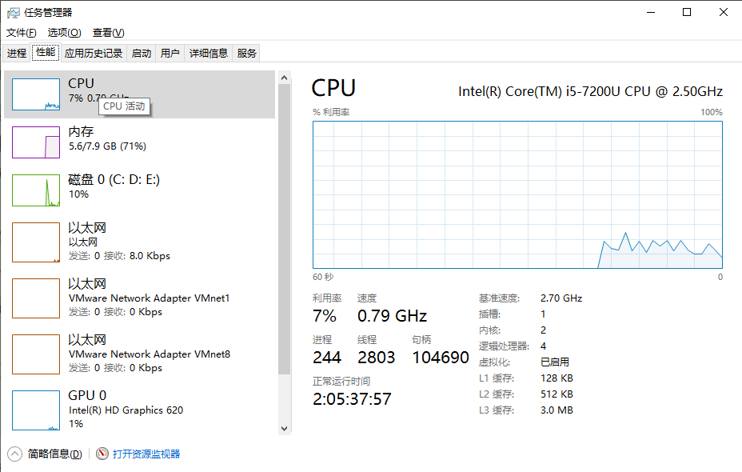

## 单例模式的动机

​		对于一个系统的某些类而言，无须创建多个实例。举个例子--Windows任务管理器、在正常情况下，无论启动任务管理器多少次，Windows系统始终只能弹出一个任务管理器窗口。也就是说，在一个Windows系统中，任务管理器存在唯一性。这样设计有两个原因：第一，如果能弹出多个窗口，且这些窗口的内容完全一致，全部是重复对象，这势必会浪费系统资源（任务管理器需要获取系统运行时的诸多信息，这些信息的获取需要消耗一定的系统资源，包括CPU资源及内存资源等），而且根本没有必要显示多个内容完全相同的接口；第二，如果弹出的多个窗口不一致，问题就更加严重了，这意味着在某一瞬间系统资源使用情况和进程。服务等信息存在多个状态，例如任务管理器窗口A显示“CPU使用率”为10%，窗口B显示“CPU使用率”为15%，到底哪个才是正确的？这会给用户带来误解，更不可取。由此可见，确保Windows任务管理器在系统中有且仅有一个非常重要。



​		在实际开发中也经常遇到类似的情况，为了节约系统资源，有时需要确保系统中某个类只有唯一一个实例，当这个唯一实例创建成功之后，无法再创建一个同类型的其他对象，所有的操作都只能基于这个唯一实例。为了确保对象的唯一性，可以通过单例模式来实现，这就是单例模式的动机所在。

## 单例模式概述

​		下面来模拟实现Windows任务管理器。假设任务管理器的类名为TaskManager，在TaskManager类中包含了大量的成员方法，例如构造函数TaskManager()，显示进程的方法displayProcesses()，显示服务的方法displayServices()等，该类的示意代码如下：

```java
class TaskManager{
	// 初始化窗口
	public TaskManager() {
		...
	}
	
	// 显示进程
	public void displayProcesses() {
		...
	}
	
	// 显示服务
	public void displayServices() {
		...
	}
	
	...
}
```

​		为了实现Windows任务管理器的唯一性，通过以下3步对TaskManager类进行重构：


