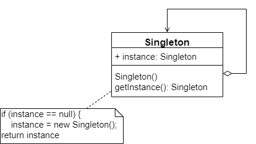
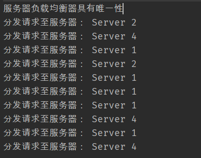

## 单例模式的动机

对于一个系统的某些类而言，无须创建多个实例。举个例子-- Windows 任务管理器、在正常情况下，无论启动任务管理器多少次，Windows 系统始终只能弹出一个任务管理器窗口。也就是说，在一个Windows 系统中，任务管理器存在唯一性。这样设计有两个原因：第一，如果能弹出多个窗口，且这些窗口的内容完全一致，全部是重复对象，这势必会浪费系统资源（任务管理器需要获取系统运行时的诸多信息，这些信息的获取需要消耗一定的系统资源，包括 CPU 资源及内存资源等），而且根本没有必要显示多个内容完全相同的接口；第二，如果弹出的多个窗口不一致，问题就更加严重了，这意味着在某一瞬间系统资源使用情况和进程。服务等信息存在多个状态，例如任务管理器窗口 A 显示“CPU 使用率”为 10%，窗口B显示“CPU 使用率”为 15%，到底哪个才是正确的？这会给用户带来误解，更不可取。由此可见，确保 Windows 任务管理器在系统中有且仅有一个非常重要。


在实际开发中也经常遇到类似的情况，为了节约系统资源，有时需要确保系统中某个类只有唯一一个实例，当这个唯一实例创建成功之后，无法再创建一个同类型的其他对象，所有的操作都只能基于这个唯一实例。为了确保对象的唯一性，可以通过单例模式来实现，这就是单例模式的动机所在。

## 单例模式概述

下面来模拟实现 Windows 任务管理器。假设任务管理器的类名为 TaskManager，在 TaskManager 类中包含了大量的成员方法，例如构造函数 TaskManager()，显示进程的方法 displayProcesses()，显示服务的方法 displayServices()等，该类的示意代码如下：

```java
class TaskManager{
	// 初始化窗口
	public TaskManager() {
		...
	}
	
	// 显示进程
	public void displayProcesses() {
		...
	}
	
	// 显示服务
	public void displayServices() {
		...
	}
	
	...
}
```

为了实现 Windows 任务管理器的唯一性，通过以下3步对TaskManager类进行重构：


（1）由于每次使用 new 关键字来实例化 TaskManager 类时都将产生一个新对象，为了确保 TaskManager 实例的唯一性，需要禁止类的外部直接引用使用 new 来创建对象，因此需要将 TaskManager 的构造函数的可见性改为 private，如下

```java
private TaskManager() { ... }
```

（2）将构造函数的可见性改为 private 后，虽然类的外部不能在使用 new 来创建对象，但是在 TaskManager 的内部还是可以创建对象的，可见性只对类外有效。因此，可以在 TaskManager 中创建并保存这个唯一实例。为了让外界可以访问这个唯一实例，需要在 TaskManager 中定义一个静态的 TaskManager 类型的私有变量，代码如下：

```java
private static TaskManager tm = null;
```

（3）为了保证成员变量的封装性，将 TaskManager 类型的 tm 对象的可见性设置为 private，但外界该如何使用该成员变量并何时实例化该成员变量呢？答案是增加一个工友的静态方法，如下：

```java
public static TaskManager getInstance() {
	if (tm == null) {
		tm = new TaskManager();		// 自行实例化
	}
	return tm;
}
```

在 getInstance() 方法中首选判断 tm 对象是否存在，如果不存在，则使用 new 关键字创建一个新的 TaskManager 类型的 tm 对象，再返回新创建的 tm 对象；否则直接返回已有的 tm 对象。需要注意的是 getInstance() 方法的修饰符。


首先它应该是一个 public 方法，以便外界其他对象使用；其次它使用了 static 关键字，即它是一个静态方法，在类外可以直接通过类名来访问，而无须创建 TaskManager 对象。事实上，在类外也无法创建 TaskManager 对象，因为构造函数是私有的。最终整合的代码如下：

```java
class TaskManager {
	private static TaskManager tm = null;
	private TaskManager() { ... }	// 初始化窗口
	public void displayProcesses() { ... }	// 显示进程
	public void displayServices() { ... }	// 显示服务
	
	public static TaskManager getInstance() {
		if(tm === null) {
			tm = new TaskManager();
		}
		return tm;
	}
}
```

上述代码是单例模式的一种最典型实现方式，有了以上基础，理解单例模式的定义和结构就非常容易了。单例模式定义如下：


> 单例模式：确保某一个类只有一个实例，而且自行实例化并向这个系统提供这个实例，这个类称为单例类，它提供全局访问的方法。单例模式是一种对象性创建模式。


单例模式有 3 个要点：（1）某个类只有有一个实例；（2）它必须自行创建这个实例；（3）它必须自行向整个系统提供这个实例。单例模式的结构图如图所示：



## 负载均衡器的设计

Sunny 软件公司承接了一个服务器负载均衡（Load Balance）软件的开发工作，该软件运行在一台负载均衡服务器上，可以将并发访问和数据流量分发到服务器集群中的多台设备上进行并发处理，提高系统的整体处理能力。由于集群汇总的服务器需要动态删减，且客户端请求需要统一分发，因此需要确保负载均衡器的唯一性，即只能有一个负载均衡器来负责服务器的管理和请求的分发，否则会带来服务器状态的不一致以及请求分配冲突等问题。


Sunny 公司开发人员通过分析和权衡，决定使用单例模式来设计该负载均衡器。将负载均衡器 `LoadBalancer` 设计为单例类，其中包含一个存储服务器信息的集合 serverList，每次在 serverList 中随机选择一台服务器来相应客户端的请求，实现代码如下：

```java
/**
 * 负载均衡器 LoadBalancer:单例类，真实环境该类非常复杂，包括大量初始化的工作和
 * 业务方法，考虑到代码的可读性和易理解性，只列出部分与模式相关的核心代码
 */
public class LoadBalancer {

    // 私有静态成员变量，存储唯一实例
    private static LoadBalancer instance = null;

    // 服务器集合
    private List serverList = null;

    private LoadBalancer() {
        serverList = new ArrayList();
    }

    public static LoadBalancer getLoadBalancer() {
        if (instance == null) {
            instance = new LoadBalancer();
        }
        return instance;
    }

    /**
     * 增加服务器
     * @param server
     */
    public void addServer(String server) {
        serverList.add(server);
    }

    /**
     * 删除服务器
     * @param server
     */
    public void removeServer(String server) {
        serverList.remove(server);
    }

    /**
     * 使用 Random 类随机获取服务器
     * @return
     */
    public String getServer() {
        Random random = new Random();
        int i = random.nextInt(serverList.size());
        return (String) serverList.get(i);
    }
}
```

```java
public class Client {

    public static void main(String[] args) {
        // 创建 4 个 LoadBalancer 对象
        LoadBalancer balancer1, balancer2, balancer3, balancer4;

        balancer1 = LoadBalancer.getLoadBalancer();
        balancer2 = LoadBalancer.getLoadBalancer();
        balancer3 = LoadBalancer.getLoadBalancer();
        balancer4 = LoadBalancer.getLoadBalancer();

        // 判断服务器复制均衡器是否相同
        if (balancer1 == balancer2 && balancer2 == balancer3 && balancer3 == balancer4) {
            System.out.println("服务器负载均衡器具有唯一性");
        }

        // 增加服务器
        balancer1.addServer("Server 1");
        balancer1.addServer("Server 2");
        balancer1.addServer("Server 3");
        balancer1.addServer("Server 4");

        // 模拟客户端请求的分发
        for(int i = 0; i < 10; i++) {
            String server = balancer1.getServer();
            System.out.println("分发请求至服务器： " + server);
        }
    }
}
```

编译并运行程序，输出结果如下：



虽然创建了 4 个 LoadBalancer 对象，但是它们实际上是同一个对象，因此，通过使用单例模式可以确保 LoadBalancer 对象的唯一性。

## 饿汉式单例与懒汉式单例的讨论

Sunny 公司开发人员使用了单例模式实现了负载均衡器的设计，但是在实际使用中出现了一个非常严重的问题，当负载均衡器在启动过程中用户再次启动负载均衡器时，系统无任何异常，但当客户端提交请求时出现请求分发失败，通过仔细分析发现原来系统中还是存在多个负载均衡器对象导致分发时目标服务器不一致，从而产生冲突。为什么会这样？


现在对负载均衡器的实现代码进行再次分析，当第一次调用 `getLoadBalancer()` 方法创建并启动负载均衡器时， instance 对象为 null 值，因此系统将执行代码 `instance = new LoadBalancer()`，在此过程中，由于要对 LoadBalancer 进行大量初始化工作，需要一段时间来创建 LoadBalancer 对象。而在此时，如果再一次调用 getLoadBalancer() 方法（通常发生在多线程环境中），由于 instance 尚未创建成功，仍为 null 值，判断条件 `instance == null` 为真值，因此代码 `instance = new LoadBalancer()` 将再次执行，导致最终创建了多个 instance 对象，这违背了单例模式的初衷，也导致系统发生运行错误。


如何解决该问题？至少有两种解决方案，在此之前，先介绍一下单例类的两种不同实现方式---饿汉式单例类和懒汉式单例类

### 饿汉式单例类

饿汉式单例类是实现起来最容易的单例类，其代码如下：

```java
class EagerSingleton {
	private static final EagerSingleton instance = new EagerSingleton();
	private EagerSingleton() {}
	
	public static EagerSingleton getInstance() {
		return instance;
	}
}
```

当类被加载时，静态变量 instance 会被初始化，此时类的私有构造函数会被调用，单例类的唯一实例将被创建。如果使用饿汉式单例类实现负责均衡器 LoadBalancer 类的设计，则不会创建出多个单例对象的情况，可确保单例对象的唯一性。

### 懒汉式单例类与线程锁定

除了饿汉式单例，还有一种经典的懒汉式单例，就是前面的负载均衡器 LoadBalancer 类的实现方式。由之前的代码可以看出，懒汉式单例在第一次调用 getInstance() 方法时实例化，在类加载时并不自行实例化，这种技术又称为**延迟加载技术**，即需要的时候再加载实例，为了避免多个线程同时调用 getInstance() 方法，可以使用关键字 `synchronized`，代码如下：

```java
class LazySingleton {
	private static LazySingleton instance = null;
	
	private LazySingleton() {}
	
	synchronized public static LazySingleton getInstance() {
		if (instance == null) {
			instance = new LazySingleton();
		}
		return instance;
	}
}
```

该懒汉式单例类在 getInstance() 方法面前增加了关键字 `synchronized` 进行线程锁定，以处理多个线程同时访问的问题。上述代码虽然解决了线程安全问题，但是每次调用 getInstance() 时都需要进行线程锁定判断，在多线程高并发访问环境中，将会导致系统性能大大降低。继续对懒汉式单例进行改进，事实上，无须对整个 getInstance() 方法进行锁定，只需锁定代码 `instance = new LazySingleton()` 即可。如下：

```java
public static LazySingleton getInstance() {
	if (instance == null) {
		synchronized (LazySingleton.class) {
			instance = new LazySingleton();
		}
	}
	return instance;
}
```

其实这样子也没有解决问题。原因如下：如果某一瞬间线程 A 和线程 B 都在调用 getInstance() 方法，此时 instance 对象为 null 值，均能通过 `instance == null` 的判断，由于实现了 synchronized 加锁机制，线程 A进入synchronized 锁定的代码中执行实例创建代码。但当 A 执行完毕时，线程 B并不知道实例已经创建，将继续创建新的实例，导致产生多个单例对象，因此需要进一步改进，在synchronized 锁定代码中再进行一次 `instance == null` 判断，这种方式称为**双重检查锁定**。完整代码如下：

```
class LazySingleton {
	private volatile static LazySinleton instance = null;
	
	private LazySingleton() {}
	
	public static LazySingleton getInstance() {
		// 第一重判断
		if (instance == null) {
			// 锁定代码块
			synchronized(LazySingleton.class) {
				// 第二重判断
				if (instance == null) {
					instance = new LazySingleton();
				}
			}
		}
		return instance;
	}
}
```

需要注意的是，如果使用双重检查锁定来实现懒汉式单例类，需要在静态成员变量 instance 之前增加修饰符 `volatile`，被 volatile 修饰的成员变量可以确保多个线程都能够正确处理，且该代码只能在 JDK 1.5 及以上版本才能正确执行。由于 volatile 关键字会屏蔽 Java 虚拟机所做的一些代码优化，可能会导致系统运行效率降低，因此使用双重检查来实现单例模式也不是一种完美的实现方式。

### 饿汉式单例类与懒汉式单例类比较

饿汉式单例类在类被加载时就将自己实例化，它的优点在于无须考虑多线程访问问题，可以确保实例的唯一性；从调用速度和反应时间来说，由于单例对象一开始就得以创建，因此要优于懒汉式单例。但是无论系统在运行时是否需要使用该单例对象，由于在类加载时该对象就需要创建，因此从资源利用效率角度来讲，饿汉式单例不及懒汉式单例，而且在系统加载时由于需要创建饿汉式单例对象，加载时间可能会比较长。


懒汉式单例类在第一次使用时创建，无须一直占用系统资源，实现了延迟加载，但是必须处理好多个线程同时访问的问题，特别是当单例类作为资源控制器，在实例化时必然涉及资源初始化，而资源初始化很有可能耗费大量时间，这意味着出现多线程同时首次引用此类的几率变得比较大，需要通过双重检查锁定机制进行控制，这将导致系统性能受到一定影响。

## 一种更好的单例实现方法

饿汉式单例类不能实现延迟加载，不管将来用不用，它始终占据内存；懒汉式单例类线程安全控制烦琐，而且性能受影响。无论是饿汉式单例还是懒汉式单例都存在问题，接下来就介绍一种更好的方法，称之为 Initialization on Demand Holder（IoDH）。


实现 IoDH 时，需在单例类中增加一个**静态内部类**，在该内部类中创建单例对象，再将该单例对象通过 getInstance() 方法返回给外部使用，代码如下：

```java
class Singleton {

	private Singleton() {
	
	}
	
	private static class HolderClass{
		private static final Singleton instance = new Singleton();
	}
	
	public static Singleton getInstance() {
		return HolderClass.instance;
	}
	
	public static void main(String args[]) {
		Singleton s1, s2;
		s1 = Singleton.getInstance();
		s2 = Singleton.getInstance();
		System.out.println(s1 == s2);
	}
}
```

编译并运行上述代码，运行结果为 true，即创建的单例对象 s1 和 s2 为同一对象。由于静态单例对象没有作为 Singleton 的成员变量直接实例化，因此类加载时不会实例化 Singleton，第一次调用 getInstance() 时将加载内部类 HolderClass，在该内部类中定义了一个 static 类型的变量 instance，此时会首先初始化这个成员变量，由 Java 虚拟机来保证其线程安全性，确保该成员变量只能初始化一次。由于 getInstance() 方法没有任何线程锁定，因此其性能不会造成任何影响。


通过使用 IoDH，既可以实现延迟加载，又可以保证线程安全，不影响系统性能，因此，IoDH不失为一种比较好的 Java 语言单例模式实现方式；其缺点是与编程语言本身的特性相关，很多面向对象语言不支持 IoDH。

## 单例模式总结

单例模式作为一种目标明确，结构简单，理解容易的设计模式，在软件开发中使用频率相当高，在很多应用软件和框架中得以广泛应用。

### 主要优点

- 单例模式提供了对唯一实例的受控访问。因为单例类封装了它的唯一实例，所以它可以严格控制客户怎样以及何时访问它。

- 由于在系统内存中只存在一个对象，因此可以节约系统资源，对于一些需要频繁创建和销毁的对象，单例模式无疑可以提高系统的性能。

- 允许可变数目的实例。基于单例模式，开发人员可以进行扩展，使用与控制单例对象相似的方法来获得指定个数的实例对象，既节省资源系统，又解决了由于单例对象共享过多有损性能的问题。

### 主要缺点

- 由于单例模式中没有抽象层，因此单例类的扩展有很大的困难。

- 单例类的职责过重，在一定程度上违背了单一原则。因为单例类既提供了业务方法，又提供了创建对象的方法（工厂方法），将对象的创建和对象本身的功能耦合在一起。

- 很多面向对象语言的运行环境都提供了自动垃圾回收技术，因此，如果实例化的共享对象长时间不被利用，系统会认为它是垃圾，会自动销毁并回收资源，下次利用时又将重新实例化，这将导致共享的单例对象状态的丢失。

### 使用场景

- 系统只需要一个实例对象。例如，系统要求提供一个唯一的序列号生成器或资源管理器，或者需要考虑资源消耗太大而只允许创建一个对象。

- 客户调用类的单个实例只允许使用一个公共访问点，除了该公共访问点，不能通过其他途径访问该实例。

## 参考资料

《设计模式的艺术——软件开发人员内功修炼之道》 -- 刘伟


