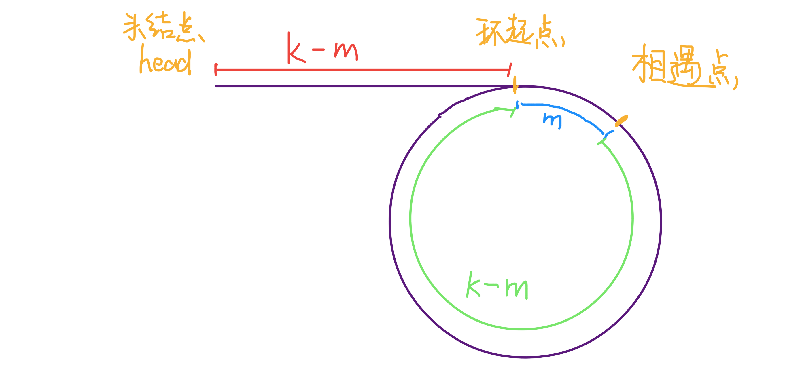

双指针技巧可以分为两类：一类是「快慢指针」，一类是「左右指针」。前者主要解决链表中的问题，比如典型的判定链表中是否包含环；后者主要解决数组（或者字符串）的问题，比如二分查找


## 快慢指针的常见算法

快慢指针一般都初始化指向链表的头结点 head，前进时快指针 fast 在前，慢指针 slow 在后，巧妙解决一些链表中的问题


### 判定链表中是否含有环

单链表的特点就是每个节点只知道下一个节点，所以一个指针的话无法判断链表中是否含有环。如果链表中不含环，那么这个指针最终会遇到空指针 null，表示链表到头了，如下：

```java
boolean hasCycle(ListNode head) {
	while(head != null) {
		head = head.next;
	}
	return false;
}
```


但是链表中含有环，这个指针就会陷入死循环，因为环形数组中没有 null 指针作为尾部节点。


经典解法就是用两个指针，一个跑的块，一个跑得慢。如果不含有环，跑的块的指针最终会遇到 null，说明链表不含环；如果含有环，快指针最终会超慢指针一圈，和慢指针相遇，说明链表含有环

```java
boolean hasCycle(ListNode head) {
	ListNode fast = head;
	ListNode slow = head;
	
	while(fast != null && fast.next != null) {
		fast = fast.next.next;
		slow = slow.next;
		
		while(fast == slow) {
			return true; 
		}
	}
	
	return false;
}
```


### 已知链表中含有环，返回这个环的起始位置


这个有点类似脑筋急转弯，先看代码：

```java
ListNode detectCycle(ListNode head) {

	ListNode fast = head;
	ListNode slow = head;
	 
	while(fast != null && fast.next != null){
		fast = fast.next.next;
		slow = slow.next;
		
		while(fast == slow) {
			break;
		}
	}
	
	// 上面的代码类似 hasCycle 函数
	slow = head;
	while(slow != fast) {
		fast = fast.next;
		slow = slow.next;
	}
	return slow;
}
```


可以看到，当快慢指针相遇时，让其中一个指针指向头结点，然后它俩以相同速度前进，再次相遇时所在的节点位置就是环开始的位置，这是为什么呢？


第一次相遇，假设慢指针 `slow` 走了 k 步，那么快指针 `fast` 一定走了 2k 步，也就是说比 slow 多走了 k 步（也就是环的长度）


假设相遇点距环的起点的距离为 m，那么环的起点距头结点 head 的距离为 k - m，也就是说如果从 head 前进 k - m 步就能到达环起点。巧的是，如果从相遇点继续前进 k - m 步，也恰好到达环起点




所以，只要我们把快慢指针中的任何一个重新指向 head，然后两个指针同速前进，k - m 步后就会相遇，相遇之处就是环的起点了


### 寻找链表的中点

类似上面的思路，我们还可以让快指针一次前进两次，慢指针一次前进一步，当快指针到达链表尽头时，慢指针就处于链表的中间位置

```java
while(fast != null && fast.next != null) {
	fast = fast.next.next;
	slow = slow.next;
}

// slow 就在中间位置
return slow;
```


当链表的长度是奇数时，slow 刚好停在中点的位置；如果长度是偶数，slow 最终的位置是中间偏右


### 寻找链表的倒数第 K 个元素

思路还是使用快慢指针，让快指针先走 k 步，然后快慢指针开始同速前进。这样当快指针走到链表末尾 null 时，慢指针所在的位置就是倒数第 k 个链表节点（为了简化，k 不会超过链表长度）

```java
ListNode fast = head;
ListNode slow = head;

int step = 0;
while(step < k) {
	fast = fast.next;
	step++;
}

while(fast != null) {
	slow = slow.next;
	fast = fast.next;
}

return slow;
```


## 左右指针的常用算法

左右指针在数组中实际上是两个索引值，一般初始化为 left = 0，right = nums.length - 1


### 二分查找

简单的二分查找如下：

```java
int binarySearch(int[] nums, int target) {
	
	int left = 0;
	int right = nums.length - 1;
	while(left <= right) {
		int mid = left + (right - left) / 2;
		if(nums[mid] == target) {
			return mid;
		}else if(nums[mid] < target) {
			left = mid + 1;
		}else if(nums[mid] > target) {
			right = mid - 1;
		}
	}
	return -1;
}
```


### 两数之和

直接看下面的这么一道题目：


只要数组有序，就应该想到双指针技巧。这道题有点像二分查找，通过调节 left 和 right 来 调整 sum 的大小：

```java
int[] twoSum(int[] nums, int target) {
	int left = 0;
	int right = nums.length - 1;
	
	while(left < right) {
		int sum = nums[left] + nums[right];
		if(sum == target) {
			// 题目要求的索引是从 1 开始的
			return new int[]{left + 1, right + 1};
		}else if(sum < target) {
			// 让 sum 大一点
			left++;
		}else if(sum > target) {
			// 让 sum 小一点
			right--;
		}
	}
	
	return new int[]{-1. -1};
}
```


### 反转数组

代码如下：

```java
void reverse(int[] nums) {
	int left = 0;
	int right = nums.length - 1;
	
	while(left < right) {
		int temp = nums[left];
		nums[left] = nums[right];
		nums[right] = temp;
		left++;
		right--;
	}
}
```


## 参考资料

[双指针技巧总结](https://labuladong.gitbook.io/algo/suan-fa-si-wei-xi-lie/shuang-zhi-zhen-ji-qiao)