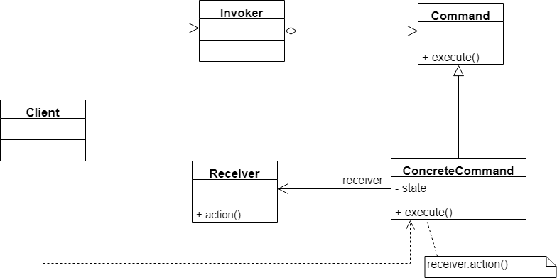
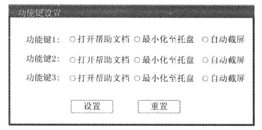
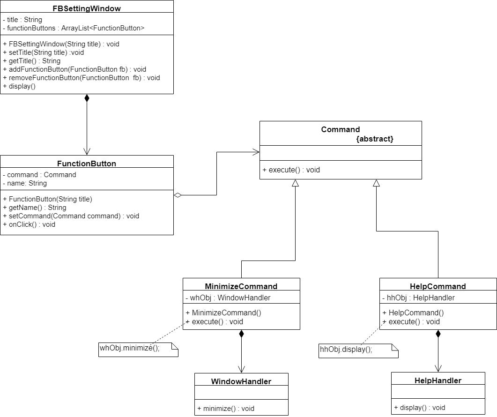
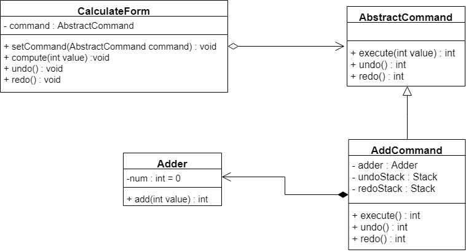
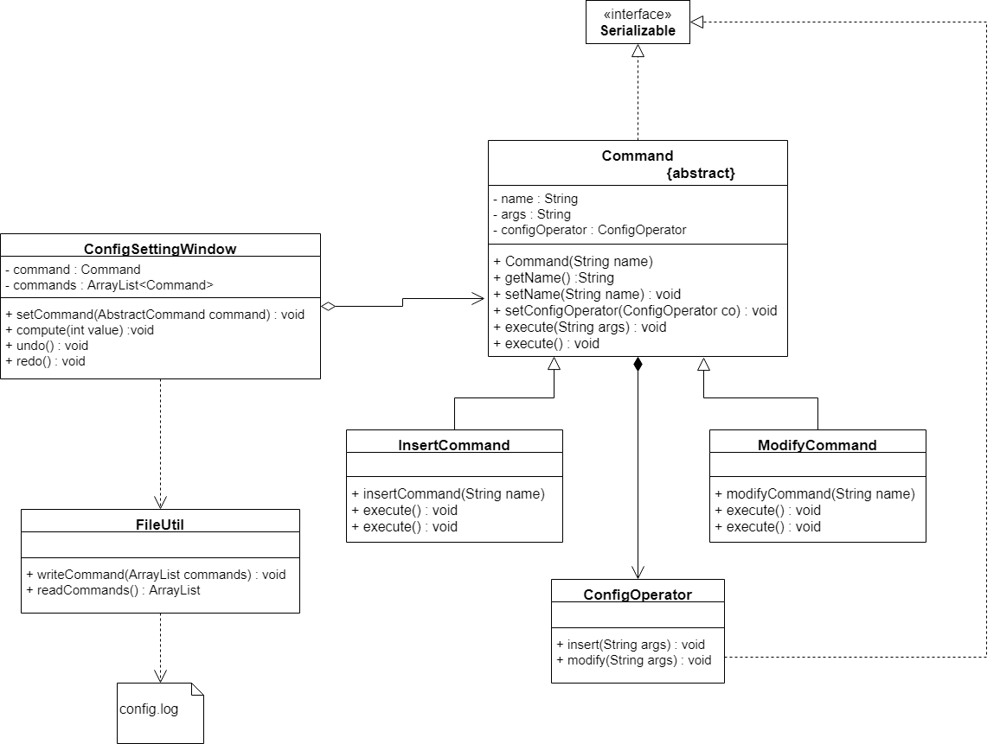

​		在软件开发中有很多类似这样的一个场景：一个按钮，它可能是一个“关闭窗口”请求的发送者，而按钮点击事件处理类则是该请求的接收者。为了降低系统的耦合度，将请求的发送者和接收者解耦，可以使用一种被称之为命令模式的设计模式来设计系统。在命令模式中，发送者与接收者之间引入了新的命令对象，将发送者的请求封装在命令模式中，再通过命令对象来调用接收者的方法。

​		在软件开发中，经常需要向某些对象发送请求（调用其中的某个或某些方法），但是并不知道请求的接收者是谁，也不知道被请求的操作是哪个，此时，希望能以一种松耦合的方式来设计软件，使得请求发送者与请求接收者能够消除彼此之间的耦合，让对象之间的调用关系更加灵活。

​		命令模式可以将请求发送者和接收者完全解耦，发送者与接收者之间没有直接引用关系，发送请求的对象只需要知道如何发送请求，而不必知道如何完成请求。

## 命令模式定义

​		将一个请求封装为一个对象，从而可用不同的请求对客户进行参数化；对请求排队或者记录日志，以及支持可撤销的操作。命令模式是一种对象行为型模式，又称为动作模式或事物模式。

## 命令模式结构图

​		命令模式的核心在于引入了命令类，通过命令类来降低发送者和接收者的耦合度，请求发送者只需要指定一个命令对象，再通过命令对象来调动请求接收者的处理方法，其结果如下：



​		由上图可知命令模式包含以下四个角色：

- **Command（抽象命令类）**：抽象命令类一般是一个抽象类或接口，在其中声明了用于执行请求execute()等方法，通过这些方法可以调用请求接收者的相关操作。
- **ConcreteCommand（具体命令类）**：具体命令类是抽象命令类的子类，实现了在抽象命令类中声明的方法，它对应具体的接收者对象，将接收者对象的动作绑定在其中。在实现execute()方法时，将调用接收者对象的相关操作（Action）.
- **Invoker（调用者）**：调用者即请求发送者，它通过命令对象来执行请求。一个调用者并不需要在设计时确定其接收者，因此它只与抽象命令类之间存在关联关系。在程序运行时可以将一个具体命令对象注入其中，再调用具体命令对象的execute()方法，从而实现间接调用请求接收者的相关操作。
- **Receiver（接收者）**：接收者执行与请求相关的操作，它具体实现对请求的业务处理。

## 具体案例

​		某公司开发人员为公司内部OA系统开发了一个桌面版应用程序，该应用程序为客户提供了一系列自定义功能键，用户可以通过这些功能键来实现一些快捷操作。产品人员通过分析，发现不同的用户可能有不同的使用习惯，在设置功能键的时候每个人都有自己的喜好，例如有人喜欢将第一个功能键设置为“打开帮助文档”，有的人则喜欢将该功能键设置为“最小化至托盘”。为了让用户能够灵活地进行功能键的设置,开发人员提供了一个“功能键设置”窗口,如图所示：



​		通过这个窗口界面，用户可以将功能键和相应功能绑定在一起，还可以根据需要来修改功能键的设置，而且系统未来还可能增加一些新的功能或功能键。

​		该软件使用命令模式设计，结构图如下所示：



​		相关代码已上传到[github](https://github.com/GD-CKING/Design-Pattern/tree/master/Command-Pattern(%E5%91%BD%E4%BB%A4%E6%A8%A1%E5%BC%8F)/command)上。

## 命令队列的实现

​		有时候需要将多个请求排队，当一个请求发送者发送一个请求时，不止一个请求接收者产生响应，这些请求接收者将逐个执行业务方法，完成对请求的处理。此时，可以通过命令队列来实现。

​		命令队列的实现方法有多种形式，其中最常用、灵活性最好的一种方式是增加一个CommandQueue类，由该类来负责存储多个命令对象，而不同的命令对象可以对应不同的请求接收者。CommandQueue类的典型代码如下：

```java
package com.command;

import java.util.ArrayList;

public class CommandQueue {

    //定义一个ArrayList来存储命令队列
    private ArrayList<Command> commands = new ArrayList<Command>();

    public void addCommand(Command command) {
        commands.add(command);
    }

    public void removeCommand(Command command) {
        commands.remove(command);
    }

    //循环调用每一个命令对象的execute()方法
    public void execute() {
        commands.stream().forEach(command -> {
            command.execute();
        });
    }
}
```

​		在增加了命令队列类CommandQueue以后，请求发送者类Invoker将针对CommandQueue编程，代码如下：

```java
package com.command;

public class Invoker {

    //维持一个CommandQueue对象的引用
    private CommandQueue commandQueue;

    public Invoker(CommandQueue commandQueue) {
        this.commandQueue = commandQueue;
    }

    //设值注入
    public void setCommandQueue(CommandQueue commandQueue) {
        this.commandQueue = commandQueue;
    }

    //调用CommandQueue类的execute()方法
    public void call() {
        commandQueue.execute();
    }
}
```

​		命令队列与批处理有点类似。批处理，意思就是可以对一组对象（命令）进行批量处理，当一个发送者发送请求后，将有一系列接收者对请求作出相应，**命令对象可以用于设计批处理应用程序**，如果请求接收者的接受次序没有严格的先后次序，还可以使用多线程技术来并发调用命令对象的execute()方法，从而提高程序的执行效率。

## 撤掉操作的实现

​		在命令模式中，可以通过调用一个命令对象的execute()方法来实现对请求的处理，如果需要撤销请求，可以通过在命令类中增加一个逆向操作来实现。此外，还可以通过保存对象的历史状态来实现撤销。

### 案例

​		某公司欲开发一个简易计算器，该计算器可以实现简单的数学运算，还可以对运算实施撤销操作和恢复操作。



​		本例完整代码已上传到[github](https://github.com/GD-CKING/Design-Pattern/tree/master/Command-Pattern(%E5%91%BD%E4%BB%A4%E6%A8%A1%E5%BC%8F)/undo-redo)上

## 请求日志

​		请求日志就是将请求的历史记录保存下来，通常以日志文件的形式永久存储在计算机系统中。在实现请求日志时，可以将命令对象通过序列化写到日志文件中，此时命令类必须实现java.io.Serializable接口。

### 案例

​		某公司开发了一个网站配置文件管理工具，可以通过一个可视化界面对网站配置文件进行增删改等操作，该工具使用命令模式进行设计，结构如下所示。现在改公司开发人员希望对配置文件的操作请求记录在日志文件中，如果网站重新部署，主需要执行保存在日志文件中的命令对象即可修改配置文件。



​		该案例的相关代码已上传到[github](https://github.com/GD-CKING/Design-Pattern/tree/master/Command-Pattern(%E5%91%BD%E4%BB%A4%E6%A8%A1%E5%BC%8F)/log)上。

## 命令模式主要优缺点

### 主要优点

- 降低系统的耦合度。由于请求者与接收者之间不存在直接引用，因此请求者与接收者之间实现完全解耦，相同的请求者可以对应不同的接收者，同样，相同的接收者也可以供不同的请求者使用，两者之间具有良好的独立性。
- 新的命令可以很容易地加入到系统中。由于增加新的具体命令类不会影响到其他类，因此增加新的具体命令类很容易，无须修改原有系统源代码甚至客户类代码，满足开闭原则。
- 可以比较容易地设计一个命令队列或宏命令。
- 为请求的撤销和恢复操作提供了一种设计和实现方案。

### 主要缺点

​		主要缺点是：使用命令模式可能会导致某些系统有过多的具体命令类。因为针对每一个请求接收者的调用操作都需要设计一个具体命令类，因此在某些系统中可能需要提供大量的具体命令类，这将影响命令模式的使用。

## 命令模式使用场景

1. 系统需要将请求调用者和请求接收者解耦，使得调用者和接收者不直接交互。请求调用者无须知道接收者的存在，也无须知道接收者是谁，接收者也无须关心何时被调用。
2. 系统需要在不同的时间指定请求、将请求排队和执行请求。一个命令对象和请求的初始调用者可以有不同的生命期。即，最初的请求发出者可能已经不在了，而命令对象本身仍然是活动的，可以通过该命令对象去调用请求接收者，而无须关系请求调用者的存在性，可以通过请求日志文件等机制来具体实现。
3. 系统需要支持命令的撤销操作和恢复操作。
4. 系统需要将一组操作组合在一起形成宏命令。