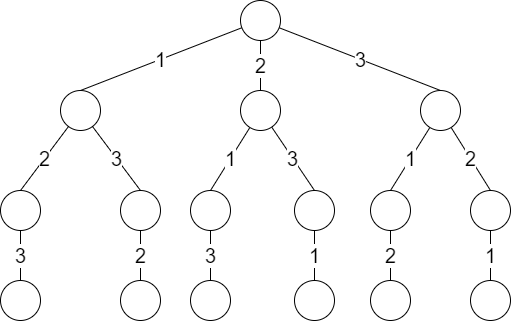
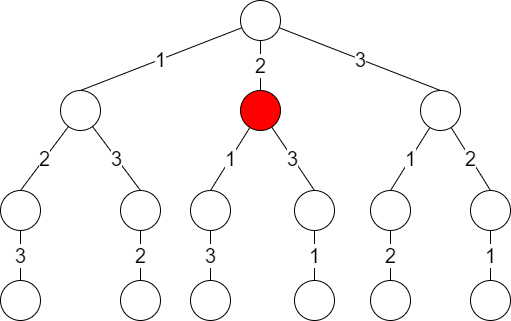
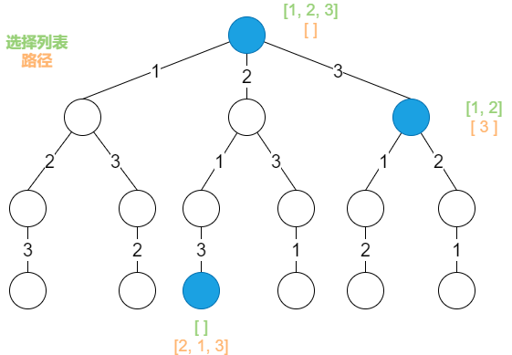
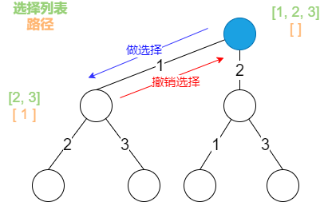

解决一个回溯问题，实际上就是一个决策树的遍历过程，你只需要思考三个问题：

- 路径：也就是已经做出的选择

- 选择列表：也就是你当前可以做的选择

- 结束条件：也就是到达决策树底层，无法再做选择的条件


如果你不理解这三个词语的解释，没关系，我们后面会用几个经典的回溯算法问题来帮你理解这些词语是什么意思。现在你先留着隐形。


代码方面，回溯算的的框架：

```java
result = []
def backtrack(路径, 选择列表) {
	if(满足结束条件) {
		result.add(路径);
		return;
	}
	
	for(选择 in 选择列表) {
		做选择
		backtrack(路径, 选择列表)
		撤销选择
	}
}
```


**其核心就是 for 循环里面的递归，在递归调用之前 「做选择」，在递归调用之后「撤销选择」**。什么叫做选择和撤销选择？这个框架的底层原理是什么呢？下面我们就通过「全排列」这个问题来解开之前的疑惑。


## 全排列问题

我们在高中的时候就做过排列组合的数学题，我们也知道 n 个不重复的数，全排列共有 n! 个。为了简单清晰起见，我们这次讨论的全排列问题不包含重复的数字。


我们当时是怎么穷举全排列的呢？比如说给三个数 [1, 2, 3]，你肯定不会无规律地乱穷举，一般是这样：先固定第一位为 1，然后第二位可以是 2，那么第三位只能是 3；然后可以把第二位变成 3，第三位就只能是 2 了；然后就只能变化第一位，变成 2，然后再穷举后两位。。。


其实这就是回溯算法，我们高中无师自通就会用，或者有的同学直接画出如下这棵回溯树：




只要从根遍历这棵树，记录路径上的数字，其实就是所有的全排列。**我们不妨把这棵树称为回溯算法的「决策树」。**


**为啥说是决策树呢，因为你在每个节点上其实都在做决策**。比如说你站在下图的红色节点上：




你现在就在做决策，可以选择 1 那条树枝，也可以选择 3 那条树枝。为啥只能在 1 和 3 之中选择呢？因为 2 这个树枝在你身后，这个选择之前做过了，而全排列是不允许重复使用数字的。


**现在可以解答开头的几个名词：[2] 就是 「路径」，记录你已经做过的选择；[1, 3] 就是 「选择列表」，表示你当前可以做出的选择；「结束条件」就是遍历到树的底层，在这里就是选择列表为空的时候。**


如果明白了这几个名词，可以把「路径」和「选择」列表作为决策树上每个节点的属性。比如下图列出了几个节点的属性：




**我们定义的 backtrack 函数其实就像一个指针。在这棵树上游走，同时要正确维护每个节点的属性，每当走到树的底层，其「路径」就是一个全排列。**


「路径」和「选择」是每个节点的属性，函数在树上游走要正确维护节点的属性，那么就要在这两个特殊时间点搞点动作：




现在，你是否理解了回溯算法的这段核心框架？

```java
for(选择 in 选择列表) {
	// 做选择
	将该选择从选择列表移除
	路径.add(选择)
	backtrack(路径，选择列表)
	// 撤销选择
	路径.remove(选择)
	将该选择再加入列表
}
```


我们只要在递归之前做出选择，在递归之后撤销刚才的选择，就能正确得到每个节点的选择列表和路径。下面看全排序代码：

```java
List<List<Integer>> res = new LinkedList<>();

/* 主函数，输入一组不重复的数字，返回它们的全排列 */
List<List<Integer>> permute(int[] nums) {
    // 记录「路径」
    LinkedList<Integer> track = new LinkedList<>();
    backtrack(nums, track);
    return res;
}

// 路径：记录在 track 中
// 选择列表：nums 中不存在于 track 的那些元素
// 结束条件：nums 中的元素全都在 track 中出现
void backtrack(int[] nums, LinkedList<Integer> track) {
    // 触发结束条件
    if (track.size() == nums.length) {
        res.add(new LinkedList(track));
        return;
    }

    for (int i = 0; i < nums.length; i++) {
        // 排除不合法的选择
        if (track.contains(nums[i]))
            continue;
        // 做选择
        track.add(nums[i]);
        // 进入下一层决策树
        backtrack(nums, track);
        // 取消选择
        track.removeLast();
    }
}
```


至此，我们就通过全排列问题详解了回溯算法的底层原理。当然，这个算法解决全排列不是很高效，因为对链表使用 `contains` 方法需要 O(N) 的时间复杂度，有更好的方法通过交换元素打到目的，但是难理解一些，这里就不写了，有兴趣可以自行搜索一下。


但是必须说明的是，不管怎么优化，都符合回溯框架，而且时间复杂度都不可能低于 O(N!)，因为穷举整棵决策树事务无法避免的。**这也是回溯算法的一个特点，不像动态规划存在重叠子问题可以优化，回溯算法就是纯暴力穷举，复杂度一般都很高。**


明白了 全排列问题，就可以直接套回溯算法框架了，下面简单看看 N 皇后问题。


## N 皇后问题

这个问题很经典了，我们以力扣网第 51 题的[「N 皇后」](https://leetcode-cn.com/problems/n-queens/) 题目为例。简单解释一下：给你一个 N * N 个皇后，使得它们不能互相攻击。


PS：皇后可以攻击同一行，同一列，左上左下右上右下四个方向的任意单位。


这个问题本质上跟全排列问题差不多，决策树的每一层表示棋盘上的每一行；每个节点可以做出的选择是，在该行的任意一列放置一个皇后。


直接套用框架：

```java
public List<List<String>> res = new ArrayList<>();
/**
 * 输入棋盘边长n，返回所有合法的放置
 * @param n
 * @return
 */
public List<List<String>> solveNQueens(int n) {
    String[][] nQueue = new String[n][n];
    // "."表示空，"Q"表示皇后，初始化空棋盘
    for (int i = 0; i < n; i++) {
        for (int j = 0; j < n; j++) {
            nQueue[i][j] = ".";
        }
    }

    backtrack(nQueue, 0);
    return res;
}

/**
 * @param nQueue 路径：nQueue中小于row的那些行都已经成功放置了皇后
 * @param row    选择列表：第row行的所有列都是防止皇后的选择
 */
private void backtrack(String[][] nQueue, int row) {

    int n = nQueue.length;
    // 结束条件：row超过nQueue的最后一行
    if (n == row) {
        List<String> re = new ArrayList<>();
        for (String[] list : nQueue) {
            StringBuilder sb = new StringBuilder();
            for (String str : list) {
                sb.append(str);
            }
            re.add(sb.toString());
        }
        res.add(re);
        return;
    }

    for (int col = 0; col < n; col++) {
        // 排除不合法选择
        if (!isValid(nQueue, row, col)) {
            continue;
        }
        // 做选择
        nQueue[row][col] = "Q";
        // 进入下一行决策
        backtrack(nQueue, row + 1);
        // 撤销选择
        nQueue[row][col] = ".";
    }
}
```


这部分代码，其实跟全排列问题差不多，`isValid` 函数的实现也很简单：

```java
/**
 * 是否可以在 nQueue[row][col] 放置皇后
 * @param nQueue
 * @param row
 * @param col
 * @return
 */
private boolean isValid(String[][] nQueue, int row, int col) {

    int n = nQueue.length;
    // 检查列是否有皇后互相冲突
    for (int i = 0; i < row; i++) {
        if ("Q".equals(nQueue[i][col])) {
            return false;
        }
    }

    // 检查左上方是否有皇后互相冲突
    for (int i = row - 1, j = col - 1; i >= 0 && j >= 0; i--, j--) {
        String s = nQueue[i][j];
        if ("Q".equals(s)) {
            return false;
        }
    }

    // 检查右上方是否有皇后互相冲突
    for (int i = row - 1, j = col + 1; i >= 0 && j < n; i--, j++) {
        String s = nQueue[i][j];
        if ("Q".equals(s)) {
            return false;
        }
    }

    return true;
}
```


函数 `backtrack` 依然像个决策树上游走的指针，通过 row 和 col 就可以表示函数遍历到的位置，通过 `isValid` 函数可以将不符合条件的情况剪枝。


如果直接给你这么一大段解法代码，可能是懵逼的。但是现在明白了回溯算法的框架套路，还有啥难理解的？无非是改造做选择的方式，排除不合法选择的方式而已，只要框架存于心，你面对的只剩下小问题了。


**有的时候，我们并不想得到所有合法的答案，只想要一个答案，怎么办**？比如解数独的算法，找所有解法复杂度太高，只要找到一种解法就可以。那么我们只要稍微修改一下回溯算法的代码即可：

```java
/** 函数找到一个答案后就返回true
 * @param nQueue 路径：nQueue中小于row的那些行都已经成功放置了皇后
 * @param row    选择列表：第row行的所有列都是防止皇后的选择
 */
private boolean tracebacking(String[][] nQueue, int row) {

    int n = nQueue.length;
    // 结束条件：row超过nQueue的最后一行
    if (n == row) {
        List<String> re = new ArrayList<>();
        for (String[] list : nQueue) {
            StringBuilder sb = new StringBuilder();
            for (String str : list) {
                sb.append(str);
            }
            re.add(sb.toString());
        }
        res.add(re);
        return true;
    }

    for (int col = 0; col < n; col++) {
        // 排除不合法选择
        if (!isValid(nQueue, row, col)) {
            continue;
        }
        // 做选择
        nQueue[row][col] = "Q";
        // 进入下一行决策
        if(tracebacking(nQueue, row + 1)) {
            return true;
        }
        // 撤销选择
        nQueue[row][col] = ".";
    }

    return false;
}
```


这样修改后，只要找到一个答案，for 循环的后续递归穷举都会被阻断。也许你可以在 N 皇后问题的代码框架上，稍加修改，写一个解数独的算法。


## 回溯算法框架的应用

我们从力扣第 1415 题[「长度为 n 的开心字符串中字典序第 k 小的字符串」](https://leetcode-cn.com/problems/the-k-th-lexicographical-string-of-all-happy-strings-of-length-n/)来应用这个回溯算法的框架。


从题目的描述中，我们可以知道我们的选择路径是 `[ 'a', 'b', 'c' ]`，其中它的结束条件就是当路径的长度打到 `n` 时就可以结束。而且根据题目的描述，我们不用全部遍历回溯完，只要拿到第 k 小的字符串就可以结束遍历。当我们分析好这些条件的时候，就可以开始应用回溯框架写代码了。

```java
/**
 * 长度为 n 的开心字符串中字典第 k 小的字符串
 * @param n
 * @param k
 * @return
 */
public String getHappyString(int n, int k) {
    List<String> list = new ArrayList<>();
    happyString(k, new LinkedList<String>(), n, list);
    if (list.size() < k) {
        return "";
    }
    return list.get(k - 1);
}

/**
 * 
 * @param k 第 k 个字符串
 * @param strList 用于记录已经走过的路径
 * @param n 字符串长度为 k
 * @param result 存储符合条件的路径
 */
private void happyString(int k, LinkedList<String> strList, int n, List<String> result) {

    // 结束条件：路径的长度等于 n
    if (strList.size() == n) {
        StringBuilder sb = new StringBuilder();
        strList.stream().forEach(item -> {
            sb.append(item);
        });
        // 存储路径
        result.add(sb.toString());
        return;
    }

    // 遍历选择列表
    for (int i = 0; i < 3; i++) {
        //当获取到第 k 小的字符串时，可以停止遍历了
        if (result.size() == k) {
            break;
        }
        // 如果符合开心字符串的标准
        if (isValid(strList, String.valueOf((char) ('a' + i)))) {
            strList.add(String.valueOf((char) ('a' + i)));
            happyString(k, strList, n, result);
            strList.removeLast();
        }
    }
}

/**
 * 判断是否符合开心字符串的要求
 * @param strs
 * @param s
 * @return
 */
private boolean isValid(List<String> strs, String s) {
    if (strs.size() == 0) {
        return true;
    }
    if (strs.get(strs.size() - 1).equals(s)) {
        return false;
    }
    return true;
}
```


## 总结

回溯算法就是个多叉树的遍历问题，算法框架如下：

```java
def backtrack(路径, 选择列表) {
	
	for(选择 in 选择列表) {
		做选择
		backtrack(路径, 选择列表)
		撤销选择
	}
}
```


**写 `backtrack` 函数时，需要维护走过的「路径」和当前可以做的「选择列表」，当触发「结束条件」时，将「路径」记入结果集**


## 参考资料

[回溯算法解题套路框架](https://labuladong.gitbook.io/algo/di-ling-zhang-bi-du-xi-lie/hui-su-suan-fa-xiang-jie-xiu-ding-ban)