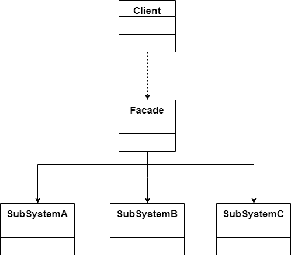
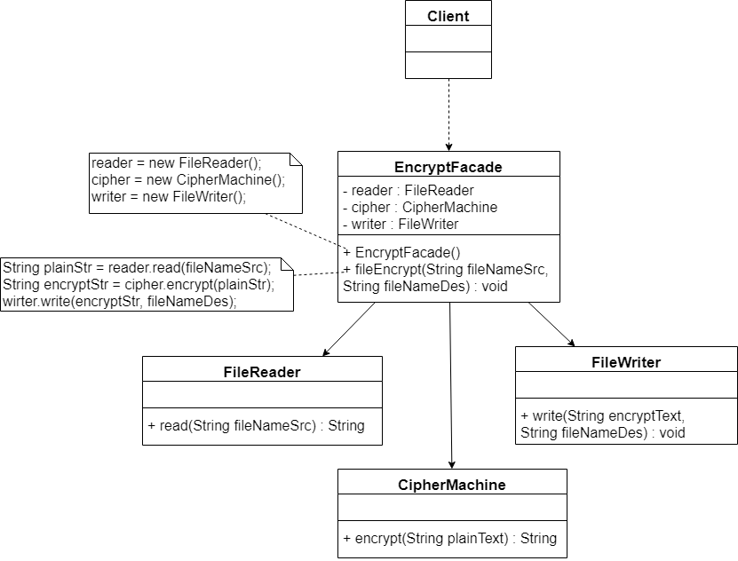
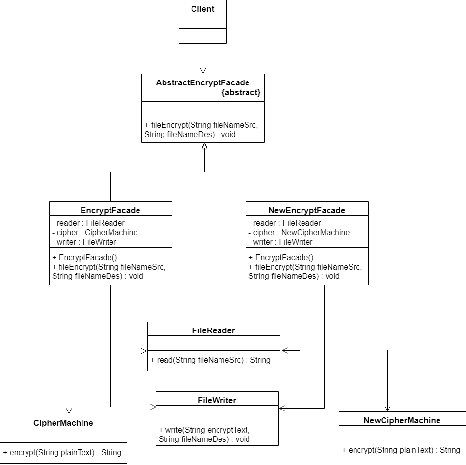

​		在软件开发中，有时候为了完成一项较为复杂的功能，一个类需要和多个其他业务类交互，**而这些需要交互的业务类经常会作为一个完整的整体出现**，由于涉及的类比较多，导致使用时代码较为复杂，此时，需要一个类似服务员一样的角色，由它来负责和多个业务类进行交互，而使用这些业务类的类只需和该类交互即可。外观模式通过引入一个新的外观类来实现该功能，外观类充当了软件系统中的“服务员”，它为多个业务类的调用提供了一个统一的入口，简化了类与类之间的交互。

## 外观模式定义

​		外观模式要求一个子系统的外部与其内部的通信通过一个统一的外观角色进行，外观角色将客户端与子系统的内部复杂性分隔开，使得客户端只需要与外观角色打交道，而不需要与子系统内部的很多对象打交道，其定义如下：

​		外部与一个子系统的通信通过一个统一的外观角色进行，为子系统中的一组接口提供一个一致的入口，外观模式定义了一个高层接口，这个接口使得这一子系统更加容易使用。外观模式又称为门面模式，它是一种对象结构型模式。

## 外观模式结构图

​		在外观模式结构图中包含以下两种角色：

- **Facade（外观角色）**：在客户端可以调用这个角色的方法，在外观角色中可以知道相关的（一个或者多个）子系统的功能和责任，在正常情况下，它将所有从客户端发来的请求委派到相应的子系统中去，传递给相应的子系统对象处理。
- **SubSystem（子系统角色）**：在软件系统中可以有一个或者多个子系统角色，每一个子系统可以不是一个单独的类，而是一个类的集合，它实现子系统的功能，每一个子系统都可以被客户端直接调用，或者被外观角色调用，它处理由外观类传过来的请求；子系统并不知道外观的存在，对于子系统而言，外观角色仅仅是另外一个客户端而已。

## 案例

​		某软件公司欲开发一个可应用与多个软件的文件加密模块，改模块可以对文件中的数据进行加密并将加密之后的数据存储在一个新文件中，具体流程包括三个部分，分别是读取源文件、加密、保存加密之后的文件。其中，读取文件和保存文件使用流来实现，加密操作通过求模运算来实现。这三个操作相互独立，为了实现代码的独立重用，让设计更符合单一职责原则，这3个操作的业务代码封装在3个不同的类中。

​		相关代码已上传至[github](https://github.com/GD-CKING/Design-Pattern/tree/master/Facade-Pattern(%E5%A4%96%E8%A7%82%E6%A8%A1%E5%BC%8F)/code)上。

## 抽象外观类的引入

​		在标准的外观模式中，如果需要增加、删除或更换与外观类交互的子系统类，必须修改外观类或客户端的源代码，这将违背开闭原则，因此可以通过引入抽象外观类来对系统进行改进，在一定程度上解决该问题。**在引入抽象外观类之后，客户端可以针对抽象外观类进行编程**，对于新的业务需求，不需要修改原有外观类，而对应增加一个新的具体外观类，由新的具体外观类来关联新的子系统对象，同时通过修改配置文件来达到不修改任何源代码并更换外观类的目的。

​		如在上面的案例中，如果要更换原有的加密方式，换成新的加密方式。那么相应的解决思路如下图：

## 外观模式主要优缺点

### 主要优点

1. 对客户端屏蔽了子系统组件，减少了客户端所需处理的对象数目并使得子系统使用起来更加容易。通过引入外观模式，客户端代码变得很简单，与之关联的对象也很少。
2. 实现了子系统与客户端之间的松耦合关系，这使得子系统的变化不会影响到调用它的客户端，只需要调整外观类即可。
3. 一个子系统的修改对其他子系统没有任何影响，而且子系统内部变化也不会影响到外观对象。
4. 只是提供了一个访问子系统的统一入口，并不影响客户端直接使用子系统类。

### 主要缺点

1. 不能很好地限制客户端直接使用子系统类，如果对客户端访问子系统类做太多的限制则减少了可变性和灵活性。
2. 如果设计不当，当增加新的子系统可能需要修改外观类的源代码，这违背了开闭原则。

## 外观模式适用场景

1. 当要为访问一系列复杂的子系统提供一个简单入口时可以使用外观模式。
2. 客户端程序与多个子系统之间存在很大的依赖。引入外挂类可以将子系统与客户端解耦，从而提供子系统的独立性和可移植性。
3. 在层次化结构中，可以使用外观模式定义系统中每一层的入口，层与层之间不直接产生联系，而通过外观类建立联系，降低层之间的耦合度。