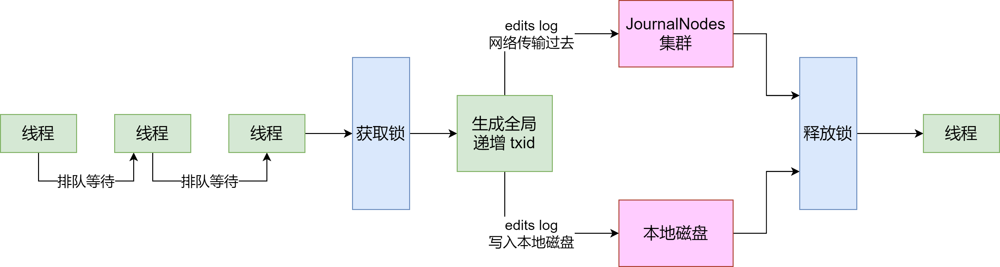
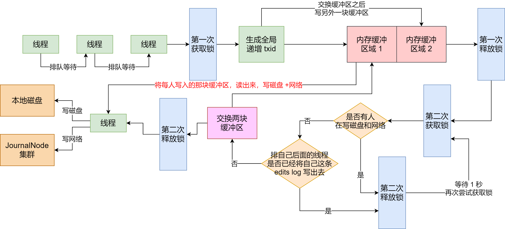

我们分析一下，高并发请求 NameNode 会遇到什么问题

我们知道，每次请求 NameNode 修改一条元数据（比如说申请上传一个文件，那么就需要在内存目录树种加入一个文件），都要写一条 `edits log`，包括两个步骤：

- 写入本地磁盘

- 通过网络传输给 JournalNodes 集群

但是这存在多线程并发安全问题。NameNode 在写 edits log 时的第一条原则：

> 必须保证每条 edits log 都有一个全局顺序递增的 **transactionId**（简称为 txid），这样才可以标识出来一条一条的 edits log 的先后顺序

那么如果要保证每条 edits log 的 txid 都是递增的，就必须要**加锁**

每个线程修改了元数据，要写一条 edits log 的时候，都必须按顺序排队获取锁后，才能生成一个递增的额 txid，代表了这次要写的 edits log 的序号

如上图，如果每次都是在一个加锁的代码块里，生成 txid，然后写磁盘文件 edits log，网络请求写入 JournalNodes 一条 edits log。这样子是绝对不行的，NameNode 本身用多线程接收多个客户端发送过来的并发请求，结果多个线程居然修改完内存中的元数据之后，排着队写 edits log

而且，写本地磁盘 + 网络传输 JournalNodes 集群，都是很耗时的。**性能两大杀手：磁盘写 + 网络写**

如果 HDFS 的架构这么设计的话，基本上 NameNode 能承载的每秒的并发数就很少了，可能就每秒处理几十个并发请求处理就撑死了

## HDFS 的解决方案

针对上述问题，HDFS 是做了不少优化的

首先，既然我们不希望每个线程写 edits log 的时候，串行化排队生成 txid + 写磁盘 + 写 JournalNodes，那么是不是可以搞一个内存缓冲。即，多个线程可以快速地获取锁，生成 txid，然后快速地将 edits log 写入内存缓冲。接着就快速地释放锁，让下一个线程获取锁后，生成 id + 写 edits log 进入内存缓冲

然后接下来有一个线程可以将内存中的 edits log 刷入磁盘，但是在这个过程中，还是继续允许其他线程将 edits log 写入内存缓冲中

但是这里就有一个问题了，如果针对同一块内存缓冲，同时有人写入，还同时有人读取后写磁盘，那也有问题，**因为不能并发读写一块共享内存数据**

所以 HDFS 在这里采取了 **double - buffer 双缓冲机制**来处理，将一块内存缓冲分为两个部分：

- 其中一个部分可以写入

- 另外一个部分用于读取后写入磁盘和 JournalNodes

如下图：

### 分段加锁机制 + 内存双缓冲机制

首先各个线程依次第一次获取锁，生成顺序递增的 txid，然后将 edits log 写入内存双缓冲的区域 1，接着就立马第一次释放锁了

趁着这个空隙，后面的线程就可以再次第一次获取锁，然后立即写自己的 edits log 到内存缓冲

写内存那么快，可能才耗时即使微秒，接着就立马第一次释放锁了。所以这个并发优化是有效果的

接着各个线程竞争第二次获取锁，有线程获取到锁之后，就看看，**有没有谁在写磁盘和网络？**如果没有，那么这个线程就是个幸运儿，直接交换双缓冲的区域 1 和 区域 2，接着第二次释放锁。这个过程相当快速，内存里判断几个条件，耗时不了几微秒

到这一步，内存缓冲已经被交换了，后面的线程可以立马快速地依次获取锁，然后将 edits log 写入内存缓冲的区域 2，区域 1 中的数据被锁定了，不能写

### 多线程并发吞吐量的百倍优化

接着，之前那个幸运儿，将内存缓冲区的区域 1 中的数据读取出来（此时没人写区域 1 了，都在写区域 2），将里面的 edits log 都写入磁盘文件，以及通过网络写入 JournalNodes 集群

这个过程是很耗时的，但是没关系，人家做过优化了，在写磁盘和网络的过程中，是不具有锁的

因此后面的线程可以快速地第一次获取锁之后，立马写入内存缓冲的区域 2，然后释放锁。这个时候大量的线程都可以快速地写入内存，没有阻塞和卡顿

### 缓冲数据批量刷磁盘 + 网络的优化

那么在幸运儿线程把数据写磁盘和网络的过程中，排在后面的大量线程，快速地第一次获取锁，写内存缓冲区域 2，释放锁，之后，这些线程第二次获取到锁后会干嘛？

它们会发现有人在写磁盘，所以会立即休眠 1 秒，释放锁

此时大量的线程并发过来，都会在这里快速地第二次获取锁，然后发现有人在写磁盘和网络，快速地释放锁，休眠

这样，这个过程没有长时间地阻塞其他人，因为都会快速地释放锁，所以后面的线程还是可以迅速地第一次获取锁后写内存缓冲

而且这时，一定会有很多线程发现，好像之前的那个幸运儿的 txid 是排在自己之后的，那么肯定就把自己的 edits log 从缓冲里写入磁盘和网络了。这些线程甚至都不会休眠等待，直接返回后去干别的事情，不会卡在这里

然后按个幸运儿线程写完磁盘和网络之后，就会唤醒之前休眠的那些线程

那些线程会依次排队再第二次获取锁后进入判断，发现没有人在写磁盘和网络了。然后就会判断，有没有排在自己之后的线程已经将自己的 edits log 写入磁盘了。如果有，就直返返回；没有的话，那么就成为第二个幸运儿线程，交换两块缓冲区，区域 1 和区域 2 交换一下，然后释放锁，自己将区域 2 的数据写入磁盘和网络

这个时候，后面的线程如果要写 edits log 的，还是可以第一次获取锁后立马写内存缓冲再释放锁，以此类推

## 总结

这套机制还是挺复杂的，涉及到了**分段加锁**以及**内存双缓冲**两个机制

通过这套机制，NameNode 保证了多个线程在高并发的修改元数据之后写 edits log 的时候，不会说一个线程一个线程地写磁盘和网络，那样性能很差，并发能力太弱

通过上述那套复杂的机制，尽量保证，一个线程可以批量地将一个缓冲中的多条 edits log 刷入磁盘和网络。在这个漫长的过程中，其他线程可以快速地高并发写入 edits log 到内存缓冲里，不会阻塞其他线程写 edits log

正是依靠以上机制，最大限度优化了 NameNode 处理高并发访问修改元数据的能力

## 参考资料

[大规模集群下Hadoop NameNode如何承载每秒上千次的高并发访问](https://juejin.cn/post/6844903713966915598)