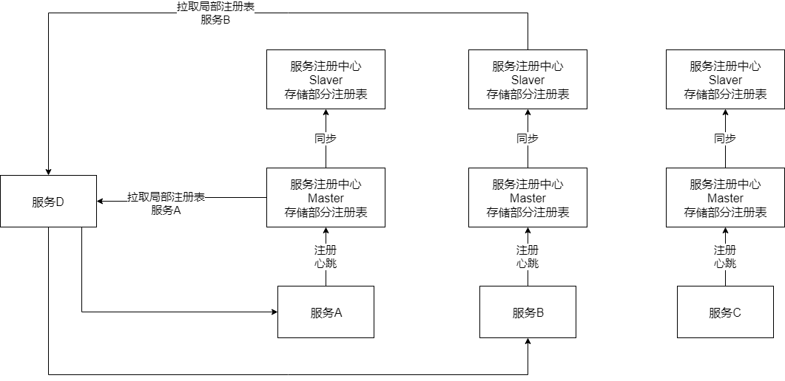

​		之前说过ZooKeeper和Eureka由于自己的特性，都不太适合支撑大规模的服务实例。Eureka是peer-to-peer模式，每台机器都是高并发请求的话会有瓶颈。而ZooKeeper是每次服务上下线，就会全量通知其他服务，导致网络宽带被打满，这也是一个瓶颈。具体可以查看[服务注册中心的选型调研]([https://gd-cking.github.io/CKING.github.io/2019/08/11/%E6%9C%8D%E5%8A%A1%E6%B3%A8%E5%86%8C%E4%B8%AD%E5%BF%83%E7%9A%84%E9%80%89%E5%9E%8B%E8%B0%83%E7%A0%94/](https://gd-cking.github.io/CKING.github.io/2019/08/11/服务注册中心的选型调研/))这篇文章。那么怎样才能实现一个能抗住上万服务实例的注册中心呢？

​		目前大公司的服务注册中心为了能支撑大规模的服务实例，基本都是自研服务注册中心。基本的思路就是实现一个**分布式服务注册中心**。主要设计逻辑包括：**分片存储服务注册表、支持横向扩容、每台机器均摊高并发请求、各个服务主动拉取注册表信息，避免方向通知网卡被打爆**等等。

​		简单的原理图如下所示：

