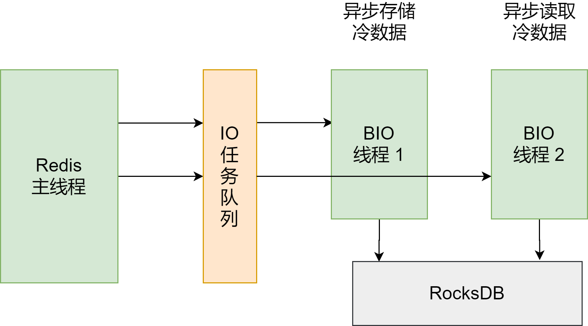

微博的业务有很多，例如让红包飞活动、粉丝数、用户数、音乐榜单等。同时，这些业务面临的用户体量非常大，业务使用 Redis 存取的数据量经常会达到 TB 级别。作为直接面向终端用户的应用，微博用户的业务体验至关重要，这些都需要技术的支持。我们总结下微博对 Redis 的技术需求：

- 能够提供高性能、高并发的读写访问，保证读写延迟低
- 能够支持大容量存储
- 可以灵活扩展，对于不同业务能进行快速扩容

因此，微博对 Redis 自身做了一些改进

## 微博对 Redis 的基本改进

微博对于 Redis 的基本改进可以分成两类：避免阻塞和节省内存

首先，针对持久化需求，他们使用了全量 RDB 加增量 AOF 复制结合的机制，这就避免了数据可靠性或性能降低的问题。当然，Redis 在官方 4.0 以后，也增加了混合使用 RDB 和 AOF 的机制

其次，在 AOF 日志写入刷盘时，用额外的 BIO 线程负责实际的刷盘工作，这可以避免 AOF 日志慢速刷盘阻塞主线程的问题

再次，增加了 `aofnumber` 配置项。这个配置项可以设置 AOF 文件的数量，控制 AOF 写盘时的总文件量，避免了写入过多的 AOF 日志文件导致的磁盘写满问题

最后，在主从复制机制上，使用独立的复制线程进行主从库同步，避免对主线程的阻塞影响

在节省内存方面，微博有一个典型的优化，就是定制化数据结构

在使用 Redis 缓存用户的关注列表时，针对关注列表的存储，他们定制化设计了 LongSet 数据类型。这个数据类型是一个存储 Long 类型元素的集合，它的底层数据结构是一个 Hash 数组，在设计 LongSet 类型之前，微博是用 Hash 集合类型来保存用户关注列表，但是，Hash 集合类型在保存大量数据时，内存空间消耗很大

而且，当缓存的关注列表被从 Redis 中淘汰时， 缓存实例需要从后台数据库中读取用户关注列表，在用 `HMSET` 写入 Hash 集合，在并发请求压力大的场景下，这个过程会降低缓存性能。跟 Hash 集合相比，LongSet 类型底层使用 Hash 数组保存数据，既避免了 Hash 表较多的指针开销，节省内存，也可以实现快速存储

对此，总结了两个经验：

第一个经验是：高性能和省内存始终都是应用 Redis 要关注的重点，这和 Redis 在整个业务系统中的位置是密切相关的

Redis 通常是作为缓存再数据库层前端部署，就需要能够快速地返回结果。另外，Redis 使用内存保存数据，一方面带来了访问速度快的优势；另一方面，也让我们在运维时需要特别关注内存优化

第二个经验是，在实际应用中需要基于 Redis 做定制化工作或二次开发，来满足一些特殊场景的需求，就像微博定制化数据结构

除了这些改进工作，为了满足大容量存储需求，他们还把 RocksDB 和 磁盘结合起来使用，以扩大单实例的容量

## 微博如何应对大容量数据存储需求？

微博业务要保存的数据经常会达到 TB 级别，这就需要扩大 Redis 实例的存储容量了

针对这个需求，微博对数据区分冷热度，把热数据保留在 Redis 中，而把冷数据通过 RocksDB 写入底层的硬盘

在微博的业务场景中，冷热数据是比较常见的。比如，有些微博话题刚发生时，热度非常高，会有海量的用户访问这些话题，使用 Redis 服务用户请求就非常有必要

但是，等到话题热度过了以后，访问人数就会急剧下降，这些数据就变为冷数据了。这个时候，冷数据就可以从 Redis 迁移到 RocksDB，保存在硬盘中。这样一来，Redis 实例的内存就可以节省下来保存热数据，同时，单个实例能保存的数据量就由整个硬盘的大小来决定了。如下图：

从上图可以看到，Redis 是用异步线程在 RocksDB 中读写数据

读写 RocksDB 的延迟毕竟比不上 Redis 的内存访问延迟，这样做也是为了避免读写冷数据时，阻塞 Redis 主线程。至于冷数据在 SSD 上的布局和管理，都交给 RocksDB 负责

关于微博使用 RocksDB 和 SSD 进行扩容的优化工作，总结了两条经验：

首先，实现大容量的单实例在某些业务场景下还是有需求的。虽然我们可以使用切片集群的多实例分散保存数据，但是这种方法也会带来集群运维的开销，涉及到分布式系统的管理和维护。而且，切片集群的规模会受限，如果能增加单个实例的存储容量，那么，即使在使用较小规模的集群时，集群也能保存更多的数据

第二，如果想实现大容量的 Redis 实例，**借助与 SSD 和 RocksDB 来实现是一个不错的方案**。还有 360 开源的Pika，也是一个很好的参考

RocksDB 可以实现快读写入数据，同时使用内存缓存部分数据，也可以提供万级别的数据读取性能。而且，当前 SSD 的性能提升很快，单块 SSD 的盘级 IOPS 可以达到几十万级别。这些技术结合起来，Redis 就能够在提供大容量数据存储的同时，保持一定的读写性能

