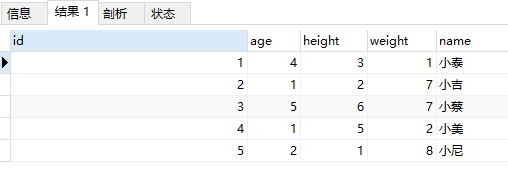
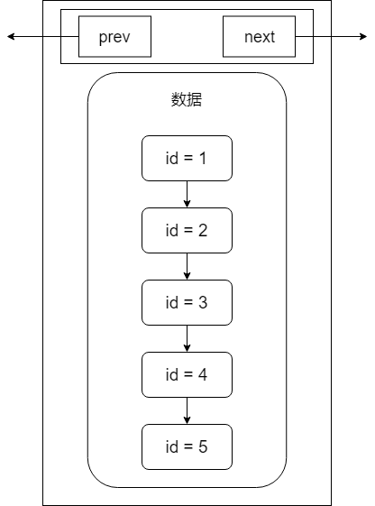
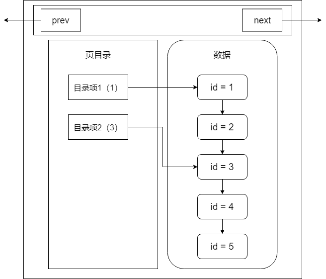
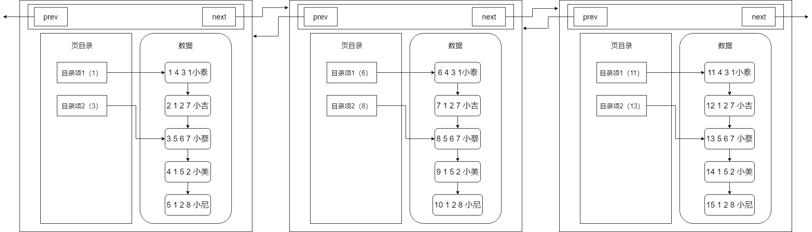
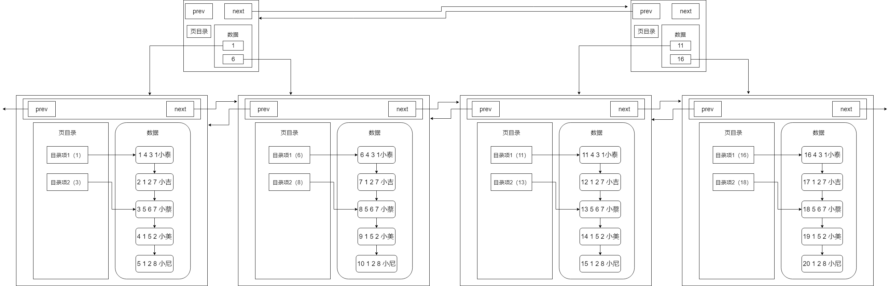
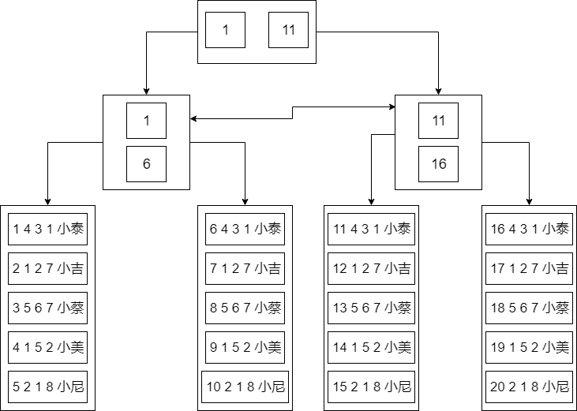
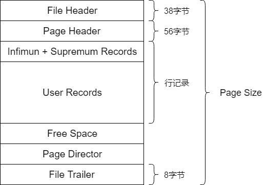
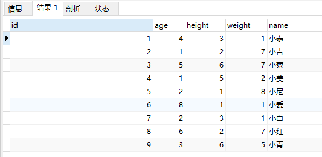
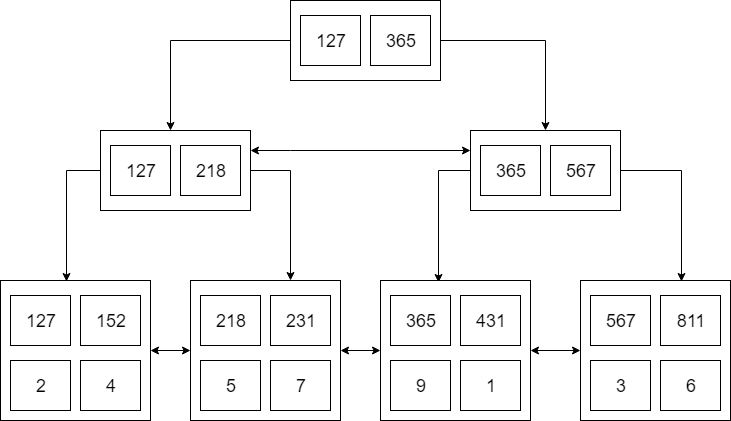

## 从一个简单的表开始

​		首先我们先建一个表，语句如下：

```sql
create table user(
    id int primary key,
    age int,
    height int,
    weight int,
    name varchar(32)
)engine = innoDb;
```

​		然后往这个表中插入一些数据：

```sql
INSERT INTO user(id,age,height,weight,name)VALUES(2,1,2,7,'小吉');
INSERT INTO user(id,age,height,weight,name)VALUES(5,2,1,8,'小尼');
INSERT INTO user(id,age,height,weight,name)VALUES(1,4,3,1,'小泰');
INSERT INTO user(id,age,height,weight,name)VALUES(4,1,5,2,'小美');
INSERT INTO user(id,age,height,weight,name)VALUES(3,5,6,7,'小蔡');
```

​		最后，我们查一下这些数据是否已经放入表中

```sql
select * from user;
```

​		结果如下：



​		可以看到，数据已经完整地放到我们创建的user表中。但是有一个地方需要注意：**我们插入的数据都是乱序的，但MySQL好像按照id给我们的数据排了序**。为什么会出现MySQL在我们没有显式排序的情况下，默默帮我们排序了？它是在什么时候进行排序的？

## 页的引入

​		在操作系统的概念中，当我们往磁盘中取数据，假设要取出的数据的大小是1KB，但是操作系统并不会只取出这1KB的数据，而是会取出4KB的数据，因为操作系统的一个页表项的大小是4KB。那为什么我们主需要1KB的数据，但是操作系统要取出4KB的数据呢？

​		这就涉及到一个程序局部性的概念，大概就是“**一个程序在访问了一条数据之后，在之后会有极大可能再次访问这条数据和访问这条数据的相邻数据**”。所以索性直接加载4KB的数据到内存，下次要访问这一页的数据时，直接从内存中找，可以减少磁盘IO次数。因此磁盘IO是影响程序性能主要的因素，因为磁盘IO和内存IO的速度是不可同日而语的。

​		我们回到数据库层面中，重新理解页的概念。假设还是我们刚才插入的那些数据，我们现在要找id=5的数据，依照最原始的方式，我们一定会想到的就是`遍历`。这也是我们刚开始学计算机的时候最常用的寻找数据的方式。我们来看看，以遍历的方式，我们找到id=5的数据，需要经历几次磁盘IO。

> ​		首先，我们得先从id=1的数据开始读起，然后判断是否是我们需要的数据，如果不是，就再取id=2的数据，再进行判断，循环往复。在MySQL帮我们排好序之后，我们需要经历五次磁盘IO，才能将5号数据找到并读出来。

​		如果引入页的概念后，我们是如何读取数据的。

​		在引入页的概念后，MySQL会将多条数据存入一个叫“页”的数据结构中，当MySQL读取id=1的数据时，会将id=1数据所在的页整页读到内存中，然后在内存中进行遍历判断，由于内存的IO速度比磁盘高很多，所以相对于磁盘IO，几乎可以忽略不计。

​		假设一页可以存4条数据，那么我们第一次读取id=1的数据，并且将id=1到id=4的数据全部读到内存中，这是第一次磁盘IO。第二次将读取id=5的数据到内存中，这是第二次磁盘IO。我们只需要经历2次磁盘IO就可以找到id=5的这条数据。

​		但其实，在MySQL的InnoDB引擎中，页的大小是16KB，是操作系统的4倍，而int类型的数据是4个字节，其他类型的数据的字节数通常也在4000字节以内，所以一页是可以存放很多条数据的。而**MySQL的数据正是以页为基本单位组合而成的**。



​		上图是我们目前为止所理解的页的结构，它包含我们的多条数据。另外，MySQL的数据以页组成，那么它有指向下一页的指针和指向上一页的指针。

​		到这里，可以回答第一个问题。MySQL实际上就是在我们插入数据的时候，就帮我们在页中排好了序。至于为什么排序，接着往下看。

## 排序对性能的影响

​		上面我们提了一个问题，**为什么数据库再插入数据时要对其进行排序呢**？这就涉及到一个数据库查询流程的问题了。无论如何，我们是绝对不会平白无故地在插入数据时增加一个操作让流程复杂化的，所以插入数据时排序一定有其目的，就是**优化查询的效率**。而我们不难看出，页内部存放数据的模块，实质上就是一个链表结构，链表的特点就是增删快，查询慢。所以优化查询的效率是必须的。

## 基于单页模式存储的查询流程

​		还是基于上面的那张页图来说，我们插入了五条数据，id分别是从1-5，那么假设我要找一个表中不存在的id，假设id = -1，那么查询的流程就是：

> ​		将id=1的这一整页数据取出，进行逐个比对，那么当我们找到id=1的这条数据时，发现这个id大于我们所需要找的那个id。由于数据库再插入数据时，已经进行过排序了，那么在id=1的数据后面，都是id > 1的数据，所以我们就不需要再继续往下找了。

​		如果在插入时没有进行排序，那我们需要在继续往下寻找，逐条查找直到结尾也没有找到这条数据，才能返回不存在这条数据。当然，这只是排序优化的冰山一角。

## 上述页模式可能带来的问题

​		说完了排序，我们就分析一下上面的那张页图，对于大数据量下有什么弊端，或者说，我们可以怎么对这个模式进行优化。

​		不难看出，现阶段我们了解的页模式中，只有一个功能，**就是在查询某条数据的时候直接将一整页的数据加载到内存中，以较少磁盘IO次数，从而提高性能**。但是，我们也可以看到，现在的页模式内部，实际上是采用了链表的结构，前一条数据指向后一条数据，本质上还是通过数据的逐条比较来取出特定的数据。

​		如果这一页中有一百万条数据，我们要查的数据正好在最后一个，那么我们是不是一定要从前往后找到这一条数据呢r？如果是这样，我们需要查找的次数就达到了一百万次，即使是在内存中查找，这个效率也是不高的。那么有什么办法来优化这种情况下的查找效率呢？

## 页目录的引入

​		打个比方，我们在看书的时候，如果要找到某一节，而这一节我们并不知道在哪一页，我们不需要从前往后，一节一节寻找我们需要的内容。以为在书的前面，存在目录，它会告诉你这一节在哪一页。**在数据库的页中，实际上也使用了这种目录的结构，这就是页目录**。

​		在引入页目录之后，我们所理解的页结构，就变成了这样：



​		分析下这张图，实际上页目录就像是我们在看书的时候书本的目录一样，目录项1就相当于第一节，目录项2就相当于第二节，而每一条数据就相当于书本的每一页，这张图就可以解释成：**第一节从第一页开始，第二节从第三页开始。而实际上，每个目录项会存放自己这个目录项当中最小的id，也就是说，目录项1中会存放1，而目录项2会存放3。**

​		对比一下数据库在没有页目录时候的查找流程，假设要查找id=3的数据，在没有页目录的情况下，需要查找id=1、id=2、id=3，三次才能找到该数据，而如果有页目录之后，只需要先查看一下id=3存在于哪个目录项下，然后直接通过目录项进行数据的查找即可，如果在该目录项下没有找到这条数据，那么就可以直接确定这条数据不存在，这样就大大提升了数据库的查找效率。但是这种页目录的实现，首先就需要基于数据是在已经进行过排序的场景下，才可以发挥其作用，所以到这里，大家应该明白第二个问题了，为什么数据库在插入时会进行排序，这才是真正发挥排序的作用的地方。

## 页的扩展

​		在上文中，我们基本上说明白了数据库中页的概念，以及它是如何基于页来减少磁盘IO次数，以及排序是如何优化查询的效率的。

​		那么第三个问题：在开头说页的概念的时候，我们有说过，MySQL中每一页的大小只有16KB，不会随着数据的插入而自动扩容，所以这16KB不可能存下我们所有的数据，那么必定会有多个页来存储数据。那么在多页的情况下，MySQL中又是怎么组织这些页的呢？

​		针对这个问题，我们继续画出来我们现在多了解的多页的结构图：



​		可以看到，在数据不断变多的情况下，MySQL会再去开辟新的页来存放新的数据，而每个页都有指向下一页的指针和指向上一页的指针，将多有页组织起来（这里修改了数据，将每一列的数据都放到了数据区中，其中第一个空格之前的代表id）,第一页中存放id为1-5的数据，第二页存放id为6-10的数据，第三页存放id为11-15的数据。需要注意的是，**在开辟新页的时候，我们插入的数据不一定是在新开辟的页上，而是要进行所有页的数据比较，来决定这条插入的数据放在哪一页上，而完成数据插入后，最终的多页结构会像上图中画的那样**。

## 多页模式

​		在多页模式下，MySQL终于完成多数据的存储，就是采用开辟新页的方式，将多条数据放在不同的页中，然后同样采用链表的数据结构，将每一页连接起来，那么可以思考第四个问题：**多页情况下是否对查询效率有影响呢？**

### 多页模式对于查询效率的影响

​		答案是肯定的，多页会对查询效率产生一定的影响，影响主要就体现在，多页其本质也是一个链表结构，只要是链表结构，查询效率一定不会高。

​		假设数据又非常多，数据库就会开辟非常多的新页，而这些新页就会像链表一样连接在一起，当我们要在这么多页中查询某条数据时，它还是会从头节点遍历到存在我们需要的那条数据所存在的页上。我们好不容易通过页目录优化了页中数据的查询效率，现在又出现了以页为单位的链表。

### 优化多页模式

​		由于多页模式会影响查询的效率，那么肯定需要有一种方式来优化多页模式下的查询。既然我们可以用页目录的优化页内的数据区，那么我们也可以采取类似的方式来优化这种多页的情况。是的，页内数据区和多页模式本质上都是链表，的确可以采用相同的方式来对其进行优化，它就是目录页。

​		我们对比页内数据区，来分析如何优化多页结构。在单页时，我们**采用了页目录的目录项来指向一行数据，这条数据就是存在于这个目录项中的最小数据，那么就可以通过页目录来查找所需数据。**

​		所以对于多页结构也可以采用这种方式，使用一个目录项来指向某一页，而这个目录项存放的就是这一页中存放的最小数据的索引值。和页目录不同的地方在于，**这种目录管理的级别是页，而页目录管理的级别是行。**

​		分析到这里，我们多页模式的结构就会是下图所示的那样：



​		存在一个目录页还管理目录，目录页中的数据存放就是指向的那一页中最小的数据。这里需要注意的一点是：**其实目录页的本质也是页，普通页中存放的数据是项目数据，而目录页中存的数据是普通页的地址。**

​		假设我们要查找id = 19的数据，按照以前的查找方式，我们需要从第一页开始查找，发现不存在那么再到第二页查找，一直找到第四页才能找到id = 19的数据，但是如果有了页目录，就可以使用id = 19与页目录中存放的数据进行比较，发现19大于任何一条数据，于是进入id = 16指向的页进行查找，然后再通过页内的页目录行级别的数据的查找，很快就可以找到id为19的数据了。随着数据越来越多，这种结构的效率相对于普通的多页模式，优势也就越来越明显。

​		**相信对MySQL比较了解的同学已经发现，我们画的最终的这幅图，就是MySQL中的一种索引结构-B+树。**

## B+树的引入

​		接着往下说，我们将我们画的存在在目录页的多页模式图宏观化，可以形成下面的这张图：



​		这就是我们兜兜转转由简到繁形成的一颗B+树。和常规B+树有些许不同，这是一棵MySQL意义上的B+树，MySQL上的一种索引结构，其中的每个节点就可以理解为是一个页，而叶子节点也就是数据页，除了叶子节点以外的节点就是目录页。

​		这一点在图中也可以看出来，非叶子节点只存放了索引，而只有叶子节点存放了真是的数据，这也是符合B+树的特点。

### B+树的优势

由于叶子节点上存放了所有的数据，并且有指针相连，每个叶子节点在逻辑上是相连的，所以对于查找范围比较友好。

B+树的所有数据都在叶子节点上，所以B+树的查询效率稳定，一般都是查询3次。

B+树有利于数据库的扫描。

B+树有利于磁盘的IO，因为它的层高基本不会因为数据扩大而增高（三层树结构大概可以存放两千万数据量）。

## 页的完整结构

​		说完了页的概念和页时如何一步一步地组合成为B+树的结构之后，相信大家对于页都有了一个比较清楚的认知。所以这里就要开始说说官方的概念了。基于我们上文所说的，给出一个完整的页结构，也算是对上文中理解的页结构的一种补充。



​		上图为Page数据结构，File Header字段用于记录Page的头信息，其中比较重要的是`FIL_PAGE_PREV`和`FIL_PAGE_NEXT`字段，通过这两个字段，我们可以找到该页的上一页和下一页，实际上所有页通过这两个字段可以形成一条双向链表。

> ​		Page Header字段用于记录Page的状态信息。接下来的Infimum和Supremum是两个伪行记录，Infimum（下确界）记录比该页中任何主键值都要小的值，Supremum（上确界）记录比该页中任何主键值都要大的值，这个伪记录分别构成了页中记录的边界。
>
> ​		User Records中存放的是实际的数据行记录。Free Space中存放的是空闲空间，被删除的行记录会被记录成空闲空间。Page Directory记录着与二叉查找相关的信息。File Trailer存储用于检测数据完整性的校验和等数据。

## 基于B+树聊赖MySQL的其他知识点

​		看到这里，我们已经了解了MySQL从单条数据开始，到通过页来减少磁盘IO次数，并且在页中实现了页目录来优化页中的查询效率，然后使用多页模式来存储大量的数据，最终使用目录页来实现多页模式的查询效率并形成我们口中的索引结构---B+树。接下来，我们说说MySQL的其他知识点。

### 聚簇索引和非聚簇索引

​		简单地说，所谓聚簇索引，就是将索引和数据放到一起，找到索引也就找到了数据，我们刚才看到的B+树索引就是一种聚簇索引。而非聚簇索引就是将数据和索引分开，查找时需要先查找到索引，然后通过索引回表找到相应的数据。InnoDB有且只有一个聚簇索引，而MyISAM中都是非聚簇索引。

### 联合索引的最左前缀匹配原则

​		在MySQL数据库中不仅可以对某一列建立索引，还可以对多列建立一个联合索引，而联合索引存在一个最左前缀匹配原则的概念，如果基于B+树来理解这个最左前缀匹配原则，相对来说就会容易很多了。

​		首先我们基于文首的这张表建立一个联合索引：

```sql
create index idx_obj on user(age asc,height asc,weight asc)
```

​		我们已经了解了索引的数据结构是一棵B+树，也了解了B+树优化查询效率的其中一个因素就是对数据进行了排序，那么我们在创建idx_obj这个索引的时候，也就相当于创建了一颗B+树索引，而这个索引就是**依据联合索引的成员来进行排序**，这里是age，height，weight。

​		InnoDB中只要有主键被定义，那么主键列被作为一个聚簇索引，而其他索引都被作为非聚簇索引，所以自然而然的，这个索引就会是一个非聚簇索引。所以根据这些我们可以得出结论：

- idx_obj这个索引会根据age，height，weight进行排序

- idx_obj这个索引是一个非聚簇索引，查询时需要回表

​		根据这两个结论，首先需要了解的就是，如何排序？单列排序很简单，就是比大小。但多列排序是基于什么原则呢？实际上在MySQL中，联合索引的排序有这么一个原则，从左到右依次比较大小。就拿刚才建立的索引，它会先去比较age的大小，如果age的大小相同，那么比较height的大小，如果height也无法比较大小，那么就比较weight的大小，最终对这个索引进行排序。

​		那么根据这个排序我们也可以画出一个B+树，这里就不像上文画的那么详细了，简化一下：

​		数据：



​		B+树：



​		注意，**此时由于是非聚簇索引，所以叶子节点不在有数据，而是存了一个主键索引，最终会通过主键索引来回表查询数据**。

​		B+树的结构有了，就可以通过这个来理解最左前缀匹配原则了。我们先下一个查询语句：

```sql
SELECT * FROM user WHERE age=1 and height = 2 and weight = 7
```

​		毫无疑问，这条语句一定会走idx_obj这个索引。那我们再看一个语句：

```sql
SELECT * FROM user WHERE height=2 and weight = 7
```

​		这条SQL会走索引吗？答案是否定的。为什么这条语句不会走索引？上文中我们提到了一个多列的排序原则，是从左到右进行比较然后排序的，而我们的`idx_obj`这个索引从左到右依次是age，height，weight，所以当我们使用height和weight来作为查询条件时，由于age的缺失，那么就无法从age来进行比较了。

​		难道不能直接用height和weight来进行比较吗？显然是不可以的。举个例子，**我们把缺失的这一列写作一个问号，那么这条语句的查询条件就变成了`?27`，那么我们从这棵B+树的根节点开始，根节点上有127和365，那么以height和weight来进行比较的是，走的一定是127这一边，但是如果缺失的数字是大于3的呢？比如427,527,627，那么如果走索引来查询数据，将会丢失数据，错误查询。所以这种情况下是不会走索引查询的。这就是最左前缀匹配原则的成因。**

> ​		1、最左前缀匹配原则，MySQL会一直向右匹配直到遇到范围查询（>、<、between、like）就停止匹配。比如`a = 3 and b = 4 and c > 5 and d = 6`，如果建立（a, b, c, d）顺序的索引，d是无法使用索引的，如果建立（a, b, d, c）的索引则都可以使用到。a、b、d的顺序可以任意调整。
>
> ​		2、=和in可以乱序。比如`a = 1 and b = 2 and c = 3`，建立(a, b, c)索引可以任意顺序，MySQL的查询优化器会帮你优化成索引可以识别的形式。

​		根据我们了解的可以得出结论：**只要无法进行排序比较大小的，就无法走联合索引。**

​		再看几个语句：

```sql
SELECT * FROM user WHERE age=1 and height = 2
```

​		这条语句是可以走idx_obj索引的，因为它可以通过比较（12? < 365）。

```sql
SELECT * FROM user WHERE age=1 and weight=7
```

​		这条语句也是可以走idx_obj索引的，因为它也可以通过比较(1?7 < 364)，走左子树，但是实际上weight并没有用到索引，因为根据最左匹配原则，如果有两页的age都等于1，那么会去比较height，但是height在这里并不作为查询条件，所以MySQL会将这两页全都加载到内存中进行最后的weight字段的比较，进行扫描查询。

```sql
SELECT * FROM user where age>1
```

​		这条语句不会走索引，但是可以走索引。这句话什么意思呢？这条SQL很特殊，由于其存在可以比较的索引，所以它走索引也可以查询出结果，但是由于这种情况是范围查询并且是全字段查询，如果走索引，还需要进行回表，MySQL查询优化器就会认为走索引的效率比全表扫描还要低，所以MySQL会去优化它，让它直接进行全表扫描。

```sql
SELECT * FROM user WHERE age=1 and height>2 and weight=7
```

​		这条语句可以走索引的，因为它可以通过age进行比较，但是weight不会用到索引，因为height是范围查找，与第二条语句类似，如果有两页的height都大于2，那么MySQL会将两页的数据都加载进内存，然后再来通过weight匹配正确的数据。

### 为什么InnoDB只有一个聚簇索引，而不将所有索引都是用聚簇索引

​		因为聚簇索引是将索引和数据都存放在叶子节点中，如果所有的索引都是用聚簇索引，则每一个索引都将保存一份数据，会造成数据的冗余，在数据量很大的情况下，这种数据冗余是很消耗资源的。

### 补充两个索引的点

​		**1、什么情况下会发生明明创建了索引，但是执行的时候并没有通过索引呢？**

​		查询优化器执行一条SQL语句的查询，可以有不同的执行方案，至于最终选择哪种方案，需要通过优化器进行选择，选择执行成本最低的方案。

​		在一条单表查询语句真正执行之前，MySQL的查询优化器会找出执行该语句所有可能使用的方案，对比之后找出成本最低的方案。这个成本最低的方案就是所谓的执行计划。优化过程大致如下：

- 根据搜索条件，找出所有可能使用的索引

- 计算全表扫描的代价

- 计算使用不同索引执行查询的代价

- 对比各种执行方案的代价，找出成本最低的那一个

​		**2、在费聚簇索引情况下通常需要通过叶子节点的指针回表查询数据，什么情况下不需要回表？**

​		覆盖索引。覆盖索引是指一个查询语句的执行只用从索引中就能够取得，不必从数据表中读取。也可以称之为实现了索引覆盖。

​		当一条查询语句符合覆盖索引条件时，MySQL只需要通过索引就可以返回查询所需要的数据，这样避免了查到索引后再返回表操作，减少I/O提高效率。

​		例如，表`covering_index_sample`中有一个普通索引`idx_key1_key2(key1, key2)`。当我们通过SQL语句：`select key2 from covering_index_sample where key1 = 'keytest';`的时候，就可以通过覆盖索引查询，无需回表。

​		例如上面的` SELECT age FROM user where age = 1 `。这句话就不需要进行回表查询。

## 结语

​		本文着重讲解关于MySQL的索引结果，从零开始慢慢构建了一个B+树索引，并且根据这个过程谈了B+树是如何一步一步去优化查询效率的。简单地归纳一下就是：

> ​		排序：优化查询的根本，插入时进行排序实际上就是为了优化查询的效率。
>
> ​		页：用于减少IO次数，还可以利用程序局部性原理，来稍微提高查询的效率。
>
> ​		页目录：用于规避链表的软肋，避免在查询时进行链表的扫描。
>
> ​		多页：数据量增加的情况下开辟新页来保存数据。
>
> ​		目录页：特殊的页目录，其中保存的数据是页的地址。查询时可以通过目录页快速定位到页，避免多页的扫描。

## 参考资料

​		转载自[索引很难么？带你从头到尾捋一遍MySQL索引结构，不信你学不会！](https://mp.weixin.qq.com/s/ygsG_B4fQmSxNinIpAq72A)


​		