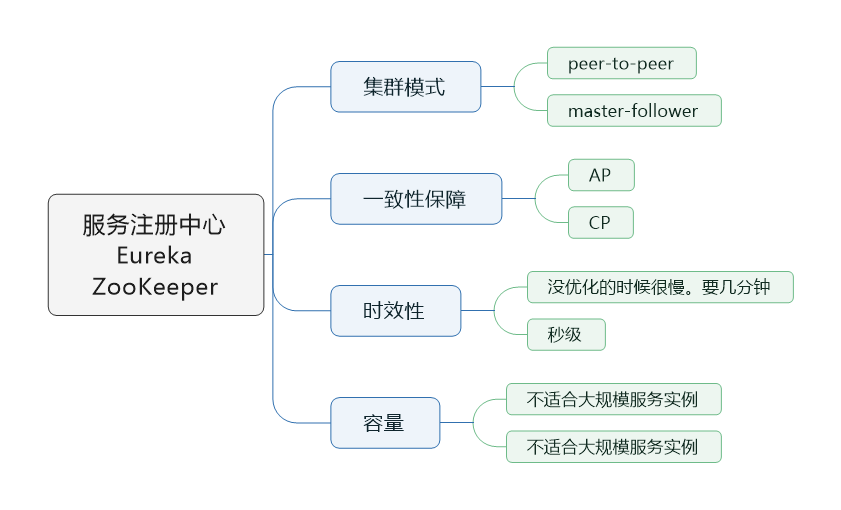
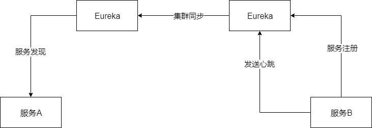
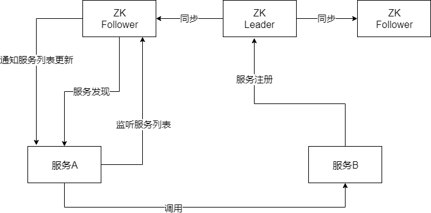

> 本节思维导图

​		目前市场上使用最多的服务注册中心应该是Eureka和Zookeeper，当然Consul和Nacos，也在慢慢崛起。本文主要从集群模式、一致性保障、时效性和容量这几个角度来讨论Eureka和ZooKeeper的区别。

## 服务注册发现的集群模式

### Eureka

​		Eureka的集群模式，简单地说就是peer-to-peer。部署一个集群，但是集群里每个机器的地位是对等的，各个服务可以向任何一个Eureka实例进行服务注册和发现，集群里的任何一个Eureka实例收到请求后，会自动同步给其他所有的Eureka实例。除了注册信息，服务发送的心跳信息也会同步到其他Eureka实例上。如图所示：

### ZooKeeper

​		ZooKeeper的集群模式，简单就是Leader+Follower，其中只有Leader可以负责写，即服务注册，领完，它还负责把数据同步给Follow。服务发现的时候，Leader/Follow都可以读。

## 一致性保障：CP or AP

​		CAP原则包含如下三个元素：

- C（Consistency）：一致性。在分布式系统中的所有数据备份，在同一时刻具有同样的值，所有节点在同一时刻读取的数据都是最新的数据副本。
- A（Availability）：可用性。好的相应性能。完全的可用性指的是在任何故障模型下，服务都会在有限的时间内处理完成并进行相应。
- P（Partition tolerance）：分区容错性。尽管网络上有部分消息丢失，但系统仍然可以继续工作。

CAP原理证明，任何分布式系统只可同时满足以上两点，无法三者兼顾。由于关系型数据库是单节点无复制的，因此不具有分区容忍性，但是具有一致性和可用性；而分布式的服务化系统都需要满足分区容忍性，那么我们必须在一致性和可用性之间进行权衡。

### Eureka

​		**Eureka是AP模式的**，即它牺牲了一致性，而实现可用性和分区容错性。因为Eureka是peer-to-peer模式，可能数据还没有同步互过去，自己就挂掉了，但服务实例依然可以从别的Eureka实例上拉去注册表，但是看到的数据就不是最新的收据了。但Eureka保证了最终一致性。例如服务A除了注册服务之外还会发送心跳信息，当服务A发现Eureka1实例挂掉之后，会向另一个活着的Eureka2实例发送心跳信息，Eureka2就能感知到服务A的存在并更新注册表的数据，从而实现最终一致性。

### ZooKeeper

​		**ZooKeeper是CP模式的**。ZooKeeper是有一个Leader节点会接收数据，然后同步其他节点，一旦Leader挂掉了，就要重新选举Leader，这个过程为了一致性，就会牺牲看可用性，会不可用一段时间，那么就可以继续写数据了，保证了一致性。即ZooKeeper是同步数据期间和Leader选举期间，都处于不可用阶段，等结束之后就可以继续使用，但这样却保证了强一致性。

## 服务注册发现的时效性

​		ZooKeeper的时效性更好，注册或者是挂了，一般秒级就能感知到。

​		Eureka，默认配置非常糟糕。服务发现感知要到几十秒，甚至分钟级别。上线一个新的服务，到其他服务可以发现它，极端情况下可能要一分钟的时间。（30秒ReadWriteCache更新ReadOnlyCacheMap数据，再30秒服务实例去拉取ReadOnlyCacheMap的数据）。

​		在默认情况下，服务故障，隔60秒才去检查心跳，发现这个服务上一次心跳是在30秒之前。在隔60秒去检查心跳，超过90秒没有心跳，才会认为这个服务已经挂了，这样子就已经过去两分钟了。

​		因此极端情况下，你的服务挂掉了，到其他服务感知到，可能需要两三分钟时间，比较漫长。

## 容量

​		Eureka很难支撑大规模的服务实例，因为每个Eureka实例都要接受所有服务的注册请求信息和心跳信息，实例多了压力太大扛不住，很难做到几千服务实例。比如服务实例太多，达到上千个，每秒钟的有上千个心跳信息，那要同时同步到其余心跳信息。压力会比较大。

​		ZooKeeper同样不适合大规模的服务实例，因为服务上线的时候，需要瞬间推送数据通知到所有的其他服务实例，所以一旦服务规模太大，到了几千个服务实例的时候，会导致网络带宽被大量占用。