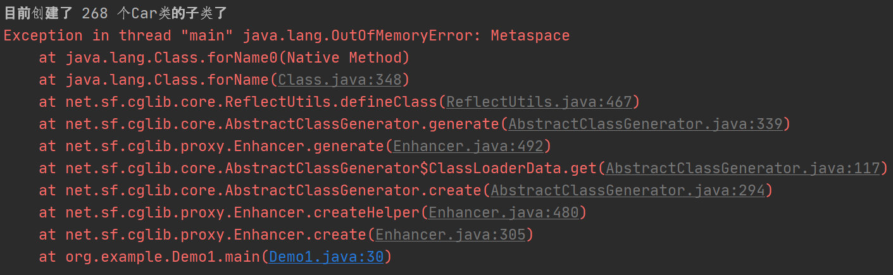

## 模拟 Metaspace 内存溢出

Metaspace 区域发生内存溢出的一个场景，就是如果我们在程序里不停地动态生成类，就会导致不停地加载类到 Metaspace 区域里去，而且这些动态生成的类必须还是不能被回收的。接着一旦 Metaspace 区域满了，就会触发 Full GC 连带着回收 Metaspace 中的类，但是此时大量的类是不能被回收的。


因此即使触发过 Full GC 过后，Metaspace 区域几乎还是不能放下任何一个类，此时必然会触发 Metaspace 区域的内存溢出。


### CGLIB 动态生成类的代码示例

以下代码时用 Maven 来进行项目构建的，如果要用 CGLIB 来动态生成一些类，那么必须在你项目的 pom.xml 中引入以下的一些依赖

```xml
<dependency>
	<groupId>cblib</gruopId>
	<artifactId>cglib</artifactId>
	<version>3.3.0</version>
</dependency>
```


接着就可以使用 CGLIB 来动态生成类了，代码如下：

```java
import net.sf.cglib.proxy.Enhancer;
import net.sf.cglib.proxy.MethodInterceptor;
import net.sf.cglib.proxy.MethodProxy;

import java.lang.reflect.Method;

public class Demo1 {

    public static void main(String[] args) {
        long counter = 0;
        while (true) {
            System.out.println("目前创建了 " + (++counter) + " 个Car类的子类了");
            Enhancer enhancer = new Enhancer();
            enhancer.setSuperclass(Car.class);
            enhancer.setUseCache(false);
            enhancer.setCallback(new MethodInterceptor() {
                @Override
                public Object intercept(Object o, Method method, Object[] objects, MethodProxy methodProxy) throws Throwable {
                    if(method.getName().equals("run")) {
                        System.out.println("启动汽车之前，先进行自动的安全检查。。。。。");
                        return methodProxy.invokeSuper(o, objects);
                    }else {
                        return methodProxy.invokeSuper(o, objects);
                    }
                }
            });

            Car car = (Car) enhancer.create();
            car.run();
        }
    }

    static class Car {
        public void run() {
            System.out.println("汽车启动，开始行使。。。。。。");
        }
    }
}

```


跟大家解释以下上面的代码。首先我们可以看到我们在这里定义了一个类，代表了一个汽车，它有一个 run() 方法，执行的时候就会启动汽车，开始让汽车行驶，如下：

```java
 static class Car {
        public void run() {
            System.out.println("汽车启动，开始行使。。。。。。");
        }
 }
```


接着我们看下面的代码片段，我们通过 CGLIB 的 Enhancer 类生成一个 Car 类的子类。从这里开始，就动态生成类了，如下：

```java
Enhancer enhancer = new Enhancer();
enhancer.setSuperclass(Car.class);
enhancer.setUseCache(false);
```


你权且当做 Enhancer 是用来生成类的一个 API，代码中的 `enhancer.setSuperclass(Car.class);` 的意思是说 Enhancer 生成的类是 Car 类的子类，Car 类是生成类的父类。至于那个 UseCache 是什么意思，就先别管了。


既然 Enhancer 动态生成的类是 Car 的子类，那么子类也会有 Car 的 run() 方法，而且我们在调用子类的 run() 方法的时候可以做点手脚，如下：

```java
 enhancer.setCallback(new MethodInterceptor() {
 	@Override
    public Object intercept(Object o, Method method, Object[] objects,
    MethodProxy methodProxy) throws Throwable {
    	if(method.getName().equals("run")) {
        	System.out.println("启动汽车之前，先进行自动的安全检查。。。。。");
            return methodProxy.invokeSuper(o, objects);
        }else {
            return methodProxy.invokeSuper(o, objects);
        }
    }
 });
```


这个片段的意思是，如果你调用子类对象的 run() 方法，会先被这里的 MethodInterceptor 拦截一下，如果判断了一下，如果你调用的 Method 是 run 方法，那么就先对汽车做一下安全检查。安全检查做完之后，再通过 "methodProxy.invokeSuper(o, objects)" 调用父类 Car 的 run() 方法，去启动汽车，这行代码就会执行到 Car 类的 run() 方法。


到此为止，我们就已经通过 CGLIB 的 Enhancer 生成了一个 Car 类的子类了，而且定义好了对这个子类调用继承自父类的 run() 方法的时候，先干点别的，再调用父类的 run() 方法。


这样子，就跟下面手写的一个 Car 子类是类似的

```java
static class SafeCar extends Car {

	@Override
	public void run() {
		System.out.println("汽车启动，开始行使。。。。。。");
		super.run();
	}
}
```


### 限制 Metaspace 大小看内存溢出效果

接着我们可以设置一下这个程序的 JVM 参数，限制它的 Metaspace 区域小一点。例如我们用 `-XX:MetaspaceSize=10m -XX:MaxMetaspaceSize=10m`。接着我们可以在上述代码中做一下修改。大家看到上面的代码时有一个 while 循环的，所以它会不停地创建 Car 类的子类，我们在里面可以加一个计数器，就是看看当前创建了多少个 Car 的子类，如下：

```java
long counter = 0;
while(true) {
	System.out.println("目前创建了" + (++counter) + "个 Car 类的子类了");
}
```


接着用上述 JVM参数来运行这个程序即可，如图：




## 模拟 JVM 栈内存溢出

Metaspace 区域我们一般会设置为 512MB 左右的大小，这个大小只要你代码里没有自己胡乱生成类，一般都是够你存放一个系统运行时需要的类的。堆内存的大小，一般分配在机器内存的一半就差不多了，毕竟还要考虑其他对内存的使用。


最后一个内存区域就是栈内存区域。在一个基本的线上机器配置，比如 4 核 8G 的线上机器，其中 512M 给了 Metaspace，4G 给了堆内存（其中包括了年轻代和老年代），剩余只有 3G 左右的内存了，要考虑到操作系统自己也会用掉一些内存。那么剩余你就认为有一两个 GB 的内存可以留给栈内存好了。


通常来讲，我们会设置每个线程的栈内存为 1MB，假设你一个 JVM 进程内包括它自带的后台线程，你依赖的第三方组件的后台线程，加上你的核心工作线程（比如你部署在 Tomcat 中，那就是 Tomcat 的工作线程），还有你自己可能额外创建的一些线程，可能要你一个 JVM 中有 1000 个线程。那么 1000 个线程就需要 1GB 的栈内存空间，每个线程有 1MB 的空间。


所以 Metaspace 区域 + 堆内存 + 几百个线程的栈内存，就是 JVM 一共对机器上的内存资源的一个消耗，所以你也能理解这么一个道理：你要是给每个线程的栈内存分配过大的空间，那么会导致机器上能创建的线程数量变少，要是给每个线程的栈内存相对较小，能创建的线程就会比较多一些。当然，现在都建议给栈内存 1MB 就可以了。


### 示范栈内存溢出

先看一段代码：

```java
public class Demo2 {

    public static long counter = 0;

    public static void main(String[] args) {
        work();
    }

    public static void work() {
        System.out.println("目前是第 " + (++counter) + " 次调用方法");
        work();
    }
}
```


上面的代码就是 work() 方法调用自己，进入一个无限制的递归调用，陷入死循环，也就是在 main 线程的栈中，会不停地压入 work() 方法调用的栈帧，知道 1MB 的内存空间耗尽。


另外需要设置这个程序的 JVM 参数：`-XX:ThreadStackSize=1m`。通过这个参数设置 JVM 的栈内存为 1MB。接着运行代码，就会看到如下：

```verilog
目前是第 6203 次调用方法
Exception in thread "main" java.lang.StackOverflowError
```


也就是说，当这个线程调用了 6203 次方法之后，它的栈里压入了 6203 个栈帧，最终把 1MB 的栈内存给塞满了，引发了栈内存的溢出。


## 模拟 JVM 堆内存溢出

之前已经讲过堆内存溢出的原理，现在用代码给大家演示一下：

```java
public class Demo3 {

    public static void main(String[] args) {
        Long counter = 0L;

        List<Object> list = new ArrayList<>();
        while (true) {
            list.add(new Object());
            System.out.println("当前创建了第" + (++counter) + "个对象");
        }
    }
}
```


代码很简单，就是在一个 while 循环里不停地创建对象，而且对象全部都是放在 List 里面被引用的，也就是不能回收的。


如果你不停地创建对象，Eden 区满了，它们全部存活的话就会转移到老年代，反复几次之后老年代满了，然后 Eden 区再次满了，ygc 后存活对象再次进入老年代，此时老年代先 full gc，但是回收不了任何对象，因此 ygc 后的存活对象就一定是无法进入老年代的。


所以我们用 `-Xms10m -Xmx10m` 限制了堆内存大小总共就只有 10m，这样可以尽快触发堆内存的溢出。我们可以在控制台打印的信息看到如下：

```verilog
当前创建了第360145个对象
Exception in thread "main" java.lang.OutOfMemoryError: Java heap space
```


从这里看出，在 10M 的堆内存中，用最简单的 Object 对象搞到老年代被塞满大概需要 36 万个对象，然后堆内存实战放不下任何对象，此时就会 OutOfMemory 了，而且告诉你是 Java heap space，也就是堆空间发生了内存溢出。