> 本节思维导图

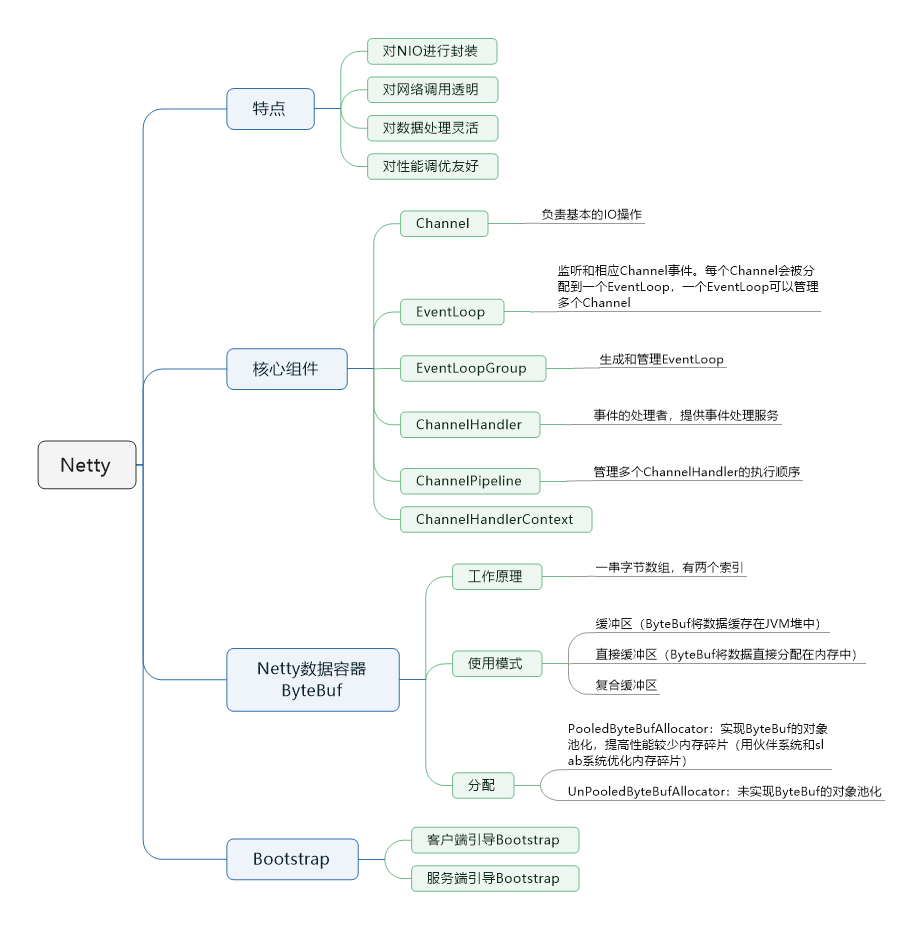

​		对于高性能的RPC框架，Netty作为异步通信框架，几乎成了必需品。例如Dubbo框架中通信组件，还有RocketMQ中生产者和消费者的通信，都是用了Netty。现在让我们开简单看一下Netty的基本架构和原理。

## Netty的特点与NIO

​		Netty是一个异步的、基于事件驱动的网络应用框架，它可以用来开发高性能服务端和客户端。以前编写网络调用程序的时候，我们都会在客户端创建一个Socket，通过这个Socket连接到服务端。服务端根据这个Socket创建一个Thread，用来发出请求。客户端在发起调用以后，需要等待服务端处理完成，才能继续后面的操作。这样线程会出现等待的状态。

​		如果客户端请求数越多，服务端创建的处理线程也会越多，JVM管理如此多的线程并不是容易的事。

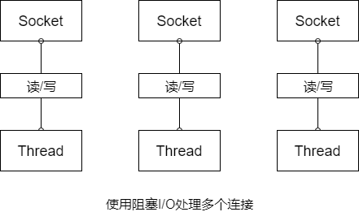

​		为了解决上述问题，退出了NIO的概念，就是（Non-blocking I/O）。其中Selector机制就是NIO的核心。当每次客户端请求时，会创建一个Socket Channel，并将其注册到Selector上（多路复用器），然后Selector关注服务端IO读写事件，此时客户端并不用等待IO事件完成，可以继续做接下来的工作。一旦服务端完成了IO读写操作，Selector会接到通知，同时告诉客户端IO操作已经完成。接到通知的客户端，就可以通过SocketChannel获取需要的数据了。

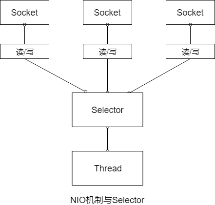

​		上面描述的过程有异步的意思，不过，Selector实现的并不是真正意义上的异步操作。因为Selector需要通过线程阻塞的方式监听IO事件变更，只是这种方式没有让客户端等待，是Selector在等待IO返回，并且通知客户端去获取数据。

​		谈好了NIO再来谈谈Netty。Netty作为NIO的实现，它适用于服务器/客户端通讯的场景，以及针对于TCP协议下的高并发应用。对于开发者来说，它具有以下特点：

- 对NIO进行封装，开发者不需要关注NIO的底层原理，只需要调用Netty组件就能完成工作。

- 对网络调用透明，从Socket建立TCP连接到网络异常的处理都做了包装

- 对数据处理灵活，Netty支持多种序列化框架，通过`ChannelHandler`机制，可以自定义“编/解码器”

- 对性能调优友好，Netty提供了线程池模式以及Buffer的重用机制（对象池化），不需要构件复制的多线程模型和操作队列。

## 从一个简单的例子开始

​		现在通过一个例子来讲解。假设有一个客户端去调用一个服务端，假设服务端叫做EchoServer，客户端叫做EchoClient，用Netty架构实现代码如下。

### 服务端代码

​		构建服务器端，假设服务器接受客户端传来的信息，然后在控制台打印。首先，生成EchoServer，在构件函数中传入需要监听的端口号。然后再编写服务的启动方法：

```java
package server;

import io.netty.bootstrap.ServerBootstrap;
import io.netty.channel.ChannelFuture;
import io.netty.channel.ChannelInitializer;
import io.netty.channel.EventLoopGroup;
import io.netty.channel.nio.NioEventLoopGroup;
import io.netty.channel.socket.SocketChannel;
import io.netty.channel.socket.nio.NioServerSocketChannel;

import java.net.InetSocketAddress;

public class EchoServer {

    private final int port;

    public EchoServer(int port) {
        this.port = port;
    }
    
    public void start() throws Exception{
        final EchoServerHandler serverHandler = new EchoServerHandler();

        // 1、创建EventLoopGroup
        EventLoopGroup group = new NioEventLoopGroup();

        try {
            // 2、创建ServerBootstrap
            ServerBootstrap b = new ServerBootstrap();
            b.group(group)
                    // 3、指定所使用的 NIO 传输 Channel
                    .channel(NioServerSocketChannel.class)
                    // 4、使用指定的端口设置套接字地址
                    .localAddress(new InetSocketAddress(port))
                    // 5、添加一个 EchoServerHandler 到 Channel 的 ChannelPipeline
                    .childHandler(new ChannelInitializer<SocketChannel>() {
                        @Override
                        protected void initChannel(SocketChannel socketChannel) throws Exception {
                            socketChannel.pipeline().addLast(serverHandler);
                        }
                    });
            // 6、异步绑定服务器：调用sync()方法阻塞等到直到绑定完成
            ChannelFuture f = b.bind().sync();

            System.out.println(EchoServer.class.getName() +
                    "started and listening for connections on " + f.channel().localAddress());

            // 7、获取Channel 的 CloseFuture，并且阻塞当前线程直到它完成
            f.channel().closeFuture().sync();
        }finally {
            // 8、关闭EventLoopGroup，释放所有的资源
            group.shutdownGracefully().sync();
        }
    }
}

```

​		Server的启动方法涉及到了一些组件的使用，例如EventLoopGroup、Channel。这些后面会讲解，这里有个大概的印象就好：

- 创建EventLoopGroup。

- 创建ServerBootstrap。

- 指定所使用的NIO传输Channel。

- 使用指定的端口设置套接字地址。

- 添加一个ServerHandler到Channel的ChannelPipeline。

- 异步地绑定服务器，调用sync()方法阻塞等待直到绑定完成。

- 获取Channel的CloseFuture，并且阻塞当前线程直到它完成。

- 关闭EventLoopGroup，释放所有的资源。

​        NettyServer启动以后会监听某个端口的请求，当接收到了请求就需要处理了。在Netty中客户端请求服务端，被称为“入站”操作。可以通过`ChannelInboundHandlerAdapter`实现，具体内容如下：

```java
package server;

import io.netty.buffer.ByteBuf;
import io.netty.buffer.Unpooled;
import io.netty.channel.ChannelFutureListener;
import io.netty.channel.ChannelHandler;
import io.netty.channel.ChannelHandlerContext;
import io.netty.channel.ChannelInboundHandlerAdapter;
import io.netty.util.CharsetUtil;

@ChannelHandler.Sharable
public class EchoServerHandler extends ChannelInboundHandlerAdapter {

    @Override
    public void channelRead(ChannelHandlerContext ctx, Object msg) {
        ByteBuf in = (ByteBuf) msg;

        //将消息记录到控制台
        System.out.println("Server received：" + in.toString(CharsetUtil.UTF_8));

        //将接收到的消息写给发送者，而不冲刷出站消息
        ctx.write(in);
    }

    @Override
    public void channelReadComplete(ChannelHandlerContext ctx)throws Exception {
        //将未决消息冲刷到远程节点，并且关闭该 Channel
        ctx.writeAndFlush(Unpooled.EMPTY_BUFFER)
                .addListener(ChannelFutureListener.CLOSE);
    }

    @Override
    public void exceptionCaught(ChannelHandlerContext ctx, Throwable cause) {
        //打印异常栈跟踪
        cause.printStackTrace();

        //关闭该Channel
        ctx.close();
    }
}

```

​		从上面的代码可以看出，服务端处理的代码包含了三个方法。这三个方法是根据事件触发的。它们分别是：

- 当接收到消息时的操作：channelRead。

- 消息读取完成时的方法：channelReadComplete。

- 出现异常时的方法：exceptionCaught

### 客户端代码

​		客户端和服务端的代码基本相似，在初始化时需要输入服务端的IP和Port。整个客户端的代码如下：

```java
package client;

import io.netty.bootstrap.Bootstrap;
import io.netty.channel.ChannelFuture;
import io.netty.channel.ChannelInitializer;
import io.netty.channel.EventLoopGroup;
import io.netty.channel.nio.NioEventLoopGroup;
import io.netty.channel.socket.SocketChannel;
import io.netty.channel.socket.nio.NioSocketChannel;

import java.net.InetSocketAddress;

public class EchoClient {

    private final String host;

    private final int port;

    public EchoClient(String host, int port) {
        this.host = host;
        this.port = port;
    }

    public void start() throws Exception{
        EventLoopGroup group = new NioEventLoopGroup();

        try {
            // 创建 Bootstrap
            Bootstrap b = new Bootstrap();
            // 指定 EventLoopGroup以处理客户端事件：需要适用于NIO的实现
            b.group(group)
                    // 适用于NIO传输的Channel 类型
                    .channel(NioSocketChannel.class)
                    // 设置服务器的InetSocketAddress
                    .remoteAddress(new InetSocketAddress(host, port))
                    // 在创建C喊你了时，向ChannelPipeline中添加一个 EchoClientHandler实例
                    .handler(new ChannelInitializer<SocketChannel>() {
                        @Override
                        public void initChannel(SocketChannel socketChannel) throws Exception {
                            socketChannel.pipeline().addLast(new EchoClientHandler());
                        }
                    });
            // 连接到远程节点，阻塞等待直到连接完成
            ChannelFuture f = b.connect().sync();

            //阻塞，直到Channel 关闭
            f.channel().closeFuture().sync();
        }finally {
            // 关闭线程池并且释放所有的资源
            group.shutdownGracefully().sync();
        }
    }
}

```

​		客户端的启动程序的顺序：

- 创建Bootstrap。

- 指定EventLoopGroup用来监听事件。

- 定义Channel的传输模式为NIO。

- 设置服务器的InetSocketAddress。

- 在创建Channel时，向ChannelPipeline中添加一个EchoClientHandler实例。

- 连接到远程节点，阻塞等待直到连接完成。

- 阻塞，直到Channel关闭。

- 关闭线程池并且释放所有的资源。

​		客户端在完成以上操作以后，会与服务端建立连接从而传输数据。同样在接受到Channel中触发的事件时，客户端会触发对应事件的操作。

```java
package client;

import io.netty.buffer.ByteBuf;
import io.netty.buffer.Unpooled;
import io.netty.channel.ChannelHandlerContext;
import io.netty.channel.SimpleChannelInboundHandler;
import io.netty.util.CharsetUtil;

public class EchoClientHandler extends SimpleChannelInboundHandler<ByteBuf> {

    @Override
    public void channelActive(ChannelHandlerContext ctx) {
        // 当被通知 Channel是活跃的时候，发送一条信息
        ctx.writeAndFlush(Unpooled.copiedBuffer("Netty rocks!", CharsetUtil.UTF_8));
    }

    @Override
    public void channelRead0(ChannelHandlerContext ctx, ByteBuf in) throws Exception {
        //记录已接收信息的转储
        System.out.println("Client received：" + in.toString(CharsetUtil.UTF_8));
    }

    // 在发生异常时，记录错误并关闭Channel
    @Override
    public void exceptionCaught(ChannelHandlerContext ctx, Throwable cause) {
        cause.printStackTrace();
        ctx.close();
    }
}

```

​		例如Channel激活，客户端接受到服务端的消息，或者发生异常的捕获。

## Netty核心组件

​		通过上面的例子，发现有些Netty组件在服务初始化以及通讯时被用到，下面就来介绍这些组件的用途和关系。

### Channel

​		上面的例子可以看出，当客户端和服务端连接的时候会建立一个Channel。这个Channel可以理解为Socket连接，它负责基本的IO操作，例如：bind()、connect()、read()和write()等等。简单理解就是，Channel就是代表连接，实体之间的连接，程序之间的连接，文件之间的连接，设备之间的连接。同时它也是数据入站和出站的载体。

### EventLoop和EventLoopGroup

​		既然有了Channel连接服务，让信息之间可以流动。如果服务发出的消息称作“出站”消息，服务接受的消息称作“入站”消息，那么消息的“出站”/“入站”就会产生事件（Event）。例如：连接已激活；数据读取；用户事件；异常事件；打开链接；关闭链接等待。

​		顺着这个思路往下想，有了数据，数据的流动产生事件，那么就有一个机制去监控和协调事件。这个机制（组件）就是EventLoop。在Netty中每个Channel都会被分配到一个EventLoop，而一个EventLoop可以服务多个Channel。而每个EventLoop会占用一个Thread，同时这个Thread会处理EventLoop上面发生的所有IO操作和事件（Netty 4.0）。

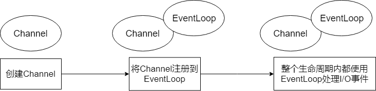

​		理解了EventLoop，理解EventLoopGroup就容量了。EventLoopGroup是用来生成EventLoop的。上面的例子代码中第一行就new了`EventLoopGroup`对象。一个EventLoopGroup包含了多个EventLoop对象，而EventLoopGroup要做的就是创建一个新的Channel，并且给他分配一个EventLoop。

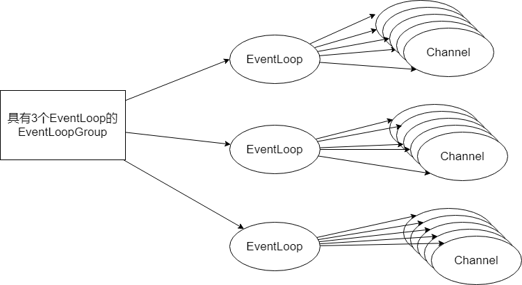

​		在异步传输的情况下，一个EventLoop是可以处理多个Channel中产生的事件的，它主要的工作就是事件的发现以及通知。相对于以前一个Channel就占用一个Thread的情况，Netty的方式要合理多了。

​		客户端发送消息到服务端，EventLoop发现以后会告诉服务端：“你去获取消息”，同时客户端进行其他的工作；当EventLoop检测到服务端返回的消息，也会通知客户端：“消息返回了，你去取吧”。客户端再去获取消息。整个过程EventLoop就是监视器 + 传声筒。

### ChannelHandler，ChannelPipeline和ChannelHandlerContext

​		如果说EventLoop是事件的通知者，那么ChannelHandler就是事件的处理者。在ChannelHandler中可以添加一些业务代码，例如数据转换，逻辑运算等等。正如上面的例子中展示的，Server和Client分别都有一个ChannelHandler来处理，读取信息，网络可用，网络异常之类的信息。并且，**针对出站和入站的事件，有不同的ChannelHandler**，分别是：

- ChannelInBoundHandler（入站事件处理器）

- ChannelOutBoundHandler（出站事件处理器）

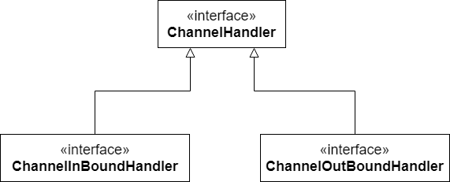

​		假设每次请求都会触发事件，而由ChannelHandler来处理这些事件，这个事件的处理顺序是由ChannelPileLine来决定的。

​		ChannelPipeline为ChannelHandler链提供了容器，到Channel被创建的时候，会被Netty框架自动分配到ChannelPipeline上。ChannelPipeline保证了ChannelHandler按照一定顺序处理事件，当事件触发以后，会将数据通过ChannelPipeline按照一定的顺序通过ChannelHandler。级，ChannelPipeline是复制“排队”的。这里的“排队”是处理事件的顺序。同时，ChannelPipeline也可以添加或者删除ChannelHandler，管理这个队列。

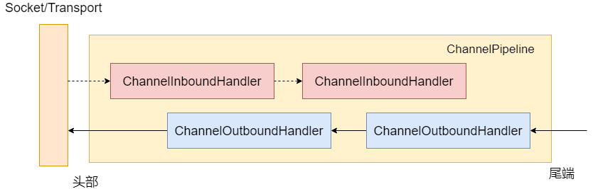

​		如上图，ChannelPipeline使ChannelHandler按照先后顺序排列，信息按照箭头所示方向流动并且被ChannelHandler处理。

​		说完了ChannelPipeline和ChannelHandler，前者管理后者的排列顺序。那么它们之间的关联就有ChannelHandlerContext来表示了。每当有ChannelHandler添加到ChannelPipeline时，同时会创建ChannelHandlerContext。ChannelHandlerContext的主要功能就是管理ChannelHandler和ChannelPipeline的交互。

​		上面的例子中，几乎ChannelHandler中每个处理事件函数，传入的参数就ChannelHandlerContext。ChannelHandlerContext参数贯穿ChannelPipeline，将信息传递给每个ChannelHandler，是个合格的“通讯员”。

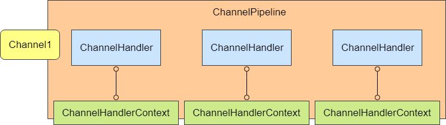

​		把上面提到的几个核心组件归纳一下，用下图表示方便记忆它们之间的关系：

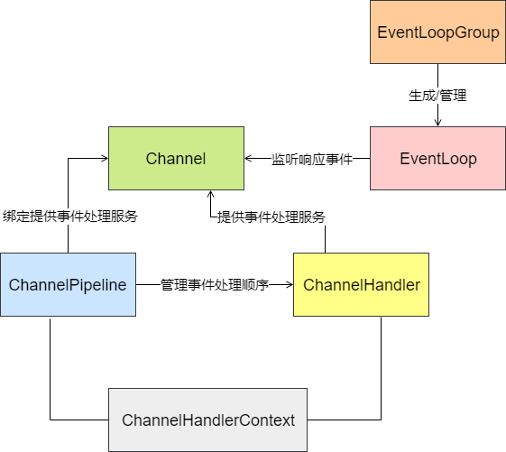

## Netty的数据容器

​		前面介绍了Netty的几个核心组件，服务器在数据传输的时候，产生事件，并且对事件进行监控和处理。接下来看数据是如何存放以及读写的。Netty将ByteBuf作为数据容器，来存放数据。

### ByteBuf工作原理

​		从结构上来说，ByteBuf由一串字节数组构成。数组中每个字节用来存放信息。ByteBuf提供了两个索引，一个用于读取数据，一个用于写入数据，这两个索引通过在字节数组中移动，来定位需要或者读写信息的位置。当从ByteBuf读取时，它的readerIndex（读索引）将会根据读取的字节数递增。同样，当写ByteBuf时，它的writeIndex也会根据写入的字节数进行递增。

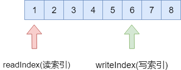

​		需要注意的是极限的情况是readerIndex刚好读到了writeIndex写入的地方。如果readerIndex超过了writeIndex的时候，Netty会抛出IndexOutOfBoundsException异常。

### ByteBuf使用模式

​		说了ByteBuf的工作原理后，再来看它的使用模式。根据存放缓冲区的不同分为三类：

- **堆缓冲区**：ByteBuf将数据存储在JVM的堆中，通过数组实现，可以做到快速分配。由于在堆上被JVM管理，在不被使用时可以快速释放。可以通过ByteBuf.array()来获取byte[]数据。

- **直接缓冲区**：在JVM的堆之外直接分配内存，用来存储数据。其不占用堆空间，使用时需要考虑内存容量。它在使用Socket传递时性能较好，因为间接从缓冲区发送数据，在发送之前JVM会先将数据复制到直接缓冲区再进行发送。由于直接缓冲区的数据分配在堆之外，通过JVM进行垃圾回收，并且分配时也需要做复制的操作，因此使用成本较高。

- **复合缓冲区**：顾名思义就是将上述两类缓冲区聚合在一起。Netty提供了一个CompsiteByteBuf，可以将堆缓冲区和直接缓冲区的数据放在一起，让使用更加方便。

### ByteBuf的分配

​		接下来看看ByteBuf如何分配缓冲区的数据。**Netty提供了两种ByteBufAllocator的实现**，他们分别是：

- **PooledByteBufAllocator**：实现了ByteBuf的对象的池化，提高性能减少内存碎片。

- **UnpooledByteBufAllocator**：没有实现对象的池化，每次会生成新的对象实例。

​		对象池化的技术和线程池比较相似，主要目的是提高内存的使用率。池化的简单实现思路，是在JVM堆内存上构建一层内存池，通过allocate方法获取内存池中的空间，通过release方法将空间归还给内存池。

​		对象的生成和销毁，会大量地调用allocate和release方法，因此内存池面临碎片空间回收的问题，在频繁申请和释放空间后，内存池需要保证连续的内存空间，用于对象的分配。基于这个需求，有两种算法用于优化这一块的内存分配：伙伴系统和slab系统。

​		伙伴系统，用完全二叉树管理内存区域，左右节点互为伙伴，每个节点代表一个内存块。内存分配将大块内存不断二分，直到找到满足所需的最小内存分片。内存释放会判断释放内存分片的伙伴（左右节点）是否空闲，如果空闲则将左右节点合成更大快内存。

​		slab系统，主要解决内存碎片问题，将大块内存按照一定内存大小进行等分，形成相等大小的内存片构成的内存集。按照内存申请空间的大小，申请尽量小块内存或者其整数倍的内存。释放内存时，也是将内存分片归还给内存集。

​		Netty内存池管理以Allocate对象的形式出现。一个Allocate对象由多个Arena组成，每个Arena能执行内存块的分配和回收。Arena内有三类内存管理单元：

- TinySubPage

- SmallSubPage

- ChunkList

​		Tiny和Small符合Slab系统的管理策略，ChunkList符合伙伴系统的管理策略。当用户申请内存介于tingSize和smallSize之间时，从tinySubPage中获取内存块；申请内存介于smallSize和pageSize之间时，从smallSubPage中获取内存块；介于pageSize和chunkSize之间时，从ChunkList中获取内存；大于ChunkSize（不知道分配内存的大小）的内存块不通过池化分配。

## Netty的Bootstrap

​		说完了Netty的核心组件以及数据存储。回到最开始的例子程序，在程序最开始的时候会new一个Bootstrap对象，后面所有的配置都是基于这个对象展开的。Boosttrap的作用就是将Netty核心组件配置到程序中，并且让他们运行起来。

​		从Bootstrap的继承结构来看，分为两类，分别是Bootstrap和ServerBootstrap，一个对应客户端的引导，一个对应服务端的引导。

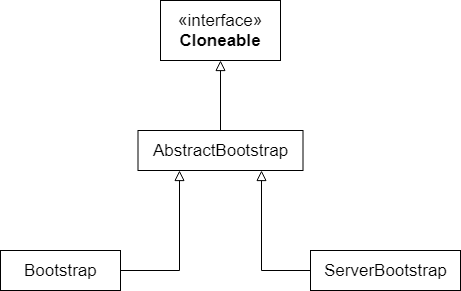

​		客户端引导Bootstrap，主要有两个方法：bind()和connetct()。Bootstrap通过bind()方法创建一个Channel。在bind()之后，通过调用connect()方法来创建Channel连接。

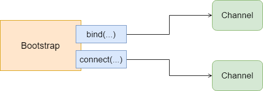

​		服务端引导ServerBootstrap，与客户端不同的是在bind()方法之后会创建一个ServerChannel，它不仅会创建新的Channel，还会管理已经存在的Channel。

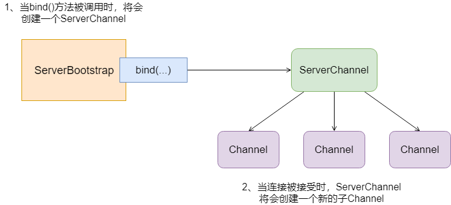

​		通过上面的描述，服务端和客户端的引导存在两个区别：

ServerBootstrap（服务端引导）绑定一个端口，用来监听客户端的连接请求。而Bootstrap（客户端引导）只要知道服务端IP和Port建立连接就可以了。

Bootstrap（客户端引导）需要一个EventLoopGroup，但是ServerBootstrap（服务端引导）则需要两个EventLoopGroup。因为服务器需要两组不同的Channel。第一组ServerChannel自身监听本地端口的套接字，第二组用于监听客户端请求的套接字。

## 总结

​		我们从NIO入手，谈到了Selector的核心机制。然后通过介绍Netty客户端和服务端的代码运行流程。让大家对Netty编写代码有基本的认识。

​		在Netty的核心组件中，Channel提供Socket的连接通道，EventLoop会对应Channel监听其产生的事件，并且通知执行者。EventLoopGroup负责生成和管理EventLoop。

​		ChannelPipeline作为ChannelHandler的容器会绑定到Channel上，然后由ChannelHandler提供具体事件处理。另外，ChannelHandlerContext为ChannelHandler和ChannelPipeline提供信息共享。

​		ByteBuf作为Netty的数据容器，通过字节数组的方式存储数据，并且通过读索引和写索引来引导读写操作。

​		上述的核心组件都是通过Bootstrap来配置并且引导启动的，Bootstrap启动方式虽然一致，但是针对客户端和服务端有些许的区别。

## 参考资料

[Netty底层架构原理](https://mp.weixin.qq.com/s/Sldln-i580LJusQd_YW06w)

