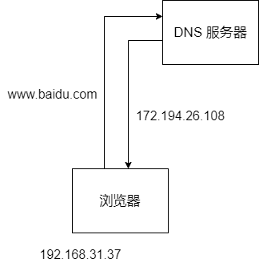
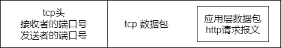
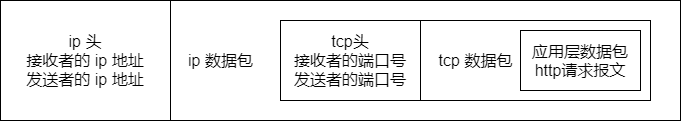
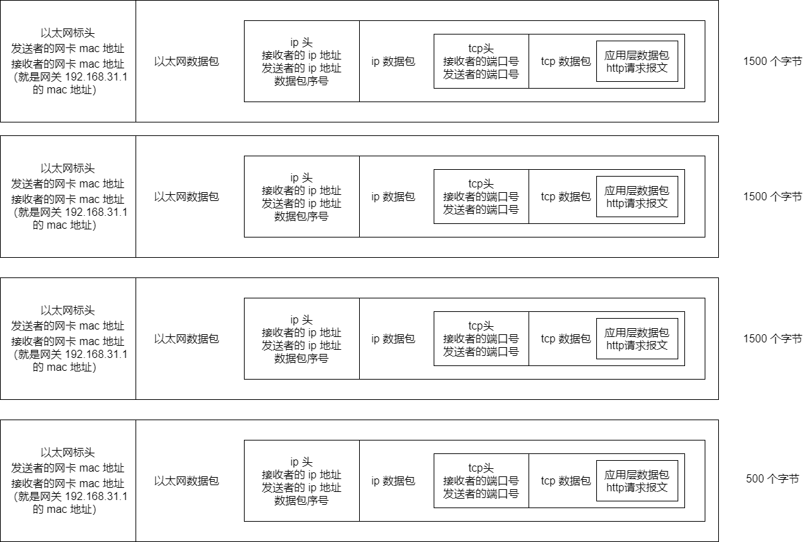
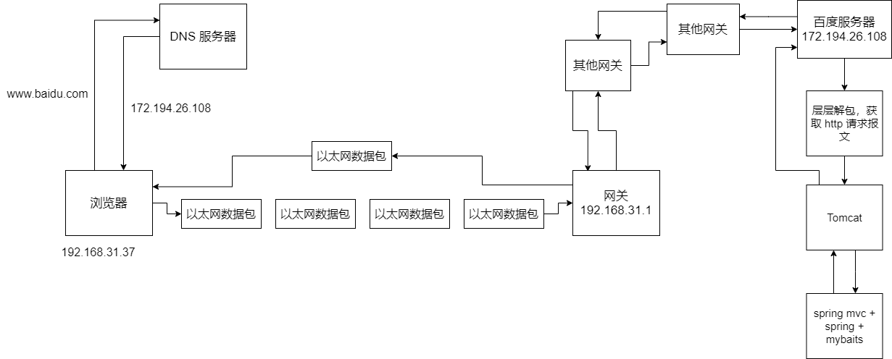

首先我们假设，我们给电脑设置了几个东西：

- ip 地址：192.168.31.37

- 子网掩码：255.255.255.0

- 网关地址：192.468.32.1

- DNS 地址：8.8.8.8

这时我们打开一个浏览器，请求 www.baidu.com 地址时，这个时候找 DNS 服务器，DNS 服务器解析域名之后，返回一个 ip 地址，比如 172.194.26.108

接着会判断两个 ip 地址是不是一个子网的，用子网掩码 255.255.255.0，对两个 ip 地址做与运算，拿到 192.168.31.1 和 172.194.26.0，明显不是一个子网的。如图：

那就得发送一个数据包给网关，其实你就认为是我们的路由器吧，就是 192.168.31.1，而且我们是可以拿到网关 ip 地址的 mac 地址的。现在我们从应用层出发，通过浏览器访问一个网站，是走应用层的 http 协议的，并且要把浏览器发出的请求打包成数据包。要把哪些东西放到数据包中去呢？

http 协议分为几个部分：请求方法 + URL 地址 + http 版本

比如：

GET http://172.194.26.108/test HTTP/1.1   类似这种请求头，类似下面这种请求体

Host:upload,jiangsu.io

Proxy-Connection:keep-alive

User-Agent:Mozilla/5.0

等等。。。

比如常见的可以放一个 json，这就构成了一个 http 请求报文。浏览器请求一个地址，先按照应用层的 http 协议，封装一个应用层数据包，数据包里就存放了 http 请求报文，这个时候会将这个 http 请求报文打包成一个数据包，仅仅只是数据包的数据部分，此时数据包是没有头的。上面根据 http 协议弄一个 http 请求报文，然后弄一个数据包出来，就是网络模型中的应用层干的事情。

接着就跑传输层来了。这个层是 TCP 协议，这个 tcp 协议会让你设置一个端口，接收方的端口一般是默认的 80 端口。这个时候，会把应用层数据包给封装到 tcp 数据包中去，而且会加一个 tcp 头，这个 tcp 数据包是对应一个 tcp 头的，这个 tcp 头里就存放了端口号信息。如图：

接着跑到网络层来了，走 ip 协议。这个时候会把 tcp 头和 tcp 数据包，放到 ip 数据包里去，然后再搞一个 ip 头，ip 头里有本机和目标机器的 ip 地址。

这里本机地址是 192.168.31.37

目标机器地址是 172.194.26.108

因为，通过 ip 协议，可以判断说，两个 ip 地址不是在一个子网内的，所以此时只能将数据包先通过以太网协议广播到网关上去，通过网关再给它发送出去。如图：

接着是数据链路层，这块走以太网协议，这里是把 ip 头和 ip 数据包封到以太网数据包里去，然后再加一个以太网数据包里的头，头里放了本机网卡 mac 地址和网关的 mac 地址。但是以太网数据包的限制是 `1500` 个字节，而此时假设这个 ip 数据包都 5000 个字节了，那么久需要将 ip 数据包切割一下。

这个时候一个以太网数据包要切割为 4 个数据包，每个数据包包含了以太网头、ip 头和切割后的 ip 数据包。4 个数据包的大小分别是 1500, 1500, 1500, 500 个字节。ip 头里包含了每个数据包的序号。如图：

这 4 个以太网数据包都会通过交换机发送到你的网关上，然后你的路由器是可以联通别的子网的，这个时候你的路由器就会转发到别的子网的可能也是某个路由器里去，然后依次类推，N 多个路由器或者你叫网关也行，N 多个网关转发之后，就会跑到百度的某台服务器，接收到 4 个以太网的数据包。

百度服务器接收到 4 个以太网数据包以后，根据 ip 头的序号，把 4 个以太网数据包里的 ip 数据包给拼起来，就还原成一个完整的 ip 数据包了。接着就从 ip 数据包里面拿出来 tcp 数据包，再从 tcp 数据包里取出 http 数据包，读取出来 http 数据包里的各种协议内容，接着就是做一些处理，然后再把相应结果封装成 http 相应报文，封装在 http 数据包里，再一样的过程，封装 tcp 数据包，封装 ip 数据包，封装以太网数据包，接着通过网关给发回去。如图：

## 参考资料

https://mp.weixin.qq.com/s/rqa_YoBkkavJ12GAXZHTYA

