> 本节思维导图

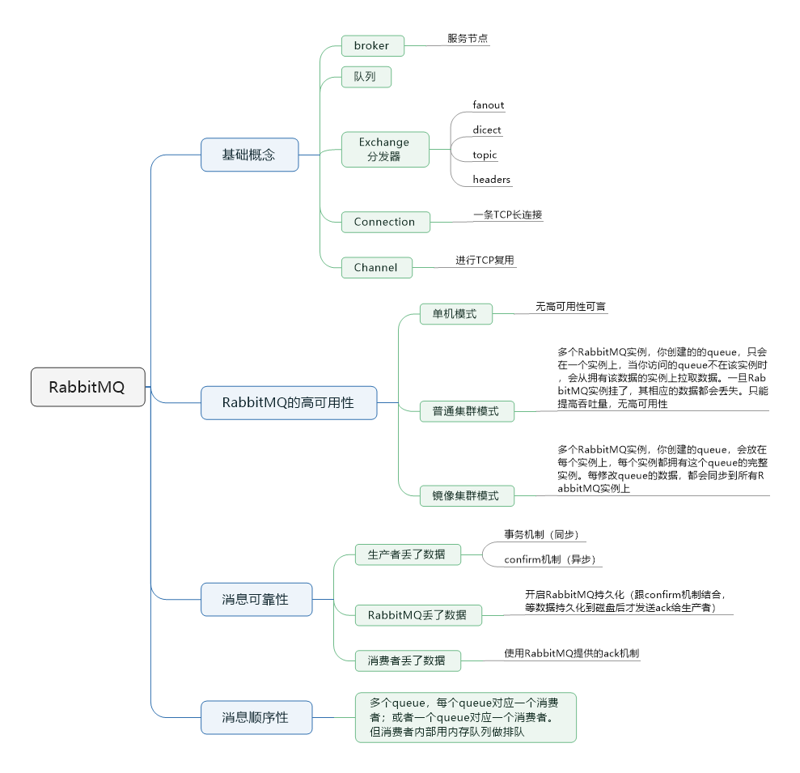

​		RabbitMQ是一个消息代理，一个消息系统的媒介。它可以为你的应用提供一个通用的消息发送和接收平台，并且保证消息在传输过程中的安全。

## 基础概念

​		RabbitMQ中除了正常的生产者消费者之外，还有一些其他的概念来支撑这样一个复杂的消息队列。

### Broker

​		Broker是消息服务中间件的一个服务节点，大部分情况下可以把一个Broker看成一个RabbitMQ的服务器。

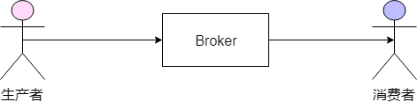

​		上图可以看出Broker相当于一个消息服务的中央节点，而我们的消息队列核心功能也就在Broker上。

### 队列

​		消息都存储在队列中，下图是一个简单的模型。实际上，一个简单的消息队列服务只要有生成者、消费者和存储单元组成队列即可。

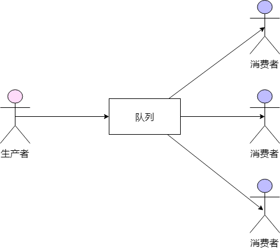

### Exchange

​		交换机（Exchange）在RabbitMQ中承担了一些队列的逻辑处理功能。一般来说，对于生产者，我们只知道把产生的内容丢到MQ当中，但是发到哪个队列中，这一点对于生产者来说是无感知的，也不知道目前对列的状况如何。而Exchange就承担了**发到哪个队列中**的职责，用几种路由策略来决定如何分发给不同的队列。

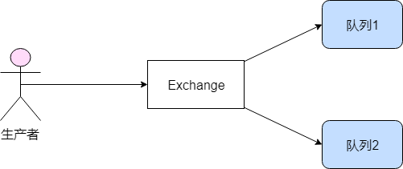

### Connection和Channel

​		每一个Connection是一条TCP连接，理论上而言每一个消费者和生产者都需要一条Connection，但是TCP连接的开销很大，所以我们会使用Channel来进行TCP复用，减少性能的开销。

### Exchange类型

#### fanout

​		我们比较常用的一种Exchange类型，它会把所有发送到该交换器的消息路由到所有与该交换器绑定的队列中。

#### direct

​		把消息路由到binding 可以和routing key完全匹配的队列中。

​		binding key和routing key基本上可以理解为对一个Queue的称呼。

​		图中Queue1叫`warning`，Queue2可以叫`info`，`warning`或者`debug`，那样Exchange叫了声`warning`的时候会有两个Queue过来拿数据，而`info`只有Queue2会回应。

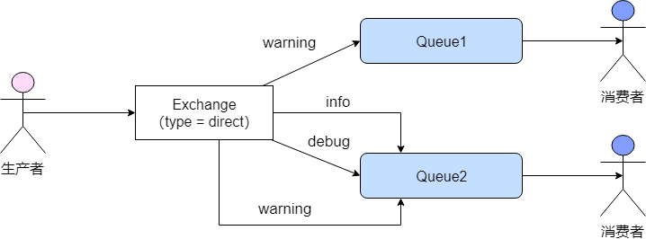

#### topic

​		direct类型太过严格，大部分我们都用不上这么严格的规则，因此有了topic。topic可以看做是一种正则表达式规则，满足正则表达式的规则就会进入队列。

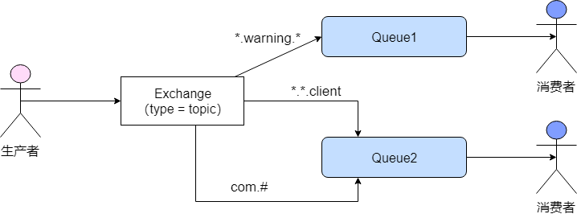

#### headers

​		这种类型根据发送信息中的header来匹配，性能差，基本没用。

### 死信队列

​		DLX（Dead-Letter-Exchanage）。利用DLX，当消息在一个对列中变成死信之后，它能被重新publish到另一个Exchange，这个Exchange就是DLX。消息变成死信一般有以下几种情况：

- 消息被拒绝（basic.reject/basic.nack）并且不再重新投递 require = false
- 消息过期（rabbitmq Time-To-Live -> messageProperties.setExpiration()）
- 队列达到最长长度

​        当一个消息变成死信导致队列无法处理的时候，开启死信队列，使得消息不会堆积在队列中，而换到死信队列被消费。在RabbitMQ中开启死信队列非常简单，只要配置为DLX即可。

### 公用Connection而不是Channel

​		公用Connection的理由在上面已经提过，那为什么不建议公用Channel呢？

​		计算机网络传输信息的时候，本质上都是二进制传输，而传输的数据经过一定的处理，最终变成我们可读可处理的数据，Channel已经是复用了TCP连接的，此时如果我们再进行并行的数据传输，很有可能会导致某一帧数据的异常。

## RabbitMQ的高可用性

​		RabbitMQ是**基于主从**做高可用性的。一般来说，RabbitMQ有三种模式：单机模式、普通集群模式和镜像集群模式。

### 单机模式

​		单机模式，就是Demo级别的，一般就是你本地启动了做做demo，基本没人生产用单机模式。

### 普通集群模式（无高可用性）

​		普通集群模式，意思就是在多台机器上启动多个RabbitMQ实例，每个机器启动一个。你**创建的queue，只会放在一个RabbitMQ实例上**，但是每个实例都同步queue的元数据（元数据可以认为是queue的一些配置信息，通过元数据，可以找到queue所在实例）。你消费的时候，实际上如果连接到了另一个实例，那么那个实例会从queue所在实例上拉取数据过来。

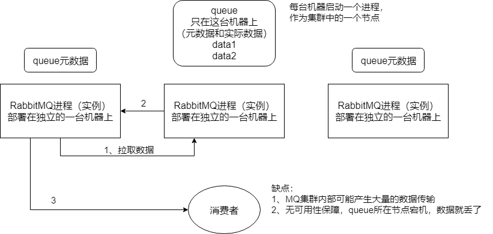

​		这种方式不仅麻烦，而且也**没做到所谓的分布式**，就是个普通集群。因为这导致你要么消费者每次随机连接一个实例后拉取数据，要么固定连接那个queue所在实例消费数据，前者有**数据拉取的开销**，后者导致**单实例性能瓶颈**。

​		而且如果那个放queue的实例宕机了，会导致接下来其他实例无法从那个实例拉取数据。如果你**开启了消息持久化**，让RabbitMQ落地存储消息的话，**消息不一定会丢**，得等这个实例恢复了，然后才可以继续从这个queue拉取数据。

​		因此这个方案主要是**用来提供吞吐量的**，就是让集群中多个节点来服务某个queue的读写操作，没有所谓的高可用性。

### 镜像集群模式（高可用性）

​		这种模式，才是所谓的RabbitMQ的高可用模式。跟普通集群模式不一样的是，你创建的queue，无论元数据还是queue里的消息都会存在于多个实例上，就是说，每个RabbitMQ节点都有这个queue的一个完成镜像，包含queue的全部数据的意思。然后你每次写消息到queue的时候，都会自动把消息同步到多个实例的queue上。

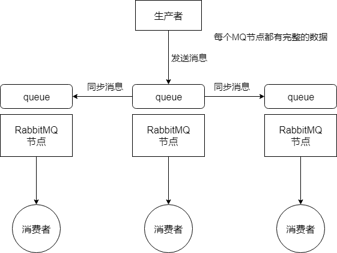

​		如何开启镜像集群模式？RabbitMQ有很好的管理控制台，就是在后台新增一个策略，这个策略是**镜像集群模式的策略**，指定的时候可以要求数据同步到所有节点的，也可以要求同步指定数据的节点，再次创建queue的时候，应用这个策略，就会自动将数据同步到其他的节点上去了。

​		这样处理，好处在于任何一个机器宕机了，其他机器还包含了这个queue的完整数据，别的consumer都可以到其他节点上去消费数据。坏处在于：第一，**性能开销太大**，消息需要同步到所有机器上，导致网络带宽压力和消耗都重；第二，这样处理并不是分布式的，**没有扩展性可言**，如果某个queue负载很重，你加机器，新的机器也包含了这个queue的所有数据，并没有办法线性扩展你的queue。

## RabbitMQ的可靠性传输

​		数据的丢失问题，可能出现在生产者、MQ、消费者中，如下图：

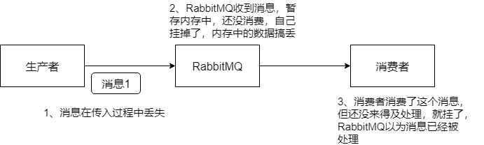

### 生产者弄丢了数据

​		生产者将数据发送到RabbitMQ的时候，因为网络问题或其他情况，导致数据在半路就搞丢了。

#### 事务机制

​		此时可以选择用RabbitMQ提供的事务功能，就是生产者发送数据之前开启RabbitMQ事务`channel.txSelect`，然后发送消息，如果消息没有成功被RabbitMQ接收到，那么生产者会收到异常报错，此时就可以回滚事务`channel.txRollback`，然后重试发送消息，如果收到了消息，那么可以提交事务`channel.txCommit`。

```java
// 开启事务
channel.txSelect
try {
    // 这里发送消息
} catch (Exception e) {
    channel.txRollback

    // 这里再次重发这条消息
}

// 提交事务
channel.txCommit
```

​		但是问题是，这样会**导致吞吐量下来，因为太耗性能**。

#### confirm机制

​		因此一般情况下，要确保RabbitMQ的消息别丢，可以开启confirm模式，在生产者那里设置开启confirm模式之后，你每次写的消息都会分配一个唯一的id，然后如果写入了RabbitMQ中，RabbitMQ会给你回传一个`ack`消息，告诉你这个消息OK了，如果RabbitMQ没能处理这个消息，会回调你的一个`nack`接口，告诉你这个消息接收失败，你可以重试。而且你可以结合这个机制自己在内存里维护每个消息id的状态，如果超过一定时间还没接收到这个消息的回调，那么你可以重发。

#### 两个机制的区别

​		事务机制和`confirm`机制最大的不同在于，**事务机制是同步的**，你提交一个事务之后会阻塞在那，**但是confirm机制是异步的**，你发送个消息之后就可以发送下一个消息，然后那个消息RabbitMQ接收了之后会异步回调你的一个接口通知你这个消息接收到了。所以一般在生产者这块避免数据丢失，都是用`confirm`机制。

### RabbitMQ弄丢了数据

​		即使RabbitMQ自己弄丢了数据，这个你必须**开启RabbitMQ的持久化**，就是消息写入之后会持久化到磁盘，哪怕是RabbitMQ自己挂了，**恢复之后会自动读取之前存储的数据**，一般数据不会丢。除非RabbitMQ还没持久化，自己就挂了，**可能导致少量数据丢失**，但是这个概率比较小。

​		设置持久化有两个步骤：

- 创建queue的时候将其设置为持久化，这样就可以保证RabbitMQ持久化queue的元数据，但是它不会持久化queue里的数据。
- 第二是是发送消息的时候将消息的`deliveryMode`设置为2，就是将消息设置为持久化的，此时RabbitMQ就会将消息持久化到磁盘上去。

​        必须要同时设置这两个持久化才行，这样RabbitMQ哪怕是挂了，再次重启，也会从磁盘上重启恢复queue，恢复这个queue里的数据。

​		但是哪怕是你给RabbitMQ开启了持久化机制，也有一种可能，就是这个消息写到了RabbitMQ中，但是还没来得及持久化到磁盘上，结果RabbitMQ挂了，就会导师内存里的一点点数据丢失。所以，持久化可以跟生产者那边的`confirm`机制配合起来，只有消息被持久化到磁盘之后，才会通知生产这`ack`了。这样即便是持久化到磁盘之前，RabbitMQ挂了，数据丢了，生产者收不到`ack`，你也是可以自己重发的。

### 消费端弄丢了数据

​		如果消费端**刚消费到消息，但还没处理，结果进程挂了**，这样就尴尬了。RabbitMQ认为你都消费了，这数据也就丢了。

​		这个时候可以用RabbitMQ提供的`ack`机制，即，你必须关闭RabbitMQ的自动`ack`,可以通过一个api来调用就行，然后每次你自己代码里确保处理完的时候，再在程序里`ack`一把。这样的话，如果你还没处理完，就没有`ack`,RabbitMQ就认为你还没处理完，这个时候RabbitMQ会把这个消费分配给别的consumer去处理，消息是不会丢的。

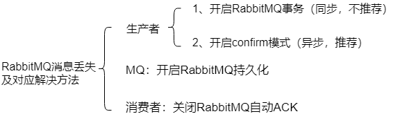

## RabbitMQ的消息顺序性

​		举个例子，一个mysql binlog同步的系统，日同步数据要达到上亿，就是说数据从一个mysql库原封不动同步到另一个mysql库里面去（mysql -> mysql）。然后你在mysql里增删改一条数据，对应出来增删改3条`binlog`日志，接着这三条`binlog`发送到MQ里面，再消费出来依次执行，要保证是按顺序执行的。否则本来是：增加、修改、删除，最后换了顺序给执行成删除、修改、增加。这就错了。

​		先看看RabbitMQ消息会错乱的场景：在RabbitMQ中，一个queue，多个consumer、比如生产者向RabbitMQ里发送了三条数据，顺序依次是data1/data2/data3，压入的是RabbitMQ的一个内存队列。有三个消费者分别从MQ中消费这三条数据中的一条，结果消费者2先执行完操作，把data2存入数据库，然后是data1/data3，这样就乱了。

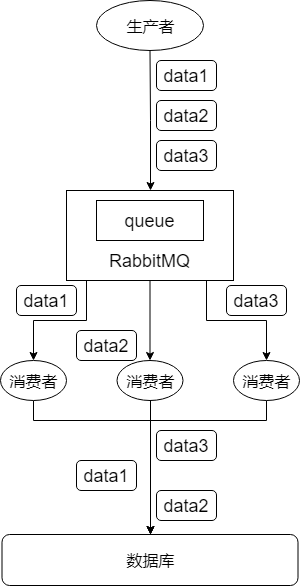

### 解决方案

​		拆分多个queue，每个queue一个consumer，就是多一些queue而已；或者就一个queue但是对应一个consumer，然后这个consumer内部用内存队列做排队，然胡分发给不同的worker来处理。

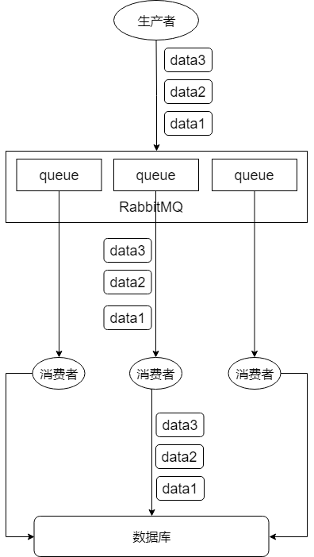