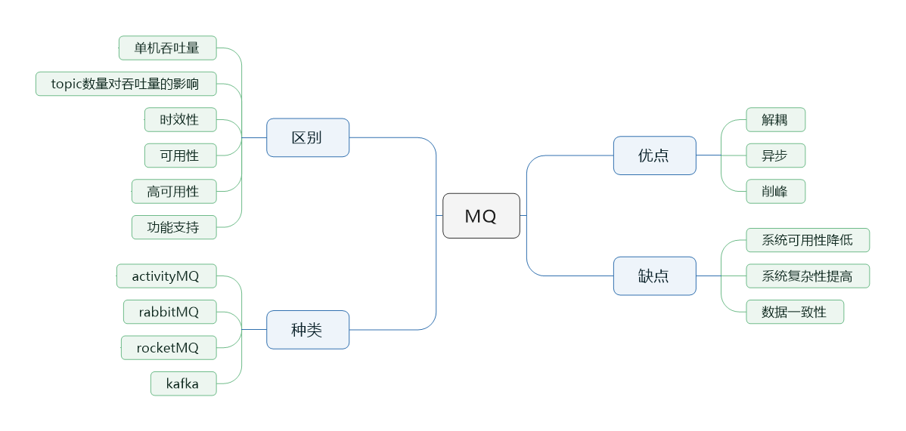
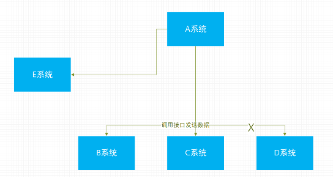
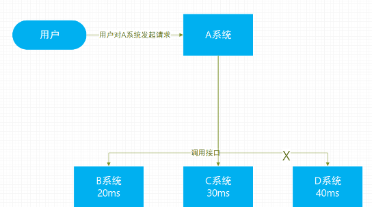
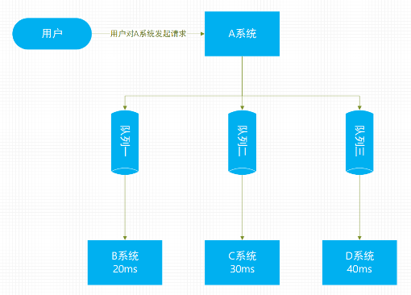

> 本节思维导图

    

## 消息队列的优点

消息队列主要有三个优点：**解耦**、**异步**和**削峰**

### 削峰

假设一个业务场景如图所示，A系统分别发送信息给B C D系统，此时系统的耦合性比较高，当需求改变要求不给D系统发送消息，或者增加一个E系统也需要A系统发送数据，那么我们就不得不去修改A系统的代码。除此之外如果其他系统挂了，同样也会影响到A系统，如果引入MQ，那么A系统就只需要把数据放进MQ中，由需要这个数据的系统去订阅这个MQ，这样就可以实现系统解耦。这样A系统不仅不需关系哪个系统需要这个消息，也不需要关心消息发送失败或者超时等情况。

    

**总结**：通过MQ，Pub/Sub发布订阅消息模型，A系统就跟其他系统解耦了。

### 异步

业务场景如图所示，用户向A系统发起请求，需要在本地写数据库，还需要在B C D系统写数据库，假设本地写耗时10ms，如下图需要10+20+30+40共100ms。那么这样相对来说比较慢。

    

但如果引入MQ，假设将消息放入MQ耗时5ms，那么总共需要15ms，极大提高了响应速度。

    

### 削峰

假设每天0:00-12:00系统每秒并发请求数量只有十几个，但过了12点之后，请求数量猛增到几千个，而且数据库系统是mysql，每秒最多也就执行一千多条SQL语句，这样导致mysql崩溃，但过了高峰期之后并发请求又恢复到了相对比较低的水平，对整个系统又没啥压力了。

引入MQ之后，A系统每秒中只能处理一千个SQL，那就从MQ中取出一千个SQL去处理，这样即使在高峰的时候，A系统也不会崩溃，而在高峰期间MQ可能会有几百万的请求积压在MQ中，但这个短暂的高峰的积压是允许，等高峰期一过，MQ积压的数据就能够迅速被处理。

## 消息队列的缺点

缺点有以下几个：

### 系统可用性降低

引入的外部依赖越多，风险就越高。本来只是调用几个系统的接口就可以了，现在引入MQ之后，如果MQ挂了，整个系统就崩溃了。

### 系统复杂性提高

引入MQ之后，需要考虑很多问题。例如如何保证消息传递的顺序，保证消息没有重复消费和怎么处理消息丢失的情况。

### 数据一致性问题

A系统将数据放到MQ将返回成功了，但如果B系统数据丢失了，那就会造出数据不一致了。

## ActiveMQ、RabbitMQ、RocketMQ和kafka有什么优缺点

| 特性                    | ActiveMQ                      | RabbitMQ                                         | RocketMQ                                                     | kafka                                                        |
| ----------------------- | ----------------------------- | ------------------------------------------------ | ------------------------------------------------------------ | ------------------------------------------------------------ |
| 单机吞吐量              | 万级，比RocketMQ、kafka低一级 | 同ActiveMQ                                       | 10万级，支撑高吞吐                                           | 10万级，高吞吐，一般配合大数据类的系统机型实时数据计算，日志采集等场景 |
| topic数量对吞吐量的影响 |                               |                                                  | topic可以达到几百/几千的级别，这是RocketMQ的优势，在同等机器下，可以支撑大量的topic | topic从几十到几百个左右的时候，吞吐量会大幅度下降，kafka尽量保证topic数量不要过多，如果要支撑大规模的topic，需要增加更多的机器资源 |
| 时效性                  | ms级                          | 微秒级，这是RabbitMQ的一大特点，延迟最低         | ms级                                                         | 延迟在ms级以内                                               |
| 可用性                  | 高，基于主从架构实现高可用    | 同ActiveMQ                                       | 非常高，分布式架构                                           | 非常高，分布式，一个数据多个副本，少数机器宕机，不会丢失数据，不会导致不可用 |
| 消息可靠性              | 有较低的概率丢失数据          | 基本不丢                                         | 经过参数优化配置，可以做到0丢失                              | 同RocketMQ                                                   |
| 功能支持                | MQ领域的功能极其完备          | 基于erlang开发，并发能力很强，性能极好，延时很低 | MQ功能较为完善，还是分布式的，扩展性好                       | 功能较为简单，主要支持简单的MQ功能，在大数据领域的实时计算以及日志采集被大规模使用 |

综上，各种对比之后，有如下建议：

一般的业务系统要引入 MQ，最早大家都用 ActiveMQ，但是现在确实大家用的不多了，没经过大规模吞吐量场景的验证，社区也不是很活跃，所以大家还是算了吧，我个人不推荐用这个了；

后来大家开始用 RabbitMQ，但是确实 erlang 语言阻止了大量的 Java 工程师去深入研究和掌控它，对公司而言，几乎处于不可控的状态，但是确实人家是开源的，比较稳定的支持，活跃度也高；

不过现在确实越来越多的公司会去用 RocketMQ，确实很不错，毕竟是阿里出品，但社区可能有突然黄掉的风险（目前 RocketMQ 已捐给 [Apache](https://github.com/apache/rocketmq)，但 GitHub 上的活跃度其实不算高）对自己公司技术实力有绝对自信的，推荐用 RocketMQ，否则回去老老实实用 RabbitMQ 吧，人家有活跃的开源社区，绝对不会黄。

所以**中小型公司**，技术实力较为一般，技术挑战不是特别高，用 RabbitMQ 是不错的选择；**大型公司**，基础架构研发实力较强，用 RocketMQ 是很好的选择。

如果是**大数据领域**的实时计算、日志采集等场景，用 Kafka 是业内标准的，绝对没问题，社区活跃度很高，绝对不会黄，何况几乎是全世界这个领域的事实性规范。