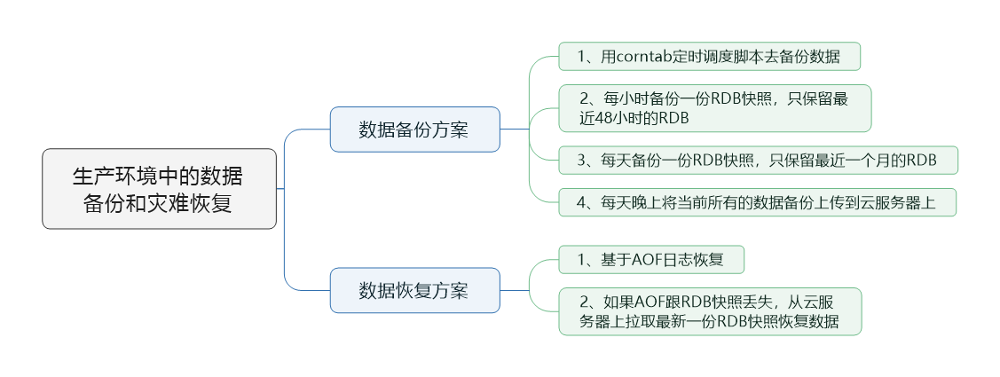

> 本节思维导图



​		我们生产环境中redis的数据备份和灾难恢复策略简单地说就是：**开启AOF机制，并用RDB做冷备**。

## 数据备份方案

​	具体的数据备份方案如下：

1. 写crontab定时调度脚本去做数据备份。
2. 每小时都备份一份rdb，可以copy到一个目录中去，并且只保留最近48小时的备份。
3. 每天都保留一份当日的rdb备份到一个目录中去，仅仅保留最近一个月的备份。
4. 每次copy备份的时候，把最旧的备份删掉。
5. 每天晚上将当前服务器上所有的数据备份，发送一份到远程的云服务上去。

​        首先先创建一个目录，`/usr/local/redis`，然后在redis的目录中创建`copy`文件夹，用来存储复制快照文件的脚本。然后在redis目录中创建snapshotting文件夹，用来存储备份的rdb快照。

​		执行`vi redis_rdb_copy_hourly.sh`，编写每小时复制一份rdb的shell脚本。

```shell
#!/bin/sh 

cur_date=`date +%Y%m%d%k`
rm -rf /usr/local/redis/snapshotting/$cur_date
mkdir /usr/local/redis/snapshotting/$cur_date
cp /var/redis/6379/dump.rdb /usr/local/redis/snapshotting/$cur_date

del_date=`date -d -48hour +%Y%m%d%k`
rm -rf /usr/local/redis/snapshotting/$del_date
```

​		执行`vi redis_rdb_copy_daily.sh`，编写每天复制一份rdb的shell脚本。

```shell
#!/bin/sh 

cur_date=`date +%Y%m%d`
rm -rf /usr/local/redis/snapshotting/$cur_date
mkdir /usr/local/redis/snapshotting/$cur_date
cp /var/redis/6379/dump.rdb /usr/local/redis/snapshotting/$cur_date

del_date=`date -d -1month +%Y%m%d`
rm -rf /usr/local/redis/snapshotting/$del_date
```

​		上面`cp /var/redis/6379/dump.rdb /usr/local/redis/snapshotting/$cur_date`中的`/var/redis/6379/dump.rdb`是redis生成的快照文件的存储地址，可以根据具体情况进行修改。

​		最后再执行`crontab -e`新建调度任务，命令如下：

```shell
0 * * * * sh /usr/local/redis/copy/redis_rdb_copy_hourly.sh
0 0 * * * sh /usr/local/redis/copy/redis_rdb_copy_daily.sh
```

​		然后再每天一次将所有的数据上传一次到远程的云服务器上去，这样一个数据备份方案就算完成了。

## 数据恢复方案

1. 如果是redis进程挂掉了，那么重启redis进程即可，直接基于AOF日志文件恢复数据。

2. 如果是redis进程所在机器宕机了，那么重启机器后，尝试重启redis进程，尝试直接基于AOF日志文件进行数据恢复。如果AOF没有破损，那么久直接基于AOF恢复，如果AOF文件损坏，那么用`redis-check-aof fix`修复日志文件。

3. 如果redis当前最新的AOF文件和RDB文件出现了丢失，那么可以尝试基于该机器上当前的某个最新的RDB数据副本进行数据恢复。具体操作步骤为：停掉redis，关闭AOF，拷贝AOF备份，重启redis，确认数据恢复，直接在命令行热修改redis配置，即在`redis-cli`中执行`config set appendonly yes`打开AOF。这个时候redis就会将内存中的数据对应的日志，写入AOF文件中，此时AOF和RDB两份数据文件的数据就同步了。用redis config set热修改配置参数，可能配置文件中的实际参数没有被持久化的修改，需要再停止redis，手动修改配置文件，打开AOF，然后再重启redis。

4. 如果当前机器上的所有RDB文件全部损坏，那么从远程的云服务上拉取最新的RDB快照来恢复数据。

5. 如果是发现有重大的数据错误，比如某个小时上线的程序一下子将数据全部污染了，数据全错了，那么可以选择某个更早的时间点，对数据进行恢复

   举个例子，12点上线了代码，发现代码有bug，导致代码生成的所有的缓存数据，写入redis，全部错了

   找到一份11点的rdb的冷备，然后按照上面的步骤，去恢复到11点的数据，就可以了。