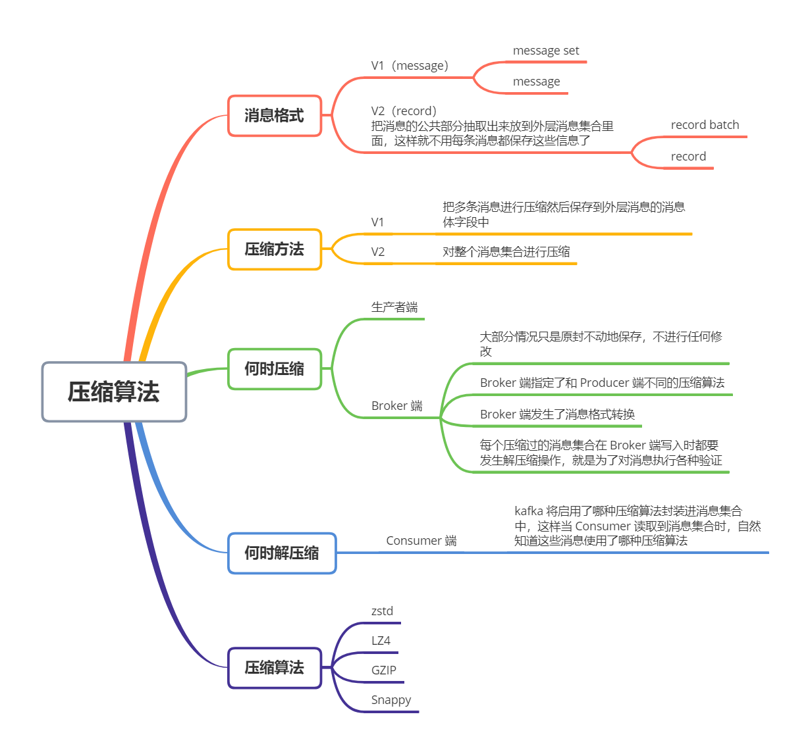

Kafka 是如何压缩算法的？目前 Kafka 共有两大类消息格式，社区分别称之为 V1 版本和 V2 版本。V2 版本是 Kafka 0.11.0.0 中正式引入的


无论是哪个版本，Kafka 的消息层次都分为两层：消息集合（message set）和消息（message）。一个消息集合中包含若干条日志项，而日志项才是真正封装消息的地方。Kafka 底层的消息日志由一系列消息集合日志项组成。**Kafka 通常不会直接操作具体的一条条消息，而是在消息集合这个层面上进行写入操作**


其中，V2 版本针对 V1 版本的一些弊端做了修正。例如，把消息的公共部分抽取出来放到外层消息集合里面，这样就不用每条消息都保存这些信息了


举个例子，在原来 V1 版本中，每条消息都需要执行 CRC 校验，但有些情况下消息的 CRC 值是会发生变化的。比如在 Broker 端可能会对消息时间戳字段进行更新，那么重新计算之后的 CRC 值也会相应更新；再比如 Broker 端在执行消息格式转换时（主要是为了兼容老版本客户端程序），也会带来 CRC 值的变化。鉴于这些情况，再对每条消息都执行 CRC 校验就有点没必要了，不仅浪费空间还耽误 CPU 时间。因此在 V2 版本中，消息的 CRC 校验工作就被移到了消息集合这一层


V2 版本还有一个和压缩息息相关的改进，就是保存压缩消息的方法发生了变化。之前 V1 版本中保存压缩信息的方法是把多条消息进行压缩然后保存到外层消息的消息体字段中；而 V2 版本的做法是对整个消息集合进行压缩。显然后者比前者有更好的压缩效果


### 何时压缩


在 Kafka 中，压缩可能发生在两个地方：生产者端和 Broker 端


生产者程序中配置 `compression.type` 参数即表示启用指定类型的压缩算法。如下：


```java
Properties props = new Properties();
props.put("bootstrap.servers", "localhost:9092");
props.put("acks", "all");
props.put("key.serializer", "org.apache.kafka.common.serialization.StringSerializer");
 props.put("value.serializer", "org.apache.kafka.common.serialization.StringSerializer");
// 开启 GZIP 压缩
props.put("compression.type", "gzip");
 
Producer<String, String> producer = new KafkaProducer<>(props);
```


在生产者端启用压缩是很自然的想法，那为什么 Broker 端也可能进行压缩呢？其实大部分情况下 Broker 从 Producer 端接收到消息后仅仅是原封不动地保存而不会对其进行任何修改。但有两种例外情况就可能让 Broker 重新压缩消息


情况一：Broker 端指定了和 Producer 端不同的压缩算法


先看一个例子。


Producer 说：“ 我要使用 GZIP 进行压缩 ”


Broker 说：“ 不好意思，我这边接收的消息必须使用 Snappy 算法进行压缩。”


这种情况下 Broker 接收到 GZIP 压缩消息后，只能解压缩然后使用 Snappy 重新压缩一遍。Broker 端也有一个参数叫 `compression.type`，和上面的那个例子中的同名。但是这个参数的默认值是 producer，这表示 Broker 端会尊重 Producer 端使用的压缩算法。可一旦你在 Broker 端设置了不同的 compression.type 值，就要小心了，因为可能会发生预料之外的 压缩 / 解压缩操作，通常表现为 Broker 端 CPU 使用率飙升


情况二：Broker 端发生了消息格式转换


所谓的消息格式转换主要是为了兼容老版本的消费者程序。上面说过 V1、V2 版本，在一个生产环境中，kafka 集群中同时保存多种版本的消息格式非常常见。为了兼容老版本的格式，Broker 端会对新版本消息执行向老版本格式的转换。这个过程会涉及消息的解压缩和重新压缩


### 何时解压缩


通常来说解压缩发生在消费者程序中，也就是说 Producer 发送压缩消息到 Broker 后，Broker 照单全收并保存起来。当 Consumer 程序请求这部分消息时，Broker 依然原样发送出去，当消息到达 Consumer 端后，由 Consumer 自行解压缩还原之前的消息


那么 Consumer 怎么知道这些消息是用何种压缩算法压缩的呢？答案就在消息中。kafka 会将启用了哪种压缩算法封装进消息集合中，这样当 Consumer 读取到消息集合时，它自然就知道了这些消息使用的是哪种压缩算法。如果用一句话总结一下压缩和解压缩，那就是：**Producer 端压缩、Broker 端保持、Consumer 端解压缩**


除了在 Consumer 端解压缩，Broker 也会进行解压缩。注意，这和前面提到的消息格式转换时发生的解压缩是不同的场景。每个压缩过的消息集合在 Broker 端写入时都要发生解压缩操作，目的就是为了对消息执行各种验证。我们必须承认这种解压缩对 Broker 端性能是有一定影响的，特别是对 CPU 的使用率而言


### 各种压缩算法对比


在 Kafka 2.1.0 版本之前，Kafka 支持 3 种压缩算法：GZIP、Snappy 和 LZ4。从 2.1.0 开始，kafka 正式支持 Zstandard 算法（简写为 zstd）。它是 Facebook 开源的一个压缩算法，能够提供超高的压缩比


在实际使用中，GZIP、Snappy、LZ4 甚至是 zstd 的表现更有千秋。但对于 Kafka 而言，它们的性能测试结果缺出奇得一致，即在吞吐量方面：LZ4 > Snappy > zstd 和 GZIP；而在压缩比方面，zstd > LZ4 > GZIP > Snappy。具体到物理资源，使用 Snappy 算法占用的网络带宽最多，zstd 最少，这是合理的，毕竟 zstd 就是要提供超高的压缩比；在 CPU 使用率方面，各个算法表现得差不多，只是在压缩时 Snappy 算是使用的 CPU 较多一些，而在解压缩时 GZIP 算法则可能使用更多的 CPU