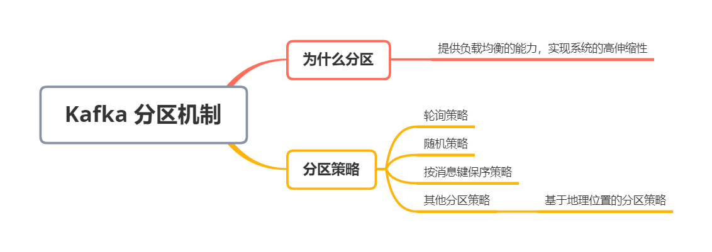
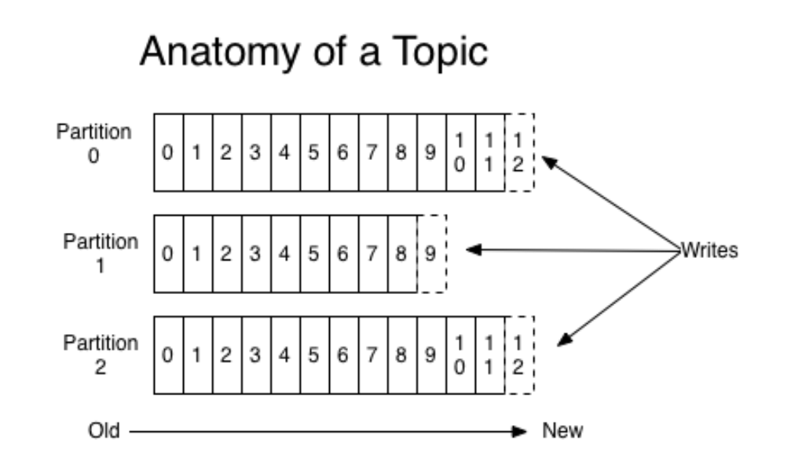
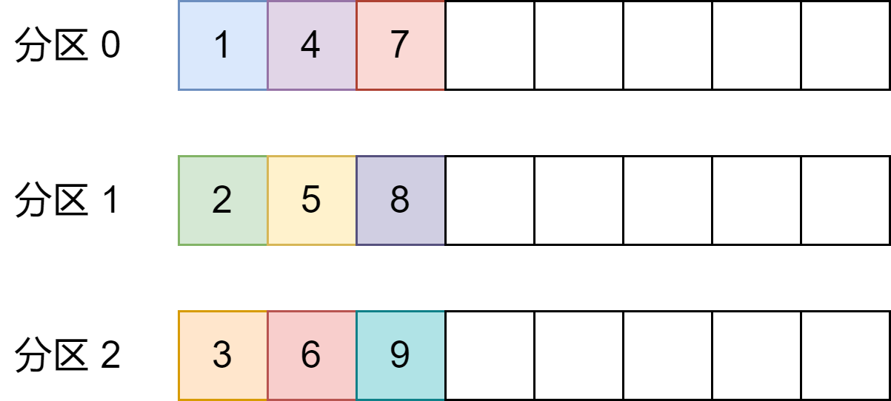
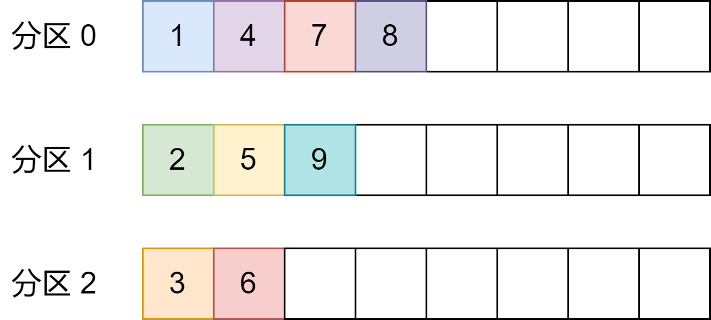
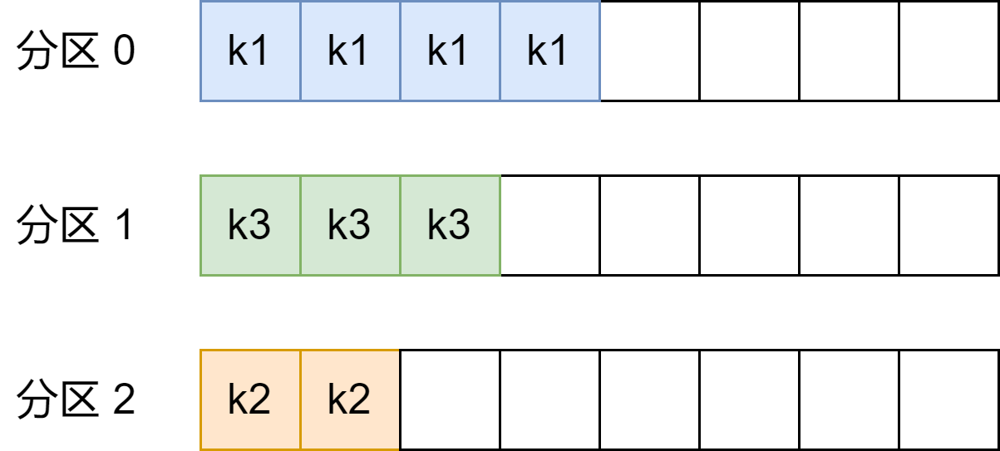

## 为什么分区


kafka 有主题（Topic）的概念，它是承载真实数据的逻辑容器，而在主题之下还分为若干个分区，也就是说 Kafka 的消息组织方式实际上是三级结构：主题 - 分区 - 消息。主题下的每条消息只会保存在某一个分区中，而不会在多个分区中被保存多份。如图：





为什么使用分区的概念而不是直接使用多个主题呢？


其实分区的作用就是提供负载均衡的能力，或者说对数据进行分区的主要原因，就是为了实现系统的高伸缩性（Scalability）。不同的分区都能独立地执行各自分区的读写请求处理。并且，我们还可以通过新的节点机器来增加整体系统的吞吐量


除了提供负载均衡这种最核心的功能之外，利用分区也可以实现其他一些业务级别的需求，比如实现业务级别的消息顺序的问题


## 分区策略


**所谓分区策略，是决定生产者将消息发送到哪个分区的算法**。Kafka 为我们提供了默认的分区策略，同时它也支持你自定义分区策略。


如果要自定义分区策略，你需要显式地配置生产者端的参数 `partitioner.class`。你可以编写一个具体的类实现 `org.apache.kafka.clients.producer.Partitioner` 接口。这个接口定义了两个方法：`partition()` 和 `close()`，通常你只需要实现最重要的 `partition` 方法。


```java
int partition(String topic, Object key, byte[] keyBytes, Object value, byte[] valueBytes, Cluster cluster);

```


这里的 topic、key、keyBytes、value 和 valueBytes 都属于消息数据，cluster 则是集群信息（比如当前 Kafka 集群共有多少主题，多个 Broker 等）


Kafka 给你这么多信息，就是希望让你能够充分地利用这些信息对消息进行分区，计算出它要被发送到哪个分区中。只要你自己实现类定义好了 `partition` 方法，同时设置 `partitioner.class` 参数为你自己实现类的 Full Qualified Name，那么生产者程序就会按照你的代码逻辑对消息进行分区


虽说可以有无数中分区的可能，但比较常见的分区策略也就那么几种


### 轮询策略


也成 Round - robin 策略，即顺序分配。比如一个主题下有 3 个分区，那么第一条消息被发送到分区 0，第二条被发送到分区 1，第三条被发送到分区 2，以此类推。如下：





这就是所谓的轮询策略。轮询策略是 Kafka Java 生产组 API 默认提供的分区策略。如果你未指定 `partitioner.class` 参数，那么你的生产者程序就会按照轮询的方式在主题的所有分区均匀地放消息


**轮询策略有非常优秀的负载均衡表现，它总是能保证消息最大限度地被平均分配到所有分区上，故默认情况下它是最合理的分区策略，也是我们最常用的分区策略之一**


### 随机策略


也成 Randomness 策略。所谓随机就是我们随意地将消息放置到任意一个分区上，如下：





如果要实现随机策略版的 partition 方法，只需要两行代码即可：


```java
List<PartitionInfo> partitions = cluster.partitionsForTopic(topic);
return ThreadLocalRandom.current().nextInt(partitions.size());
```


本质上随机策略也是力求将数据均匀地打散到各个分区，但从表现上看，它要逊于轮询策略，所以**如果追求数据的均匀分布，还是使用轮询策略比较好。**


### 按消息键保序策略


也成 Key - ordering 策略。这个名词其实是瞎编的，Kafka 官网上并无这样的提法


Kafka 允许为每条消息定义消息键，简称为 Key。这个 Key 的作用非常大，它可以是一个有着明确业务含义的字符串，比如客户代码、部门编号或是业务 ID 等；也可以直接用来表征元数据。特别是在 Kafka 不支持时间戳的年代，在一些场景中，工程师们都是直接将消息创建时间封装进 Key 里面的


一旦消息被定义了 Key，那么你就可以保证同一个 Key 的所有消息都进入到相同的分区里面，由于每个分区下的消息处理都是有顺序的，故这个策略被称为按消息键保序策略，如图：





实现这个策略的 partition 方法同样简单，只需要下面两行代码即可：


```java
List<PartitionInfo> partitions = cluster.partitionsForTopic(topic);
return Math.abs(key.hashCode()) % partitions.size();
```


前面提到的 Kafka 默认分区策略实际上同时实现了两种策略：如果指定了 Key，那么默认实现按消息键保序策略；如果没有指定 Key，则使用轮询策略


### 其他分区策略


除了上面几种比较基础的策略，其实还有一种比较常见的，即所谓的基于地理位置的分区策略。当然这种策略一般只针对于那些大规模的 Kafka 集群，特别是跨城市、跨国家甚至是跨大洲的集群


假设所有系统的一个服务都部署在北京的一个机房，现在考虑在南方找个城市（比如广州）再创建一个机房；另外从两个机房中选取一部分机器共同组成一个大的 Kafka 集群。显然，这个集群中必然有一部分机器在北京，另外一部分机器在广州


假设系统计划为每个新注册用户提供一份注册礼品，比如南方的用户注册可以免费得到一碗「甜豆腐脑」，而北方的新注册用户可以得到一碗「咸豆腐脑」。如果用 Kafka 来实现很简单，只需要创建一个双分区的主题，然后再创建两个消费者程序分别处理南北方注册用户逻辑即可


但问题是你需要把南北方注册用户的注册消息正确地发送到位于南北方的不同机房中，因为处理这些信息的消费者程序只可能在某一个机房中启动着。换句话说，送甜豆腐脑的消费者程序只在广州机房启动着，而送咸豆腐脑的程序只在北京的机房中，如果你向广州机房中的 Broker 发送北方注册用户的消息，那么这个用户就无法得到礼品


此时我们就可以根据 Broker 所在的 IP 地址实现定制化的分区策略。如下：


```java
List<PartitionInfo> partitions = cluster.partitionsForTopic(topic);
return partitions.stream().filter(p -> isSouth(p.leader().host())).map(PartitionInfo::partition).findAny().get();
```


我们可以从所有分区中找出那些 Leader 副本在南方的所有分区，然后随机挑选一个进行消息发送