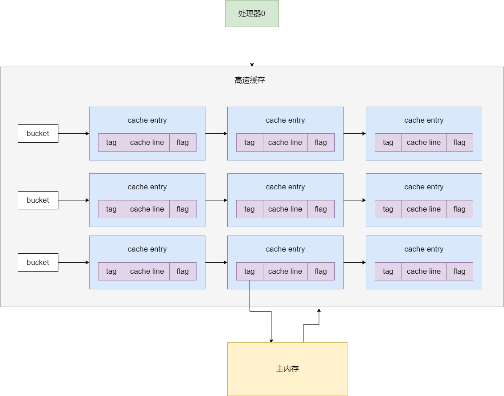
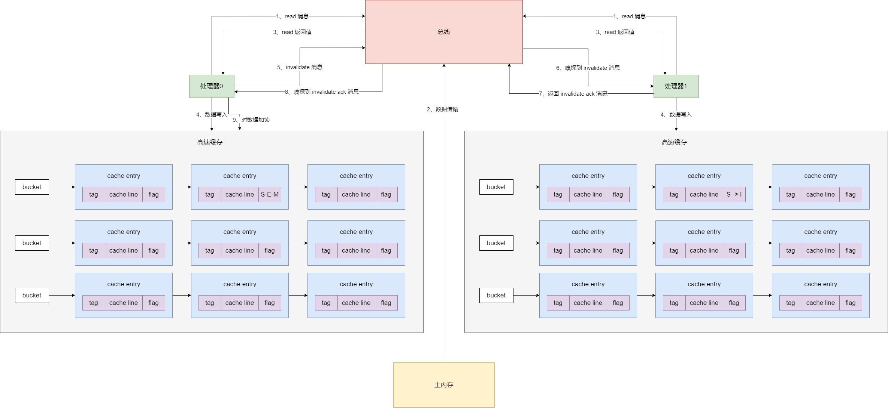
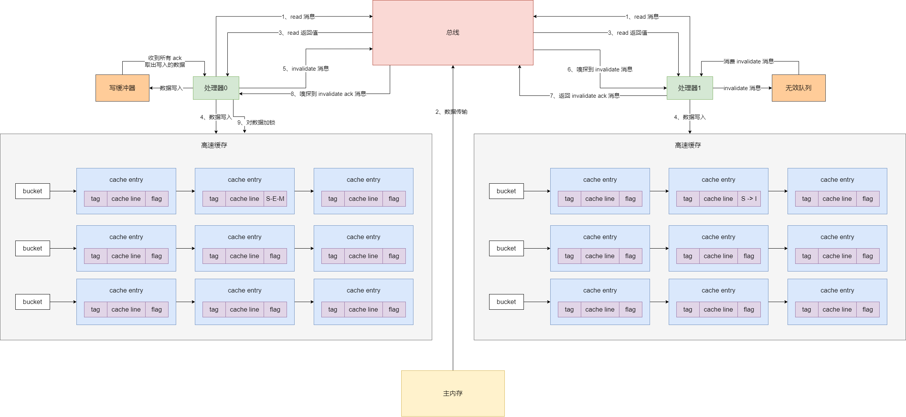

## 高速缓存的数据结构

处理器高速缓存的底层数据结构实际上一个**拉链散列表**的结构，就是有很多个 `bucket`，每个 `bucket` 挂了很多的 `cache entry`，每个 `cache entry` 由三个部分组成：`tag`、`cache line` 和 `flag`，其中的 `cache line` 就是缓存的数据；`tag` 指向了这个缓存数据在主内存中的数据地址，`flag` 标识了缓存行的状态。另外需要注意的一点是，cache line 中可以包含多个变量的值


处理器会操作一些变量，那怎么在高速缓存里定位到这个变量呢？其实处理器在读写高速缓存的时候，实际上会根据变量名执行一个**内存地址解码**的操作，解析出 3 个东西：`index`、`tag` 和 `offset`。`index` 用于定位到拉链散列表中的某个 bucket，`tag` 是用于定位 cache entry，offset 是用于定位一个变量时在 cache line 中的位置。


如果说可以成功定位到一个高速缓存中的数据，而且 `flag` 还标志着有效，则缓存命中；否则不满足上述条件，就是缓存未命中。如果是读数据未命中的话，会从主内存重新加载数据到高速缓存中。现在处理器一般都有三级高速缓存：L1、L2 和 L3，越靠前面的缓存读写速度越快。




## 缓存一致性协议（MESI 协议）

因为有高速缓存的存在，所以就导致各个处理器可能对一个变量会在自己的高速缓存里有自己的副本，这样一个处理器修改了变量值，别的处理器是看不到的。为了解决这个问题，引入了缓存一致性协议（`MESI` 协议）


`MESI` 协议规定：对一个共享变量的读操作可以是多个处理器并发执行的，但是对于一个共享变量的写操作，只有一个处理器可以执行。其实也会通过排他锁的机制保证就一个处理器能写。


之前说过那个 cache entry 的 `flag` 代表了缓数据的状态，MESI 协议中划分为：

- **invalid**：无效的。标记为 `I`。这个意思是当前 cache entry 无效，里面的数据不能使用

- **shared**：共享的。标记为 `S`。这个意思是当前 cache entry 有效，而且里面的数据在各个处理器都有各自的副本，但是这些副本的值跟主内存的值是一样的，各个处理器就是并发地在读而已

- **exclusive**：独占的。标记为 `E`。这个意思就是当前处理器对这个数据独占了，只有它可以有这个副本，其它的处理器都不能包含这个副本

- **modified**：修改的。标记为 `M`。只能有一个处理器对共享数据更新，所以只有更新数据的处理器的 cache entry，才是 exclusive 状态。表明当前线程更新了这个数据，这个副本的数据跟主内存是不一样的。


`MESI` 协议规定了一组消息，就是各个处理器在操作内存数据的时候，都会往总线发送消息，而且各个处理器还会不停地从总线嗅探最新的消息，通过这个总线的消息传递来保证各个处理器的协作。


下面来详细地图解 `MESI` 协议的工作原理，处理器0 读取某个变量的数据时，首先会根据 index、tag 和 offset 从高速缓存的拉链散列表读取数据，如果发现状态为 `I`，也就是无效的，此时就会发送 `read` 消息到总线。


接着主内存会返回对应的数据给 处理器0，处理器0 就会把数据放到高速缓存里，同时 cache entry 的 flag 状态为 `S`。


在 处理器0 对一个数据进行更新的时候，如果数据状态是 `S`，则此时就需要发送一个 invalidate 消息到总线，尝试让其他的处理器的高速缓存的 cache entry 全部变为 `I`，以获得数据的独占锁。其他的 处理器1 会从总线嗅探到 invalidate 消息，此时就会把自己的 cache entry 设置为 `I`，也就是过期掉自己本地的缓存，然后就是返回 invalidate ack 消息到总线，传递回 处理器0，处理器0 必须收到所有处理器返回的 ack 消息


接着 处理器0 就会将 cache entry 先设置为 `E`，独占这条数据，在独占期间，别的处理器就不能修改数据了，因为别的处理器此时发出 invalidate 消息，这个 处理器0 是不会返回 invalidate ack 消息的，除非它先修改完再说


接着 处理器0 就修改这条数据，接着将数据设置为 `M`，也有可能是把数据此时强制写会到主内存中，具体看底层硬件实现


然后其他处理器此时这条数据的状态都是 `I` 了，如果要读的话，全部都需要重新发送 read 消息，从出内存（或者是其他处理器）来加载，这个具体怎么实现看底层的硬件，都有可能的


这套机制其实就是缓存一致性在硬件缓存模型下的完整执行原理。




## 采用写缓冲器和无效队列优化 MESI 协议

`MESI` 协议如果每次写数据的时候都要发送 `invalidate` 消息等待所有处理器返回 ack，然后获取独占锁后才能写入数据，那可能就会导致性能很差了。因为对这个共享变量的写操作，实际上在硬件级别变成串行的。所以为了解决这个问题，硬件层面引入了**写缓冲器**和**无效队列**。


写缓冲器的作用是，一个处理器写数据的时候，直接把数据写入缓冲器，同时发送 invalidate 消息，然后就认为写操作完成了，接着就干别的事情，不会阻塞在这里。接着这个处理器如果收到其他处理器的 ack 消息之后，才会把写缓冲器中的写结果拿出来，通过堆 cache entry 设置为 E 加独占锁，同时修改数据，然后设置为 M。


其实写缓冲器的作用，就是处理器写数据的时候直接写入缓冲器，不需要同步阻塞等待其他处理器的 invalidate ack 返回，这就大大提升了硬件层面的执行效率了。包括查询数据的时候，会先从写缓冲器里查，因为有可能刚修改的值在这里，然后才会从高速缓存里查，这个就是存储转发。


引入无效队列，就是说其他处理器在接收到 `invalidate` 消息之后，不需要立马过期本地缓存，直接把消息放入无效队列，就返回 ack 给那个写处理器了，这就进一步加速了性能，然后之后从无效队列里取出消息，过期本地缓存即可


通过引入写缓冲器和无效队列，一个处理器要写数据的话，这个性能是很高的，它直接写数据到写缓冲器，发送一个 invalidate 消息出去，就立马返回，执行别的操作了；其他处理器收到 invalidate 消息之后直接放入无效队列，立马就返回 invalidate ack




## 硬件层面的 MESI 协议引发有序性和可见性的问题

通过上面的讲解，MESI 协议在硬件层面的原理大家应该清晰了。现在就讲讲 MESI 协议引发的可见性和有序性问题。


### 可见性

可见性是写缓冲器和无效队列导入的。写数据不一定立马写入自己的高速缓存（或者主内存），有可能写入了写缓冲器，导致其他处理器读不到最新的值；读数据不一定立马从别人的高速缓存（或者主内存）刷新最新的值过来，invalidate 消息还无效队列里面，高速缓存还保留着未被无效化的旧值，处理器会在自己的高速缓冲中读取旧值。


### 有序性

#### StoreLoad 重排序

```java
int a = 0;
int c = 1;

线程1:

a = 1;
int b = c;
```


上面线程 1 的代码，第一个是 `Store`，第二个是 `Load`。但是可能处理器对 store 操作先写入了写缓冲器，此时这个写操作相当于没执行，然后就执行第二行代码，第二行代码的 b 是局部变量，那这个操作等于是读取 c 的值，是 load 操作。这就导致了好像第二行代码的 load 先执行了，第一行代码的 store 后执行


第一个 store 操作写到写缓冲器里去了，导致其他的线程是读取不到的，看不到的，好像是第一个写操作没执行一样，而第二个 load 操作是成功地执行了。


#### StoreStore 重排序

```java
resource = loadResource();
loaded = true;
```


上面两个写操作，但是可能第一个写操作写入了写缓冲器，然后第二个写操作是直接修改的高速缓存，这个时候不久导致了两个写操作顺序颠倒了？


诸如此类的重排序，都可能因为 MESI 的机制发生。可见性问题也是一样的，写入写缓冲器之后，没输入高速缓存，导致别人读不到；读数据的时候，可能 invalidate 消息在无效队列里，导致没法立马感知到过期的缓存，立马加载最新的数据


## 内存屏障在硬件层面的实现以及问题解决

解决可见性问题，可以通过 **Store 屏障 + Load 屏障**。


如果加了 Store 屏障之后，就会强制性要求你对一个写操作必须阻塞等待到其他的处理器返回 `invalidate ack` 之后，对数据加锁，然后修改到高速缓存中，在写数据之后，必须强制执行 flush 操作。它的效果，是要求一个写操作必须刷到高速缓存（或者主内存），不能停留在写缓冲器里。


如果加了 Load 屏障之后，就从高速缓存读取数据的时候，如果发现无效队列里有一个 invalidate 消息，此时会立马强制那个 invalidate 消息把自己本地缓存的数据过期掉（设置为 `I`），然后就可以强制从其他处理器的高速缓存中加载最新的值了，这就是 refresh 操作。


为了解决有序性问题，可以通过**内存屏障**。通过使用 Acquire 屏障（StoreStore 屏障）、Release 屏障（StoreLoad 屏障），可以避免重排序


StoreStore 屏障，会强制让写数据的操作全部按照顺序写入写缓冲器里，不会让你第一个写到写缓冲器里去，第二个直接修改高速缓存了。


```java
resource = loadResource();

StoreStore 屏障

loaded = true;
```


StoreLoad 屏障，它会强制先将写缓冲器里的数据写入高速缓存中，接着读数据的时候强制清空无效队列，对里面的 invalidate 消息全部过期掉高速缓存中的条目，然后强制从主内存里重新加载数据。