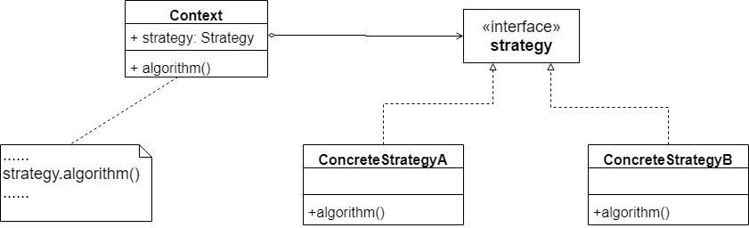

​		在软件开发中，常常会遇到这种情况：实现某个功能有多条途径，每一条途径对应一种算法，此时可以使用一种设计模式来实现灵活地选择解决途径，也能够方便地增加新的解决途径。那就是**策略模式**。

​		在策略模式中，可以定义一些独立的类来封装不同的算法，每一个类封装一种具体的算法。在这里，每一个封装算法的类都可以称之为一种策略，为了保证这些策略在使用时具有一致性，一般会提供一个抽象的策略来做规则的定义，而每种算法则对应一个具体策略类。

​		策略模式的主要目的是将算法的定义与使用分开，也就是将算法的行为和环境分开，将算法的定义放在专门的策略类中，每一个策略类封装了一种实现算法，使用算法的环境类针对抽象策略类进行编程，符合依赖倒转原则。在出现新的算法时，只需要增加一个新的实现了抽象策略类的具体策略类即可。

## 策略模式定义

​		定义了一系列算法类，将每一个算法封装起来，并让他们可以互相替换。策略模式让算法独立于使用它的客户而变化，也称为政策模式。策略模式是一种对象行为型模式。

## 策略模式结构图



​		由结构图可以看到包含以下3个角色：

- **Context（环境类）**：环境类是使用算法的角色，它在解决某个问题（即实现某个方法）时可以采用多种策略。在环境类中维持一个对抽象策略类的引用实例，用于定义所采用的策略。
- **Strategy（抽象类）**：它为所支持的算法声明了抽象方法，是所有策略类的父类，它可以是抽象类或具体类，也可以是接口。环境类通过抽象策略中声明的方法在运行时调用具体策略类中实现的算法。
- **ConcreteStrategy（具体策略类）**：它实现了在抽象策略类中声明的算法，在运行时，具体策略类将覆盖在环境类中定义的抽象策略类对象，使用一种具体的算法实现某个业务处理。

## 策略模式主要优缺点

### 主要优点

- 策略模式提供了对开闭原则的完美支持，用户可以在不修改原有系统的基础上选择算法或行为，也可以灵活地增加新的算法或行为。
- 策略模式提供了管理相关的算法族的办法，策略类的等级结构定义了一个算法或行为族，恰当使用继承可以把公共的代码移到抽象策略类中，从而避免重复的代码。
- 策略模式提供了一种可以替换继承关系的办法。如果不使用策略模式，那么使用算法的环境类就可能会有一些子类，每个子类提供一种不同的算法。但是，这样一来算法的使用就和算法本身混在一起，不符合单一职责原则，决定使用哪一种算法的逻辑和该算法本身混合在一起，从而不可能再独立演化；而且使用继承无法实现算法或行为在程序运行时的动态切换。
- 使用策略模式可以避免多重条件选择语句。多重条件选择语句不易维护，它把采取哪一种算法或行为的逻辑与算法或行为本身的实现逻辑混合在一起，将他们全部硬编码在一个庞大的多重条件选择语句中，比直接集成环境类的办法还要原始和落后。
- 策略模式提供了一种算法的复用机制，由于将算法单独提取出来封装在策略类中，因此不同的环境类可以方便地复用这些策略类。

### 主要缺点

- 客户端必须知道所有的策略类，并且自行决定使用哪一个策略类。这就意味着客户端必要理解这些算法的区别，以便实时选择恰当的算法。换言之，策略模式只适用于客户端知道所有的算法或行为的情况。
- 策略模式将造成系统产生很多具体策略类，任何细小的变化都将导致系统要增加一个新的具体策略类。
- 无法同时在客户端使用多个策略类，也就是说，在使用策略模式时，客户端每次只能使用一个策略类，不支持使用一个策略类完成部分功能后再使用另一个策略类来完成剩余功能的情况。

## 策略模式适用场景

​		在以下情况下可以考虑使用策略模式：

1. 一个系统需要动态地在几种算法中选择一种，那么可以将这些算法封装到一个个的具体算法类中，而这些算法类都是一个抽象算法类的子类。换言之，这些具体算法类均有统一的接口，根据里氏代换原则和面向对象的多态性，客户端可以选择使用任何一个具体算法类，并且只要维持一个数据类型是抽象算法类的对象。
2. 一个对象有很多的行为，如果不用恰当的模式，这些行为就只好使用多重条件选择语句来实现。此时，使用策略模式，把这些行为转移到相应的具体策略类里面，就可以避免使用难以维护的多重条件选择语句。
3. 不希望客户端知道复制的、与算法相关的数据结构，在具体策略类中封装算法与相关的数据结构，可以提高算法的保密性与安全性。

## 具体事例

### 案例1

​		Sunny软件公司为某电影院开发了一套影院售票系统，在改系统中需要为不同类型的用户提供不同的电影票打折方式，具体打折方案如下：

1. 学生凭学生证可以享受8折优惠。
2. 年龄在10周岁及以下的儿童可享受每张票减免10元的优惠（原始票价需大于等于20元）
3. 影院VIP用户除享受票价半价优惠外还可以积累积分，积分累计到一定额度可以兑换电影院赠送的奖品。

​        改系统在将来可能还需要个根据需要引入新的打折方式。

传统的实现方案大概会如下：

```java
public double calculate() {
        //学生票折后票价计算
        if(this.type.equalsIgnoreCase("student")) {
            System.out.println("学生票： ");
            return this.price * 0.8;
        }
        
        //儿童票折后票价计算
        else if(this.type.equalsIgnoreCase("children") && this.price >= 20) {
            System.out.println("儿童票：");
            return this.price - 10;
        }
        
        //VIP票折价后票价计算
        else if(this.type.equalsIgnoreCase("vip")) {
            System.out.println("VIP票：");
            System.out.println("增加积分！");
            return this.price * 0.5;
        }
        
        else {
            return this.price;
        }
    }
```

​		使用策略模式实现的代码已上传至[github](https://github.com/GD-CKING/Design-Pattern/tree/master/Strategy-Pattern(%E7%AD%96%E7%95%A5%E6%A8%A1%E5%BC%8F)/strategy)上。

### 案例2

​		使用策略模式和自定义注解去掉大量的**if-else**

https://mp.weixin.qq.com/s/sa_MMAzYg6jpy9s_rtvcCQ