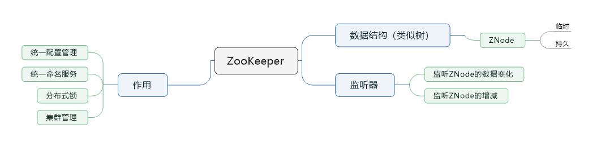
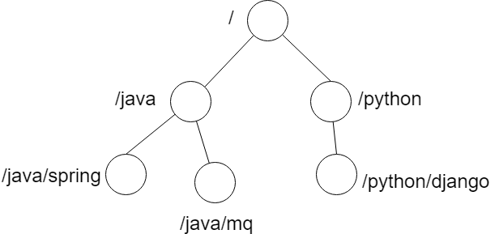
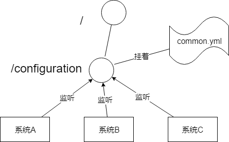
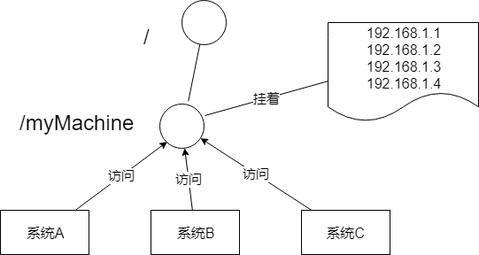
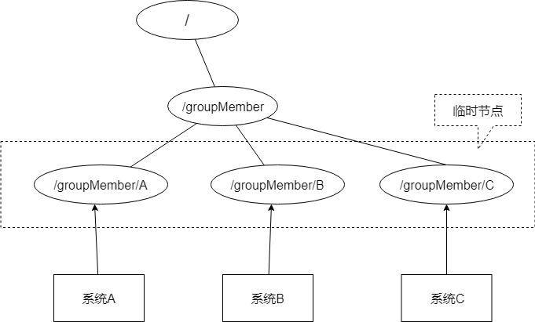

> 本节思维导图

## ZooKeeper的数据结构

​		ZooKeeper的数据结构，跟Unix文件系统非常类似，可以看做是一颗**树**，每个节点叫做**ZNode**，每一个节点可以通过路径来标识：

​		ZooKeeper的节点我们称之为ZNode，ZNode分为两种类型：

- **短暂/临时**：当客户端和服务端断开连接后，所创建的ZNode（节点）会**自动删除**
- **持久**：当客户端和服务端断开连接后，所创建的ZNode不会删除

​        这些节点由可以分成另外两种类型：

- 普通节点
- 带顺序号节点

## 监听器

​		ZooKeeper之所以能实现那么多功能，最主要还是配合了**监听器**。

​		常见的监听器有以下两个功能：

- 监听ZNode节点的数据变化
- 监听子节点的增减变化

​        通过**监听+ZNode**节点，Zookeeper就可以实现比较多的功能了

## ZooKeeper的作用

### 统一配置管理

​		比如现在有三个系统A、B、C，他们有三份配置ASystem.yml、BSystem.yml、CSystem.yml，然后，这三份配置又非常类似，很多配置项几乎一样。此时如果我们要改变其中一份配置项的信息，很可能另外两份都要改，并且改了配置项的系统很能就要重启系统。

​		于是我们希望把ASystem.yml、BSystem.yml、CSystem.yml相同的配置项抽取出来成一份公用的配置common.yml，并且即使common.yml改了，也不需要系统A、B、C重启。

​		解决方案是我们可以把common.yml这份配置放在ZooKeeper的ZNode节点中，系统A B C监听这个节点有无变更，变更了就及时响应。

​		具体实现可以大佬写的 [基于zookeeper实现统一配置管理](https://blog.csdn.net/u011320740/article/details/78742625)

### 统一命名服务

​		统一命名服务的理解其实跟**域名**一样，是我们为这某一部分的资源给它**取另一个名字**，别人通过这个名字就可以拿到对应的资源。

​		例如我们有一个域名叫www.test.com。但这个域名下有多台机器：

- 192.168.1.1

- 192.168.1.2

- 192.168.1.3

- 192.168.1.4

  别人访问www.test.com即可访问到我的机器，而不是通过IP去访问。

  

### 分布式锁

### 集群管理

​		还是以三个系统A B C为例，在ZooKeeper中创建临时节点即可，

​	只要系统A挂了，那么/groupMember/A这个节点就会删除，通过监听groupMember下的子节点，系统B和C就能感知到系统A挂了，新增也是同理。

​	除了能感知节点的上下线变化，Zookeeper还可以实现**动态选举Master**的功能（如果集群是主从结构模式下）。原理也很简单，如果想要实现这个功能，只要ZNode节点的类型是**带顺序号的临时节点**就好了。ZooKeeper会每次**选举最小编号的作为Master**，如果Master挂了，自然对应的ZNode节点就会删除，然后让**新的最小编号作为Master**，这样就可以实现动态选举的功能。

